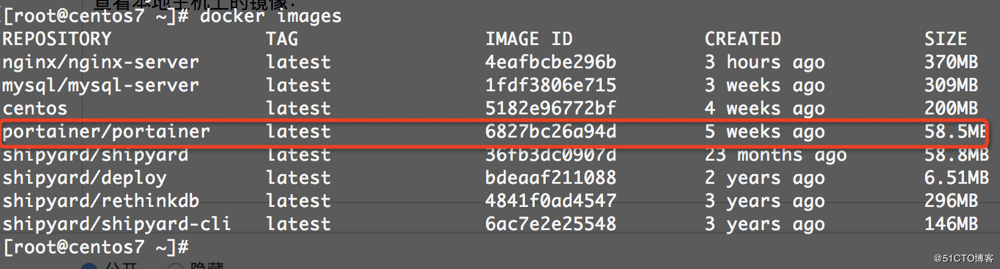
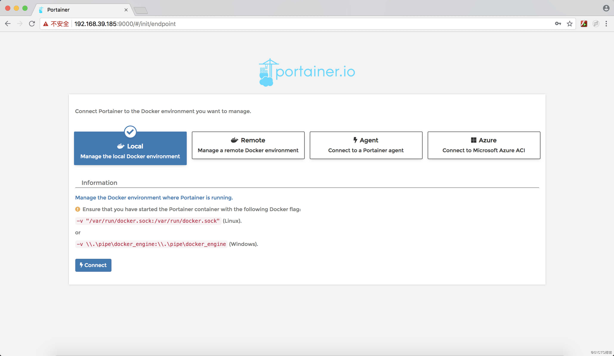
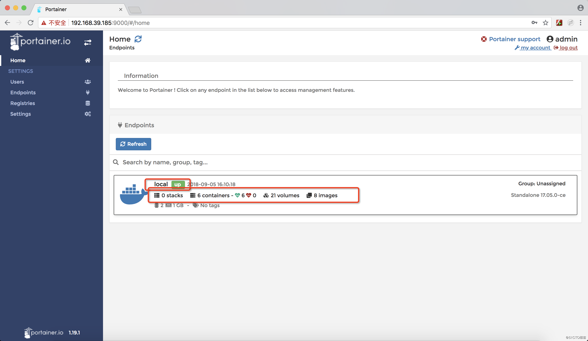
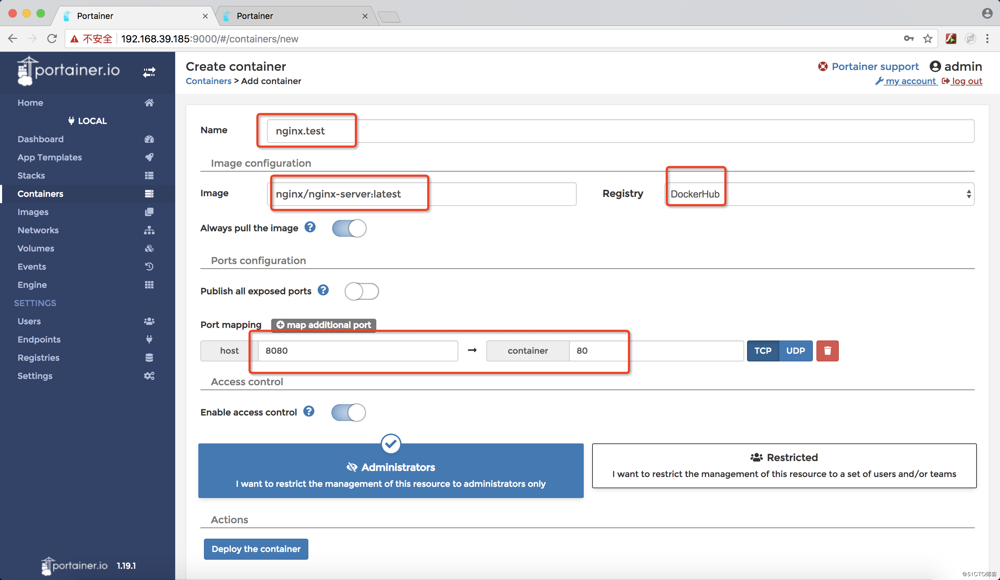
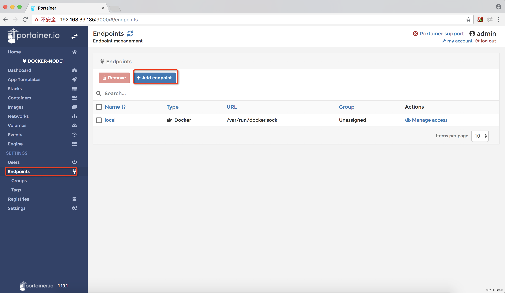
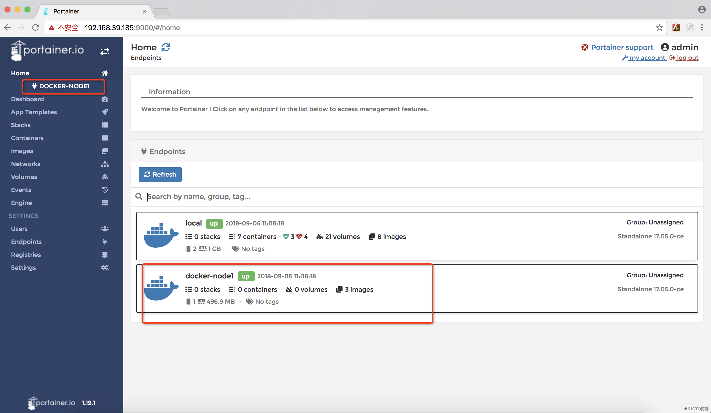
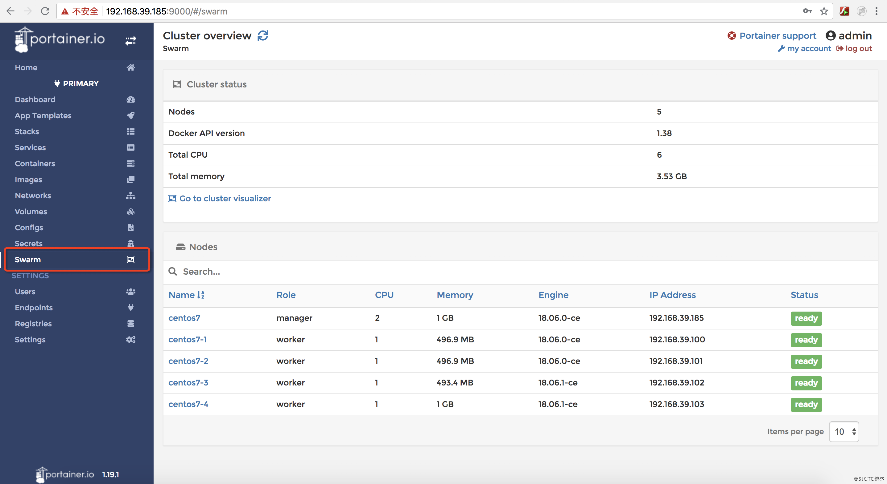
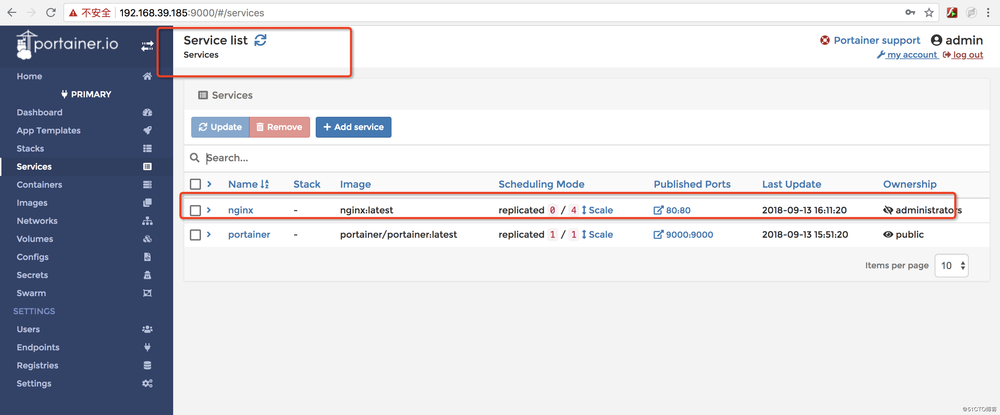
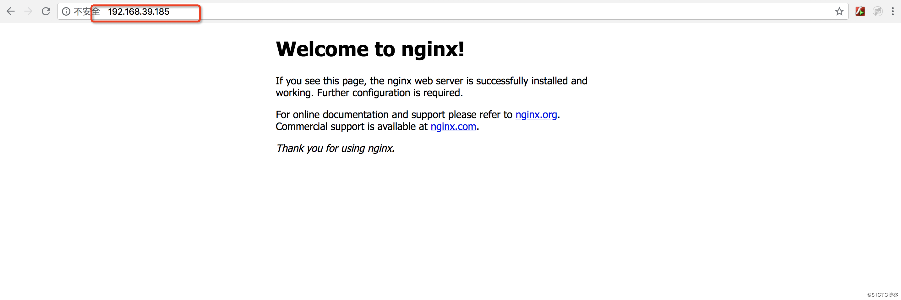
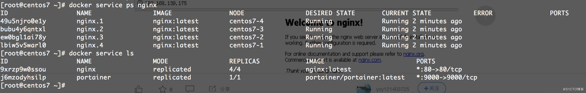

# Docker图形化管理
# 一、Portainer简介
Portainer是一款轻量级的图形化管理工具，通过它我们可以轻松管理不同的docker环境。Portainer部署和使用都非常的简单，它由一个可以运行在任何docker引擎上的容器组成。Portainer提供管理docker的containers、  images、volumes、networks等等。它兼容独立的docker环境和swarm集群模式。基本满足中小型单位对docker容器的管理工作。

# 二、快速部署
1. 从仓库中查询Portainer相关镜像：

[root@centos7 ~]# docker search portainer

2. 拉取Portainer镜像到本地：

[root@centos7 ~]# docker pull portainer/portainer

3. 查看本地主机上的镜像：



4. 单机安装

如果只有一个docker宿主机，可以使用以下命令安装：

[root@centos7 ~]# docker volume create portainer_data

[root@centos7 ~]# docker run -d -p 9000:9000 --name portainer --restart always -v /var/run/docker.sock:/var/run/docker.sock -v portainer_data:/data portainer/portainer

5. Swarm集群下安装

使用Portainer提供的代理安装程序在Swarm集群下部署：

[root@centos7 ~]# curl -L [https://portainer.io/download/portainer-agent-stack.yml](https://portainer.io/download/portainer-agent-stack.yml)-o portainer-agent-stack.yml

[root@centos7 ~]#docker stack deploy --compose-file=portainer-agent-stack.yml portainer

+ 更多场景下部署方法可以参考以下：[https://portainer.readthedocs.io/en/stable/index.html](https://portainer.readthedocs.io/en/stable/index.html)

# 三、访问Portainer
单机环境中安装完成之后，可以通过浏览机对9000端口进行访问。如：[http://192.168.39.185:9000](http://192.168.39.185:9000/)

1. 首次登陆需要注册用户：


2. 由于是单机环境下安装，选择local模式即可：



+ 注意：该页面上有提示需要挂载本地 /var/run/docker.socker与容器内的/var/run/docker.socker连接。因此，在启动时必须指定该挂载文件。
3. 进入首页可以查看到本地环境下docker相关的信息如容器，镜像等等。



4. 点击“local“，查看本地docker相关信息：


5. 点击“Containers”查看容器相关信息：

可以进行创建容器、启动、停止、删除等等操作非常的方便。


6. 点击“Name”，可以查看相关容器详细信息：


7. 在容器列表页面下，点击“Add      Containers”可以进行容器的创建：

输入相关信息点击“deploy the container”，可以根据已有的镜像快速创建容器：



8. 浏览器打开刚才创建的nginx容器：


+ Portainer中还有很多对容器有意思的操作管理，诸如提供容器状态监控视图、容器状态日志、通过console登陆容器等等。
+ Portainer中还有一些很多其他的操作，比如stacks管理、镜像管理、卷管理、权限管理、网络管理等等，可以安装上进行了解学习。
+ 如镜像管理，可以查看到所有的镜像相关列表，在镜像列表可以直接pull一个镜像，可以从远程pull，也可以从私有库中pull。从私有库中pull，需要将私有库的地址提前进行配置。

# 四、Portainer多docker宿主机环境下管理
1. 添加docker节点

首先在docker个节点中需要开启远程管理端口：2375或2376（支持ca认证，此端口较安全）

开启2375端口，可能导致安全漏洞的出现，以下有详细介绍：[https://blog.csdn.net/ghostcloud2016/article/details/51539837](https://blog.csdn.net/ghostcloud2016/article/details/51539837)

开启2376端口比较复杂，可以浏览以下：[https://docs.docker.com/engine/security/https/](https://docs.docker.com/engine/security/https/)

编辑/etc/docker/daemon.json,添加如下：

{

  "hosts": ["tcp://192.168.39.100:2375", "unix:///var/run/docker.sock"]

}

注意：192.168.39.100为docker所在宿主机ip

+ 重启docker服务

# systemctl restart docker

Warning: docker.service changed on disk. Run 'systemctl daemon-reload' to reload units.

可以查看到端口已经开放：


+ 在docker其他节点可以通过docker -H      192.168.39.100:2375 info命令查看到该节点docker相关信息。
+ 点击Home页面下“add      endportainer”添加该节点docker信息：




+ 输入以下相关信息，点击“add      endpoartainer”添加信息即可：


+ 可以看到添加docker-node1节点成功：




+ 添加各个docker节点完成，这样可以通过portainer对每个节点下的docker环境进行相关的管理操作。
2. Portanier管理Swarm集群

Portainer管理swarm集群时，确保环境下已经设置好Swarm集群

+ Master节点下安装Portainer服务：

[root@centos7 ~]# docker service create --name portainer --publish 9000:9000 --constraint 'node.role == manager' --mount type=bind,src=//var/run/docker.sock,dst=/var/run/docker.sock portainer/portainer -H unix:///var/run/docker.sock

j6mzodyhsilp6i266w7d0i4ty

overall progress: 1 out of 1 tasks 

1/1: running  [==================================================>] 

verify: Service converged

+ 查看Portainer服务：

```bash
[root@centos7 ~]# docker service ls
ID                  NAME                MODE                REPLICAS            IMAGE                       PORTS
j6mzodyhsilp        portainer           replicated          1/1                portainer/portainer:latest  *:9000->9000/tcp
```

+ 安装完成之后，打开浏览器输入http://{ip}:9000同样会出现登陆密码的设置界：
+ 设置完帐号和密码，登陆主界面，可以查看到swarm集群信息：


+ 点击“Swarm”，可以查看到个集群节点信息：



+ 点击“Image”,拉取一个nginx镜像：


+ 在Services下创建nginx服务，这里创建4个副本，并将80端口映射出去，最后点击“Create      Service”创建服务:


+ 查看service list      列表会发现，nginx服务已经创建成功：



+ 浏览器中输入个节点ip地址，都可以看到nginx页面如下：



+ 通过命令可以查看到nginx服务运行状态：

 

