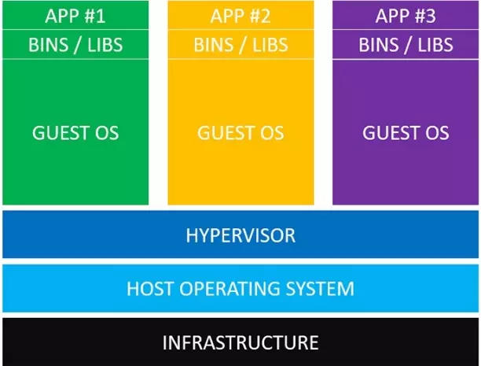
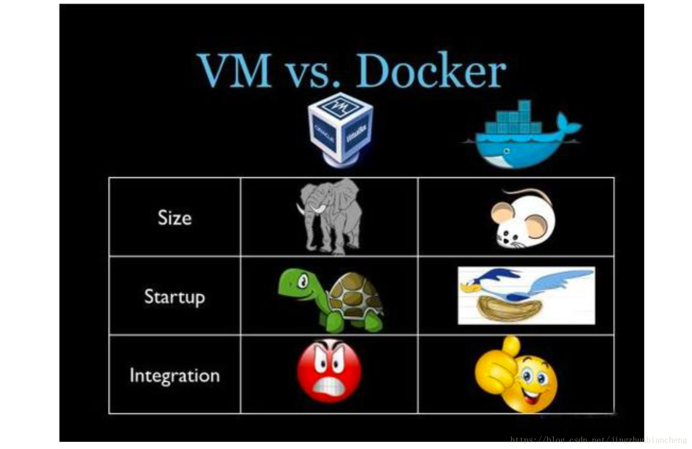

# docker基础
# 一、docker简介
Docker 是一个开源的应用容器引擎，让开发者可以打包他们的应用以及依赖包到一个可移植的镜像中，然后发布到任何流行的 Linux或Windows 机器上，也可以实现虚拟化。容器是完全使用沙箱机制，相互之间不会有任何接口。

# 二、docker基本概念
1. Docker镜像就是一个只读的模板。比如，一个镜像可以包含一个完整的ubuntu操作系统环境，里面仅安装了apache或用户需要的其他应用程序。镜像可以用来创建Docker容器。另外Docker提供了一个很简单的机制来创建镜像或者更新现有的镜像，用户甚至可以直接从其他人哪里下载一个已经做好的镜像来直接使用。
2. Docker利用容器来运行应用。容器是从镜像创建的运行实例，它可以被启动、开始、停止、删除。每个容器都是相互隔离的、保证安全的平台。可以把容器看做是一个简易版的Linux      环境（包括root用户权限、进程空间、用户空间和网络空间等）和运行在其中的应用程序。

注：镜像是只读的，容器在启动的时候创建一层可写层作为最上层。

3. Docker仓库是集中存放镜像文件的场所。有时候会把仓库和仓库注册服务器（Registry）混为一谈，      并不严格区分。实际上，仓库注册服务器上往往存放着多个仓库，每个仓库中又包含了多个镜像，每个镜像有不同的标签（tag）。
4. 仓库分为公开仓库（Public）和私有仓库（Private）两种形式。最大的公开仓库是Docker Hub， 存放了数量庞大的镜像供用户下载。国内的公开仓库包括Docker Pool等，可以提供大陆用户更稳定快速的访问。当然，用户也可以在本地网络内创建一个私有仓库。当用户创建了自己的镜像之后就可以使用push命令将它上传到公有或者私有仓库，这样下次在另外一台机器上使用这个镜像时候，只需要从仓库上pull下来就可以了。

# 三、docker容器与虚拟机区别
**首先明确一点，大家都把docker比喻成轻量化的虚拟机，但他们有本质的区别，docker并不是虚拟机**

1. 使用虚拟机运行多个相互隔离的应用时，如下图：

+ 基础设施（Infrastructure）。它可以是你的个人电脑，数据中心的服务器，或者是云主机。
+ 主操作系统（Host Operating System）。你的个人电脑之上，运行的可能是MacOS，Windows或者某个Linux发行版。
+ 虚拟机管理系统（Hypervisor）。利用Hypervisor，可以在主操作系统之上运行多个不同的从操作系统。类型1的Hypervisor有支持MacOS的HyperKit，支持Windows的Hyper-V以及支持Linux的KVM。类型2的Hypervisor有VirtualBox和VMWare。
+ 从操作系统（Guest Operating System）。假设你需要运行3个相互隔离的应用，则需要使用Hypervisor启动3个从操作系统，也就是3个虚拟机。这些虚拟机都非常大，也许有700MB，这就意味着它们将占用2.1GB的磁盘空间。更糟糕的是，它们还会消耗很多CPU和内存。
+ 各种依赖。每一个从操作系统都需要安装许多依赖。如果你的的应用需要连接PostgreSQL的话，则需要安装libpq-dev；如果你使用Ruby的话，应该需要安装gems；如果使用其他编程语言，比如Python或者Node.js，都会需要安装对应的依赖库。
+ 应用。安装依赖之后，就可以在各个从操作系统分别运行应用了，这样各个应用就是相互隔离的。
2. 使用Docker容器运行多个相互隔离的应用时，如下图：

+ 主操作系统（Host Operating System）。所有主流的Linux发行版都可以运行Docker。对于MacOS和Windows，也有一些办法"运行"Docker。
+ Docker守护进程（Docker Daemon）。Docker守护进程取代了Hypervisor，它是运行在操作系统之上的后台进程，负责管理Docker容器。
+ 各种依赖。对于Docker，应用的所有依赖都打包在Docker镜像中，Docker容器是基于Docker镜像创建的。
+ 应用。应用的源代码与它的依赖都打包在Docker镜像中，不同的应用需要不同的Docker镜像。不同的应用运行在不同的Docker容器中，它们是相互隔离的。
3. 对比虚拟机与Docker

Docker守护进程可以直接与主操作系统进行通信，为各个Docker容器分配资源；它还可以将容器与主操作系统隔离，并将各个容器互相隔离。虚拟机启动需要数分钟，而Docker容器可以在数毫秒内启动。由于没有臃肿的从操作系统，Docker可以节省大量的磁盘空间以及其他系统资源。

4. 使用场景。

虚拟机更擅长于彻底隔离整个运行环境。例如，云服务提供商通常采用虚拟机技术隔离不同的用户。

Docker通常用于隔离不同的应用，例如前端，后端以及数据库。

