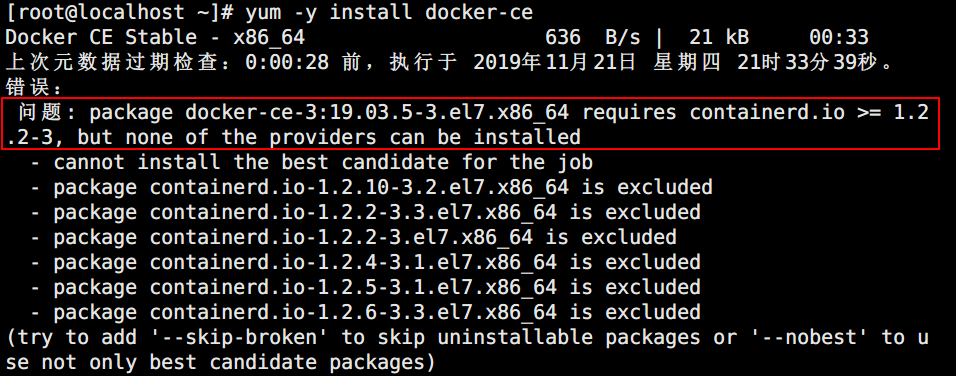

# docker安装与卸载
# 一、docker安装
+ [官方文档链接](https://docs.docker.com/get-started/#test-docker-installation)
1. 安装前源准备

`yum install -y yum-utils device-mapper-persistent-data lvm2` 

`yum-config-manager --add-repo https://mirrors.aliyun.com/docker-ce/linux/centos/docker-ce.repo` 

2. 安装docker

`yum -y install docker-ce`

3. 使用阿里云做镜像加速
+ [参考链接](https://cr.console.aliyun.com/cn-qingdao/mirrors)

```bash
mkdir -p /etc/docker
tee /etc/docker/daemon.json <<-'EOF'
{
  "registry-mirrors": [
        "https://mirror.ccs.tencentyun.com",
        "https://o2j0mc5x.mirror.aliyuncs.com",
        "http://hub-mirror.c.163.com"
    ]
}
EOF
systemctl daemon-reload
systemctl enable docker
systemctl restart docker
```

4. docker命令补全

```bash
yum install -y bash-completion
source /usr/share/bash-completion/completions/docker
```

# 二、常见异常处理
1. Cenntos8安装过程报错




+ 安装最新版containerd.io-1.2.6-3.3.el7.x86_64.rpm
+ 参考链接：[https://mirrors.aliyun.com/docker-ce/linux/centos/7/x86_64/edge/Packages/](https://mirrors.aliyun.com/docker-ce/linux/centos/7/x86_64/edge/Packages/)


`dnf install -y  https://mirrors.aliyun.com/docker-ce/linux/centos/7/x86_64/edge/Packages/containerd.io-1.3.7-3.1.el7.x86_64.rpm`

+ 再装剩下两个

`dnf install docker-ce docker-ce-cli` 

`systemctl start docker` 

`docker --version` 

2. 如果dnf安装时有如下报错

```bash
Docker CE Stable - x86_64                                                                                                                              8.2 kB/s |  51 kB     00:06    
Last metadata expiration check: 0:00:06 ago on Fri 24 Nov 2023 03:38:11 PM CST.
Error: 
 Problem 1: problem with installed package containers-common-2:1-70.module+el8.9.0+1585+f9978900.x86_64
 - package containers-common-2:1-70.module+el8.9.0+1585+f9978900.x86_64 from @System requires runc, but none of the providers can be installed
```

<font style="color:rgb(77, 77, 77);">输入下面的命令继续安装：</font>

```sql
yum install --allowerasing docker-ce
```

# 三、docker卸载
1. 卸载软件包

`yum remove docker docker-client docker-client-latest docker-common docker-latest docker-latest-logrotate docker-logrotate docker-selinux docker-engine-selinux docker-engine`

2. 删除服务注册文件

`rm -rf /etc/systemd/system/docker.service.d`

3. 删除docker库

`rm -rf /var/lib/docker`

4. 删除运行文件

`rm -rf /var/run/docker`

5. 删除docker网桥

      `ip link delete docker0`

# 四、使用官方源安装docker
优点：最新版，无依赖问题

缺点：下载慢

```bash
yum install -y yum-utils
yum-config-manager --add-repo https://download.docker.com/linux/centos/docker-ce.repo
yum install -y docker-ce docker-ce-cli containerd.io
systemctl enable docker
systemctl start docker
```


