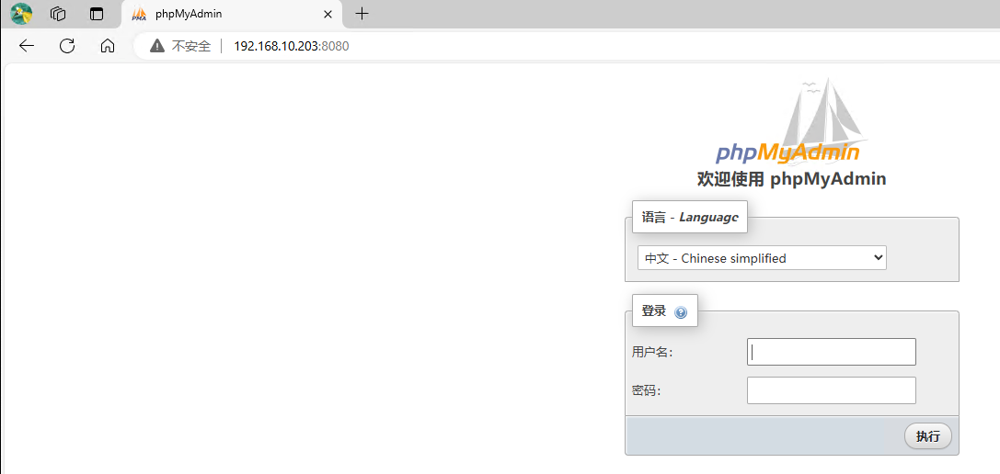

# LNMP服务部署(docker)

> 分类: Docker > 常见服务部署
> 更新时间: 2026-01-10T23:35:13.345068+08:00

---

> 以wordpress为例。官网：[https://cn.wordpress.org/download/](https://cn.wordpress.org/download/)
>

# 服务部署
## 下载项目源码包
```bash
[root@test ~]# wget https://cn.wordpress.org/latest-zh_CN.zip
[root@test ~]# ls
wordpress-6.5.5-zh_CN.zip
[root@test ~]# unzip wordpress-6.5.5-zh_CN.zip
[root@test ~]# ls
wordpress  wordpress-6.5.5-zh_CN.zip
[root@test ~]# mv wordpress/* /opt/docker/wordpress/
```

## 部署MySQL
```bash
[root@test ~]# mkdir -p /opt/docker/mysql
[root@test ~]# cd /opt/docker/mysql/
[root@test mysql]# docker run --name mysql -p 3306:3306 -v $PWD/conf:/etc/mysql/conf.d -v $PWD/logs:/logs -v $PWD/data:/var/lib/mysql -e MYSQL_ROOT_PASSWORD=123.com -d --restart=always mysql
[root@test mysql]# docker ps
CONTAINER ID   IMAGE     COMMAND                   CREATED          STATUS          PORTS                                                  NAMES
b83a334178ad   mysql     "docker-entrypoint.s…"   23 seconds ago   Up 22 seconds   0.0.0.0:3306->3306/tcp, :::3306->3306/tcp, 33060/tcp   mysql
```

## 部署php
<font style="color:rgb(33, 37, 41);">官方 php 镜像并未提供 mysql 扩展，所以我们必须要自己手动写 Dockerfile 安装扩展。</font>

```bash
[root@test ~]# mkdir -p /opt/docker/php
[root@test php]# cat Dockerfile 
FROM php:fpm
RUN docker-php-ext-install mysqli
[root@test php]# docker build -t my-php:v1 .
[root@test php]# docker run --name php -p 9000:9000 -d -v /opt/docker/wordpress:/var/www/html --restart=always --link mysql my-php:v1
CONTAINER ID   IMAGE                   COMMAND                   CREATED             STATUS             PORTS                                                  NAMES
375f39b4256b   my-php:v1               "docker-php-entrypoi…"   59 seconds ago      Up 58 seconds      0.0.0.0:9000->9000/tcp, :::9000->9000/tcp              php
b83a334178ad   mysql                   "docker-entrypoint.s…"   2 hours ago         Up 2 hours         0.0.0.0:3306->3306/tcp, :::3306->3306/tcp, 33060/tcp   mysql
```

## 部署nginx
自定义nginx配置文件，并封装至镜像中。

```bash
[root@test php]# mkdir -p /opt/docker/nginx
[root@test php]# cd /opt/docker/nginx/
[root@test nginx]# cat nginx.conf 
server {
    listen       80;
    server_name  ~^.*$;

    location / {
        root   /usr/share/nginx/html; # nginx静态资源路径
        index  index.php index.html index.htm;
    }

    location ~ \.php$ {
        fastcgi_pass   php:9000;
        fastcgi_index  index.php;
        fastcgi_param  SCRIPT_FILENAME  /var/www/html/$fastcgi_script_name; # php资源路径
        include        fastcgi_params; 
    }
}
[root@test nginx]# cat Dockerfile 
FROM nginx:latest
COPY nginx.conf /etc/nginx/conf.d/default.conf
EXPOSE 80
CMD ["nginx", "-g", "daemon off;"]
[root@test nginx]# docker build -t my-nginx:v1 .
[root@test nginx]# docker run --name nginx -p 80:80 -d -v /opt/docker/wordpress:/usr/share/nginx/html --link php:php --restart=always my-nginx:v1
f8e90c07308a8c5ff7ccfc7fea6e71858c07d0e583706b377ef270ced9d676a5
[root@test nginx]# docker ps
CONTAINER ID   IMAGE                   COMMAND                   CREATED             STATUS             PORTS                                                  NAMES
375f39b4256b   my-php:v1               "docker-php-entrypoi…"   59 seconds ago      Up 58 seconds      0.0.0.0:9000->9000/tcp, :::9000->9000/tcp              php
fa3ee19e5444   my-nginx:v1             "/docker-entrypoint.…"   15 minutes ago      Up 15 minutes      0.0.0.0:80->80/tcp, :::80->80/tcp                      nginx
b83a334178ad   mysql                   "docker-entrypoint.s…"   2 hours ago         Up 2 hours         0.0.0.0:3306->3306/tcp, :::3306->3306/tcp, 33060/tcp   mysql
```

## 部署phpmyadmin
```bash
[root@test nginx]# docker run --name phpmyadmin -p 8080:80 -d --link mysql:db --restart=always phpmyadmin/phpmyadmin
[root@test nginx]# docker ps
CONTAINER ID   IMAGE                   COMMAND                   CREATED             STATUS             PORTS                                                  NAMES
375f39b4256b   my-php:v1               "docker-php-entrypoi…"   59 seconds ago      Up 58 seconds      0.0.0.0:9000->9000/tcp, :::9000->9000/tcp              php
fa3ee19e5444   my-nginx:v1             "/docker-entrypoint.…"   15 minutes ago      Up 15 minutes      0.0.0.0:80->80/tcp, :::80->80/tcp                      nginx
a690921c73a5   phpmyadmin/phpmyadmin   "/docker-entrypoint.…"   About an hour ago   Up About an hour   0.0.0.0:8080->80/tcp, :::8080->80/tcp                  phpmyadmin
b83a334178ad   mysql                   "docker-entrypoint.s…"   2 hours ago         Up 2 hours         0.0.0.0:3306->3306/tcp, :::3306->3306/tcp, 33060/tcp   mysql
```

# 验证
## 访问phpmyadmin


用户名为root，密码为123.com


## 访问WordPress


