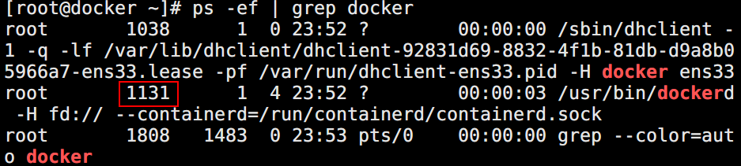
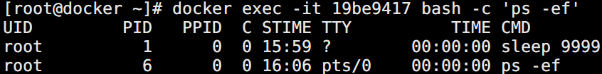
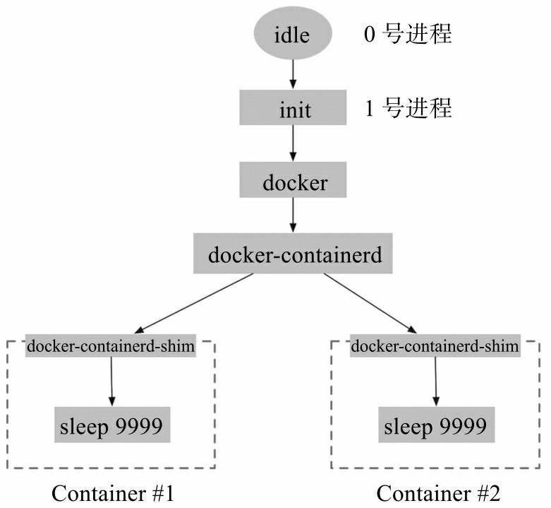
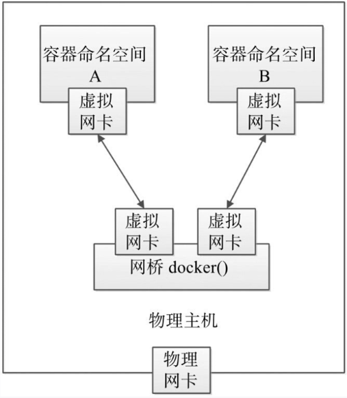
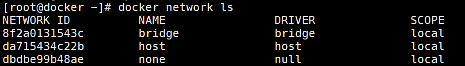
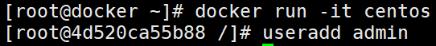
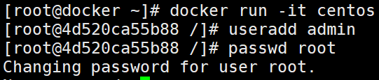

# 命名空间
每个容器都可以拥有自己单独的命名空间，运行在其中的应用都像是在独立的操作系统环境中一样。命名空间机制保证了容器之间彼此互不影响。

在操作系统中，包括内核、文件系统、网络、进程号（Process ID, PID）、用户号（User ID, UID）、进程间通信（InterProcess Communication, IPC）等资源，所有的资源都是应用进程直接共享的。要想实现虚拟化，除了要实现对内存、CPU、网络IO、硬盘IO、存储空间等的限制外，还要实现文件系统、网络、PID、UID、IPC等的相互隔离。

# 一、种类
1. PID进程命名空间

Linux通过进程命名空间管理进程号，对于同一进程（同一个task_struct），在不同的命名空间中，看到的进程号不相同。每个进程命名空间有一套自己的进程号管理方法。

+ 进程命名空间是一个父子关系的结构，子空间中的进程对于父空间是可见的。新fork出的一个进程，在父命名空间和子命名空间将分别对应不同的进程号
+ 例如，查看Docker服务主进程id号为1131

+ 新建一个centos容器，执行sleep命令，查看docker进程

[root@docker ~]# docker run --name test -d centos sleep 9999

每当启动一个容器后，相应的会启动一个containerd-shim进程进程号为1859，作为该容器内所有进程的根进程

+ 查看容器内部进程信息

+ 宿主机与容器内进程关系空间如果所示

2. IPC进程交互命名空间

容器中的进程交互还是采用了Linux常见的进程间交互方法，包括信号量、消息队列和共享内存等方式。PID命名空间和IPC命名空间可以组合起来一起使用，同一个IPC命名空间内的进程可以彼此可见，允许进行交互；不同空间的进程则无法交互。

3. net网络命名空间

有了进程命名空间后，不同命名空间中的进程号可以相互隔离，但是网络端口还是共享本地系统的端口。

+ 通过网络命名空间，可以实现网络隔离。一个网络命名空间为进程提供了一个完全独立的网络协议栈的视图。包括网络设备接口、IPv4和IPv6协议栈、IP路由表、防火墙规则、sockets等，这样每个容器的网络就能隔离开来。
+ Docker采用虚拟网络设备（Virtual Network      Device,      VND）的方式，将不同命名空间的网络设备连接到一起。默认情况下，Docker在宿主机上创建多个虚机网桥（如默认的网桥docker0），容器中的虚拟网卡通过网桥进行连接

+ 使用docker network      ls命令可以查看到当前系统中的网桥：

+ 使用brctl工具（需要安装bridge-utils工具包），还可以看到连接到网桥上的虚拟网口的信息。每个容器默认分配一个网桥上的虚拟网口，并将docker0的IP地址设置为默认的网关，容器发起的网络流量通过宿主机的iptables规则进行转发：

4. mnt挂载命名空间
+ 类似于chroot，挂载（Mount,      MNT）命名空间可以将一个进程的根文件系统限制到一个特定的目录下。
+ 挂载命名空间允许不同命名空间的进程看到的本地文件位于宿主机中不同路径下，每个命名空间中的进程所看到的文件目录彼此是隔离的。例如，不同命名空间中的进程，都认为自己独占了一个完整的根文件系统（rootfs），但实际上，不同命名空间中的文件彼此隔离，不会造成相互影响，同时也无法影响宿主机文件系统中的其他路径。
+ 容器有自己的 / 目录，可以执行 mount 和 umount 命令。当然我们知道这些操作只在当前容器中生效，不会影响到 host 和其他容器。
5. UTS主机名域名命名空间
+ UTS（UNIX Time-sharing      System）命名空间允许每个容器拥有独立的主机名和域名，从而可以虚拟出一个有独立主机名和网络空间的环境，就跟网络上一台独立的主机一样。
+  默认情况下，容器的 hostname 是它的短ID，可以通过 -h 或 --hostname 参数设置。

6．user用户命名空间

+ 每个容器可以有不同的用户和组id，也就是说，可以在容器内使用特定的内部用户执行程序，而非本地系统上存在的用户。
+ 每个容器内部都可以有最高权限的root帐号，但跟宿主主机不在一个命名空间。通过使用隔离的用户命名空间，可以提高安全性，避免容器内的进程获取到额外的权限；同时通过使用不同用户也可以进一步在容器内控制权限。
+ user namespace 让容器能够管理自己的用户，host 不能看到容器中创建的用户。

+ 例如，下面的命令在容器内创建了test用户，只有普通权限，无法访问更高权限的资源：

# 二、实现原理
1. Namespace它其实只是 Linux 创建新进程的一个可选参数。在 Linux 系统中创建线程的系统调用是 clone()，比如：int pid =      clone(main_function, stack_size, SIGCHLD, NULL); 这个系统调用就会为我们创建一个新的进程，并且返回它的进程号 pid。
2. 当我们用 clone() 系统调用创建一个新进程时，就可以在参数中指定 CLONE_NEWPID 参数，比如：int pid =      clone(main_function, stack_size, CLONE_NEWPID | SIGCHLD, NULL); 这时，新创建的这个进程将会“看到”一个全新的进程空间，在这个进程空间里，它的 PID 是 1。
3. 之所以说“看到”，是因为这只是一个“障眼法”，在宿主机真实的进程空间里，这个进程的 PID 还是真实的数值，比如 100。当然，我们还可以多次执行上面的 clone() 调用，这样就会创建多个 PID Namespace，而每个 Namespace 里的应用进程，都会认为自己是当前容器里的第 1 号进程，它们既看不到宿主机里真正的进程空间，也看不到其他 PID Namespace 里的具体情况。
4. 跟真实存在的虚拟机不同，在使用 Docker 的时候，并没有一个真正的“Docker 容器”运行在宿主机里面。Docker 项目帮助用户启动的，还是原来的应用进程，只不过在创建这些进程时，Docker 为它们加上了各种各样的 Namespace 参数。这时，这些进程就会觉得自己是各自 PID Namespace 里的第 1 号进程，只能看到各自 Mount Namespace 里挂载的目录和文件，只能访问到各自 Network Namespace 里的网络设备，就仿佛运行在一个个“容器”里面，与世隔绝。

