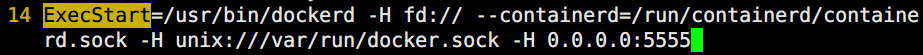

# 基本架构

> 分类: Docker > 核心技术
> 更新时间: 2026-01-10T23:35:08.854127+08:00

---

Docker目前采用了标准的C/S架构，包括客户端、服务端两大核心组件，同时通过镜像仓库来存储镜像。客户端和服务端既可以运行在一个机器上，也可通过socket或者RESTful  API来进行通信

+ 服务端用来接受并处理来自客户端的请求，包括创建、运行、删除容器等。
+ 客户端用来为用户提供一系列可执行命令，使用这些命令可实现与Docker服务端交互。

1. 服务端

Docker服务端一般在宿主主机后台运行，dockerd作为服务端接受来自客户的请求，并通过containerd具体处理与容器相关的请求，包括创建、运行、删除容器等。服务端主要包括四个组件：

+ dockerd：为客户端提供RESTful API，响应来自客户端的请求，采用模块化的架构，通过专门的Engine模块来分发管理各个来自客户端的任务。可以单独升级；
+ docker-proxy：是dockerd的子进程，当需要进行容器端口映射时，docker-proxy完成网络映射配置；
+ containerd：是dockerd的子进程，提供gRPC接口响应来自dockerd的请求，对下管理runC镜像和容器环境。可以单独升级；
+ containerd-shim：是containerd的子进程，为runC容器提供支持，同时作为容器内进程的根进程。
+ runC是Docker引擎，容器的创建，运行，销毁等等操作最终都将通过调用runC完成
+ docker-proxy只有当启动容器并且使用端口映射时候才会执行，负责配置容器的端口映射规则：
2. 客户端
+ Docker客户端为用户提供一系列可执行命令，使用这些命令可实现与Docker服务端交互。客户端发送命令后，等待服务端返回；一旦收到返回后，客户端立刻执行结束并退出。用户执行新的命令，需要再次调用客户端命令。
3. docker的远程访问

Docker使用socket进行客户端和服务端的连接，提供了三种进行socket连接的模式

+ unix:///var/run/docker.sock        Unix端口，默认的连接方式
+ tcp://host:port
+ fd://socketfd

默认情况下，Docker守护进程会生成一个socket（/var/run/docker.sock）文件来进行本地进程通信，而不会监听任何端口，因此只能在本地使用docker客户端或者使用Docker       API进行操作。如果想在其他主机上操作Docker主机，就需要让Docker守护进程监听一个端口，这样才能实现远程通信。

+ 服务端修改docker守护进程启动选项

更改docker配置文件，在[Service]模块ExecStart行追加-H unix:///var/run/docker.sock -H  0.0.0.0:5555

[root@dockerserver ~]# vim /lib/systemd/system/docker.service

+ 修改完配置后重启服务

[root@dockerserver ~]# systemctl  daemon-reload 

[root@dockerserver ~]# systemctl restart docker

+ 客户端测试远程访问

[root@dockerclient]# docker -H 192.168.217.132:5555 images

4. 镜像仓库
+ 镜像是使用容器的基础，Docker使用镜像仓库在大规模场景下存储和分发Docker镜像。镜像仓库提供了对不同存储后端的支持，存放镜像文件，并且支持RESTful  API，接收来自dockerd的命令，包括拉取、上传镜像等。
+ 用户从镜像仓库拉取的镜像文件会存储在本地使用；用户同时也可以上传镜像到仓库，方便其他人获取。使用镜像仓库可以极大地简化镜像管理和分发的流程。

