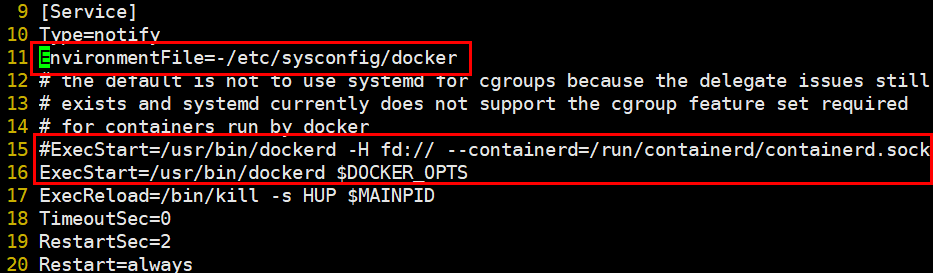
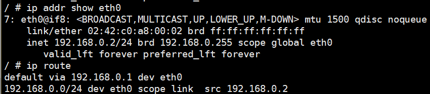
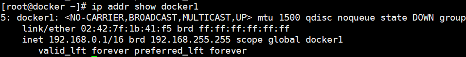
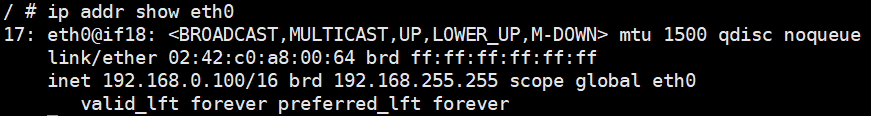
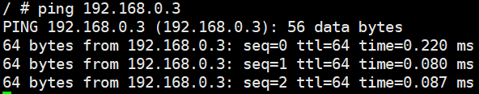
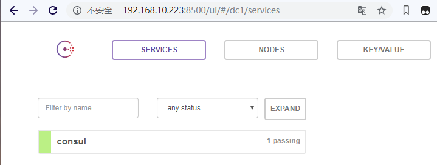
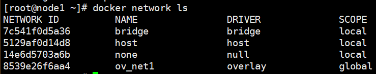
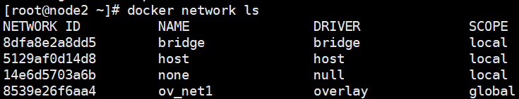
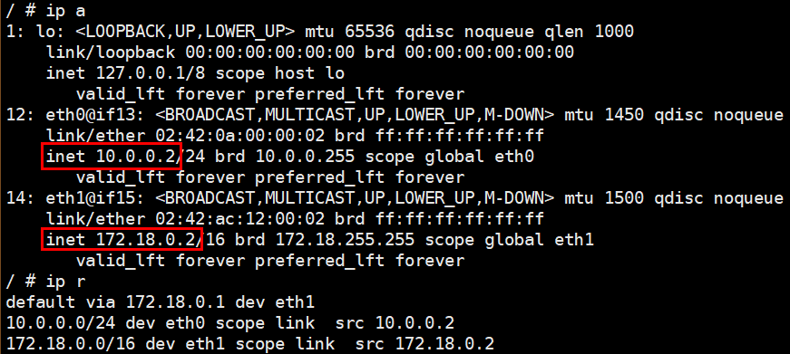
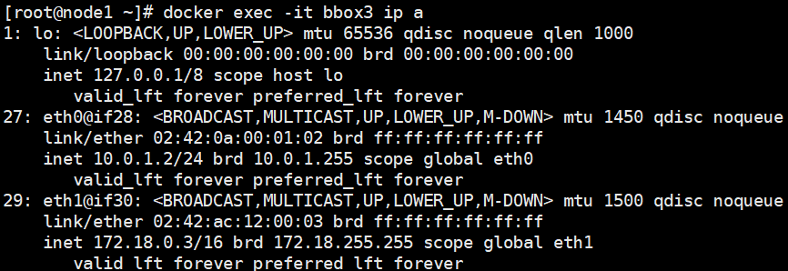

# 自定义网络
# 一、修改默认网桥
1. 安装brctl软件包

[root@docker ~]# yum -y install bridge-utils

2. 停止docker服务并移除docker0网桥

[root@docker ~]# systemctl stop docker

[root@docker ~]# ip link set dev docker0 down

[root@docker ~]# brctl delbr docker0

[root@docker ~]# iptables -t nat -F POSTROUTING

3. 创建自定义网桥

[root@docker ~]# brctl addbr bridge0

[root@docker ~]# ip addr add 192.168.0.0/24 dev bridge0

[root@docker ~]# ip link set dev bridge0 up

4. 查看网桥信息

5. 修改配置，设置docker默认使用新的网桥

[root@docker ~]# echo 'DOCKER_OPTS="-b=bridge0"' >> /etc/sysconfig/docker

6. 修改systemctl启动配置

[root@docker ~]# vim /lib/systemd/system/docker.service

7. 重启docker

[root@docker ~]# systemctl daemon-reload

[root@docker ~]# systemctl start docker

8. 运行容器，测试效果

[root@docker ~]# docker run -it busybox

# 二、使用bridge创建自定义网桥
1. 创建自定义网桥

[root@docker ~]# docker network create docker1 --subnet=192.168.0.0/16 -o com.docker.network.bridge.name=docker1

+ --subnet=192.168.0.0/16：指定IP网段
+ -o      com.docker.network.bridge.name=docker1：指定设备名称

+ 运行容器，使用docker1网络

[root@docker ~]# docker run -it --network docker1 busybox

+ 运行容器，指定ip地址

[root@docker ~]# docker run -it --network docker1 --ip 192.168.0.100 busybox

+ 删除自定义网桥

[root@docker ~]# docker network rm docker1

2. 自定义网桥与默认docker0通信
+  docker 在设计上就是要隔离不同的 netwrok。由于iptables DROP 掉了网桥 docker0  之间双向的流量。只能采取为 容器添加一块docker1的网卡来实现通信

[root@docker docker]# docker network connect docker1 a186189

+ 容器中增加了一个网卡 eth1，分配了docker1 的 IP 192.168.0.3。使用busybox访问测试

# 三、创建一个点到点连接
用户有时候需要两个容器之间可以直连通信，而不用通过主机网桥进行桥接。解决办法很简单：创建一对peer接口，分别放到两个容器中，配置成点到点链路类型即可。

1. 启动两个容器

[root@docker ~]# docker run -it --net=none --name=box1 busybox

[root@docker ~]# docker run -it --net=none --name=box2 busybox

2. 找到容器进程号，并创建网络命名空间的跟踪文件

[root@docker ~]# docker inspect -f '{{.State.Pid}}' box1

2989

[root@docker ~]# docker inspect -f '{{.State.Pid}}' box2

3004

[root@docker ~]# mkdir -p /var/run/netns

[root@docker ~]# ln -s /proc/2989/ns/net /var/run/netns/2989

[root@docker ~]# ln -s /proc/3004/ns/net /var/run/netns/3004

3. 创建一对peer接口

[root@docker ~]# ip link add A type veth peer name B

4. 添加IP地址和路由信息

[root@docker ~]# ip link set A netns 2989

[root@docker ~]# ip netns exec 2989 ip addr add 10.1.1.1/32 dev A

[root@docker ~]# ip netns exec 2989 ip link set A up

[root@docker ~]# ip netns exec 2989 ip route add 10.1.1.2/32 dev A

[root@docker ~]# ip link set B netns 3004

[root@docker ~]# ip netns exec 3004 ip addr add 10.1.1.2/32 dev B

[root@docker ~]# ip netns exec 3004 ip link set B up

[root@docker ~]# ip netns exec 3004 ip route add 10.1.1.1/32 dev B

5. 访问测试连通性

# 四、跨主机容器网络
使用libnetwork自带的Overlay类型驱动来轻松实现跨主机的网络通信。Overlay驱动默认采用VXLAN协议，在IP地址可以互相访问的多个主机之间搭建隧道，让容器可以互相访问。

1. 实验环境准备

在 docker 主机node1（192.168.10.128）和node2（192.168.10.129）上实践各种跨主机网络方案，在 master（192.168.10.223）上部署支持的组件，比如 Consul。

+ 配置网络信息管理数据库

要连通不同的主机，需要交换机或路由器（跨子网时需要）这样的互联设备。这些设备一方面是在物理上起到连接作用，但更重要的是起到了网络管理的功能。例如，主机位置在什么地方，地址是多少等信息，都需要网络管理平面来维护。

+ 在管理节点安装Consul

[root@master ~]# docker run -d -p 8500:8500 -h consul --name consul progrium/consul -server -bootstrap

+ 修改host1和host2配置文件
+ 修改docker daemon 的配置文件。

[root@node1 ~]# vim /lib/systemd/system/docker.service

+ --cluster-store 指定 consul 的地址。
+ --cluster-advertise 告知 consul      自己的连接地址。
+ 重启服务，consul查看信息

[root@node1 ~]# systemctl daemon-reload  

[root@node1 ~]# systemctl restart docker

2. 创建overlay网络
+ node1主机创建overlay网络

[root@node1 ~]# docker network create -d overlay ov_net1

+ -d      overlay 指定 driver 为 overlay。

+ node2主机查看网络

3. 在overlay中运行容器
+ 在node1中创建一个busybox容器并连接到ov_net1

[root@node1 ~]# docker run -it --name bbox1 --network ov_net1 busybox

+ 运行容器后会在宿主机上生成一个overlay网桥

+ 容器 bbox1 就可以通过     docker_gwbridge 访问外网
4. overlay连通性
+ 在node2中创建一个busybox容器并连接到ov_net1

[root@node2 ~]# docker run -it --name bbox2 --network ov_net1 busybox

+ bbox2访问bbox1

5. 实现原理
+ docker      会为每个 overlay 网络创建一个独立的 network namespace，其中会有一个 linux bridge br0， veth      pair 一端连接到容器中（即 eth0），另一端连接到 namespace 的 br0 上。
+ br0      除了连接所有的 veth pair，还会连接一个 vxlan 设备，用于与其他 host 建立 vxlan tunnel。容器之间的数据就是通过这个      tunnel 通信的。逻辑网络拓扑结构如图所示：

6. overlay网络隔离
+ node1创建ov_net2网络，并运行bbox3

[root@node1 ~]# docker network create -d overlay ov_net2

+ 启动容器bbox3

[root@node2 ~]# docker run -itd --name bbox3 --network ov_net2 busybox

+ 查看bbox3网络

+ 测试与bbox1、bbox2网络连通性

+ 网络拓扑

 

