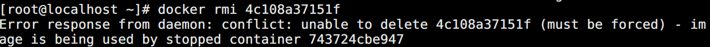

# 管理镜像
1. 从docker hub下载镜像

[root@bogon ~]# docker pull hello-world

2. 查看镜像信息

[root@bogon ~]# docker images hello-world

3. 给镜像添加tag标签（起别名，创建链接）

[root@localhost ~]# docker tag ubuntu:latest ubuntu:18.10

4. 运行镜像

[root@bogon ~]# docker run -it ubuntu bash

5. 查看镜像创建历史

[root@bogon ~]# docker history hello-world

6. 搜索镜像

[root@localhost ~]# docker search nginx

7. 删除镜像

[root@bogon ~]# docker image rm ubuntu:18.10

[root@bogon ~]# docker rmi ubuntu:18.10

[root@bogon ~]# docker image rm 9SDS3HF3S2

+ 出现上述情况因为后台存在退出状态的容器，依赖该镜像，可以使用docker ps -a查看，使用docker rm删除依赖的容器，然后才能删除该镜像
+ rmi 只能删除 host 上的镜像，不会删除      registry 的镜像。
+ 如果一个镜像对应了多个 tag，只有当最后一个 tag      被删除时，镜像才被真正删除。
8. 清理临时镜像

[root@localhost ~]# docker image prune

