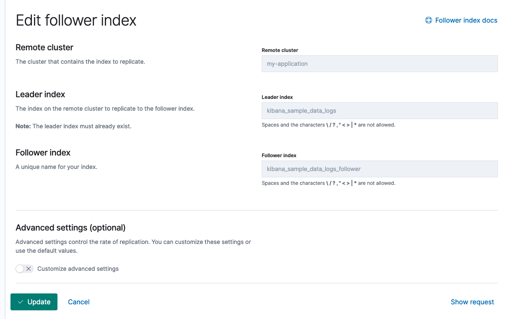

# CCR
# 注意点
配置完成后在kibana验证远程集群连接状态，搜索是否正常

# Cross-cluster search
在cluster1的kibana里配置cluster2，进行跨集群搜索

```json
# 添加远程集群
PUT _cluster/settings
{
  "persistent": {
    "cluster": {
      "remote": {
        "cluster_one": {
          "seeds": [
            "192.168.10.21:9300"
          ]
        },
        "cluster_two": {
          "seeds": [
            "192.168.10.100:9300"
          ]
        }
      }
    }
  }
}
# 查看远程集群信息
GET _remote/info
# 搜索测试
GET /cluster_one:kibana_sample_data_logs/_search
{
  "query": {
    "match": {
      "ip": "111.12.159.165"
    }
  }
}
```

# CCR


+ 角色可跳过设置

## 
