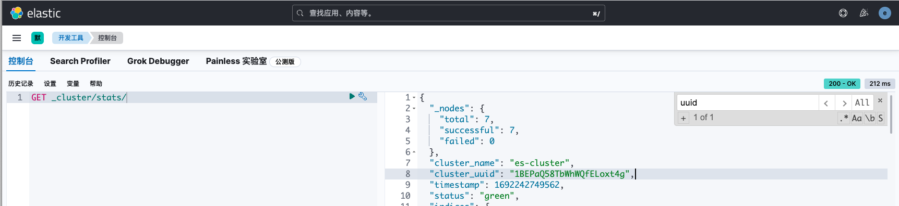
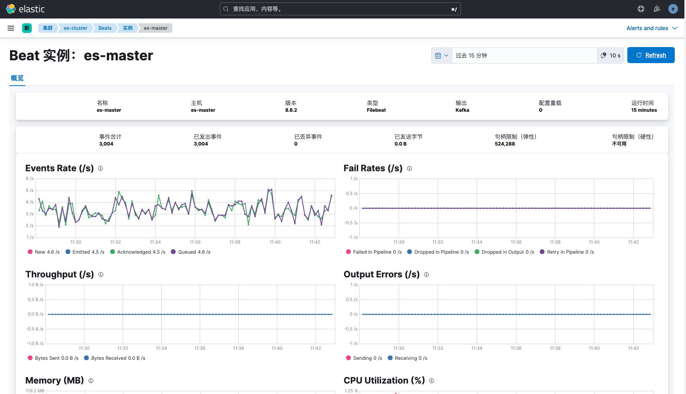
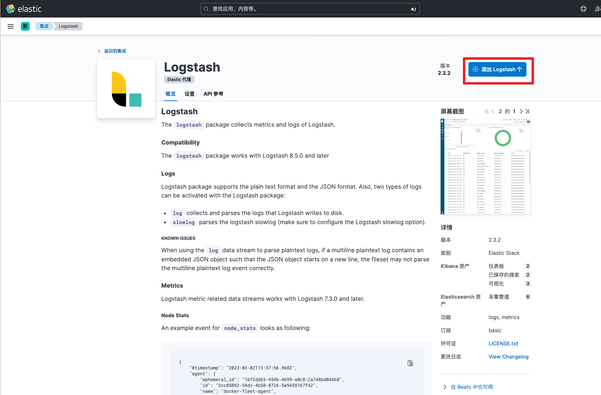
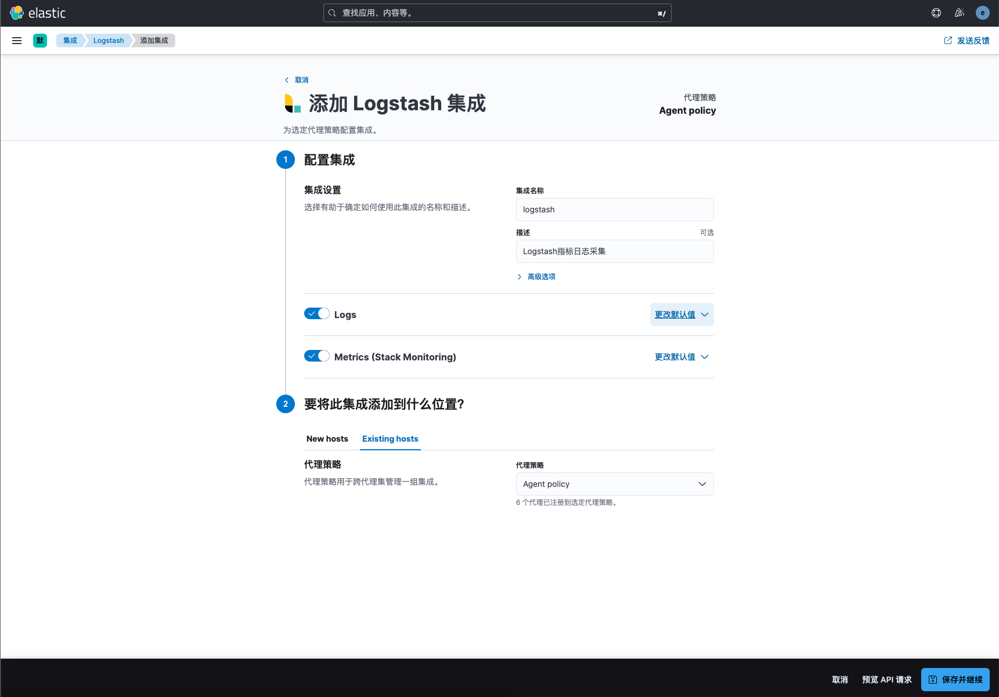
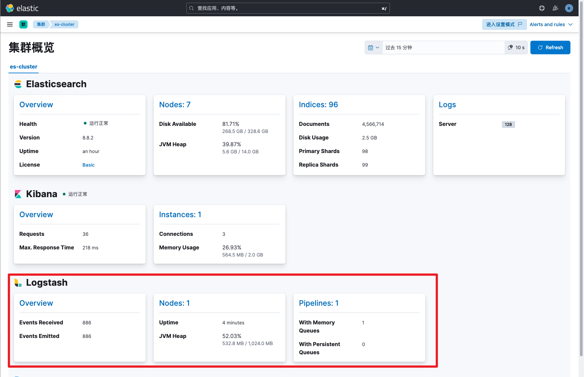
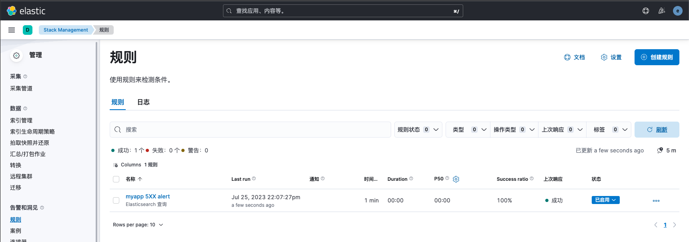

# ELK监控与告警(Kibana)
> ELK的监控主要分为两方面，一方面是Filebeat、Logstash、Elasticsearch、Kibana自身的服务性能指标的采用与监控，另一方面是采集业务日志存入ES后，进行日志分析与告警监控。
>

# Filebeat监控
Kibana监控Filebeat主要有以下两种方式：

方式1：在Filebeat中新增monitoring配置，将指标信息写入ES集群中

方式2：部署<font style="color:rgb(33, 37, 41);">Metricbeat，用于收集Filebeat的指标数据并写入到ES集群中</font>

<font style="color:rgb(33, 37, 41);">大多数情况下，我们都会采用方式1完成Filebeat性能监控。</font>

## 查询集群UUID
通过uuid标识不同的集群，只有Filebeat配置es集群的uuid后，才会在Kibana的monitor界面显示Filebeat指标信息。

首先调用_cluster API查询集群UUID



## 修改Filebeat配置
在Filebeat配置中，新增monitoring相关信息

```bash
[root@es-master ~]# vim /etc/filebeat/filebeat.yml
filebeat.inputs:
- type: log
  enabled: true
  paths:
    - /var/log/log_demo/info.log
output.kafka:
  enable: true
  hosts:  ["es-hot1:9092","es-hot2:9092","es-hot3:9092"]
  topic: "log_demo"
  partition.round_robin:
    reachable_only: false
  required_acks: -1
  compression: gzip
logging.level: info
logging.to_files: true
logging.files:
  path: /var/log/filebeat
  name: filebeat
  keepfiles: 7
  permissions: 0644
monitoring: # 新增monitoring相关配置
  enabled: true
  cluster_uuid: "1BEPaQ58TbWhWQfELoxt4g" # es集群uuid
  elasticsearch:
    hosts:  ["https://es-master:9200"]
    username: "elastic" 
    password: "_21FDs+tGRRSaxg=q=4P"
    ssl.certificate_authorities: ["/etc/elasticsearch/certs/http_ca.crt"]
```

启动测试Filebeat能否正常启动，日志有无报错信息

```bash
[root@es-master ~]# filebeat -e -c /etc/filebeat/filebeat.yml
```

重启filebeat服务

```bash
[root@es-master ~]# systemctl restart filebeat
```

## 访问验证
接下来访问kibana，在集群概览中已自动添加beats相关信息。


我们点击beats链接即可跳转至filebeat指标详情页面。



# Logstash监控
Logstash监控指标获取主要有以下两种方式：

方式1：配置代理策略，通过Elastic Agent采集Logstash指标，将指标信息写入ES集群中。

方式2：部署<font style="color:rgb(33, 37, 41);">Metricbeat，用于收集Logstash指标数据并写入到ES集群中</font>

<font style="color:rgb(33, 37, 41);">大多数情况下，我们都会采用方式1完成Logstash性能监控。</font>

## <font style="color:rgb(33, 37, 41);">修改Logstash配置</font>
我们需要修改Logstash配置，禁用默认的指标收集配置，并指定es集群uuid

```bash
[root@es-warm1 ~]# vim /etc/logstash/logstash.yml
# API相关配置
api.enabled: true
api.http.host: 0.0.0.0 # 如果想仅本地访问就填写127.0.0.1 如果想其他主机也能访问就填写0.0.0.0或ip
api.http.port: 9600
# Monitoring 相关配置
xpack.monitoring.enabled: false
monitoring.cluster_uuid: "1BEPaQ58TbWhWQfELoxt4g"
```

重启Logstash服务

```bash
[root@es-warm1 ~]# systemctl restart logstash
```

访问API地址验证（Logstash启动较慢，待端口监听后访问验证）

```bash
[root@es-warm1 ~]# curl '127.0.0.1:9600?pretty'
{
  "host" : "es-warm1",
  "version" : "8.8.2",
  "http_address" : "0.0.0.0:9600",
  "id" : "584f36d2-4663-4806-ba6a-ebbe11380d97",
  "name" : "es-warm1",
  "ephemeral_id" : "d84edce6-5644-45d0-accb-3f98ca1f304e",
  "status" : "green",
  "snapshot" : false,
  "pipeline" : {
    "workers" : 4,
    "batch_size" : 125,
    "batch_delay" : 50
  },
  "monitoring" : {
    "cluster_uuid" : "1BEPaQ58TbWhWQfELoxt4g"
  },
  "build_date" : "2023-06-21T13:45:14+00:00",
  "build_sha" : "6014e68522bf4575f10fd41b7b11714f9970a9ee",
  "build_snapshot" : false
}
```

## 添加代理策略
接下来配置代理策略，先添加Logstash集成。




如果指定了Logstash日志路径，在此修改路径。代理策略选择agent policy即可。



## 访问验证
添加完成后，等待3-5分钟，访问kibana的monitor页面即可看到已新增Logstash信息。



点击overview即可查看Logstash指标信息


# Elasticsearch日志采集
部署完ES与Kibana后，Kibana会自动为我们添加es和Kibana的指标采集，但是缺少ES日志信息。我们只需要部署Fleet并配置Elasticsearch代理策略，填写Elasticsearch日志路径即可，详细配置可参考文档：[https://www.cuiliangblog.cn/detail/article/61](https://www.cuiliangblog.cn/detail/article/61)


# 启用Kibana告警功能
Kibana 的 Alert 模块主要用于 Elastic Stack 的监控告警。以一种相对较低的使用成本，将复杂的查询条件，编辑完成后监控不同的 Elastic Stack 的技术产品中产生的数据，最终把符合条件的告警信息以需要的方式反馈给用户。

## 前提条件
1. Elasticsearch 集群启用了HTTPS的安全设置
2. 在 Kibana 的配置文件中，添加 xpack.encryptedSavedObjects.encryptionKey 设置，它的值为至少 32 位的字符。

## 启用告警
<font style="color:rgb(77, 77, 77);">Kibana 提供了一个命令行工具来生成加密字符串，该命令行工具在 bin 目录下，使用方式如下：</font>

```plain
[root@es-master ~]# kibana-encryption-keys generate
## Kibana Encryption Key Generation Utility

The 'generate' command guides you through the process of setting encryption keys for:

xpack.encryptedSavedObjects.encryptionKey
    Used to encrypt stored objects such as dashboards and visualizations
    https://www.elastic.co/guide/en/kibana/current/xpack-security-secure-saved-objects.html#xpack-security-secure-saved-objects

xpack.reporting.encryptionKey
    Used to encrypt saved reports
    https://www.elastic.co/guide/en/kibana/current/reporting-settings-kb.html#general-reporting-settings

xpack.security.encryptionKey
    Used to encrypt session information
    https://www.elastic.co/guide/en/kibana/current/security-settings-kb.html#security-session-and-cookie-settings


Already defined settings are ignored and can be regenerated using the --force flag.  Check the documentation links for instructions on how to rotate encryption keys.
Definitions should be set in the kibana.yml used configure Kibana.

Settings:
xpack.encryptedSavedObjects.encryptionKey: ca6f4a9d6543db9ad86ed12debd6b105
xpack.reporting.encryptionKey: 4d583fae32f33b5bfc13dd88ffd62fac
xpack.security.encryptionKey: 16283b383a14d68c26efc90375d3d2c9
```

修改kibana配置文件，填写生成的加密字符串配置内容。

```bash
[root@es-master ~]# vim /etc/kibana/kibana.yml
xpack.encryptedSavedObjects.encryptionKey: ca6f4a9d6543db9ad86ed12debd6b105
xpack.reporting.encryptionKey: 4d583fae32f33b5bfc13dd88ffd62fac
xpack.security.encryptionKey: 16283b383a14d68c26efc90375d3d2c9
```

重启kibana

```plain
[root@es-master ~]# systemctl restart kibana
```

## 访问验证
访问告警页面，已经可以创建告警规则信息了。


# 创建告警规则
## 场景模拟
服务器出现5XX错误是一个非常严重的问题，假如我们需要每分钟查询一次myapp数据流的数据，如果前1分钟内access_status字段的值502、503、504个数超过10个，就发送触发一条告警信息。

## 调试查询语句
接下来我们使用dev tools查询工具，调试出5XX个数的查询语句，查询语句内容如下：

```json
GET logs-myapp-default/_search
{
  "query": {
    "terms": {
      "access_status": [
        "502",
        "503",
        "504"
      ]
    }
  }
}
```

## 创建规则
告警类型我们选择Elasticsearch查询，填写名称与查询index、查询语句、告警阈值，告警规则配置如下所示：


点击测试查询，显示已匹配13个文档，说明告警规则配置无误


## 创建连接器
连接器，也就是告警媒介，告警通过什么方式发送出来，由于使用的社区免费版，所以暂时只开放了服务器日志和索引两个选项。如果想要使用其他告警媒介，需要购买授权才可以。接下来以索引为例，将告警信息写入指定的索引中。


在索引文档中填写入的告警信息字段，通过右侧的变量菜单可以浏览引用相关的变量。


点击保存后，告警规则添加完毕



## ES集群监控告警
kibana除了可以监控指定查询语句是否满足告警条件外，还支持ES集群状态监控以及节点状态监控，我们只需要按实际需求选择对于的告警规则即可。


## 查看告警记录
在索引管理中，已经可以看到自动创建了名为alert-index的索引，有1条告警记录信息。


接下来创建数据视图，方便后续查看告警记录信息。


在discover中可以看到告警产生的时间和告警值信息。


虽然Kibana支持告警功能，但免费版仅能将告警记录写入指定的索引中，需要我们开发告警程序，连接ES集群定时查询告警索引记录，发现新的告警记录通知值班人员。Kibana的告警功能实属鸡肋，后续会介绍更为方便灵活的Prometheus+grafana告警方案。

# 参考文档
filebeat开启监控：[https://www.elastic.co/guide/en/beats/filebeat/current/monitoring-internal-collection.html](https://www.elastic.co/guide/en/beats/filebeat/current/monitoring-internal-collection.html)

logstash开启监控：[https://www.elastic.co/guide/en/logstash/current/monitoring-with-elastic-agent.html](https://www.elastic.co/guide/en/logstash/current/monitoring-with-elastic-agent.html)

kibana开启告警：[https://www.elastic.co/guide/en/kibana/8.8/alert-action-settings-kb.html#general-alert-action-settings](https://www.elastic.co/guide/en/kibana/8.8/alert-action-settings-kb.html#general-alert-action-settings)

kibana告警规则配置：[https://www.elastic.co/guide/en/kibana/8.8/create-and-manage-rules.html](https://www.elastic.co/guide/en/kibana/8.8/create-and-manage-rules.html)

