# ES索引策略配置与写入性能优化
> 在前面的实验案例中，我们已经顺利的完成了自定义日志的采集与过滤清洗操作，并将日志内容存储到ES集群。但只是把数据存储到ES集群还远不够，应该根据实际情况合理配置索引策略和参数，这样才能保障ES集群长期稳定运行。
>

# 采集管道
虽然在先前的案例中已经使用Logstash对原始数据进行了清洗处理，但是实际存入ES中发现部分字段仍存在问题。我们除了重新调试Logstash的filter过滤规则外，还可以通过es的ingest pipeline，交由es的ingest节点在存入es前做最后的处理工作。

更多ingest相关的内容，可参考文章：[https://www.cuiliangblog.cn/detail/section/76304999](https://www.cuiliangblog.cn/detail/section/76304999)

## 查看es存储数据字段
除了使用discover查看文档json信息外，我们也可以通过dev tools工具查看

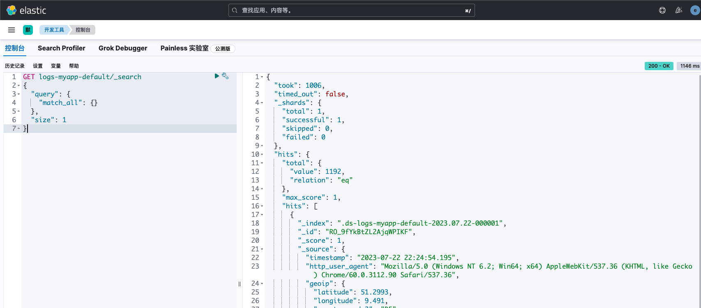

请求与响应数据如下：

```json
# 请求
GET logs-myapp-default/_search
{
  "query": {
    "match_all": {}
  },
  "size": 1
}
# 响应
{
  "took": 1006,
  "timed_out": false,
  "_shards": {
    "total": 1,
    "successful": 1,
    "skipped": 0,
    "failed": 0
  },
  "hits": {
    "total": {
      "value": 1192,
      "relation": "eq"
    },
    "max_score": 1,
    "hits": [
      {
        "_index": ".ds-logs-myapp-default-2023.07.22-000001",
        "_id": "RO_9fYkBtZL2AjqWPIKF",
        "_score": 1,
        "_source": {
          "log_timestamp": "2023-07-22 22:24:54.195",
          "http_user_agent": "Mozilla/5.0 (Windows NT 6.2; Win64; x64) AppleWebKit/537.36 (KHTML, like Gecko) Chrome/60.0.3112.90 Safari/537.36",
          "geoip": {
            "latitude": 51.2993,
            "longitude": 9.491,
            "country_code2": "DE",
            "timezone": "Europe/Berlin",
            "ip": "185.35.187.28",
            "location": {
              "lon": 9.491,
              "lat": 51.2993
            },
            "continent_code": "EU",
            "country_name": "Germany",
            "country_code3": "DE"
          },
          "input": {
            "type": "log"
          },
          "host": {
            "name": "es-master"
          },
          "event": {
            "original": """{"@timestamp":"2023-07-22T14:24:54.300Z","@metadata":{"beat":"filebeat","type":"_doc","version":"8.8.2"},"ecs":{"version":"8.0.0"},"host":{"name":"es-master"},"log":{"offset":3347648,"file":{"path":"/var/log/log_demo/info.log"}},"message":"2023-07-22 22:24:54.195 | WARNING  | __main__:debug_log:47 - {'access_status': 404, 'request_method': 'POST', 'request_uri': '/account/', 'request_length': 10, 'remote_address': '185.35.187.28', 'server_name': 'cm-13.cn', 'time_start': '2023-07-22T22:24:53.535+08:00', 'time_finish': '2023-07-22T22:24:54.973+08:00', 'http_user_agent': 'Mozilla/5.0 (Windows NT 6.2; Win64; x64) AppleWebKit/537.36 (KHTML, like Gecko) Chrome/60.0.3112.90 Safari/537.36'}","input":{"type":"log"},"agent":{"ephemeral_id":"0c5f1eda-64b7-4e27-8519-282b64d8883d","id":"d51f4cc1-288b-473e-b4d4-f2e347c849e3","name":"es-master","type":"filebeat","version":"8.8.2"}}"""
          },
          "agent": {
            "id": "d51f4cc1-288b-473e-b4d4-f2e347c849e3",
            "name": "es-master",
            "type": "filebeat",
            "ephemeral_id": "0c5f1eda-64b7-4e27-8519-282b64d8883d",
            "version": "8.8.2"
          },
          "request_length": 10,
          "server_name": "cm-13.cn",
          "@timestamp": "2023-07-22T14:24:54.195Z",
          "message": "2023-07-22 22:24:54.195 | WARNING  | __main__:debug_log:47 - {'access_status': 404, 'request_method': 'POST', 'request_uri': '/account/', 'request_length': 10, 'remote_address': '185.35.187.28', 'server_name': 'cm-13.cn', 'time_start': '2023-07-22T22:24:53.535+08:00', 'time_finish': '2023-07-22T22:24:54.973+08:00', 'http_user_agent': 'Mozilla/5.0 (Windows NT 6.2; Win64; x64) AppleWebKit/537.36 (KHTML, like Gecko) Chrome/60.0.3112.90 Safari/537.36'}",
          "ecs": {
            "version": "8.0.0"
          },
          "class": "__main__:debug_log:47",
          "log": {
            "offset": 3347648,
            "file": {
              "path": "/var/log/log_demo/info.log"
            }
          },
          "level": "warning",
          "request_method": "POST",
          "time_start": "2023-07-22T22:24:53.535+08:00",
          "@version": "1",
          "time_finish": "2023-07-22T22:24:54.973+08:00",
          "request_uri": "/account/",
          "remote_address": "185.35.187.28",
          "access_status": 404,
          "data_stream": {
            "type": "logs",
            "dataset": "myapp",
            "namespace": "default"
          }
        }
      }
    ]
  }
}
```

## 场景需求
通过观察原始数据后，我们发现event、agent、log字段存储的数据信息不是我们所关注的，需要在存入es之前，把这三个字段删除，接下来我们实现这个需求。

## 创建pipeline
我们创建一个名为myapp-pipeline的管道处理器，并添加规则为移除event、agent、log字段

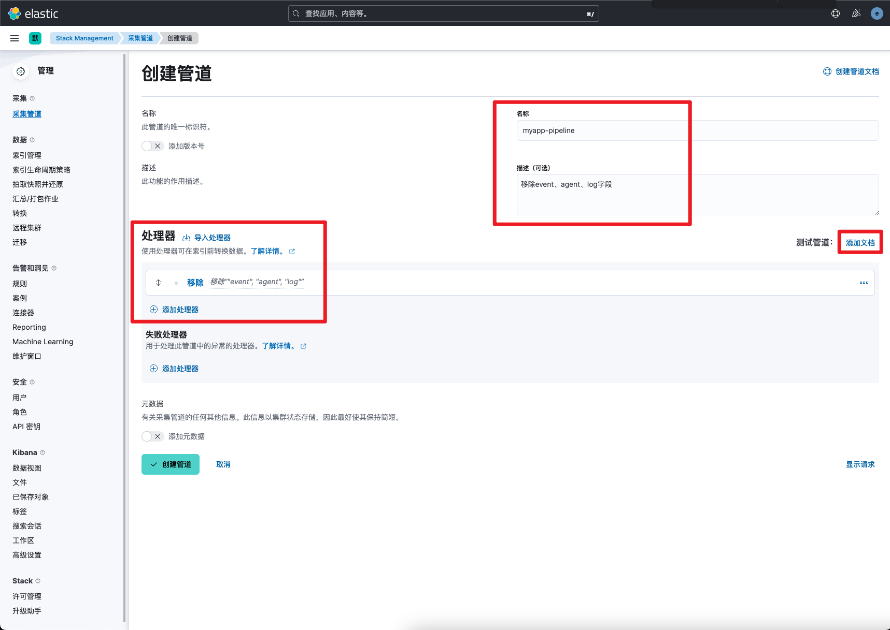

然后我们通过查询语句，获取一条样例数据，记住index和id后续使用。

```bash
# 获取数据样例
GET logs-myapp-default/_search
{
  "query": {
    "match_all": {}
  },
  "size": 1
}
```

接下来我们打开采集管道页面，将刚刚查询结果中的文档index和id内容粘贴到输入框内作为样例数据，然后运行测试。


查看页面运行结果，发现已成功去除对应的字段


接下来点击创建并保存管道即可。

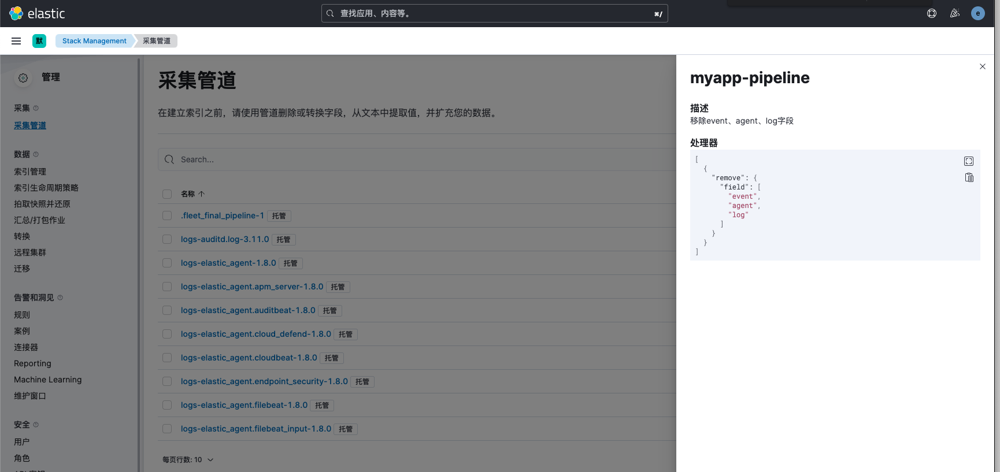

# 组件模板设置
## 场景需求
我们查看写入的索引信息可以发现，es默认为这个索引设置了1个分片和1个副本，但我们有3个hot节点，我们期望索引可以有3个分片平均分配到hot节点，分摊节点压力，提高查询和写入速度。

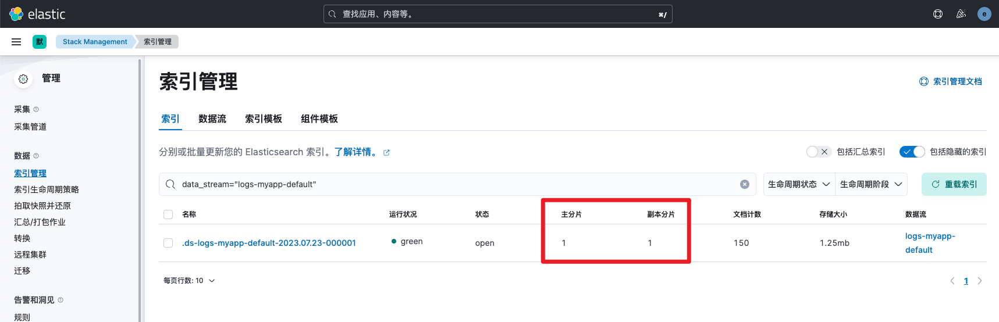

> 分片数配置建议：在实际生产实践中，建议索引分片数为hot节点数的1-3倍，且每个分片大小在20-50G为宜。对于数据量较大的索引，可以通过ilm滚动策略配置达到指定大小滚动到新的索引，对于数据量较小的索引，可以改为按月创建。
>

## 组件模板介绍
<font style="color:rgb(48, 49, 51);">索引模板（Index template）是一种告诉 Elasticsearch 在创建索引时如何配置索引的方法。 对于数据流（data stream），索引模板会在创建流时支持其后备索引。 在创建索引之前先配置模板，然后在手动创建索引或通过对文档建立索引创建索引时，模板设置将用作创建索引的基础。</font>  
<font style="color:rgb(48, 49, 51);">模板有两种类型：索引模板和组件模板。 组件模板是可重用的构建块，用于配置映射，设置和别名。 你使用组件模板来构造索引模板，但它们不会直接应用于一组索引。 索引模板可以包含组件模板的集合，也可以直接指定设置，映射和别名。更多组件模板配置请参考文章：</font>[<font style="color:rgb(48, 49, 51);">https://www.cuiliangblog.cn/detail/section/136806529</font>](https://www.cuiliangblog.cn/detail/section/136806529)

<font style="color:rgb(48, 49, 51);">通常情况下，每个索引模板都需要设置number_of_shards、number_of_replicas、refresh_interval等参数，所有使用logstash geoip插件的索引都会生成一个geoip字段，需要进行mapping字段设置。我们就可以将其设置为通用的组件模板。后续创建索引模板直接继承通用组件模板即可。</font>

## <font style="color:rgb(48, 49, 51);">配置通用setting</font>
接下来我们创建一个名为default-setting的组件模板


索引设置如下

```bash
{
  "number_of_shards": 3,
  "number_of_replicas": 1,
  "refresh_interval": "10s"
}
```


映射和别名暂不做设置，然后创建组件模板

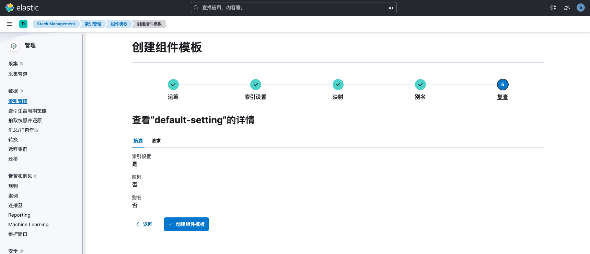

## 配置通用mapping
接下来我们创建一个名为<font style="color:rgb(26, 28, 33);">geoip-mapping的组件模板，只配置mapping相关内容。</font>

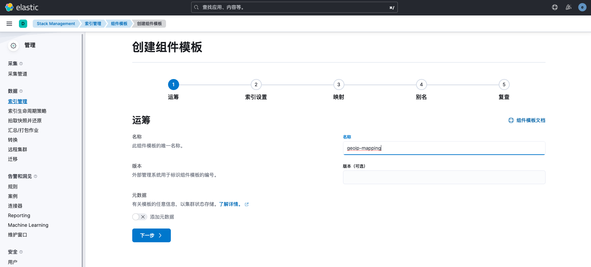

在映射中，我们直接加载JSON，JSON内容如下：

```json
{
  "dynamic": "false",
  "dynamic_templates": [],
  "properties": {
    "geoip": {
      "type": "object",
      "properties": {
        "continent_code": {
          "type": "keyword"
        },
        "country_code2": {
          "type": "keyword"
        },
        "country_code3": {
          "type": "keyword"
        },
        "country_name": {
          "type": "keyword"
        },
        "ip": {
          "type": "ip"
        },
        "latitude": {
          "type": "float"
        },
        "location": {
          "ignore_malformed": false,
          "type": "geo_point",
          "ignore_z_value": true
        },
        "longitude": {
          "type": "float"
        },
        "timezone": {
          "type": "keyword"
        }
      }
    }
  }
}
```

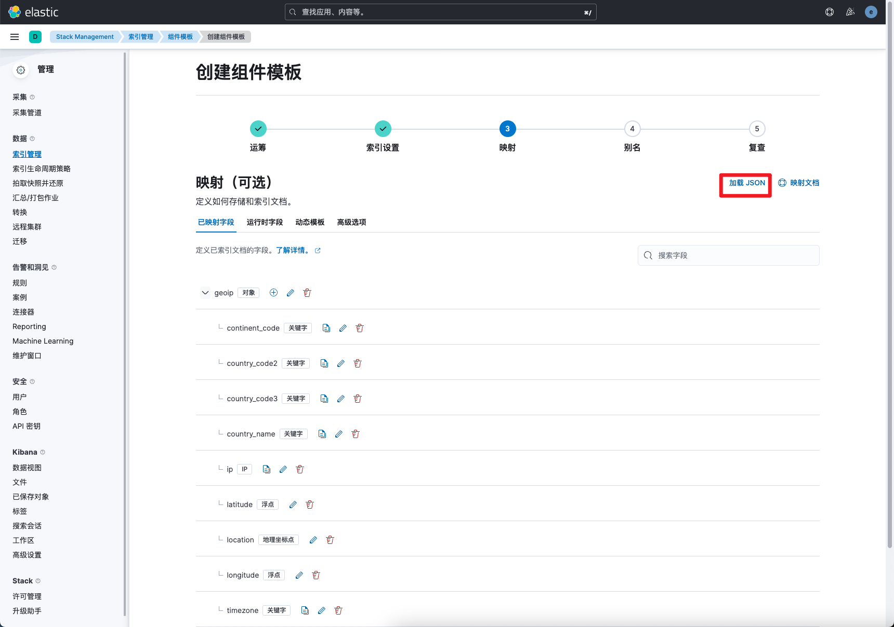

接下来创建这个组件模板


# 索引模板设置
创建完采集管道后，接下来我们要使用这个管道，我们可以通过配置索引模板的方式，指定pipeline，后续创建的index都会安装我们设置的模板自动创建并指定pipeline，更多索引模板配置请参考文章：[https://www.cuiliangblog.cn/detail/section/75856129](https://www.cuiliangblog.cn/detail/section/75856129)

## 查看索引模板
我们点击索引管理，查看数据流详细信息，就可以看到当前索引配置是由名为logs的模板管理。通常情况下都会根据实际需求单独为每个索引创建新的索引模板。


## 创建索引模板
我们找到默认的logs索引模板，查看模板的优先级

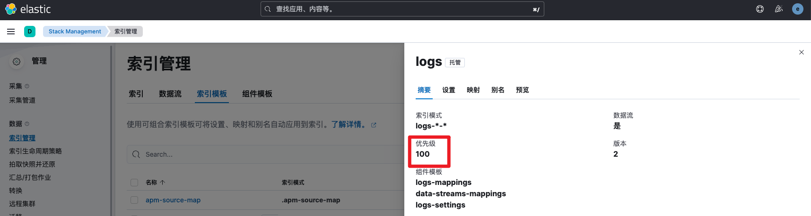

接下来创建一个新的索引模板，模板的名称为myapp，索引模式为数据流的名称，并将优先级设置为110，否则会由于优先级低于logs模板而不生效。

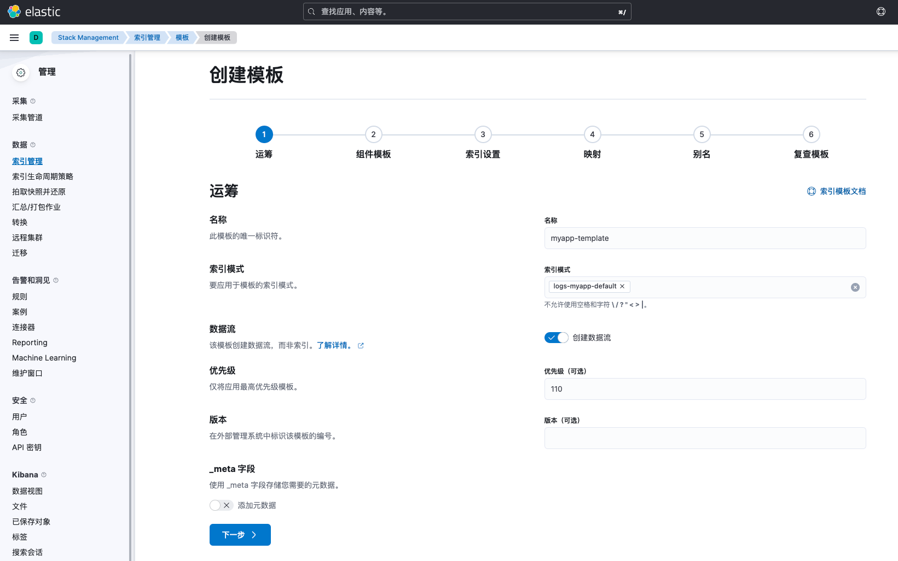

在组件模板中我们选择继承先前自定义的模板，完全自定义创建配置。


索引设置(setting)

我们在索引设置中由于以及继承了组件模板的设置，因此在此处只需要指定默认的pipeline即可。

> 索引设置优化建议：
>
> 对于实时性要求不高的索引，我们应该尽可能的调大refresh间隔。以减少写入资源的占用，提升写入吞吐能力。
>
> 同时我们可以通过total_shards_per_node参数让分片分散到各个数据节点，避免索引分片集中到部分节点导致数据倾斜。
>
> 还可以通过translong落盘异步化，提升写入性能。
>
> 设置merge并发控制参数。而一个shard其实就是一个Lucene的index，它又由多个segment组成，且Lucene会不断地把一些小的segment合并成一个大的segment，这个过程被称为merge。我们可以通过调整并发度来减少这一步占用的资源操作。
>

更多集群写入性能优化建议可参考文章：[https://www.cuiliangblog.cn/detail/section/110234776](https://www.cuiliangblog.cn/detail/section/110234776)

更多索引设置可参考文章：[https://www.cuiliangblog.cn/detail/section/68668951](https://www.cuiliangblog.cn/detail/section/68668951)

分片数设置可参考文章：[https://www.cuiliangblog.cn/detail/section/92745686](https://www.cuiliangblog.cn/detail/section/92745686)

```json
{
  "default_pipeline": "myapp-pipeline"
}
```


**映射(mapping)**

在mapping配置中，由于我们还需要对索引字段进行调整，我们先选择动态模板，待一切调整完成后，在使用固定字段mapping。更多mapping相关文章请参考[https://www.cuiliangblog.cn/detail/section/68422449](https://www.cuiliangblog.cn/detail/section/68422449)


别名设置，此处也设置为空，更多alias设置请参考[https://www.cuiliangblog.cn/detail/section/68668990](https://www.cuiliangblog.cn/detail/section/68668990)


至此，索引模板创建完成


## 创建数据流验证
我们删除原本的数据流后，会自动按索引模板设置创建新的数据流。


查看数据流信息，已关联名为myapp-template的索引模板


查看索引设置信息，已按模板设置创建了索引，将分片数调整为3个。


# 运行时
## 场景需求
查看es数据，我们发现有time_finish和time_start字段，此时如果想计算两个时间的差值，作为新的字段request_time存入es中，我们可以有以下方式实现：

1. 在查询数据时使用自定义脚本计算时间差
2. 使用Logstash插件在写入es前计算时间差
3. 使用es ingest处理，计算时间差写入es中
4. 使用runtime运行时，自动计算时间差

从简洁程度来说，首选方案4，如果从性能角度，首选方案2。本实例以方案4为例，演示runtime的使用。更多runtime信息请参考文档：[https://www.cuiliangblog.cn/detail/section/84342649](https://www.cuiliangblog.cn/detail/section/84342649)

## 调试runtime
我们在script中将time_finish与time_start转换为时间戳，两者相减即是请求时间的值

```json
# 请求
GET logs-myapp-default/_search
{
  "runtime_mappings": {
    "request_time": {
      "type": "long",
      "script": {
        "source": "emit(doc['time_finish'].getValue().toInstant().toEpochMilli() - doc['time_start'].getValue().toInstant().toEpochMilli())"
      }
    }
  },
  "fields": [
    "*"
  ],
  "size": 1
}
# 响应
{
  "took": 11,
  "timed_out": false,
  "_shards": {
    "total": 3,
    "successful": 3,
    "skipped": 0,
    "failed": 0
  },
  "hits": {
    "total": {
      "value": 1707,
      "relation": "eq"
    },
    "max_score": 1,
    "hits": [
      {
        "_index": ".ds-logs-myapp-default-2023.07.22-000001",
        "_id": "ofA8fokBtZL2AjqW09gS",
        "_score": 1,
        "_ignored": [
          "message.keyword"
        ],
        "_source": {
          "server_name": "cu-34.cn",
          "geoip": {
            "timezone": "Africa/Johannesburg",
            "latitude": -29,
            "ip": "160.124.16.65",
            "country_code2": "ZA",
            "country_name": "South Africa",
            "continent_code": "AF",
            "country_code3": "ZA",
            "location": {
              "lon": 24,
              "lat": -29
            },
            "longitude": 24
          },
          "level": "info",
          "time_start": "2023-07-22T23:34:19.778+08:00",
          "access_status": 200,
          "request_method": "PUT",
          "remote_address": "160.124.16.65",
          "message": "2023-07-22 23:34:20.727 | INFO     | __main__:debug_log:49 - {'access_status': 200, 'request_method': 'PUT', 'request_uri': '/login/', 'request_length': 87, 'remote_address': '160.124.16.65', 'server_name': 'cu-34.cn', 'time_start': '2023-07-22T23:34:19.778+08:00', 'time_finish': '2023-07-22T23:34:21.020+08:00', 'http_user_agent': 'Mozilla/5.0 (Macintosh; U; Intel Mac OS X 10.4; en-US; rv:1.9.2.2) Gecko/20100316 Firefox/3.6.2'}",
          "request_uri": "/login/",
          "http_user_agent": "Mozilla/5.0 (Macintosh; U; Intel Mac OS X 10.4; en-US; rv:1.9.2.2) Gecko/20100316 Firefox/3.6.2",
          "input": {
            "type": "log"
          },
          "@timestamp": "2023-07-22T15:34:20.727Z",
          "ecs": {
            "version": "8.0.0"
          },
          "request_length": 87,
          "time_finish": "2023-07-22T23:34:21.020+08:00",
          "data_stream": {
            "namespace": "default",
            "type": "logs",
            "dataset": "myapp"
          },
          "host": {
            "name": "es-master"
          },
          "@version": "1",
          "class": "__main__:debug_log:49",
          "log_timestamp": "2023-07-22 23:34:20.727"
        }
        ]
    }
}
```

## 修改索引模板
调试无误后，接下来我们修改索引模板的mapping配置，添加运行时字段。


## 创建数据流验证
我们还是删除先前的数据流，让es为我们自动创建新的数据流，查看数据流信息验证


查看discover可知，已经成功添加了名为request_time的字段。

# mapping调整
## 场景需求
查看es文档数据，我们可以发现动态mapping存在一些问题，例如log_log_timestamp我们期望是date类型，remote_address我们期望是ip类型，request_method、level、request_uri等字段我们期望不做分词处理，以keyword类型保存，这时就需要修改索引模板固定映射。

> mapping性能优化建议：
>
> 不要对字符串使用默认的dynmic mapping。会自动分词产生不必要的开销。
>
> 减少不必要的分词，从而降低cpu和磁盘的开销。
>
> index_options控制在创建倒排索引时，哪些内容会被条件到倒排索引中，只添加有用的，这样能很大减少cpu的开销。
>
> 关闭_source，减少io操作。但是source字段用来存储文档的原始信息，如果我们以后可能reindex，那就必须要有这个字段。
>
> 只需要聚合不需要搜索的字段，index设置成false不需要算分，可以将norms设置成false
>

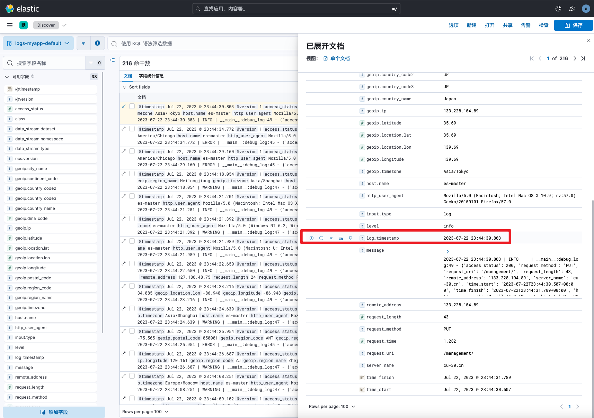

## 查看索引mapping
逐个添加并设置自动类型工作量未免过大，在工作中通常都是先使用动态mapping，然后根据自动生成的mapping信息如果有问题再做调整。

```json
# 请求数据流mapping
GET logs-myapp-default/_mapping
# 响应
{
  ".ds-logs-myapp-default-2023.07.22-000001": {
    "mappings": {
      "_data_stream_timestamp": {
        "enabled": true
      },
      "dynamic_templates": [],
      "runtime": {
        "request_time": {
          "type": "long",
          "script": {
            "source": "emit(doc['time_finish'].getValue().toInstant().toEpochMilli() - doc['time_start'].getValue().toInstant().toEpochMilli())",
            "lang": "painless"
          }
        }
      },
      "properties": {
        "@timestamp": {
          "type": "date"
        },
        "@version": {
          "type": "text",
          "fields": {
            "keyword": {
              "type": "keyword",
              "ignore_above": 256
            }
          }
        },
        "access_status": {
          "type": "long"
        },
        "class": {
          "type": "text",
          "fields": {
            "keyword": {
              "type": "keyword",
              "ignore_above": 256
            }
          }
        },
        "data_stream": {
          "properties": {
            "dataset": {
              "type": "text",
              "fields": {
                "keyword": {
                  "type": "keyword",
                  "ignore_above": 256
                }
              }
            },
            "namespace": {
              "type": "text",
              "fields": {
                "keyword": {
                  "type": "keyword",
                  "ignore_above": 256
                }
              }
            },
            "type": {
              "type": "text",
              "fields": {
                "keyword": {
                  "type": "keyword",
                  "ignore_above": 256
                }
              }
            }
          }
        },
        "ecs": {
          "properties": {
            "version": {
              "type": "text",
              "fields": {
                "keyword": {
                  "type": "keyword",
                  "ignore_above": 256
                }
              }
            }
          }
        },
        "geoip": {
          "properties": {
            "city_name": {
              "type": "text",
              "fields": {
                "keyword": {
                  "type": "keyword",
                  "ignore_above": 256
                }
              }
            },
            "continent_code": {
              "type": "text",
              "fields": {
                "keyword": {
                  "type": "keyword",
                  "ignore_above": 256
                }
              }
            },
            "country_code2": {
              "type": "text",
              "fields": {
                "keyword": {
                  "type": "keyword",
                  "ignore_above": 256
                }
              }
            },
            "country_code3": {
              "type": "text",
              "fields": {
                "keyword": {
                  "type": "keyword",
                  "ignore_above": 256
                }
              }
            },
            "country_name": {
              "type": "text",
              "fields": {
                "keyword": {
                  "type": "keyword",
                  "ignore_above": 256
                }
              }
            },
            "dma_code": {
              "type": "long"
            },
            "ip": {
              "type": "text",
              "fields": {
                "keyword": {
                  "type": "keyword",
                  "ignore_above": 256
                }
              }
            },
            "latitude": {
              "type": "float"
            },
            "location": {
              "properties": {
                "lat": {
                  "type": "float"
                },
                "lon": {
                  "type": "float"
                }
              }
            },
            "longitude": {
              "type": "float"
            },
            "postal_code": {
              "type": "text",
              "fields": {
                "keyword": {
                  "type": "keyword",
                  "ignore_above": 256
                }
              }
            },
            "region_code": {
              "type": "text",
              "fields": {
                "keyword": {
                  "type": "keyword",
                  "ignore_above": 256
                }
              }
            },
            "region_name": {
              "type": "text",
              "fields": {
                "keyword": {
                  "type": "keyword",
                  "ignore_above": 256
                }
              }
            },
            "timezone": {
              "type": "text",
              "fields": {
                "keyword": {
                  "type": "keyword",
                  "ignore_above": 256
                }
              }
            }
          }
        },
        "host": {
          "properties": {
            "name": {
              "type": "text",
              "fields": {
                "keyword": {
                  "type": "keyword",
                  "ignore_above": 256
                }
              }
            }
          }
        },
        "http_user_agent": {
          "type": "text",
          "fields": {
            "keyword": {
              "type": "keyword",
              "ignore_above": 256
            }
          }
        },
        "input": {
          "properties": {
            "type": {
              "type": "text",
              "fields": {
                "keyword": {
                  "type": "keyword",
                  "ignore_above": 256
                }
              }
            }
          }
        },
        "level": {
          "type": "text",
          "fields": {
            "keyword": {
              "type": "keyword",
              "ignore_above": 256
            }
          }
        },
        "log_timestamp": {
          "type": "text",
          "fields": {
            "keyword": {
              "type": "keyword",
              "ignore_above": 256
            }
          }
        },
        "message": {
          "type": "text",
          "fields": {
            "keyword": {
              "type": "keyword",
              "ignore_above": 256
            }
          }
        },
        "remote_address": {
          "type": "text",
          "fields": {
            "keyword": {
              "type": "keyword",
              "ignore_above": 256
            }
          }
        },
        "request_length": {
          "type": "long"
        },
        "request_method": {
          "type": "text",
          "fields": {
            "keyword": {
              "type": "keyword",
              "ignore_above": 256
            }
          }
        },
        "request_uri": {
          "type": "text",
          "fields": {
            "keyword": {
              "type": "keyword",
              "ignore_above": 256
            }
          }
        },
        "server_name": {
          "type": "text",
          "fields": {
            "keyword": {
              "type": "keyword",
              "ignore_above": 256
            }
          }
        },
        "tags": {
          "type": "text",
          "fields": {
            "keyword": {
              "type": "keyword",
              "ignore_above": 256
            }
          }
        },
        "time_finish": {
          "type": "date"
        },
        "time_start": {
          "type": "date"
        }
      }
    }
  }
}
```

## 修改模板mapping
复制刚刚获取的索引mapping信息中的mappings内容，然后打开索引模板，粘贴进json数据框中，记得去除geoip字段配置(已经在前面的组件模板中配置过)


kibana会自动解析mapping相关设定，然后我们再根据需要修改部分字段类型

例如将<font style="color:rgb(26, 28, 33);">log_timestamp字段设置为日期类型，并指定日期格式，其他字段格式按实际需求做调整即可。</font>

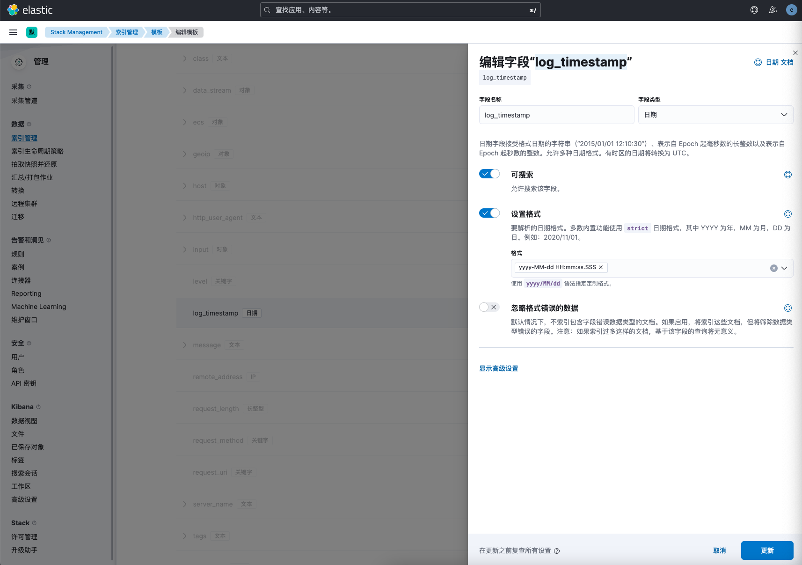

例如我们使用了<font style="color:rgb(48, 49, 51);">geoip插件获取了用户访问IP的经纬度数据，我们需要指定类型</font>为geo_point

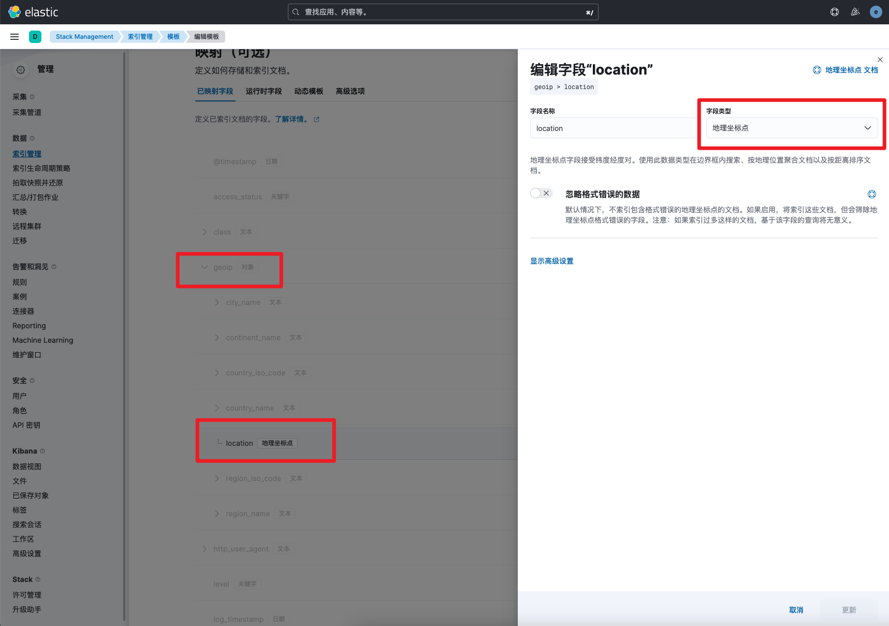

## 创建数据流验证
我们还是删除先前的数据流，让es为我们自动创建新的数据流，查看数据流信息验证，可以看到新创建的数据流字段已经按我们的期望设置了数据类型。


# ILM
<font style="color:rgb(48, 49, 51);">随着时间的推移，索引的数据量会越来越大</font>，我们需要在索引不同的阶段，使用不同的策略配置索引，此时就需要使用ILM索引生命周期管理配置，具体可参考文章：[https://www.cuiliangblog.cn/detail/section/83540149](https://www.cuiliangblog.cn/detail/section/83540149)

## 场景需求
回到刚开始集群角色规划时我们假设的场景，通常情况下需要经常查询最近7天数据，历史数据最大查询时间为30天，日志数据归档存储最多为60天。

## 各生命周期 Actions 设定
1. Hot 阶段
+ 滚动更新：索引已存在1天或者分片大小达到30GB	
+ 设置优先级为：100（值越大，优先级越高）。 	
2. Warm 阶段
+ 段合并：max_num_segments 设置为1。 	
+ 收缩分片数：将主分片合并为1个分片。
+ 只读索引：将索引标记为只读，禁止写入和更改。
+ 副本分片：副本设置为 1。 	
+ 数据迁移：7-30天数据迁移到warm 节点。 	
+ 优先级设置为：50。 	
3. Cold 阶段
+ 副本分片：副本设置为 0。
+ 降采样：将存储粒度改为1分钟
+ 数据迁移：30-60天数据迁移到冷节点 
4. Delete 阶段
+ 60天以上数据删除索引 
+ 快照备份：可以设置删除前将索引快照备份至存储库中	

## 创建索引生命周期策略
在kibana中点击索引生命周期策略，创建名为myapp-policy的策略

为了便于演���，我们将时间缩短，0-7分钟的数据存放hot节点，7-15分钟数据存放warm节点，15-30分钟数据存放clod节点，超过30分钟以上数据删除。

接下来我们创建一个名为myapp-policy的策略。

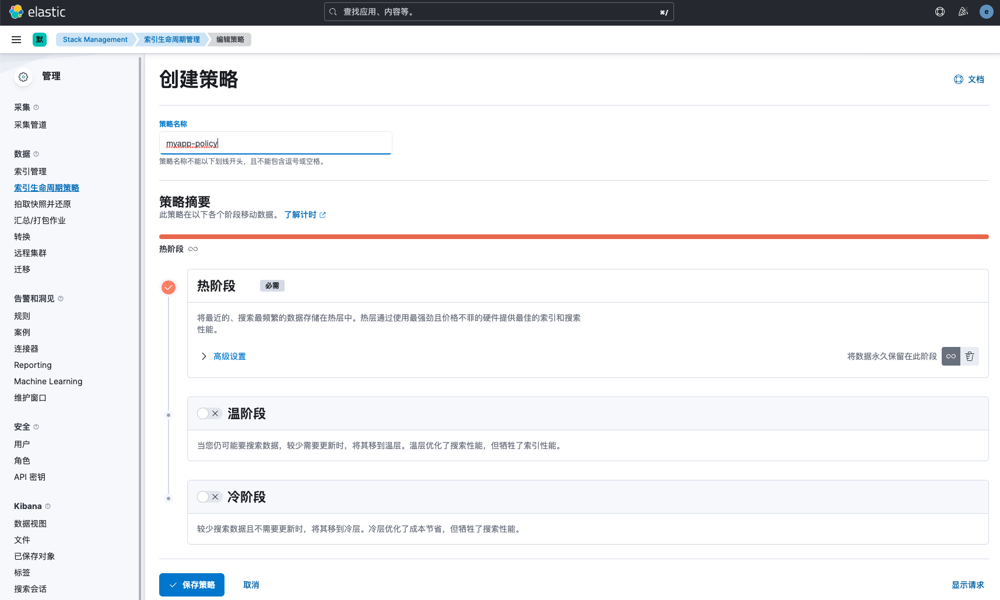

hot阶段配置如下：


warm阶段配置如下：


cold阶段配置如下：

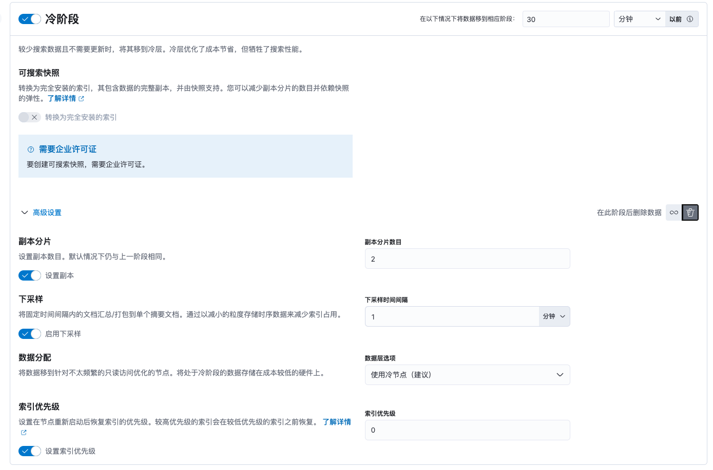

删除阶段配置如下：


## ILM与索引模板关联
创建完ILM策略后，接下来，我们将ILM策略与索引模板关联，这样后续创建的索引都会通过ILM进行管理。


## 验证
先减小policy策略检查间隔，默认是10分钟，我们改为1秒便于观察。

```json
PUT _cluster/settings
{
  "persistent": {
    "indices.lifecycle.poll_interval": "1s"
  }
}
```

查看索引信息，发现已自动关联myapp-policy的策略，并处于hot阶段。


hot阶段验证

0-7分钟的数据存放hot节点，且每分钟滚动生成一个索引

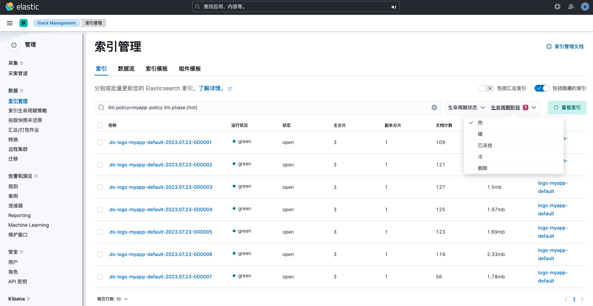

warm阶段验证

7-15分钟数据存放warm节点，合并为1分片，只读索引

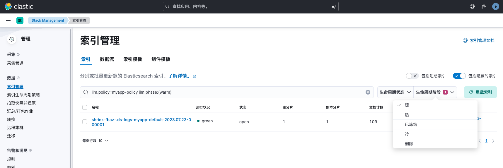

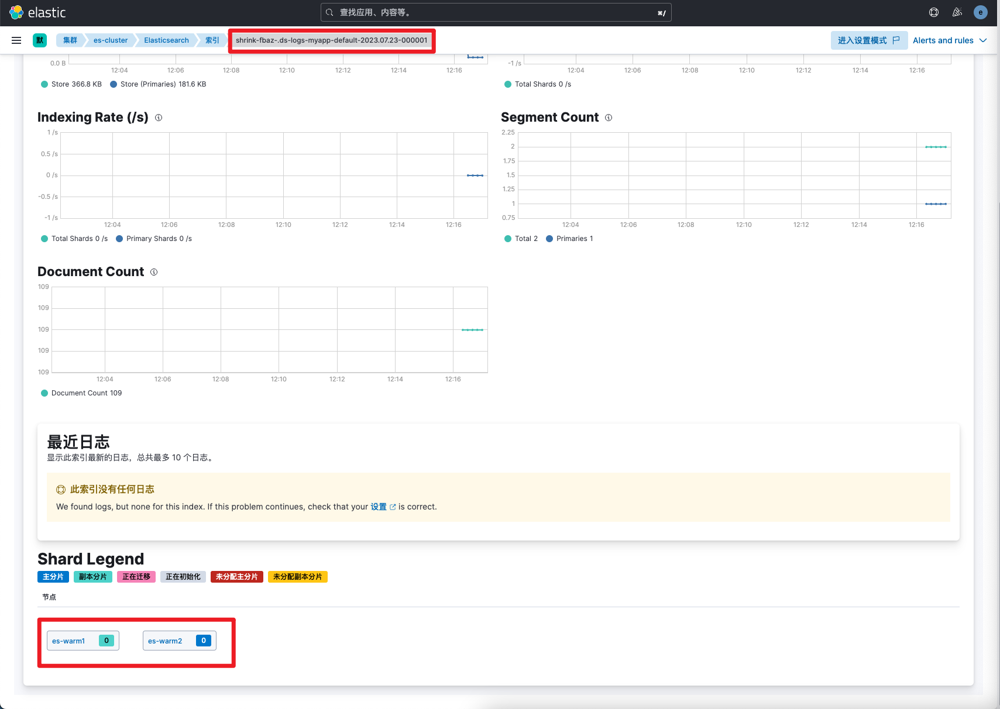

clod验证

15-30分钟数据存放clod节点，调整为0副本，数据降采样

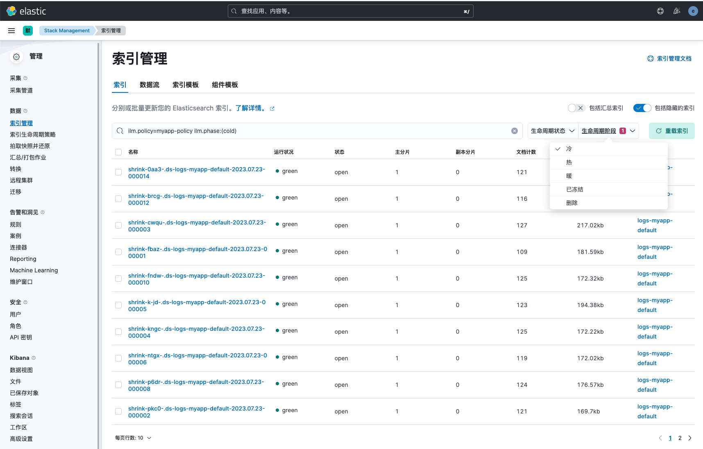

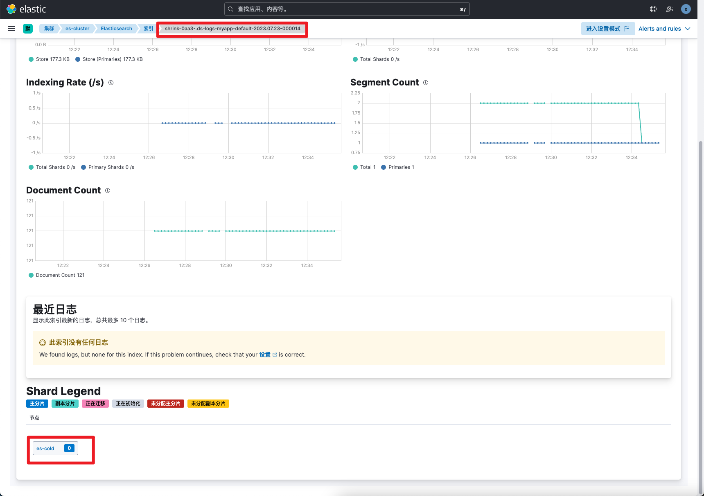

删除验证

超过30分钟以上数据删除。discover只能查到最近30分钟的数据

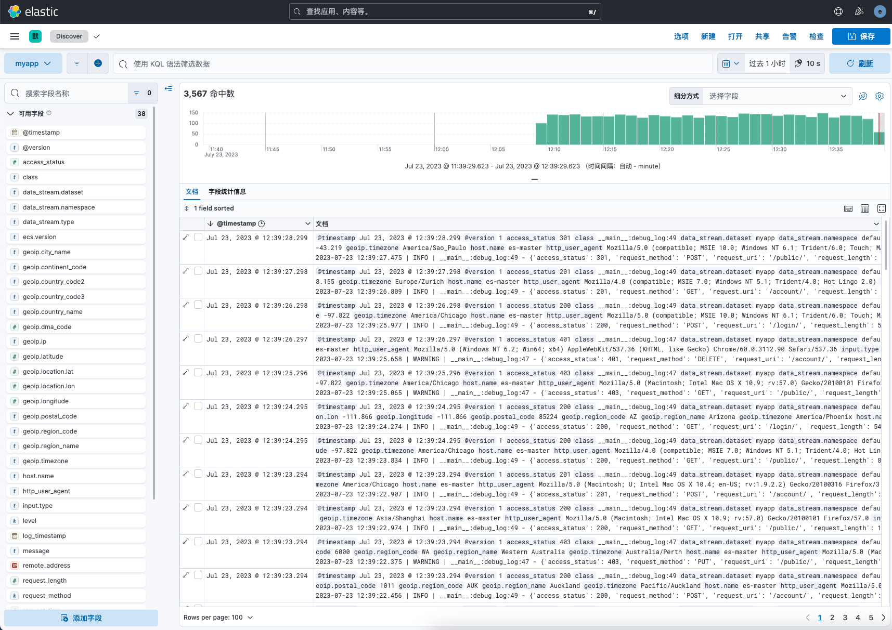

# 数据流
## 数据流简介
数据流是es7.9新推出的功能，<font style="color:rgb(48, 49, 51);">它是索引、模板、rollover、ilm 基于时序性数据的综合产物。</font>在es8中，凡是<font style="color:rgb(48, 49, 51);">日志（logs）、事件（events）、指标（metrics）和其他持续生成的数据，都强烈推荐创建数据流类型的索引。更多数据流的详细信息可参考文章：</font>[<font style="color:rgb(48, 49, 51);">https://www.cuiliangblog.cn/detail/section/84285233</font>](https://www.cuiliangblog.cn/detail/section/84285233)

## <font style="color:rgb(48, 49, 51);">数据流模板配置</font>
<font style="color:rgb(48, 49, 51);">经过配置后，最终的数据流模板如下：</font>

```bash
# 请求
GET _index_template/myapp-template
# 响应
{
  "index_templates": [
    {
      "name": "myapp-template",
      "index_template": {
        "index_patterns": [
          "logs-myapp-default"
        ],
        "template": {
          "settings": {
            "index": {
              "lifecycle": {
                "name": "myapp-policy"
              },
              "routing": {
                "allocation": {
                  "include": {
                    "_tier_preference": "data_hot"
                  }
                }
              },
              "default_pipeline": "myapp-pipeline",
            }
          },
          "mappings": {
            "runtime": {
              "request_time": {
                "type": "long",
                "script": {
                  "source": "emit(doc['time_finish'].getValue().toInstant().toEpochMilli() - doc['time_start'].getValue().toInstant().toEpochMilli())",
                  "lang": "painless"
                }
              }
            },
            "dynamic": "false",
            "dynamic_templates": [],
            "properties": {
              "log_timestamp": {
                "format": "yyyy-MM-dd HH:mm:ss.SSS",
                "type": "date"
              },
              "server_name": {
                "type": "text",
                "fields": {
                  "keyword": {
                    "ignore_above": 256,
                    "type": "keyword"
                  }
                }
              },
              "level": {
                "type": "keyword"
              },
              "time_start": {
                "format": "strict_date_optional_time",
                "type": "date"
              },
              "access_status": {
                "type": "keyword"
              },
              "remote_address": {
                "type": "ip"
              },
              "request_method": {
                "type": "keyword"
              },
              "request_uri": {
                "type": "keyword"
              },
              "http_user_agent": {
                "type": "text",
                "fields": {
                  "keyword": {
                    "ignore_above": 256,
                    "type": "keyword"
                  }
                }
              },
              "@timestamp": {
                "type": "date"
              },
              "request_length": {
                "type": "long"
              },
              "time_finish": {
                "format": "strict_date_optional_time",
                "type": "date"
              },
              "class": {
                "type": "text",
                "fields": {
                  "keyword": {
                    "ignore_above": 256,
                    "type": "keyword"
                  }
                }
              }
            }
          }
        },
        "composed_of": [
          "default-setting",
          "geoip-mapping"
        ],
        "priority": 110,
        "data_stream": {
          "hidden": false,
          "allow_custom_routing": false
        }
      }
    }
  ]
}
```

# 参考文档
es 管道：[https://www.elastic.co/guide/en/elasticsearch/reference/current/ingest.html](https://www.elastic.co/guide/en/elasticsearch/reference/current/ingest.html)

es remove处理器：[https://www.elastic.co/guide/en/elasticsearch/reference/8.8/remove-processor.html](https://www.elastic.co/guide/en/elasticsearch/reference/8.8/remove-processor.html)

es 索引模板：[https://www.elastic.co/guide/en/elasticsearch/reference/current/index-templates.html](https://www.elastic.co/guide/en/elasticsearch/reference/current/index-templates.html)

es index配置：[https://www.elastic.co/guide/en/elasticsearch/reference/current/indices-update-settings.html](https://www.elastic.co/guide/en/elasticsearch/reference/current/indices-update-settings.html)

es mapping设置：[https://www.elastic.co/guide/en/elasticsearch/reference/current/explicit-mapping.html](https://www.elastic.co/guide/en/elasticsearch/reference/current/explicit-mapping.html)

es动态mapping：[https://www.elastic.co/guide/en/elasticsearch/reference/current/dynamic.html](https://www.elastic.co/guide/en/elasticsearch/reference/current/dynamic.html)

es 别名：[https://www.elastic.co/guide/en/elasticsearch/reference/current/indices-aliases.html](https://www.elastic.co/guide/en/elasticsearch/reference/current/indices-aliases.html)

es runtime：[https://www.elastic.co/guide/en/elasticsearch/reference/current/runtime.html](https://www.elastic.co/guide/en/elasticsearch/reference/current/runtime.html)

ILM配置：[https://www.elastic.co/guide/en/elasticsearch/reference/current/index-lifecycle-management.html](https://www.elastic.co/guide/en/elasticsearch/reference/current/index-lifecycle-management.html)

数据流：[https://www.elastic.co/guide/en/elasticsearch/reference/current/data-streams.html](https://www.elastic.co/guide/en/elasticsearch/reference/current/data-streams.html)

