# Kibana对接Azure AD实现单点登录
# 基本概念介绍
## 什么是单点登录
单点登录（Single Sign-On，SSO）是一种身份验证和访问控制机制，允许用户使用一组凭据（通常是用户名和密码）仅需登录一次，即可访问多个应用程序或系统，而无需在每个应用程序中单独设置账号密码并进行身份验证。

在没有单点登录前，当用户访问多个应用程序时，每个应用程序需要用户提供自己的凭据进行身份验证。这种方式对用户来说很不便，需要记住多个用户名和密码，并且在每个应用程序之间进行频繁的登录操作。单点登录解决了这个问题，使用户只需在第一次登录时提供凭据，然后在访问其他应用程序时自动使用已验证的身份。

在单点登录系统中，通常有一个独立的身份提供者（Identity Provider，IdP），它负责进行用户身份验证并生成相应的身份认证令牌。一旦用户通过身份验证并获得令牌，他们可以使用该令牌访问已集成的多个应用程序或系统，而无需再次输入凭据。

单点登录提供了以下好处：

1. 用户方便：用户只需登录一次，即可访问多个应用程序，简化了登录过程，提高了用户体验。
2. 提高安全性：通过集中的身份验证和访问控制，单点登录可以提供更强的安全性，减少了用户密码的传输和存储，降低了风险。
3. 简化管理：对于系统管理员来说，单点登录简化了用户账号和权限管理，减少了对多个应用程序的管理工作量。
4. 跨域访问：单点登录可以实现跨域访问，使用户可以无缝地在不同域之间进行身份验证和访问控制。

## 单点登录常见协议和实现方式
1. SAML (Security Assertion Markup Language)：SAML是一种基于XML的协议，用于在不同的安全域之间进行身份验证和授权。它是传统的SSO协议，通过将身份验证信息和授权声明封装在SAML断言中来实现单点登录。
2. OAuth 2.0：OAuth 2.0是一种授权协议，用于授权第三方应用程序访问受保护资源。虽然OAuth 2.0主要用于授权，但它也可以用于实现单点登录。例如，使用OpenID Connect（基于OAuth 2.0）来实现身份验证和单点登录。
3. OpenID Connect：OpenID Connect（OIDC）是基于OAuth 2.0的身份验证协议，它在OAuth 2.0的基础上添加了身份验证功能。OIDC使用JSON Web Tokens（JWT）传输身份验证信息，常用于实现单点登录。
4. SAML-based Federation：基于SAML的联合身份验证是一种使用SAML协议实现的联合身份验证和单点登录机制。它允许不同组织之间共享身份验证和授权信息，实现跨组织的单点登录。
5. CAS (Central Authentication Service)：CAS是一种基于票据的单点登录协议，通过使用服务器端存储的票据进行身份验证和单点登录。CAS在多个应用程序之间共享身份验证状态，实现单点登录。
6. WS-Federation：WS-Federation是一种基于Web服务的标准，用于实现可跨域的身份验证和单点登录。它使用SOAP消息和XML格式来交换身份验证和授权信息。

## SAML登录原理流程
以用户登录kibana使用Azure Active Directory为例，单点登陆包含三个角色

+ Service Provider：应用程序提供者kibana
+ User：用户浏览器，
+ Identity Provider：身份定义者Azure Active Directory

SAML登录过程如下所示：


1. 用户使用浏览器访问Kibana
2. Kibana根据配置文件，找到身份提供者（Azure Active Directory）对用户进行身份验证
3. Kibana生成SAML2.0请求，并将用户浏览器重定向到Azure Active Directory单点登录URL
4. 如果用户未登录过Azure Active Directory，则对用户进行身份验证登录并生成SAML令牌
5. Azure Active Directory通过用户浏览器向Kibana发送SAML响应
6. Kibana验证 SAML 响应
7. Kibana完成用户登录

## OAuth 2.0登录原理流程
以登录知乎网站，使用第三方账号(QQ登录)为例，知乎就是客户端，QQ就是认证服务器，整个流程分为以下三个阶段：

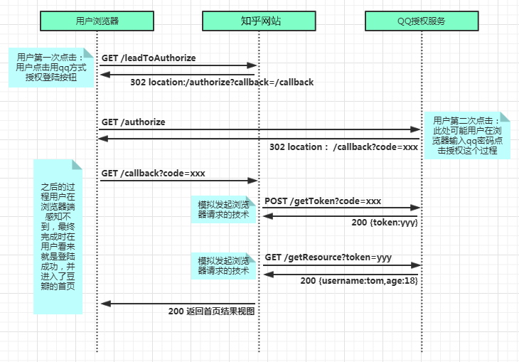


1. 用户点击QQ登录进入授权页面同意授权，登录完成后获取到code。
2. 知乎网站请求QQ服务器，通过code换取授权access_token。
3. QQ通过网页授权access_token向知乎返回用户的基本信息。

## SAML与OAuth 2.0对比
SAML是一种基于XML的标准，用于在不同的安全域之间交换身份验证和授权数据。它主要用于单点登录（Single Sign-On，SSO）场景，其中用户在一个身份提供者（IdP）进行身份验证后，可以无需再次输入凭据而访问其他服务提供者（SP）。SAML的工作原理是通过使用加密和数字签名来传递包含身份验证信息的XML文档。

相比之下，OAuth 2.0是一种用于授权的开放标准，广泛用于第三方应用程序获取访问受保护资源的权限。OAuth 2.0主要用于授权场景，允许用户将他们的资源（如照片、视频等）提供给其他应用程序，而无需分享他们的用户名和密码。OAuth 2.0使用访问令牌（access token）来代表授权，并通过令牌进行受保护资源的访问。

下面是SAML和OAuth 2.0之间的一些主要区别：

+ 目标：SAML的主要目标是实现单点登录和身份提供者间的身份验证和授权。OAuth 2.0的主要目标是允许用户授权第三方应用程序访问他们的资源。
+ 数据格式：SAML使用基于XML的格式来传输身份验证和授权信息，而OAuth 2.0使用基于JSON的格式。
+ 授权流程：SAML使用基于重定向和POST的流程，其中用户在身份提供者和服务提供者之间进行跳转。OAuth 2.0使用授权码授权流程、隐式授权流程和客户端凭证授权流程等不同的授权流程。
+ 用途：SAML主要用于企业环境中的身份验证和授权，例如企业内部系统的单点登录。OAuth 2.0主要用于互联网和移动应用程序中，允许用户授权第三方应用程序访问他们的资源。

# 准备工作
## ELK升级为白金版
需要注意的是使用Azure AD登录验证需要白金级以上才可以使用。


我们可以在kibana页面选择试用白金版本功能，升级我们的license授权。

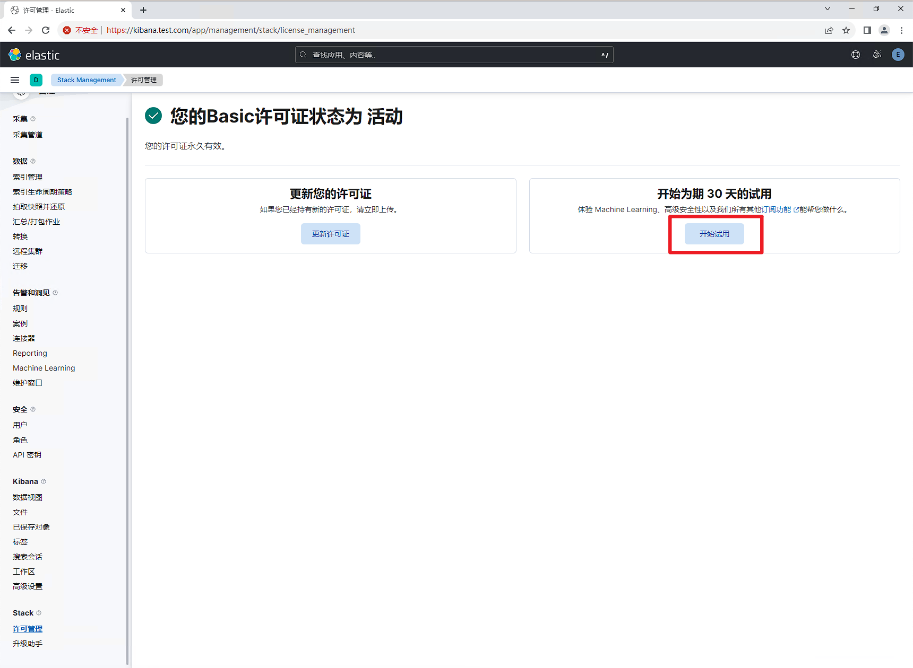

## kibana启用https
默认情况下kibana是http方式访问，在实际生产环境中为满足安全需求，通常需要修改为https方式，如果使用Azure AD登录，URL地址必须为https协议。此时可选择申请公网tls证书或使用elasticsearch工具自签证书。

+ elasticsearch工具生成kibana证书和私钥

```bash
[root@es-test ~]# cd /usr/share/elasticsearch/bin/
[root@es-test bin]# ./elasticsearch-certutil csr -name kibana-server -dns kibana.test.com, localhost
```

生成的证书仅仅可以供kibana.test.com及 localhost 使用。上面的命令将一个叫做 csr-bundle.zip 的文件。我们使用如下的命令来进行解压缩

```bash
[root@es-test bin]# cd ../
[root@es-test elasticsearch]# ls
LICENSE.txt  NOTICE.txt  README.asciidoc  bin  csr-bundle.zip  jdk  lib  modules  plugins
[root@es-test elasticsearch]# unzip csr-bundle.zip
```

+ 拷贝证书至kibana目录下

```bash
[root@es-test elasticsearch]# pwd
/usr/share/elasticsearch
[root@es-test elasticsearch]# mv kibana-server /etc/kibana
```

+ 生成crt文件

```bash
[root@es-test ~]# cd /etc/kibana/kibana-server/
[root@es-test kibana-server]# ls
kibana-server.csr  kibana-server.key
[root@es-test kibana-server]# openssl x509 -req -in kibana-server.csr -signkey kibana-server.key -out kibana-server.crt
Certificate request self-signature ok
subject=CN = kibana-server
[root@es-test kibana-server]# ls
kibana-server.crt  kibana-server.csr  kibana-server.key
```

+ 修改Kibana配置

```yaml
[root@es-test kibana-server]# vim /etc/kibana/kibana.yml
server.publicBaseUrl: "https://kibana.test.com:5601"
server.ssl.enabled: true
server.ssl.certificate: /etc/kibana/kibana-server/kibana-server.crt
server.ssl.key: /etc/kibana/kibana-server/kibana-server.key
```

+ 访问验证

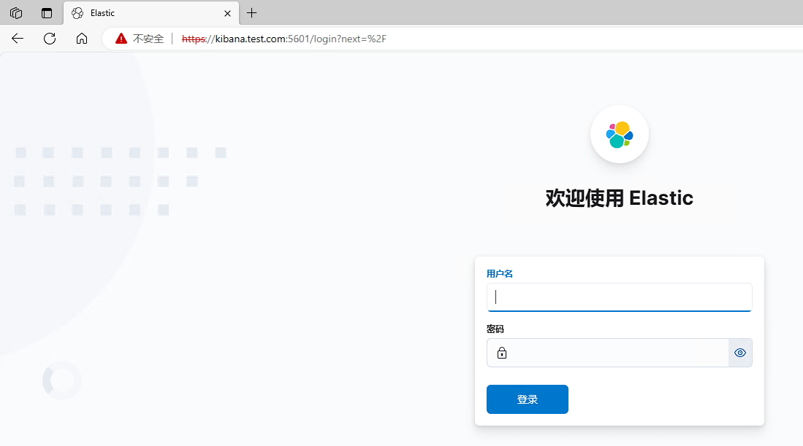

## Kibana修改端口为443（非必须）
非 root 用户默认无法绑定到低于 1024 的端口。

但是，从内核 2.6.24 开始，可以使用 setcap 命令为程序设置特定功能

+ 设置node进程特殊权限

```bash
[root@es-test kibana-server]# setcap 'cap_net_bind_service=+ep' /usr/share/kibana/node/bin/node
[root@es-test kibana-server]# systemctl restart kibana
```

+ 访问验证


# Azure配置流程
## 创建用户和组
我们分别创建dev和ops两个组，并在每个组各创建一个用户，用户与组信息如下所示：

| 显示名 | 用户名/邮箱 | 所属组 |
| --- | --- | --- |
| 开发人员 | dev@cuiliang.onmicrosoft.com | dev |
| 运维人员 | ops@cuiliang.onmicrosoft.com | ops |


+ 用户信息


+ 组信息

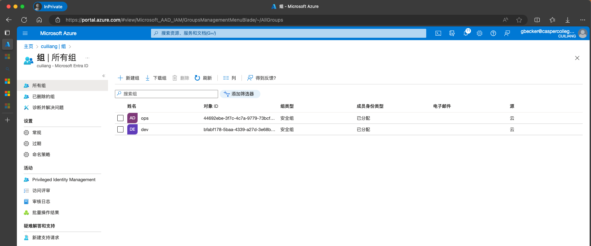

## 创建企业应用程序
Microsoft Entra ID——>企业应用程序——>新建应用程序


创建你自己的应用程序——>输入应用名称——>选择集成未在库中找到的任何其他应用程序(非库)

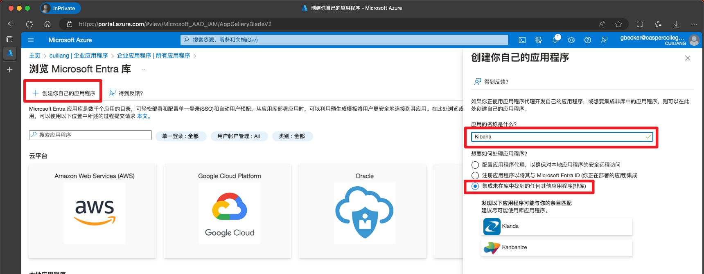

## 分配用户和组
配置哪些用户和组可以登录访问kibana应用。

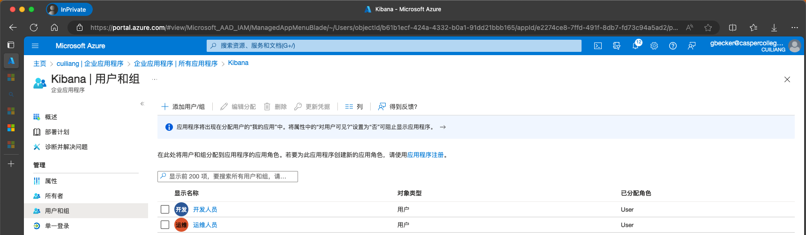

## 配置单点登录
单一登录——>选择SAML方式登录


编辑SAML配置信息

+ 标识符填写Kibana地址，注意协议必须为https，此处填写kibana的访问地址https://kibana.test.com
+ 回复URL添加kibana地址+/api/security/saml/callback
+ 注销URL填写kibana地址+/logout


## 配置属性
默认属性中并未携带组信息，我们可以添加组声明属性，通过Azure登录后会将用户组信息传给Kibana。

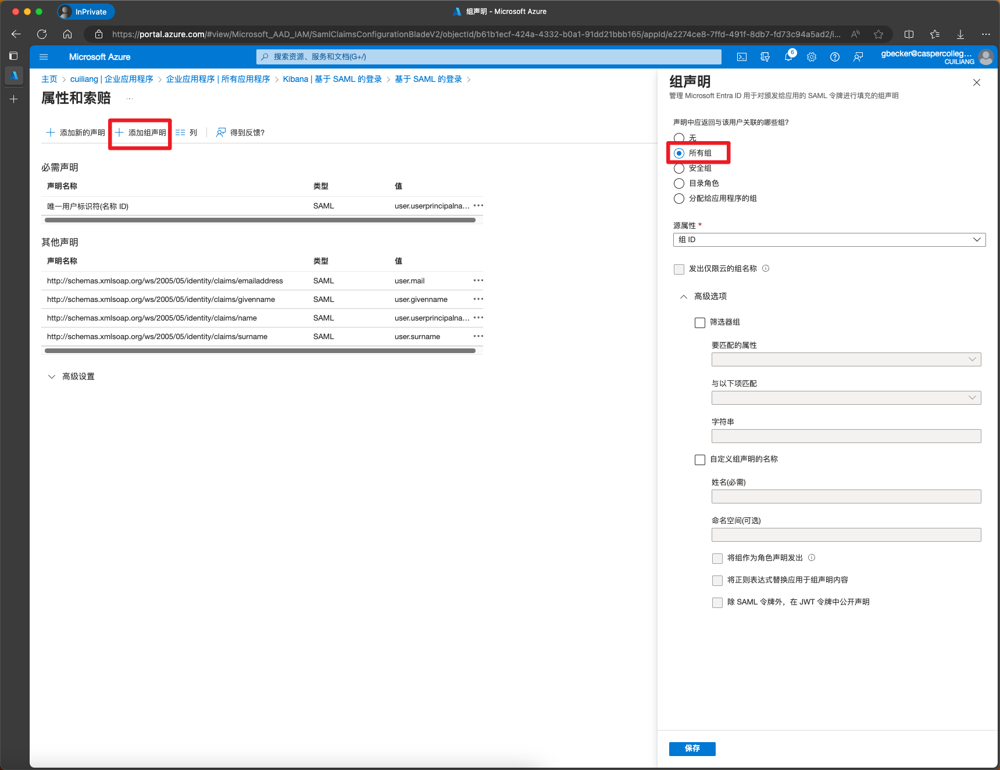

添加后页面显示内容如下


## 下载SAML文件
配置完后后点击下载联合元数据XML，并导入elasticsearch服务器目录中。


# Elasticsearch配置
## 导入XML文件
将Azure下载的xml文件导入elasticsearch服务器/etc/elasticsearch/目录下，并修改所属组为elasticsearch

```bash
[root@es-test ~]# mv Kibana.xml /etc/elasticsearch/
[root@es-test ~]# cd /etc/elasticsearch/
[root@es-test elasticsearch]# chown root:elasticsearch Kibana.xml 
[root@es-test elasticsearch]# ll
total 60
-rw-r--r-- 1 root elasticsearch 14170 Dec 25 16:15 Kibana.xml
drwxr-x--- 2 root elasticsearch    62 Nov 27 16:21 certs
-rw-rw---- 1 root elasticsearch  1042 Oct 12 06:08 elasticsearch-plugins.example.yml
-rw-rw---- 1 root elasticsearch   536 Nov 27 16:21 elasticsearch.keystore
-rw-rw---- 1 root elasticsearch  4052 Nov 27 16:21 elasticsearch.yml
-rw-rw---- 1 root elasticsearch  2781 Oct 12 06:08 jvm.options
drwxr-s--- 2 root elasticsearch     6 Oct 12 06:12 jvm.options.d
-rw-rw---- 1 root elasticsearch 17969 Oct 12 06:08 log4j2.properties
-rw-rw---- 1 root elasticsearch   473 Oct 12 06:08 role_mapping.yml
-rw-rw---- 1 root elasticsearch   197 Oct 12 06:08 roles.yml
-rw-rw---- 1 root elasticsearch     0 Dec 25 15:55 users
-rw-rw---- 1 root elasticsearch     0 Dec 25 15:55 users_roles
```

## 修改elasticsearch配置文件
```bash
[root@es-test elasticsearch]# vim /etc/elasticsearch/elasticsearch.yml
xpack.security.authc.token.enabled: true # 启用令牌服务
xpack.security.authc.realms.saml.saml1: # SAML配置
  order: 2 
  idp.metadata.path: Kibana.xml # SAML文件地址
  idp.entity_id: "https://sts.windows.net/c0c726af-6762-4ef6-ae19-7e3edfa9b046/" # idp标识符，可从SAML文件entityID参数中获取
  sp.entity_id:  "https://kibana.test.com/" # 实例标识符，参考Azure单点登录SAML基本信息填写
  sp.acs: "https://kibana.test.com/api/security/saml/callback" # 回复URL，参考Azure单点登录SAML基本信息填写
  sp.logout: "https://kibana.test.com/logout" # 注销URL，参考Azure单点登录SAML基本信息填写
  attributes.principal: "http://schemas.xmlsoap.org/ws/2005/05/identity/claims/name" # 用户唯一表示，参考Azure单点登录属性填写
  attributes.groups: "http://schemas.microsoft.com/ws/2008/06/identity/claims/groups" # 用户组，参考Azure单点登录属性填写
  attributes.mail: "http://schemas.xmlsoap.org/ws/2005/05/identity/claims/emailaddress" # 用户邮箱，参考Azure单点登录属性填写
  attributes.name: "http://schemas.microsoft.com/identity/claims/displayname" # 显示名称，Azure固定值
[root@es-test elasticsearch]# systemctl restart elasticsearch
```

# kibana配置
## 修改kibana配置
```bash
[root@es-test elasticsearch]# vim /etc/kibana/kibana.yml 
xpack.security.authc.providers: 
  saml.saml1: # SAML配置
    order: 0
    realm: saml1 # SAML名称,固定值
    description: "Log in with Azure AD" # 描述信息
    icon: "https://learn.microsoft.com/zh-cn/entra/fundamentals/media/new-name/azure-ad-icon-2.png" # 显示图标
  basic.basic1: # 同时开启base认证
    order: 1
[root@es-test elasticsearch]# systemctl restart kibana
```

## 访问验证
重新访问kibana页面，可以看到除了base认证外，还新增了Azure AD登录方式。

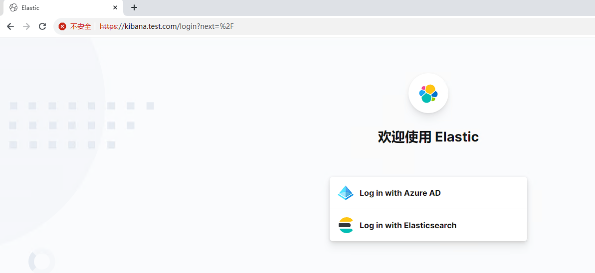

# 配置角色权限
我们已经提前在Azure中创建的用户和对应的组信息，接下来只需要在kibana分别按需求创建dev和ops两个角色，分别对应Azure AD中的dev和ops两个组。

## 创建角色权限
创建dev角色，给开发人员使用，只需要查看kibana的Analytics模块功能即可。

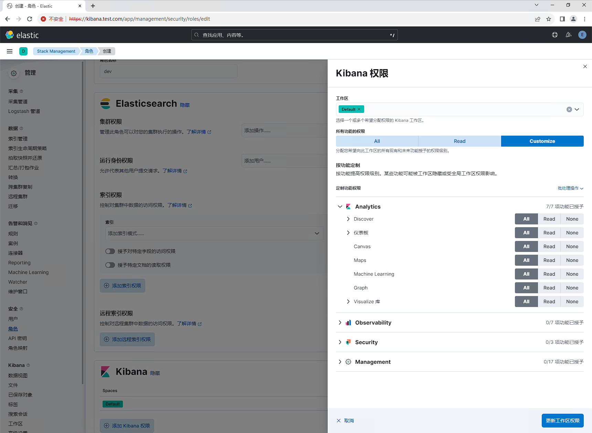

创建ops角色，给运维人员使用，拥有kibana的全部权限。


## 查看Azure AD组ID
接下来查看Azure AD组的ID编号并记录，用于将其与kibana的dev和ops角色关联。

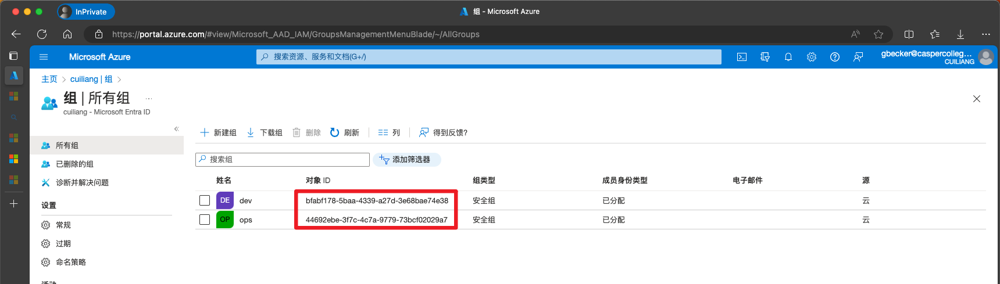

## ���建角色映射
我们已经知道了Azure AD组的id，并且已经在kibana分别创建了dev和ops角色，接下来将Azure AD的组id和kibana的角色名称关联起来即可。

+ 创建dev角色映射


+ 创建ops角色映射


## 访问验证
+ dev用户登录，使用Azure AD方式登录kiban，用户名为dev@cuiliang.onmicrosoft.com，登录kibana后信息和权限如下：

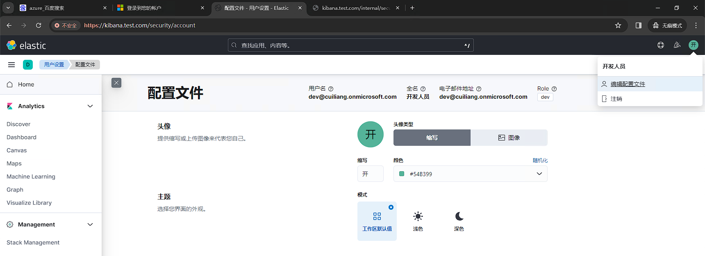

+ 同样的使用ops用户登录，信息如下


至此，我们顺利的完成了kibana对接Azure AD实现用户的登录认证，并将Azure AD用户的组信息关联到了kibana创建的角色上。

# 调试技巧
## <font style="color:rgb(52, 55, 65);">启用调试日志</font>
可能在配置过程中经常因为参数错误而导致不能顺利登录，此时可以打开debug，根据日志内容检查配置参数。

```json
# 开启debug
PUT /_cluster/settings
{
  "transient": {
    "logger.org.elasticsearch.xpack.security.authc": "DEBUG"
  }
}
# 关闭debug
PUT /_cluster/settings
{
  "transient": {
    "logger.org.elasticsearch.xpack.security.authc": null
  }
}
```

## 获取当前登录用户SAML元数据信息
<font style="color:rgb(52, 55, 65);">使用Azure AD登录后，直接浏览器访问https://kibana.test.com/internal/security/me即可获取saml信息。</font>


# 参考链接
Azure SAML介绍：[https://learn.microsoft.com/zh-cn/entra/identity-platform/single-sign-on-saml-protocol](https://learn.microsoft.com/zh-cn/entra/identity-platform/single-sign-on-saml-protocol)

Azure SAML配置：[https://www.elastic.co/guide/en/cloud/current/ec-securing-clusters-saml-azure.html](https://www.elastic.co/guide/en/cloud/current/ec-securing-clusters-saml-azure.html)

ELK stack SAML配置：[https://www.elastic.co/guide/en/elasticsearch/reference/8.10/saml-guide-stack.html#saml-guide-stack](https://www.elastic.co/guide/en/cloud/current/ec-securing-clusters-saml-azure.html)


