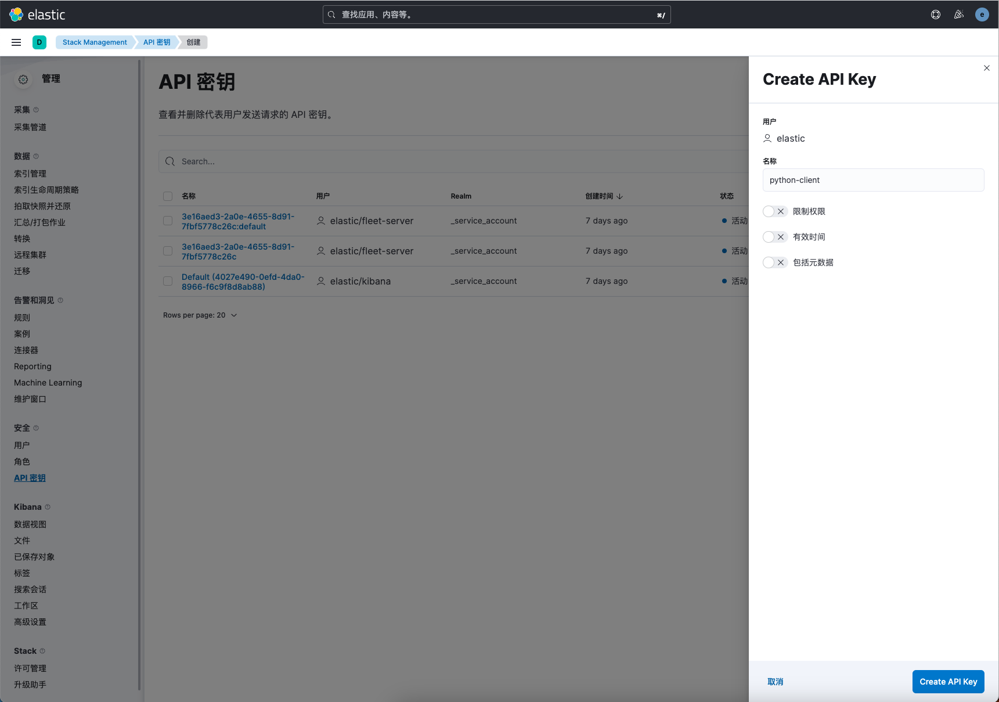
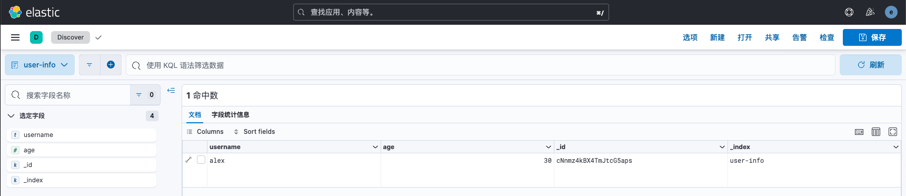
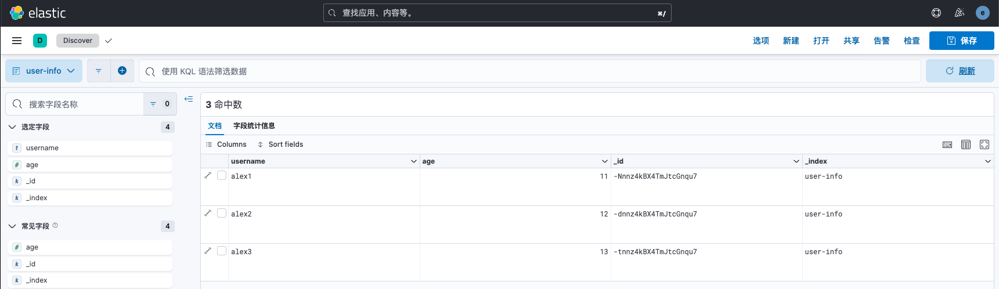
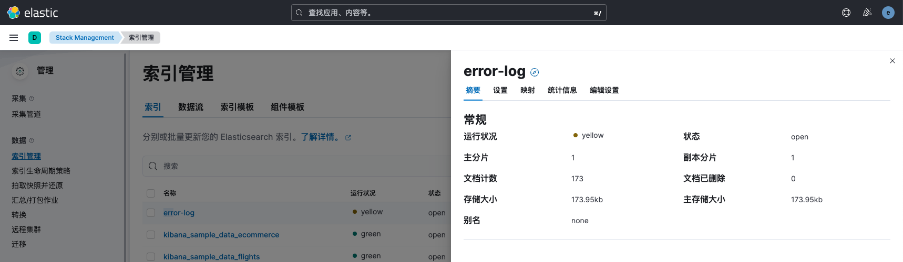
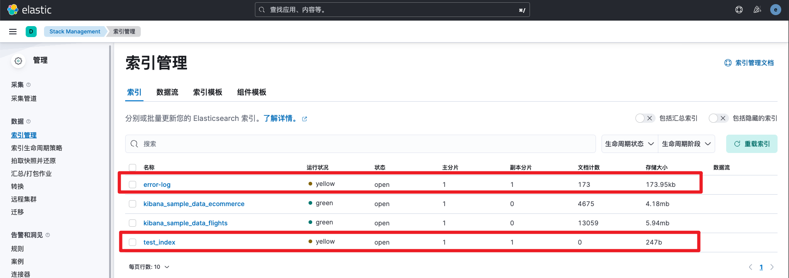
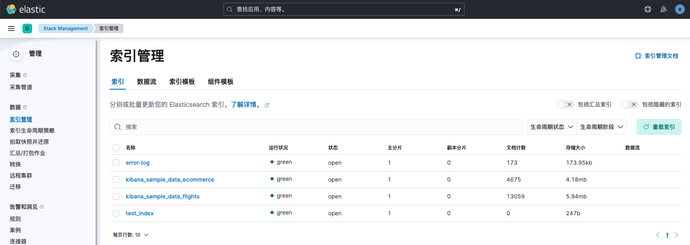

# Python操作Elasticsearch

> 分类: ELK Stack > ELK8生产实践
> 更新时间: 2026-01-10T23:33:46.446412+08:00

---

> 我们除了可以使用kibana页面管理操作ElasticSearch外，elasticsearch还支持通过SDK和RESTful API接口进行操作。通过sdk我们可以非常便捷的将我们的项目与elasticsearch对接，实现数据的增删改查。通过API接口我们可以对elasticsearch集群进行一些例如索引调整、集群故障处理等进阶操作。
>

# 安装与连接
## 安装
<font style="color:rgb(33, 37, 41);">使用pip安装Elasticsearch的Python 客户端，pip包版本要与ES版本保持一致。</font>

```bash
pip install elasticsearch==8.8.2
```

elasticsearch支持多种证书和身份认证方式，接下来演示几种常用连接认证方式。

## 跳过CA证书+Basic Auth连接
可以跳过ca证书验证，但存在安全风险，不建议生产环境这样操作。

```python
from elasticsearch import Elasticsearch
from loguru import logger


class ES:
    def __init__(self):
        self.client = Elasticsearch(
            hosts='https://elp-test-api.aiibank.org:9200',
            verify_certs=False,
            basic_auth=('elastic', 'xPO7p-Z2jg918nJYF16a'),
        )

    def info(self):
        logger.info(self.client.info())

    def disconnect(self):
        self.client.close()


if __name__ == '__main__':
    es = ES()
    es.info()
    es.disconnect()
```

## 使用CA证书+Basic Auth连接
指定CA证书路径为certs/http_ca.crt，代码如下所示：

```python
from elasticsearch import Elasticsearch
from loguru import logger


class ES:
    def __init__(self):
        self.client = Elasticsearch(
            hosts='https://localhost:9200',
            ca_certs="certs/http_ca.crt",
            basic_auth=('elastic', 'ANrjs2w+upw0O1a1Yuka'),
        )

    def info(self):
        logger.info(self.client.info())

    def disconnect(self):
        self.client.close()

        
if __name__ == '__main__':
    es = ES()
    es.info()
    es.disconnect()
```

点击执行后，控制台成功打印了当前es的信息

```python
2023-08-07 16:08:31.743 | INFO     | __main__:info:14 - {'name': 'f70457f06c3c', 'cluster_name': 'docker-cluster', 'cluster_uuid': 'JhbjrKJzTVqXlkpHWDFhFg', 'version': {'number': '8.8.2', 'build_flavor': 'default', 'build_type': 'docker', 'build_hash': '98e1271edf932a480e4262a471281f1ee295ce6b', 'build_date': '2023-06-26T05:16:16.196344851Z', 'build_snapshot': False, 'lucene_version': '9.6.0', 'minimum_wire_compatibility_version': '7.17.0', 'minimum_index_compatibility_version': '7.0.0'}, 'tagline': 'You Know, for Search'}
```

## 使用证书指纹+Basic Auth连接
生成证书指纹

```bash
(venv) ➜  pythonProject openssl x509 -fingerprint -sha256 -noout -in certs/http_ca.crt
sha256 Fingerprint=B2:DD:C4:5B:F1:C9:9B:B0:4E:6C:63:A9:FF:80:EC:CF:03:EF:66:80:12:94:9B:70:98:74:B6:93:BA:03:BC:DB
```

指定使用证书指纹连接ES，代码如下所示：

```python
from elasticsearch import Elasticsearch
from loguru import logger


class ES:
    def __init__(self):
        self.client = Elasticsearch(
            hosts='https://localhost:9200',
            ssl_assert_fingerprint="B2:DD:C4:5B:F1:C9:9B:B0:4E:6C:63:A9:FF:80:EC:CF:03:EF:66:80:12:94:9B:70:98:74:B6:93:BA:03:BC:DB",
            basic_auth=('elastic', 'ANrjs2w+upw0O1a1Yuka'),
        )

    def info(self):
        logger.info(self.client.info())

    def disconnect(self):
        self.client.close()


if __name__ == '__main__':
    es = ES()
    es.info()
    es.disconnect()
```

## 使用CA证书+token连接
使用devtools工具，在enterprise-search-server服务账号下创建一个名为python-client的额令牌，发送如下请求：

```json
# 请求
POST /_security/service/elastic/enterprise-search-server/credential/token/python-client
# 响应
{
  "created": true,
  "token": {
    "name": "python-client",
    "value": "AAEAAWVsYXN0aWMvZW50ZXJwcmlzZS1zZWFyY2gtc2VydmVyL3B5dGhvbi1jbGllbnQ6V2hMRDBVa2lRbWl0dWVicnJhY21WUQ"
  }
}
```

指定认证方式为token认证，并使用CA证书，代码如下：

```python
from elasticsearch import Elasticsearch
from loguru import logger


class ES:
    def __init__(self):
        self.client = Elasticsearch(
            hosts='https://localhost:9200',
            ca_certs="certs/http_ca.crt",
            bearer_auth="AAEAAWVsYXN0aWMvZW50ZXJwcmlzZS1zZWFyY2gtc2VydmVyL3B5dGhvbi1jbGllbnQ6V2hMRDBVa2lRbWl0dWVicnJhY21WUQ"
        )

    def info(self):
        logger.info(self.client.info())

    def disconnect(self):
        self.client.close()


if __name__ == '__main__':
    es = ES()
    es.info()
    es.disconnect()
```

## 使用CA证书+key连接
在kibana的API密钥界面，点击创建API密钥。



创建完成后，点击复制密钥内容。


使用curl客户端访问测试

```bash
[root@tiaoban eck]# curl -k -H "Authorization: ApiKey RXEwNHo0a0I2RlZiUXBkYUt0UkI6RFBFc2NBbG9RZ0tmRzZabVZkSjI4UQ==" https://localhost:9200/_cluster/health 
{"cluster_name":"elasticsearch","status":"green","timed_out":false,"number_of_nodes":1,"number_of_data_nodes":1,"active_primary_shards":31,"active_shards":63,"relocating_shards":0,"initializing_shards":0,"unassigned_shards":0,"delayed_unassigned_shards":0,"number_of_pending_tasks":0,"number_of_in_flight_fetch":0,"task_max_waiting_in_queue_millis":0,"active_shards_percent_as_number":100.0}
```

指定认证方式为api_key认证，并使用CA证书，代码如下：

```python
from elasticsearch import Elasticsearch
from loguru import logger


class ES:
    def __init__(self):
        self.client = Elasticsearch(
            hosts='https://localhost:9200',
            ca_certs="certs/http_ca.crt",
            api_key="RXEwNHo0a0I2RlZiUXBkYUt0UkI6RFBFc2NBbG9RZ0tmRzZabVZkSjI4UQ=="
        )

    def info(self):
        logger.info(self.client.info())

    def disconnect(self):
        self.client.close()


if __name__ == '__main__':
    es = ES()
    es.info()
    es.disconnect()
```

# 客户端基础操作
## 查询结果统计
> 例如查询指定时间范围内access_status值为502、503、504的记录条数。
>

先在devtools调试查询语句，查询语句如下

```python
GET logs-myapp-default/_count
{
  "query": {
    "bool": {
      "filter": [
        {
          "terms": {
            "access_status": [
              "502",
              "503",
              "504"
            ]
          }
        },
        {
          "range": {
            "@timestamp": {
              "gte": "2023-08-07T17:20:00.000+08:00",
              "lt": "2023-08-07T17:30:00.000+08:00"
            }
          }
        }
      ]
    }
  }
}
```

代码如下

```python
from elasticsearch import Elasticsearch
from loguru import logger


class ES:
    def __init__(self):
        self.client = Elasticsearch(
            hosts='https://localhost:9200',
            ca_certs="certs/http_ca.crt",
            basic_auth=('elastic', 'ANrjs2w+upw0O1a1Yuka')
        )

    def query_count(self, index: str, query: dict) -> None:
        """
        DSL查询结果统计
        :param index:查询索引
        :param query: 查询语句
        :return: 查询结果统计
        """
        result = self.client.count(index=index, query=query)
        logger.info(result)


if __name__ == '__main__':
    es = ES()
    query = {"bool": {"filter": [{"terms": {"access_status": ["502", "503", "504"]}}, {
        "range": {"@timestamp": {"gte": "2023-08-07T17:20:00.000+08:00", "lt": "2023-08-07T17:30:00.000+08:00"}}}]}}
    es.query_count('logs-myapp-default', query)
```

运行结果如下，从结果字段可知，符合查询条件的文档总计173条。

```python
2023-08-07 17:57:47.533 | INFO     | __main__:query_count:21 - {'count': 173, '_shards': {'total': 1, 'successful': 1, 'skipped': 0, 'failed': 0}}
```

## DSL查询
Python客户端同样也支持灵活的DSL查询，与7X版本的sdk区别在于，之前版本的查询语句直接传入body参数即可，在8X版本需要分别传入query、sort、size等参数。

> 例如查询指定时间范围内access_status值为502、503、504的记录条数，并按@timestamp排序，返回前20条记录。
>

查询语句如下

```python
GET logs-myapp-default/_search
{
  "query": {
    "bool": {
      "filter": [
        {
          "terms": {
            "access_status": [
              "502",
              "503",
              "504"
            ]
          }
        },
        {
          "range": {
            "@timestamp": {
              "gte": "2023-08-07T17:20:00.000+08:00",
              "lt": "2023-08-07T17:30:00.000+08:00"
            }
          }
        }
      ]
    }
  },
  "sort": [
    {
      "@timestamp": {
        "order": "asc"
      }
    }
  ],
  "size": 20
}
```

代码如下

```python
from elasticsearch import Elasticsearch
from loguru import logger


class ES:
    def __init__(self):
        self.client = Elasticsearch(
            hosts='https://localhost:9200',
            ca_certs="certs/http_ca.crt",
            basic_auth=('elastic', 'ANrjs2w+upw0O1a1Yuka')
        )

    def query_dsl(self, index: str, query: dict, sort: list, size: int) -> None:
        """
        获取DSL查询结果的内容
        :param index:查询索引
        :param query:查询语句
        :param sort:排序参数
        :param size:分页参数
        :return:
        """
        result = self.client.search(index=index, query=query, sort=sort, size=size)
        logger.info(result)


if __name__ == '__main__':
    es = ES()
    query = {"bool": {"filter": [{"terms": {"access_status": ["502", "503", "504"]}}, {
        "range": {"@timestamp": {"gte": "2023-08-07T17:20:00.000+08:00", "lt": "2023-08-07T17:30:00.000+08:00"}}}]}}
    sort = [{"@timestamp": {"order": "asc"}}]
    es.query_dsl('logs-myapp-default', query, sort, 20)
```

运行结果如下

```python
2023-08-07 18:09:43.781 | INFO     | __main__:query_dsl:23 - {'took': 15, 'timed_out': False, '_shards': {'total': 1, 'successful': 1, 'skipped': 0, 'failed': 0}, 'hits': {'total': {'value': 173, 'relation': 'eq'}, 'max_score': None, 'hits': [{'_index': '.ds-logs-myapp-default-2023.08.03-000001', '_id': '5K5Lz4kB6FVbQpda6wfv', '_score': None, '_source': {'log_timestamp': '2023-08-07 17:20:04.706', 'server_name': 'cu-7.cn', 'geoip': {'timezone': 'America/Chicago', 'ip': '148.158.17.189', 'latitude': 37.751, 'country_name': 'United States', 'country_code2': 'US', 'country_code3': 'US', 'continent_code': 'NA', 'location': {'lon': -97.822, 'lat': 37.751}, 'longitude': -97.822}, 'time_start': '2023-08-07T17:20:03.852+08:00', 'level': 'error', 'access_status': 504, 'request_method': 'POST', 'remote_address': '148.158.17.189', 'message': "2023-08-07 17:20:04.706 | ERROR    | __main__:debug_log:46 - {'access_status': 504, 'request_method': 'POST', 'request_uri': '/account/', 'request_length': 89, 'remote_address': '148.158.17.189', 'server_name': 'cu-7.cn', 'time_start': '2023-08-07T17:20:03.852+08:00', 'time_finish': '2023-08-07T17:20:04.961+08:00', 'http_user_agent': 'Chrome 9\\tMozilla/5.0 (Macintosh; Intel Mac OS X 10_13_2) AppleWebKit/537.36 (KHTML, like Gecko) Chrome/94.0.4606.81 Safari/537.36'}", 'request_uri': '/account/', 'tags': ['beats_input_codec_plain_applied'], 'http_user_agent': 'Chrome 9\tMozilla/5.0 (Macintosh; Intel Mac OS X 10_13_2) AppleWebKit/537.36 (KHTML, like Gecko) Chrome/94.0.4606.81 Safari/537.36', 'input': {'type': 'log'}, '@timestamp': '2023-08-07T09:20:05.532Z', 'ecs': {'version': '8.0.0'}, 'request_length': 89, 'time_finish': '2023-08-07T17:20:04.961+08:00', 'data_stream': {'namespace': 'default', 'type': 'logs', 'dataset': 'myapp'}, 'host': {'name': '14f718adaba9'}, '@version': '1', 'class': '__main__:debug_log:46'}, 'sort': [1691400005532]}, {'_index': '.ds-logs-myapp-default-2023.08.03-000001', '_id': 'A65Lz4kB6FVbQpda-wie', '_score': None, '_source': {'log_timestamp': '2023-08-07 17:20:09.377', 'server_name': 'cu-6.cn', 'geoip': {'timezone': 'America/Chicago', 'ip': '149.136.192.44', 'latitude': 37.751, 'country_name': 'United States', 'country_code2': 'US', 'country_code3': 'US', 'continent_code': 'NA', 'location': {'lon': -97.822, 'lat': 37.751}, 'longitude': -97.822}, 'time_start': '2023-08-07T17:20:08.499+08:00', 'level': 'error', 'access_status': 504, 'request_method': 'GET', 'remote_address': '149.136.192.44', 'message': "2023-08-07 17:20:09.377 | ERROR    | __main__:debug_log:46 - {'access_status': 504, 'request_method': 'GET', 'request_uri': '/management/', 'request_length': 64, 'remote_address': '149.136.192.44', 'server_name': 'cu-6.cn', 'time_start': '2023-08-07T17:20:08.499+08:00', 'time_finish': '2023-08-07T17:20:09.780+08:00', 'http_user_agent': 'Chrome 9\\tMozilla/5.0 (Linux; Android 9; MX10 PRO) AppleWebKit/537.36 (KHTML, like Gecko) Chrome/94.0.4606.71 Safari/537.36'}", 'request_uri': '/management/', 'tags': ['beats_input_codec_plain_applied'], 'http_user_agent': 'Chrome 9\tMozilla/5.0 (Linux; Android 9; MX10 PRO) AppleWebKit/537.36 (KHTML, like Gecko) Chrome/94.0.4606.71 Safari/537.36', 'input': {'type': 'log'}, '@timestamp': '2023-08-07T09:20:09.542Z', 'ecs': {'version': '8.0.0'}, 'request_length': 64, 'time_finish': '2023-08-07T17:20:09.780+08:00', 'data_stream': {'namespace': 'default', 'type': 'logs', 'dataset': 'myapp'}, 'host': {'name': '14f718adaba9'}, '@version': '1', 'class': '__main__:debug_log:46'}, 'sort': [1691400009542]}, {'_index': '.ds-logs-myapp-default-2023.08.03-000001', '_id': 'DK5Mz4kB6FVbQpdaBwhh', '_score': None, '_source': {'log_timestamp': '2023-08-07 17:20:12.298', 'server_name': 'cu-1.cn', 'geoip': {'timezone': 'America/Chicago', 'ip': '173.36.186.69', 'latitude': 37.751, 'country_name': 'United States', 'country_code2': 'US', 'country_code3': 'US', 'continent_code': 'NA', 'location': {'lon': -97.822, 'lat': 37.751}, 'longitude': -97.822}, 'time_start': '2023-08-07T17:20:11.384+08:00', 'level': 'error', 'access_status': 503, 'request_method': 'PUT', 'remote_address': '173.36.186.69', 'message': "2023-08-07 17:20:12.298 | ERROR    | __main__:debug_log:46 - {'access_status': 503, 'request_method': 'PUT', 'request_uri': '/public/', 'request_length': 84, 'remote_address': '173.36.186.69', 'server_name': 'cu-1.cn', 'time_start': '2023-08-07T17:20:11.384+08:00', 'time_finish': '2023-08-07T17:20:12.385+08:00', 'http_user_agent': 'Chrome 9\\tMozilla/5.0 (Macintosh; Intel Mac OS X 10_13_2) AppleWebKit/537.36 (KHTML, like Gecko) Chrome/94.0.4606.81 Safari/537.36'}", 'request_uri': '/public/', 'tags': ['beats_input_codec_plain_applied'], 'http_user_agent': 'Chrome 9\tMozilla/5.0 (Macintosh; Intel Mac OS X 10_13_2) AppleWebKit/537.36 (KHTML, like Gecko) Chrome/94.0.4606.81 Safari/537.36', 'input': {'type': 'log'}, '@timestamp': '2023-08-07T09:20:12.554Z', 'ecs': {'version': '8.0.0'}, 'request_length': 84, 'time_finish': '2023-08-07T17:20:12.385+08:00', 'data_stream': {'namespace': 'default', 'type': 'logs', 'dataset': 'myapp'}, 'host': {'name': '14f718adaba9'}, '@version': '1', 'class': '__main__:debug_log:46'}, 'sort': [1691400012554]}, {'_index': '.ds-logs-myapp-default-2023.08.03-000001', '_id': 'Da5Mz4kB6FVbQpdaBwhh', '_score': None, '_source': {'log_timestamp': '2023-08-07 17:20:12.491', 'server_name': 'cu-3.cn', 'geoip': {'timezone': 'America/Chicago', 'ip': '173.159.200.4', 'latitude': 37.751, 'country_name': 'United States', 'country_code2': 'US', 'country_code3': 'US', 'continent_code': 'NA', 'location': {'lon': -97.822, 'lat': 37.751}, 'longitude': -97.822}, 'time_start': '2023-08-07T17:20:12.470+08:00', 'level': 'error', 'access_status': 502, 'request_method': 'GET', 'remote_address': '173.159.200.4', 'message': "2023-08-07 17:20:12.491 | ERROR    | __main__:debug_log:46 - {'access_status': 502, 'request_method': 'GET', 'request_uri': '/account/', 'request_length': 52, 'remote_address': '173.159.200.4', 'server_name': 'cu-3.cn', 'time_start': '2023-08-07T17:20:12.470+08:00', 'time_finish': '2023-08-07T17:20:13.423+08:00', 'http_user_agent': 'Chrome 9\\tMozilla/5.0 (Macintosh; Intel Mac OS X 10_13_2) AppleWebKit/537.36 (KHTML, like Gecko) Chrome/94.0.4606.81 Safari/537.36'}", 'request_uri': '/account/', 'tags': ['beats_input_codec_plain_applied'], 'http_user_agent': 'Chrome 9\tMozilla/5.0 (Macintosh; Intel Mac OS X 10_13_2) AppleWebKit/537.36 (KHTML, like Gecko) Chrome/94.0.4606.81 Safari/537.36', 'input': {'type': 'log'}, '@timestamp': '2023-08-07T09:20:12.555Z', 'ecs': {'version': '8.0.0'}, 'request_length': 52, 'time_finish': '2023-08-07T17:20:13.423+08:00', 'data_stream': {'namespace': 'default', 'type': 'logs', 'dataset': 'myapp'}, 'host': {'name': '14f718adaba9'}, '@version': '1', 'class': '__main__:debug_log:46'}, 'sort': [1691400012555]}, {'_index': '.ds-logs-myapp-default-2023.08.03-000001', '_id': 'Za5Mz4kB6FVbQpdaNgiZ', '_score': None, '_source': {'log_timestamp': '2023-08-07 17:20:23.636', 'server_name': 'cm-1.cn', 'geoip': {'timezone': 'America/Chicago', 'latitude': 29.7009, 'ip': '129.106.215.14', 'continent_code': 'NA', 'city_name': 'Houston', 'country_code2': 'US', 'dma_code': 618, 'country_name': 'United States', 'country_code3': 'US', 'location': {'lon': -95.5885, 'lat': 29.7009}, 'region_name': 'Texas', 'postal_code': '77072', 'longitude': -95.5885, 'region_code': 'TX'}, 'time_start': '2023-08-07T17:20:23.511+08:00', 'level': 'error', 'access_status': 503, 'request_method': 'GET', 'remote_address': '129.106.215.14', 'message': "2023-08-07 17:20:23.636 | ERROR    | __main__:debug_log:46 - {'access_status': 503, 'request_method': 'GET', 'request_uri': '/login/', 'request_length': 21, 'remote_address': '129.106.215.14', 'server_name': 'cm-1.cn', 'time_start': '2023-08-07T17:20:23.511+08:00', 'time_finish': '2023-08-07T17:20:24.535+08:00', 'http_user_agent': 'Safari 11\\tMozilla/5.0 (Macintosh; Intel Mac OS X 10_13_1) AppleWebKit/604.3.5 (KHTML, like Gecko) Version/11.0.1 Safari/604.3.5'}", 'request_uri': '/login/', 'tags': ['beats_input_codec_plain_applied'], 'http_user_agent': 'Safari 11\tMozilla/5.0 (Macintosh; Intel Mac OS X 10_13_1) AppleWebKit/604.3.5 (KHTML, like Gecko) Version/11.0.1 Safari/604.3.5', 'input': {'type': 'log'}, '@timestamp': '2023-08-07T09:20:24.582Z', 'ecs': {'version': '8.0.0'}, 'request_length': 21, 'time_finish': '2023-08-07T17:20:24.535+08:00', 'data_stream': {'namespace': 'default', 'type': 'logs', 'dataset': 'myapp'}, 'host': {'name': '14f718adaba9'}, '@version': '1', 'class': '__main__:debug_log:46'}, 'sort': [1691400024582]}, {'_index': '.ds-logs-myapp-default-2023.08.03-000001', '_id': 'ja5Mz4kB6FVbQpdaRggO', '_score': None, '_source': {'log_timestamp': '2023-08-07 17:20:28.093', 'server_name': 'cu-6.cn', 'geoip': {'timezone': 'Australia/Sydney', 'ip': '143.238.52.149', 'latitude': -33.494, 'country_name': 'Australia', 'country_code2': 'AU', 'country_code3': 'AU', 'continent_code': 'OC', 'location': {'lon': 143.2104, 'lat': -33.494}, 'longitude': 143.2104}, 'time_start': '2023-08-07T17:20:27.507+08:00', 'level': 'error', 'access_status': 502, 'request_method': 'POST', 'remote_address': '143.238.52.149', 'message': "2023-08-07 17:20:28.093 | ERROR    | __main__:debug_log:46 - {'access_status': 502, 'request_method': 'POST', 'request_uri': '/public/', 'request_length': 51, 'remote_address': '143.238.52.149', 'server_name': 'cu-6.cn', 'time_start': '2023-08-07T17:20:27.507+08:00', 'time_finish': '2023-08-07T17:20:28.906+08:00', 'http_user_agent': 'Chrome 9\\tMozilla/5.0 (X11; Linux x86_64) AppleWebKit/537.36 (KHTML, like Gecko) Chrome/93.0.4577.58 Safari/537.36 Edg/93.0.961.33'}", 'request_uri': '/public/', 'tags': ['beats_input_codec_plain_applied'], 'http_user_agent': 'Chrome 9\tMozilla/5.0 (X11; Linux x86_64) AppleWebKit/537.36 (KHTML, like Gecko) Chrome/93.0.4577.58 Safari/537.36 Edg/93.0.961.33', 'input': {'type': 'log'}, '@timestamp': '2023-08-07T09:20:28.592Z', 'ecs': {'version': '8.0.0'}, 'request_length': 51, 'time_finish': '2023-08-07T17:20:28.906+08:00', 'data_stream': {'namespace': 'default', 'type': 'logs', 'dataset': 'myapp'}, 'host': {'name': '14f718adaba9'}, '@version': '1', 'class': '__main__:debug_log:46'}, 'sort': [1691400028592]}, {'_index': '.ds-logs-myapp-default-2023.08.03-000001', '_id': 'q65Mz4kB6FVbQpdaTQje', '_score': None, '_source': {'log_timestamp': '2023-08-07 17:20:30.567', 'server_name': 'cu-5.cn', 'geoip': {}, 'time_start': '2023-08-07T17:20:30.142+08:00', 'level': 'error', 'access_status': 503, 'request_method': 'GET', 'remote_address': '127.0.208.73', 'message': "2023-08-07 17:20:30.567 | ERROR    | __main__:debug_log:46 - {'access_status': 503, 'request_method': 'GET', 'request_uri': '/account/', 'request_length': 80, 'remote_address': '127.0.208.73', 'server_name': 'cu-5.cn', 'time_start': '2023-08-07T17:20:30.142+08:00', 'time_finish': '2023-08-07T17:20:31.493+08:00', 'http_user_agent': 'Chrome 9\\tMozilla/5.0 (Windows NT 10.0; Win64; x64) AppleWebKit/537.36 (KHTML, like Gecko) Chrome/91.0.4472.124 Safari/537.36'}", 'request_uri': '/account/', 'tags': ['beats_input_codec_plain_applied', '_geoip_lookup_failure'], 'http_user_agent': 'Chrome 9\tMozilla/5.0 (Windows NT 10.0; Win64; x64) AppleWebKit/537.36 (KHTML, like Gecko) Chrome/91.0.4472.124 Safari/537.36', 'input': {'type': 'log'}, '@timestamp': '2023-08-07T09:20:30.597Z', 'ecs': {'version': '8.0.0'}, 'request_length': 80, 'time_finish': '2023-08-07T17:20:31.493+08:00', 'data_stream': {'namespace': 'default', 'type': 'logs', 'dataset': 'myapp'}, 'host': {'name': '14f718adaba9'}, '@version': '1', 'class': '__main__:debug_log:46'}, 'sort': [1691400030597]}, {'_index': '.ds-logs-myapp-default-2023.08.03-000001', '_id': 'rK5Mz4kB6FVbQpdaUQjF', '_score': None, '_source': {'log_timestamp': '2023-08-07 17:20:30.877', 'server_name': 'cu-8.cn', 'geoip': {'timezone': 'Australia/Sydney', 'latitude': -33.8715, 'ip': '120.150.186.169', 'continent_code': 'OC', 'city_name': 'Sydney', 'country_code2': 'AU', 'country_name': 'Australia', 'country_code3': 'AU', 'location': {'lon': 151.2006, 'lat': -33.8715}, 'region_name': 'New South Wales', 'postal_code': '2000', 'longitude': 151.2006, 'region_code': 'NSW'}, 'time_start': '2023-08-07T17:20:30.545+08:00', 'level': 'error', 'access_status': 504, 'request_method': 'DELETE', 'remote_address': '120.150.186.169', 'message': "2023-08-07 17:20:30.877 | ERROR    | __main__:debug_log:46 - {'access_status': 504, 'request_method': 'DELETE', 'request_uri': '/login/', 'request_length': 56, 'remote_address': '120.150.186.169', 'server_name': 'cu-8.cn', 'time_start': '2023-08-07T17:20:30.545+08:00', 'time_finish': '2023-08-07T17:20:31.057+08:00', 'http_user_agent': 'Chrome 9\\tMozilla/5.0 (X11; Linux x86_64) AppleWebKit/537.36 (KHTML, like Gecko) Chrome/93.0.4577.58 Safari/537.36 Edg/93.0.961.33'}", 'request_uri': '/login/', 'tags': ['beats_input_codec_plain_applied'], 'http_user_agent': 'Chrome 9\tMozilla/5.0 (X11; Linux x86_64) AppleWebKit/537.36 (KHTML, like Gecko) Chrome/93.0.4577.58 Safari/537.36 Edg/93.0.961.33', 'input': {'type': 'log'}, '@timestamp': '2023-08-07T09:20:31.599Z', 'ecs': {'version': '8.0.0'}, 'request_length': 56, 'time_finish': '2023-08-07T17:20:31.057+08:00', 'data_stream': {'namespace': 'default', 'type': 'logs', 'dataset': 'myapp'}, 'host': {'name': '14f718adaba9'}, '@version': '1', 'class': '__main__:debug_log:46'}, 'sort': [1691400031599]}, {'_index': '.ds-logs-myapp-default-2023.08.03-000001', '_id': 'Jq5Mz4kB6FVbQpdadAn5', '_score': None, '_source': {'log_timestamp': '2023-08-07 17:20:40.236', 'server_name': 'cu-4.cn', 'geoip': {'timezone': 'Asia/Shanghai', 'ip': '120.53.138.78', 'latitude': 34.7732, 'country_name': 'China', 'country_code2': 'CN', 'country_code3': 'CN', 'continent_code': 'AS', 'location': {'lon': 113.722, 'lat': 34.7732}, 'longitude': 113.722}, 'time_start': '2023-08-07T17:20:40.030+08:00', 'level': 'error', 'access_status': 502, 'request_method': 'GET', 'remote_address': '120.53.138.78', 'message': "2023-08-07 17:20:40.236 | ERROR    | __main__:debug_log:46 - {'access_status': 502, 'request_method': 'GET', 'request_uri': '/account/', 'request_length': 9, 'remote_address': '120.53.138.78', 'server_name': 'cu-4.cn', 'time_start': '2023-08-07T17:20:40.030+08:00', 'time_finish': '2023-08-07T17:20:40.434+08:00', 'http_user_agent': 'Chrome 9\\tMozilla/5.0 (Linux; Android 9; MX10 PRO) AppleWebKit/537.36 (KHTML, like Gecko) Chrome/94.0.4606.71 Safari/537.36'}", 'request_uri': '/account/', 'tags': ['beats_input_codec_plain_applied'], 'http_user_agent': 'Chrome 9\tMozilla/5.0 (Linux; Android 9; MX10 PRO) AppleWebKit/537.36 (KHTML, like Gecko) Chrome/94.0.4606.71 Safari/537.36', 'input': {'type': 'log'}, '@timestamp': '2023-08-07T09:20:40.613Z', 'ecs': {'version': '8.0.0'}, 'request_length': 9, 'time_finish': '2023-08-07T17:20:40.434+08:00', 'data_stream': {'namespace': 'default', 'type': 'logs', 'dataset': 'myapp'}, 'host': {'name': '14f718adaba9'}, '@version': '1', 'class': '__main__:debug_log:46'}, 'sort': [1691400040613]}, {'_index': '.ds-logs-myapp-default-2023.08.03-000001', '_id': 'WK5Mz4kB6FVbQpdajAmI', '_score': None, '_source': {'log_timestamp': '2023-08-07 17:20:46.116', 'server_name': 'cu-3.cn', 'geoip': {'timezone': 'America/Chicago', 'ip': '209.216.41.21', 'latitude': 37.751, 'country_name': 'United States', 'country_code2': 'US', 'country_code3': 'US', 'continent_code': 'NA', 'location': {'lon': -97.822, 'lat': 37.751}, 'longitude': -97.822}, 'time_start': '2023-08-07T17:20:45.621+08:00', 'level': 'error', 'access_status': 504, 'request_method': 'GET', 'remote_address': '209.216.41.21', 'message': "2023-08-07 17:20:46.116 | ERROR    | __main__:debug_log:46 - {'access_status': 504, 'request_method': 'GET', 'request_uri': '/account/', 'request_length': 19, 'remote_address': '209.216.41.21', 'server_name': 'cu-3.cn', 'time_start': '2023-08-07T17:20:45.621+08:00', 'time_finish': '2023-08-07T17:20:47.051+08:00', 'http_user_agent': 'Chrome 9\\tMozilla/5.0 (Windows NT 10.0; Win64; x64) AppleWebKit/537.36 (KHTML, like Gecko) Chrome/91.0.4472.124 Safari/537.36'}", 'request_uri': '/account/', 'tags': ['beats_input_codec_plain_applied'], 'http_user_agent': 'Chrome 9\tMozilla/5.0 (Windows NT 10.0; Win64; x64) AppleWebKit/537.36 (KHTML, like Gecko) Chrome/91.0.4472.124 Safari/537.36', 'input': {'type': 'log'}, '@timestamp': '2023-08-07T09:20:46.640Z', 'ecs': {'version': '8.0.0'}, 'request_length': 19, 'time_finish': '2023-08-07T17:20:47.051+08:00', 'data_stream': {'namespace': 'default', 'type': 'logs', 'dataset': 'myapp'}, 'host': {'name': '14f718adaba9'}, '@version': '1', 'class': '__main__:debug_log:46'}, 'sort': [1691400046640]}, {'_index': '.ds-logs-myapp-default-2023.08.03-000001', '_id': 'g65Mz4kB6FVbQpdanAkv', '_score': None, '_source': {'log_timestamp': '2023-08-07 17:20:50.607', 'server_name': 'cu-6.cn', 'geoip': {'timezone': 'Asia/Tokyo', 'ip': '106.187.9.109', 'latitude': 35.6897, 'country_name': 'Japan', 'country_code2': 'JP', 'country_code3': 'JP', 'continent_code': 'AS', 'location': {'lon': 139.6895, 'lat': 35.6897}, 'longitude': 139.6895}, 'time_start': '2023-08-07T17:20:49.888+08:00', 'level': 'error', 'access_status': 502, 'request_method': 'GET', 'remote_address': '106.187.9.109', 'message': "2023-08-07 17:20:50.607 | ERROR    | __main__:debug_log:46 - {'access_status': 502, 'request_method': 'GET', 'request_uri': '/public/', 'request_length': 26, 'remote_address': '106.187.9.109', 'server_name': 'cu-6.cn', 'time_start': '2023-08-07T17:20:49.888+08:00', 'time_finish': '2023-08-07T17:20:51.272+08:00', 'http_user_agent': 'Chrome 9\\tMozilla/5.0 (X11; Linux x86_64) AppleWebKit/537.36 (KHTML, like Gecko) Chrome/93.0.4577.58 Safari/537.36 Edg/93.0.961.33'}", 'request_uri': '/public/', 'tags': ['beats_input_codec_plain_applied'], 'http_user_agent': 'Chrome 9\tMozilla/5.0 (X11; Linux x86_64) AppleWebKit/537.36 (KHTML, like Gecko) Chrome/93.0.4577.58 Safari/537.36 Edg/93.0.961.33', 'input': {'type': 'log'}, '@timestamp': '2023-08-07T09:20:50.648Z', 'ecs': {'version': '8.0.0'}, 'request_length': 26, 'time_finish': '2023-08-07T17:20:51.272+08:00', 'data_stream': {'namespace': 'default', 'type': 'logs', 'dataset': 'myapp'}, 'host': {'name': '14f718adaba9'}, '@version': '1', 'class': '__main__:debug_log:46'}, 'sort': [1691400050648]}, {'_index': '.ds-logs-myapp-default-2023.08.03-000001', '_id': 'tq5Mz4kB6FVbQpdavwl7', '_score': None, '_source': {'log_timestamp': '2023-08-07 17:20:58.724', 'server_name': 'cu-3.cn', 'geoip': {'timezone': 'Asia/Shanghai', 'ip': '182.147.60.2', 'latitude': 34.7732, 'country_name': 'China', 'country_code2': 'CN', 'country_code3': 'CN', 'continent_code': 'AS', 'location': {'lon': 113.722, 'lat': 34.7732}, 'longitude': 113.722}, 'time_start': '2023-08-07T17:20:58.650+08:00', 'level': 'error', 'access_status': 502, 'request_method': 'POST', 'remote_address': '182.147.60.2', 'message': "2023-08-07 17:20:58.724 | ERROR    | __main__:debug_log:46 - {'access_status': 502, 'request_method': 'POST', 'request_uri': '/login/', 'request_length': 70, 'remote_address': '182.147.60.2', 'server_name': 'cu-3.cn', 'time_start': '2023-08-07T17:20:58.650+08:00', 'time_finish': '2023-08-07T17:20:59.117+08:00', 'http_user_agent': 'Safari 11\\tMozilla/5.0 (Macintosh; Intel Mac OS X 10_13_1) AppleWebKit/604.3.5 (KHTML, like Gecko) Version/11.0.1 Safari/604.3.5'}", 'request_uri': '/login/', 'tags': ['beats_input_codec_plain_applied'], 'http_user_agent': 'Safari 11\tMozilla/5.0 (Macintosh; Intel Mac OS X 10_13_1) AppleWebKit/604.3.5 (KHTML, like Gecko) Version/11.0.1 Safari/604.3.5', 'input': {'type': 'log'}, '@timestamp': '2023-08-07T09:20:59.666Z', 'ecs': {'version': '8.0.0'}, 'request_length': 70, 'time_finish': '2023-08-07T17:20:59.117+08:00', 'data_stream': {'namespace': 'default', 'type': 'logs', 'dataset': 'myapp'}, 'host': {'name': '14f718adaba9'}, '@version': '1', 'class': '__main__:debug_log:46'}, 'sort': [1691400059666]}, {'_index': '.ds-logs-myapp-default-2023.08.03-000001', '_id': '7a5Mz4kB6FVbQpdawwlX', '_score': None, '_source': {'log_timestamp': '2023-08-07 17:21:00.032', 'server_name': 'cm-2.cn', 'geoip': {'timezone': 'Asia/Seoul', 'latitude': 37.1579, 'ip': '182.219.137.40', 'continent_code': 'AS', 'city_name': 'Osan', 'country_code2': 'KR', 'country_name': 'South Korea', 'country_code3': 'KR', 'location': {'lon': 127.0662, 'lat': 37.1579}, 'region_name': 'Gyeonggi-do', 'postal_code': '181', 'longitude': 127.0662, 'region_code': '41'}, 'time_start': '2023-08-07T17:20:59.584+08:00', 'level': 'error', 'access_status': 504, 'request_method': 'GET', 'remote_address': '182.219.137.40', 'message': "2023-08-07 17:21:00.032 | ERROR    | __main__:debug_log:46 - {'access_status': 504, 'request_method': 'GET', 'request_uri': '/public/', 'request_length': 30, 'remote_address': '182.219.137.40', 'server_name': 'cm-2.cn', 'time_start': '2023-08-07T17:20:59.584+08:00', 'time_finish': '2023-08-07T17:21:00.192+08:00', 'http_user_agent': 'Firefox 7\\tMozilla/5.0 (Windows NT 10.0; Win64; x64; rv:78.0) Gecko/20100101 Firefox/78.0'}", 'request_uri': '/public/', 'tags': ['beats_input_codec_plain_applied'], 'http_user_agent': 'Firefox 7\tMozilla/5.0 (Windows NT 10.0; Win64; x64; rv:78.0) Gecko/20100101 Firefox/78.0', 'input': {'type': 'log'}, '@timestamp': '2023-08-07T09:21:00.668Z', 'ecs': {'version': '8.0.0'}, 'request_length': 30, 'time_finish': '2023-08-07T17:21:00.192+08:00', 'data_stream': {'namespace': 'default', 'type': 'logs', 'dataset': 'myapp'}, 'host': {'name': '14f718adaba9'}, '@version': '1', 'class': '__main__:debug_log:46'}, 'sort': [1691400060668]}, {'_index': '.ds-logs-myapp-default-2023.08.03-000001', '_id': '965Mz4kB6FVbQpdaxwk_', '_score': None, '_source': {'log_timestamp': '2023-08-07 17:21:00.933', 'server_name': 'cu-4.cn', 'geoip': {'timezone': 'America/Chicago', 'ip': '153.102.152.171', 'latitude': 37.751, 'country_name': 'United States', 'country_code2': 'US', 'country_code3': 'US', 'continent_code': 'NA', 'location': {'lon': -97.822, 'lat': 37.751}, 'longitude': -97.822}, 'time_start': '2023-08-07T17:21:00.734+08:00', 'level': 'error', 'access_status': 504, 'request_method': 'GET', 'remote_address': '153.102.152.171', 'message': "2023-08-07 17:21:00.933 | ERROR    | __main__:debug_log:46 - {'access_status': 504, 'request_method': 'GET', 'request_uri': '/public/', 'request_length': 84, 'remote_address': '153.102.152.171', 'server_name': 'cu-4.cn', 'time_start': '2023-08-07T17:21:00.734+08:00', 'time_finish': '2023-08-07T17:21:01.392+08:00', 'http_user_agent': 'Firefox 7\\tMozilla/5.0 (Windows NT 10.0; Win64; x64; rv:78.0) Gecko/20100101 Firefox/78.0'}", 'request_uri': '/public/', 'tags': ['beats_input_codec_plain_applied'], 'http_user_agent': 'Firefox 7\tMozilla/5.0 (Windows NT 10.0; Win64; x64; rv:78.0) Gecko/20100101 Firefox/78.0', 'input': {'type': 'log'}, '@timestamp': '2023-08-07T09:21:01.670Z', 'ecs': {'version': '8.0.0'}, 'request_length': 84, 'time_finish': '2023-08-07T17:21:01.392+08:00', 'data_stream': {'namespace': 'default', 'type': 'logs', 'dataset': 'myapp'}, 'host': {'name': '14f718adaba9'}, '@version': '1', 'class': '__main__:debug_log:46'}, 'sort': [1691400061670]}, {'_index': '.ds-logs-myapp-default-2023.08.03-000001', '_id': '-65Mz4kB6FVbQpdaywkk', '_score': None, '_source': {'log_timestamp': '2023-08-07 17:21:01.896', 'server_name': 'cm-5.cn', 'geoip': {'timezone': 'Asia/Seoul', 'ip': '115.18.133.96', 'latitude': 37.5112, 'country_name': 'South Korea', 'country_code2': 'KR', 'country_code3': 'KR', 'continent_code': 'AS', 'location': {'lon': 126.9741, 'lat': 37.5112}, 'longitude': 126.9741}, 'time_start': '2023-08-07T17:21:01.735+08:00', 'level': 'error', 'access_status': 504, 'request_method': 'GET', 'remote_address': '115.18.133.96', 'message': "2023-08-07 17:21:01.896 | ERROR    | __main__:debug_log:46 - {'access_status': 504, 'request_method': 'GET', 'request_uri': '/login/', 'request_length': 74, 'remote_address': '115.18.133.96', 'server_name': 'cm-5.cn', 'time_start': '2023-08-07T17:21:01.735+08:00', 'time_finish': '2023-08-07T17:21:01.948+08:00', 'http_user_agent': 'Firefox 7\\tMozilla/5.0 (Windows NT 10.0; Win64; x64; rv:78.0) Gecko/20100101 Firefox/78.0'}", 'request_uri': '/login/', 'tags': ['beats_input_codec_plain_applied'], 'http_user_agent': 'Firefox 7\tMozilla/5.0 (Windows NT 10.0; Win64; x64; rv:78.0) Gecko/20100101 Firefox/78.0', 'input': {'type': 'log'}, '@timestamp': '2023-08-07T09:21:02.670Z', 'ecs': {'version': '8.0.0'}, 'request_length': 74, 'time_finish': '2023-08-07T17:21:01.948+08:00', 'data_stream': {'namespace': 'default', 'type': 'logs', 'dataset': 'myapp'}, 'host': {'name': '14f718adaba9'}, '@version': '1', 'class': '__main__:debug_log:46'}, 'sort': [1691400062670]}, {'_index': '.ds-logs-myapp-default-2023.08.03-000001', '_id': 'Aa5Mz4kB6FVbQpda0gr7', '_score': None, '_source': {'log_timestamp': '2023-08-07 17:21:03.941', 'server_name': 'cu-8.cn', 'geoip': {'timezone': 'Asia/Shanghai', 'ip': '220.114.225.226', 'latitude': 34.7732, 'country_name': 'China', 'country_code2': 'CN', 'country_code3': 'CN', 'continent_code': 'AS', 'location': {'lon': 113.722, 'lat': 34.7732}, 'longitude': 113.722}, 'time_start': '2023-08-07T17:21:03.054+08:00', 'level': 'error', 'access_status': 504, 'request_method': 'GET', 'remote_address': '220.114.225.226', 'message': "2023-08-07 17:21:03.941 | ERROR    | __main__:debug_log:46 - {'access_status': 504, 'request_method': 'GET', 'request_uri': '/account/', 'request_length': 76, 'remote_address': '220.114.225.226', 'server_name': 'cu-8.cn', 'time_start': '2023-08-07T17:21:03.054+08:00', 'time_finish': '2023-08-07T17:21:04.733+08:00', 'http_user_agent': 'Chrome 9\\tMozilla/5.0 (Macintosh; Intel Mac OS X 10_13_2) AppleWebKit/537.36 (KHTML, like Gecko) Chrome/94.0.4606.81 Safari/537.36'}", 'request_uri': '/account/', 'tags': ['beats_input_codec_plain_applied'], 'http_user_agent': 'Chrome 9\tMozilla/5.0 (Macintosh; Intel Mac OS X 10_13_2) AppleWebKit/537.36 (KHTML, like Gecko) Chrome/94.0.4606.81 Safari/537.36', 'input': {'type': 'log'}, '@timestamp': '2023-08-07T09:21:04.672Z', 'ecs': {'version': '8.0.0'}, 'request_length': 76, 'time_finish': '2023-08-07T17:21:04.733+08:00', 'data_stream': {'namespace': 'default', 'type': 'logs', 'dataset': 'myapp'}, 'host': {'name': '14f718adaba9'}, '@version': '1', 'class': '__main__:debug_log:46'}, 'sort': [1691400064672]}, {'_index': '.ds-logs-myapp-default-2023.08.03-000001', '_id': 'Jq5Mz4kB6FVbQpda3grC', '_score': None, '_source': {'log_timestamp': '2023-08-07 17:21:06.812', 'server_name': 'cu-8.cn', 'geoip': {'timezone': 'Asia/Tokyo', 'latitude': 36.7024, 'ip': '219.124.94.98', 'continent_code': 'AS', 'city_name': 'Toyama', 'country_code2': 'JP', 'country_name': 'Japan', 'country_code3': 'JP', 'location': {'lon': 137.2198, 'lat': 36.7024}, 'region_name': 'Toyama', 'postal_code': '930-0855', 'longitude': 137.2198, 'region_code': '16'}, 'time_start': '2023-08-07T17:21:06.656+08:00', 'level': 'error', 'access_status': 503, 'request_method': 'POST', 'remote_address': '219.124.94.98', 'message': "2023-08-07 17:21:06.812 | ERROR    | __main__:debug_log:46 - {'access_status': 503, 'request_method': 'POST', 'request_uri': '/account/', 'request_length': 95, 'remote_address': '219.124.94.98', 'server_name': 'cu-8.cn', 'time_start': '2023-08-07T17:21:06.656+08:00', 'time_finish': '2023-08-07T17:21:07.345+08:00', 'http_user_agent': 'Safari 11\\tMozilla/5.0 (Macintosh; Intel Mac OS X 10_13_1) AppleWebKit/604.3.5 (KHTML, like Gecko) Version/11.0.1 Safari/604.3.5'}", 'request_uri': '/account/', 'tags': ['beats_input_codec_plain_applied'], 'http_user_agent': 'Safari 11\tMozilla/5.0 (Macintosh; Intel Mac OS X 10_13_1) AppleWebKit/604.3.5 (KHTML, like Gecko) Version/11.0.1 Safari/604.3.5', 'input': {'type': 'log'}, '@timestamp': '2023-08-07T09:21:07.676Z', 'ecs': {'version': '8.0.0'}, 'request_length': 95, 'time_finish': '2023-08-07T17:21:07.345+08:00', 'data_stream': {'namespace': 'default', 'type': 'logs', 'dataset': 'myapp'}, 'host': {'name': '14f718adaba9'}, '@version': '1', 'class': '__main__:debug_log:46'}, 'sort': [1691400067676]}, {'_index': '.ds-logs-myapp-default-2023.08.03-000001', '_id': 'L65Mz4kB6FVbQpda7gpa', '_score': None, '_source': {'log_timestamp': '2023-08-07 17:21:11.256', 'server_name': 'cu-5.cn', 'geoip': {'timezone': 'America/Toronto', 'ip': '198.168.208.16', 'latitude': 43.6319, 'country_name': 'Canada', 'country_code2': 'CA', 'country_code3': 'CA', 'continent_code': 'NA', 'location': {'lon': -79.3716, 'lat': 43.6319}, 'longitude': -79.3716}, 'time_start': '2023-08-07T17:21:10.726+08:00', 'level': 'error', 'access_status': 504, 'request_method': 'GET', 'remote_address': '198.168.208.16', 'message': "2023-08-07 17:21:11.256 | ERROR    | __main__:debug_log:46 - {'access_status': 504, 'request_method': 'GET', 'request_uri': '/login/', 'request_length': 96, 'remote_address': '198.168.208.16', 'server_name': 'cu-5.cn', 'time_start': '2023-08-07T17:21:10.726+08:00', 'time_finish': '2023-08-07T17:21:11.828+08:00', 'http_user_agent': 'Chrome 9\\tMozilla/5.0 (Macintosh; Intel Mac OS X 10_13_2) AppleWebKit/537.36 (KHTML, like Gecko) Chrome/94.0.4606.81 Safari/537.36'}", 'request_uri': '/login/', 'tags': ['beats_input_codec_plain_applied'], 'http_user_agent': 'Chrome 9\tMozilla/5.0 (Macintosh; Intel Mac OS X 10_13_2) AppleWebKit/537.36 (KHTML, like Gecko) Chrome/94.0.4606.81 Safari/537.36', 'input': {'type': 'log'}, '@timestamp': '2023-08-07T09:21:11.682Z', 'ecs': {'version': '8.0.0'}, 'request_length': 96, 'time_finish': '2023-08-07T17:21:11.828+08:00', 'data_stream': {'namespace': 'default', 'type': 'logs', 'dataset': 'myapp'}, 'host': {'name': '14f718adaba9'}, '@version': '1', 'class': '__main__:debug_log:46'}, 'sort': [1691400071682]}, {'_index': '.ds-logs-myapp-default-2023.08.03-000001', '_id': 'NK5Mz4kB6FVbQpda8go-', '_score': None, '_source': {'log_timestamp': '2023-08-07 17:21:12.392', 'server_name': 'cu-2.cn', 'geoip': {'timezone': 'America/Chicago', 'ip': '129.176.58.105', 'latitude': 37.751, 'country_name': 'United States', 'country_code2': 'US', 'country_code3': 'US', 'continent_code': 'NA', 'location': {'lon': -97.822, 'lat': 37.751}, 'longitude': -97.822}, 'time_start': '2023-08-07T17:21:11.822+08:00', 'level': 'error', 'access_status': 503, 'request_method': 'GET', 'remote_address': '129.176.58.105', 'message': "2023-08-07 17:21:12.392 | ERROR    | __main__:debug_log:46 - {'access_status': 503, 'request_method': 'GET', 'request_uri': '/public/', 'request_length': 61, 'remote_address': '129.176.58.105', 'server_name': 'cu-2.cn', 'time_start': '2023-08-07T17:21:11.822+08:00', 'time_finish': '2023-08-07T17:21:13.259+08:00', 'http_user_agent': 'Mobile Safari\\tMozilla/5.0 (iPhone; CPU iPhone OS 11_4_1 like Mac OS X) AppleWebKit/605.1.15 (KHTML, like Gecko) Version/11.0 Mobile/15E148 Safari/604.1'}", 'request_uri': '/public/', 'tags': ['beats_input_codec_plain_applied'], 'http_user_agent': 'Mobile Safari\tMozilla/5.0 (iPhone; CPU iPhone OS 11_4_1 like Mac OS X) AppleWebKit/605.1.15 (KHTML, like Gecko) Version/11.0 Mobile/15E148 Safari/604.1', 'input': {'type': 'log'}, '@timestamp': '2023-08-07T09:21:12.683Z', 'ecs': {'version': '8.0.0'}, 'request_length': 61, 'time_finish': '2023-08-07T17:21:13.259+08:00', 'data_stream': {'namespace': 'default', 'type': 'logs', 'dataset': 'myapp'}, 'host': {'name': '14f718adaba9'}, '@version': '1', 'class': '__main__:debug_log:46'}, 'sort': [1691400072683]}, {'_index': '.ds-logs-myapp-default-2023.08.03-000001', '_id': 'Ya5Mz4kB6FVbQpda_Qr6', '_score': None, '_source': {'log_timestamp': '2023-08-07 17:21:14.724', 'server_name': 'cu-8.cn', 'geoip': {'timezone': 'Europe/Rome', 'latitude': 40.9986, 'ip': '151.26.7.206', 'continent_code': 'EU', 'city_name': 'Toritto', 'country_code2': 'IT', 'country_name': 'Italy', 'country_code3': 'IT', 'location': {'lon': 16.6867, 'lat': 40.9986}, 'region_name': 'Bari', 'postal_code': '70020', 'longitude': 16.6867, 'region_code': 'BA'}, 'time_start': '2023-08-07T17:21:14.339+08:00', 'level': 'error', 'access_status': 504, 'request_method': 'GET', 'remote_address': '151.26.7.206', 'message': "2023-08-07 17:21:14.724 | ERROR    | __main__:debug_log:46 - {'access_status': 504, 'request_method': 'GET', 'request_uri': '/public/', 'request_length': 31, 'remote_address': '151.26.7.206', 'server_name': 'cu-8.cn', 'time_start': '2023-08-07T17:21:14.339+08:00', 'time_finish': '2023-08-07T17:21:15.448+08:00', 'http_user_agent': 'Chrome 9\\tMozilla/5.0 (Linux; Android 9; MX10 PRO) AppleWebKit/537.36 (KHTML, like Gecko) Chrome/94.0.4606.71 Safari/537.36'}", 'request_uri': '/public/', 'tags': ['beats_input_codec_plain_applied'], 'http_user_agent': 'Chrome 9\tMozilla/5.0 (Linux; Android 9; MX10 PRO) AppleWebKit/537.36 (KHTML, like Gecko) Chrome/94.0.4606.71 Safari/537.36', 'input': {'type': 'log'}, '@timestamp': '2023-08-07T09:21:15.686Z', 'ecs': {'version': '8.0.0'}, 'request_length': 31, 'time_finish': '2023-08-07T17:21:15.448+08:00', 'data_stream': {'namespace': 'default', 'type': 'logs', 'dataset': 'myapp'}, 'host': {'name': '14f718adaba9'}, '@version': '1', 'class': '__main__:debug_log:46'}, 'sort': [1691400075686]}]}}
```

## 插入单条(索引)
往ES中插入数据时，如果索引不存在，会自动帮我们创建索引，使用动态mapping。

```python
from elasticsearch import Elasticsearch, helpers
from loguru import logger


class ES:
    def __init__(self):
        self.client = Elasticsearch(
            hosts='https://localhost:9200',
            ca_certs="certs/http_ca.crt",
            basic_auth=('elastic', 'ANrjs2w+upw0O1a1Yuka')
        )

    def insert_data(self, index: str, data: dict) -> None:
        """
        ES中插入单条数据
        :param index: 索引
        :param data: 数据内容
        :return:
        """
        logger.info(self.client.index(index=index, document=data))


if __name__ == '__main__':
    es = ES()
    data = {"username": "alex", "age": 30}
    es.insert_data('user-info', data)
```

结果

```python
2023-08-07 20:09:23.146 | INFO     | __main__:insert_data:20 - {'_index': 'user-info', '_id': 'cNnmz4kBX4TmJtcG5aps', '_version': 1, 'result': 'created', '_shards': {'total': 2, 'successful': 1, 'failed': 0}, '_seq_no': 0, '_primary_term': 1}

```

discover查看



## 插入数据(数据流)
插入数据后默认会新建一个索引，如果需要插入数据到数据流中，可以通过以下两种方式，但前提插入内容中必须有@timestamp字段，内容为标准UTC时间格式，示例数据如下：

```python
{'username': 'alex', 'age': 30, '@timestamp': '2023-08-08T00:29:12.045Z'}
```

### 按数据流标准名称格式插入数据
数据流标准名称格式为data_stream_type(数据流类型，目前仅支持这几种logs、metrics、synthetics、traces)-data_stream_dataset(数据流数据集，自定义字符串)-data_stream_namespace(数据流命名空间。默认为default)。

例如插入的索引名称为logs-userinfo-test，示例代码如下：

```python
from datetime import datetime

from elasticsearch import Elasticsearch, helpers
from loguru import logger


class ES:
    def __init__(self):
        self.client = Elasticsearch(
            hosts='https://localhost:9200',
            ca_certs="certs/http_ca.crt",
            basic_auth=('elastic', 'ANrjs2w+upw0O1a1Yuka')
        )

    def insert_data(self, index: str, data: dict) -> None:
        """
        ES中插入单条数据
        :param index: 索引
        :param data: 数据内容
        :return:
        """
        logger.info(self.client.index(index=index, document=data))


if __name__ == '__main__':
    es = ES()
    data = {"username": "alex", "age": 30, "@timestamp": datetime.utcnow().strftime("%Y-%m-%dT%H:%M:%S.%f")[:-3] + "Z"}
    logger.info(data)
    es.insert_data('logs-userinfo-test', data)
```

查看数据流信息


### 配置数据流模板后插入
如果有自定义命名需求的话，可以提前创建数据流模板，然后再插入数据到自定义的数据流名称下。

```python
# 创建数据流模板
PUT _index_template/user_info
{
  "index_patterns": ["user_info*"],
  "data_stream": { },
  "template": {}
}
```

插入数据到user_info中

```python
from datetime import datetime

from elasticsearch import Elasticsearch, helpers
from loguru import logger


class ES:
    def __init__(self):
        self.client = Elasticsearch(
            hosts='https://localhost:9200',
            ca_certs="certs/http_ca.crt",
            basic_auth=('elastic', 'ANrjs2w+upw0O1a1Yuka')
        )

    def insert_data(self, index: str, data: dict) -> None:
        """
        ES中插入单条数据
        :param index: 索引
        :param data: 数据内容
        :return:
        """
        logger.info(self.client.index(index=index, document=data))


if __name__ == '__main__':
    es = ES()
    data = {"username": "alex", "age": 30, "@timestamp": datetime.utcnow().strftime("%Y-%m-%dT%H:%M:%S.%f")[:-3] + "Z"}
    logger.info(data)
    es.insert_data('user_info', data)

```

效果如下


批量插入操作与上面类似。

## 更新
更新数据时，只需要指定索引名称和文档id以及文档内容即可。

```python
from elasticsearch import Elasticsearch, helpers
from loguru import logger


class ES:
    def __init__(self):
        self.client = Elasticsearch(
            hosts='https://localhost:9200',
            ca_certs="certs/http_ca.crt",
            basic_auth=('elastic', 'ANrjs2w+upw0O1a1Yuka')
        )

    def update(self, index: str, id: str, data: dict) -> None:
        """
        ES中插入单条数据
        :param index: 索引
        :param index: 文档ID
        :param data: 数据内容
        :return:
        """
        logger.info(self.client.update(index=index, id=id, doc=data))


if __name__ == '__main__':
    es = ES()
    data = {"username": "tom", "age": 35}
    es.update('user-info', 'cNnmz4kBX4TmJtcG5aps', data)

```

执行结果

```python
2023-08-07 20:10:46.965 | INFO     | __main__:update:21 - {'_index': 'user-info', '_id': 'cNnmz4kBX4TmJtcG5aps', '_version': 2, 'result': 'updated', '_shards': {'total': 2, 'successful': 1, 'failed': 0}, '_seq_no': 4, '_primary_term': 1}

```

discover查看


## 删除
删除数据时，只需要指定索引名称和文档id即可。

```python
from elasticsearch import Elasticsearch, helpers
from loguru import logger


class ES:
    def __init__(self):
        self.client = Elasticsearch(
            hosts='https://localhost:9200',
            ca_certs="certs/http_ca.crt",
            basic_auth=('elastic', 'ANrjs2w+upw0O1a1Yuka')
        )

    def delete(self, index: str, id: str) -> None:
        """
        ES中插入单条数据
        :param index: 索引
        :param index: 文档ID
        :return:
        """
        logger.info(self.client.delete(index=index, id=id))


if __name__ == '__main__':
    es = ES()
    es.delete('user-info', 'cNnmz4kBX4TmJtcG5aps')

```

结果

```python
2023-08-07 20:11:18.312 | INFO     | __main__:delete:20 - {'_index': 'user-info', '_id': 'cNnmz4kBX4TmJtcG5aps', '_version': 3, 'result': 'deleted', '_shards': {'total': 2, 'successful': 1, 'failed': 0}, '_seq_no': 5, '_primary_term': 1}

```

discover



## 
# 客户端进阶操作
<font style="color:rgb(33, 37, 41);">针对ES的其他常用操作，官方为我们提供了帮助程序函数的集合，这些函数抽象了一些 原始 API 的细节，需要注意的是，当我们需要传入DSL查询语句时，helpers模块传的还是原来的body参数。</font>

## <font style="color:rgb(33, 37, 41);">滚动查询全部</font>
<font style="color:rgb(33, 37, 41);">如果数据满足条件的数据较多，想获取全部数据，可采用如下方法：</font>

+ <font style="color:rgb(33, 37, 41);">size值调整超大：不够灵活，数据量较大时容易查询超时。</font>
+ <font style="color:rgb(33, 37, 41);">page+size参数查询：查询第n页数据实际上es是把前n页的数据全部找出来，再去除前n-1页最后得到需要的数据返回，查最后一页就相当于全扫描，效率低下。</font>
+ <font style="color:rgb(33, 37, 41);">滚动查询：也叫游标查询，非常适合大批量数据查询。</font>

<font style="color:rgb(33, 37, 41);">接下来我们helpers来实现滚动查询，代码如下：</font>

```python
from elasticsearch import Elasticsearch, helpers
from loguru import logger


class ES:
    def __init__(self):
        self.client = Elasticsearch(
            hosts='https://localhost:9200',
            ca_certs="certs/http_ca.crt",
            basic_auth=('elastic', 'ANrjs2w+upw0O1a1Yuka')
        )

    def query_scan(self, index: str, query: dict) -> None:
        """
        获取DSL滚动查询结果的内容
        :param index:查询索引
        :param query:查询语句
        :return:
        """
        result = helpers.scan(self.client, query=query, index=index, scroll='2m', size=1000)
        data = []
        for i in result:
            data.append(i)
        logger.info(data)
        logger.info(len(data))


if __name__ == '__main__':
    es = ES()
    query = {"query": {"bool": {"filter": [{"terms": {"access_status": ["502", "503", "504"]}}, {
        "range": {"@timestamp": {"gte": "2023-08-07T17:20:00.000+08:00", "lt": "2023-08-07T17:30:00.000+08:00"}}}]}}}
    sort = [{"@timestamp": {"order": "asc"}}]
    es.query_scan('logs-myapp-default', query)
```

<font style="color:rgb(33, 37, 41);">结果</font>

```python
2023-08-08 15:37:17.207 | INFO     | __main__:query_scan:24 - [查询结果列表]
2023-08-08 15:37:17.215 | INFO     | __main__:query_scan:25 - 173
```

## 批量插入
我们经常有往ES集群写入数据的需求，使用elasticsearch包只能单条逐个写入，性能非常低下。此时可以借助helpers包实现数据批量插入。

```python
from elasticsearch import Elasticsearch, helpers
from loguru import logger


class ES:
    def __init__(self):
        self.client = Elasticsearch(
            hosts='https://localhost:9200',
            ca_certs="certs/http_ca.crt",
            basic_auth=('elastic', 'ANrjs2w+upw0O1a1Yuka')
        )

    def insert_bulk(self, data: list) -> None:
        """
        ES中插入单条数据
        :param data: 数据内容
        :return:
        """
        logger.info(helpers.bulk(self.client, data))


if __name__ == '__main__':
    es = ES()
    data = [{'_index': 'user-info', "username": "alex1", "age": 11},
            {'_index': 'user-info', "username": "alex2", "age": 12},
            {'_index': 'user-info', "username": "alex3", "age": 13}]
    es.insert_bulk('user-info', data)

```

<font style="color:rgb(33, 37, 41);">结果</font>

```python
2023-08-07 19:45:05.499 | INFO     | __main__:insert_bulk:20 - (3, [])
```

<font style="color:rgb(33, 37, 41);">discover查看数据</font>


## reindex
如果我们想查询指定条件的数据，将结果写入新的index中，使用elasticsearch包的话，需要调用查询和写入两步操作，而借助helpers包，我们只需要调用reindex即可。

> 例如我们通过reindex操作把logs-myapp-default中的access_status字段值为502的日志复制到名为error-log的index中，DSL语法如下：
>

```python
POST _reindex
{
  "source": {
    "index": "logs-myapp-default",
    "query": {
      "terms": {
        "access_status": [
          "502",
          "503",
          "504"
        ]
      }
    }
  },
  "dest": {
    "index": "error-log"
  }
}
```

通过python客户端代码实现如下：

```python
from elasticsearch import Elasticsearch, helpers
from loguru import logger


class ES:
    def __init__(self):
        self.client = Elasticsearch(
            hosts='https://localhost:9200',
            ca_certs="certs/http_ca.crt",
            basic_auth=('elastic', 'ANrjs2w+upw0O1a1Yuka')
        )

    def reindex(self, source_index: str, target_index: str, query: dict) -> None:
        """
        ES reindex指定条件的数据到新的index中
        :param source_index: 原数据索引
        :param target_index: 目的数据索引
        :param query: 查询条件
        :return:
        """
        logger.info(helpers.reindex(self.client, source_index=source_index, target_index=target_index, query=query))


if __name__ == '__main__':
    es = ES()
    query = {"query": {"bool": {"filter": [{"terms": {"access_status": ["502", "503", "504"]}}, {
        "range": {"@timestamp": {"gte": "2023-08-07T17:20:00.000+08:00", "lt": "2023-08-07T17:30:00.000+08:00"}}}]}}}
    es.reindex('logs-myapp-default', 'error-log', query)
```

执行结果

```python
2023-08-08 15:42:05.370 | INFO     | __main__:reindex:31 - (173, 0)
```

kibana查看



# 集群操作
## 使用场景
在日常的运维中，我们除了对索引中的数据进行频繁的操作外，也会对集群以及索引进行操作。此时Python客户端就不能满足我们的需求，我们可以通过httpx库，调用es的api接口完成集群层面的操作。

> 例如我们可以开发定时任务或者故障自愈程序，当发现ES集群处于yellow或red状态时，扫描出异常的索引分片，根据故障原因自动调整索引配置，从而解决故障。
>



## 使用示例
以下演示通过程序自动扫描处于yellow状态的索引，并自动调整副本数完成故障处理。由于是演示效果，所有故障类型和故障解决方案很单一，实际生产情况中可能会遇到各种故障，我们可以更具不同的故障类型制定不同的解决方案。集群常见异常以及处理步骤参考文档：[https://www.cuiliangblog.cn/detail/section/82848020](https://www.cuiliangblog.cn/detail/section/82848020)

```python
import ssl
from json import JSONDecodeError

import httpx
from loguru import logger


class ES:
    def __init__(self):
        self.base_url = "https://localhost:9200"
        self.header = {'Content-type': 'application/json', 'kbn-xsrf': 'reporting'}
        self.auth = ('elastic', 'ANrjs2w+upw0O1a1Yuka')
        self.context = ssl.create_default_context()
        self.context.load_verify_locations(cafile='certs/http_ca.crt')

    @staticmethod
    def __format_result(res):
        if res.status_code == 200:
            try:
                logger.info(res.json())
                return res.json()
            except JSONDecodeError:
                logger.info(res.text)
                return res.text
        else:
            logger.error(res.raise_for_status())
            return None

    def get(self, url):
        res = httpx.get(self.base_url + url, headers=self.header, auth=self.auth, verify=self.context)
        return self.__format_result(res)

    def put(self, url, data):
        res = httpx.put(self.base_url + url, data=data, headers=self.header, auth=self.auth, verify=self.context)
        return self.__format_result(res)


if __name__ == '__main__':
    es = ES()
    # 获取集群状态
    es_status_result = es.get('/_cluster/health')
    es_status = es_status_result['status']
    logger.info("ES集群当前状态为%s" % es_status)

    if es_status != 'green':
        # 检查哪些索引异常
        error_indices_result = es.get('/_cat/indices?health=' + es_status)
        error_indices = []
        for i in error_indices_result.split("\n")[:-1]:
            error_indices.append(i.split(" ")[2])
        logger.info("ES集群异常索引分片名称为%s" % error_indices)
        for indices in error_indices:
            # 更新索引副本数设置
            data = '{"index": {"number_of_replicas": 0}}'
            es.put('/' + indices + '/_settings', data)
            logger.info("已将%s索引副本数设为0" % indices)

```

执行结果

```python
2023-08-08 17:37:35.262 | INFO     | __main__:__format_result:20 - {'cluster_name': 'docker-cluster', 'status': 'yellow', 'timed_out': False, 'number_of_nodes': 1, 'number_of_data_nodes': 1, 'active_primary_shards': 66, 'active_shards': 66, 'relocating_shards': 0, 'initializing_shards': 0, 'unassigned_shards': 2, 'delayed_unassigned_shards': 0, 'number_of_pending_tasks': 0, 'number_of_in_flight_fetch': 0, 'task_max_waiting_in_queue_millis': 0, 'active_shards_percent_as_number': 97.05882352941177}
2023-08-08 17:37:35.262 | INFO     | __main__:<module>:43 - ES集群当前状态为yellow
2023-08-08 17:37:36.929 | INFO     | __main__:__format_result:23 - yellow open error-log  FRxfDibrSpGRx4RB-XuuUw 1 1 173 0 173.9kb 173.9kb
yellow open test_index ZucbZ71pT6CGpZ9H96OvYw 1 1   0 0    247b    247b

2023-08-08 17:37:36.929 | INFO     | __main__:<module>:51 - ES集群异常索引分片名称为['error-log', 'test_index']
2023-08-08 17:37:37.147 | INFO     | __main__:__format_result:20 - {'acknowledged': True}
2023-08-08 17:37:37.147 | INFO     | __main__:<module>:56 - 已将error-log索引副本数设为0
2023-08-08 17:37:37.285 | INFO     | __main__:__format_result:20 - {'acknowledged': True}
2023-08-08 17:37:37.286 | INFO     | __main__:<module>:56 - 已将test_index索引副本数设为0
```

接下来我们查看Kibana验证，已经所有异常索引副本数改为1，集群恢复正常。



# 参考文档
python客户端连接ES配置：[https://www.elastic.co/guide/en/elasticsearch/client/python-api/current/connecting.html](https://www.elastic.co/guide/en/elasticsearch/client/python-api/current/connecting.html)

Python操作ES常用示例：[https://www.elastic.co/guide/en/elasticsearch/client/python-api/current/examples.html](https://www.elastic.co/guide/en/elasticsearch/client/python-api/current/examples.html)

<font style="color:rgb(33, 37, 41);">helpers模块</font>使用示例：[https://www.elastic.co/guide/en/elasticsearch/client/python-api/current/client-helpers.html](https://www.elastic.co/guide/en/elasticsearch/client/python-api/current/client-helpers.html)

