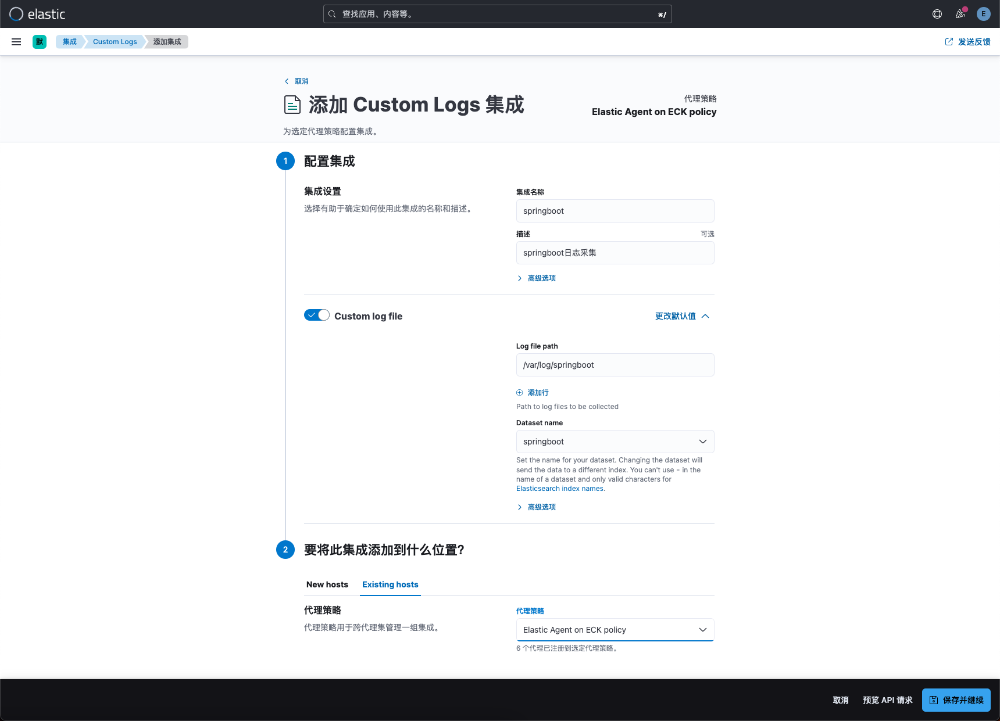

# pod日志采集（Elastic Agent方案）
# pod日志采集方案
## 采集方案
1. DaemonSet+Elastic Agent方案：使用DaemonSet控制器在每个kubernetes集群节点上运行elastic agent服务，业务容器日志目录统一挂载到节点指定目录下。在fleet中配置集成Custom Logs集成策略，指定日志采集目录和ingest pipeline，实现自定义路径下的日志收集和清理操作。
2. DaemonSet+filebeat+logstash方案：通过DaemonSet方式在每个kubernetes集群节点上运行filebeat服务。以容器运行时containerd为例，配置filebeat输入路径为/var/log/containers/<kubernetes.container.id>.log，输出路径为logstash。并在logstash中配置规则提取container名称变量，然后在logstash输出中引用container名称变量，以此来实现写入到es的不同index中。
3. sidecar+fluentd方案：每个业务容器中通过sidecar方式运行一个fluentd日志采集处理容器，Fluentd是一个开源的数据收集器，专为处理数据流设计，使用JSON作为数据格式。它采用了插件式的架构，具有高可扩展性高可用性，同时还实现了高可靠的信息转发。由于logstash处理性能较弱且占用资源较高，可以通过fluentd一个组件替代filebeat+logstash的功能，从而简化日志采集流程与配置。
4. sidecar+filebeat+kafka+logstash方案：每个业务容器中通过sidecar方式运行一个filebeat日志采集容器，用于采集业务容器产生的日志并输出到kafka中。借助Kafka的Consumer Group技术可部署多个logstash副本，提升数据处理能力和高可用性。需要注意的是每个consumer最多只能使用一个partition，当一个Group内consumer的数量大于partition的数量时，只有等于partition个数的consumer能同时消费，其他的consumer处于等待状态。因此想要增加logstash的消费性能，可以适当的增加topic的partition数量，但kafka中partition数量过多也会导致kafka集群故障恢复时间过长。

## 适用场景
在小规模日志场景下，首选DaemonSet+Elastic Agent方案采集pod日志，我们只需要调整集成策略的采集日志路径和ingest pipeline管道处理规则即可，集群性能瓶颈取决于ingest节点性能。

在大规模日志场景下，推荐使用sidecar+fluentd方案，由fluentd实现日志的采集与过滤处理后直接写入ES集群，集群性能瓶颈取决于es集群hot节点性能。

在超大规模且业务存在瞬间高峰的日志场景下，推荐使用sidecar+filebeat+kafka+logstash方案。可将日志内容暂存到kafka消息队列中，由logstash集群逐个消费并写入ES，防止瞬间高峰导致直接写入ES失败，集群性能瓶颈取决于logstash节点性能。

## 注意事项
应用日志应配置日志轮换以防止日志文件无限增长并占用过多的磁盘空间。通过设置日志轮换参数，可以控制日志文件的大小、保留的日志文件数量以及轮换的频率。这种做法可以高效管理日志，避免磁盘空间问题。

# 部署模拟日志程序
## 项目地址
代码仓库地址：[https://gitee.com/cuiliang0302/log_demo](https://gitee.com/cuiliang0302/log_demo)

## 日志格式
模拟常见的后端服务日志，格式如下

```bash
2023-07-23 09:35:18.987 | INFO     | __main__:debug_log:49 - {'access_status': 200, 'request_method': 'GET', 'request_uri': '/account/', 'request_length': 67, 'remote_address': '186.196.110.240', 'server_name': 'cu-36.cn', 'time_start': '2023-07-23T09:35:18.879+08:00', 'time_finish': '2023-07-23T09:35:19.638+08:00', 'http_user_agent': 'Mozilla/5.0 (Macintosh; Intel Mac OS X 10_12_3) AppleWebKit/537.36 (KHTML, like Gecko) Chrome/58.0.2999.0 Safari/537.36'}
2023-07-23 09:35:19.728 | WARNING  | __main__:debug_log:47 - {'access_status': 403, 'request_method': 'PUT', 'request_uri': '/public/', 'request_length': 72, 'remote_address': '158.113.125.213', 'server_name': 'cu-35.cn', 'time_start': '2023-07-23T09:35:18.948+08:00', 'time_finish': '2023-07-23T09:35:20.343+08:00', 'http_user_agent': 'Mozilla/5.0 (Macintosh; Intel Mac OS X 10_12_3) AppleWebKit/537.36 (KHTML, like Gecko) Chrome/58.0.2999.0 Safari/537.36'}
2023-07-23 09:35:19.793 | INFO     | __main__:debug_log:49 - {'access_status': 200, 'request_method': 'GET', 'request_uri': '/public/', 'request_length': 46, 'remote_address': '153.83.121.71', 'server_name': 'cm-17.cn', 'time_start': '2023-07-23T09:35:19.318+08:00', 'time_finish': '2023-07-23T09:35:20.563+08:00', 'http_user_agent': 'Mozilla/5.0 (Macintosh; Intel Mac OS X 10.9; rv:57.0) Gecko/20100101 Firefox/57.0'}
2023-07-23 09:35:20.614 | ERROR    | __main__:debug_log:45 - {'access_status': 502, 'request_method': 'GET', 'request_uri': '/public/', 'request_length': 62, 'remote_address': '130.190.246.56', 'server_name': 'cu-34.cn', 'time_start': '2023-07-23T09:35:20.061+08:00', 'time_finish': '2023-07-23T09:35:21.541+08:00', 'http_user_agent': 'Mozilla/4.0 (compatible; MSIE 7.0; Windows NT 5.1; Trident/4.0; Hot Lingo 2.0)'}
```

## 打包并上传镜像
```bash
[root@es-master ~]# cd /opt/
[root@es-master opt]# git clone https://gitee.com/cuiliang0302/log_demo.git
[root@es-master opt]# cd log_demo/
[root@es-master log_demo]# ls
Dockerfile  log.py  main.py  readme.md  requirements.txt
[root@es-master log_demo]# docker build -t harbor.local.com/app/log_demo:1.0 .
[root@es-master log_demo]# docker push harbor.local.com/app/log_demo:1.0
```

## 部署服务
在本案例中，我们将容器日志目录通过hostPath方式挂载到宿主机的/var/log/logDemo路径下。

```bash
[root@tiaoban fleet]# cat log-demo.yaml 
apiVersion: apps/v1
kind: Deployment
metadata:
  name: log-demo
spec:
  replicas: 2
  selector:
    matchLabels:
      app: log-demo
  template:
    metadata:
      labels:
        app: log-demo
    spec:
      containers:
      - name: log-demo
        image: harbor.local.com/app/log_demo:1.0
        resources:
          requests:
            memory: "32Mi"
            cpu: "100m"
          limits:
            memory: "128Mi"
            cpu: "500m"
        volumeMounts:
          - mountPath: /opt/logDemo/log
            name: logs
      volumes:
        - name: logs
          hostPath:
            path: /var/log/logDemo
            type: DirectoryOrCreate
[root@tiaoban fleet]# kubectl apply -f log-demo.yaml 
deployment.apps/log-demo created
[root@tiaoban fleet]# kubectl get pod -o wide
NAME                        READY   STATUS    RESTARTS       AGE     IP             NODE    NOMINATED NODE   READINESS GATES
log-demo-76c57cf9dc-9znrd   1/1     Running   0              2m45s   10.244.3.124   work3   <none>           <none>
log-demo-76c57cf9dc-lkvrq   1/1     Running   0              2m45s   10.244.4.158   work2   <none>           <none>
```

# 配置代理采集日志
## 创建集成策略
日志路径填写挂载到Elastic agent的日志路径，即/var/log/logDemo/info.log，代理策略选择现有的Elastic Agent on ECK policy。


## 自定义ingest处理
在先前的自定义日志采集(fleet方式)中已有详细讲解，具体内容可参考文档[https://www.cuiliangblog.cn/detail/article/62](https://www.cuiliangblog.cn/detail/article/62)，此处不再赘述。

# 多应用采集思路
通常情况下我们需要采集多个自定义应用的日志内容，我们只需要保证应用日志目录均挂载至宿主机/var/log目录下，然后配置fleet代理策略，指定对应的日志路径和名称以及ingest pipeline即可。



如下所示，我们需要采集myapp和springboot两个应用的日志，只需要添加多条Custom logs集成策略即可。


