# 数据查询与数据可视化(Kibana)
> 在前面的案例中，我们顺利的通过各种方式完成了数据的采集过滤与存储，接下来我们通过kibana实现数据的查询与可视化，用图形的方式从各个维度更加直观有效的展示数据内容。
>

# 数据查询
数据查询是kibana最基础且常用的功能，我们可以很便捷的筛选出指定条件的数据内容。

## 新建数据视图
依次点击Stack Management——>数据视图——>创建数据视图


接下来点击Analytics——>Discover即可查看数据视图信息。

## 筛选时间范围
在discover中，我们可以点击右上方的时间选择器按钮，筛选查询指定时间范围内的数据。

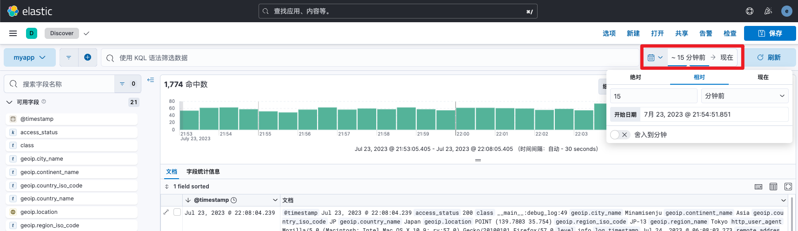

## 显示指定字段信息
默认显示文档的所有字段信息，我们可以通过左侧的字段选择框，过滤出需要查看的字段信息，结果会以表格的形式展示。

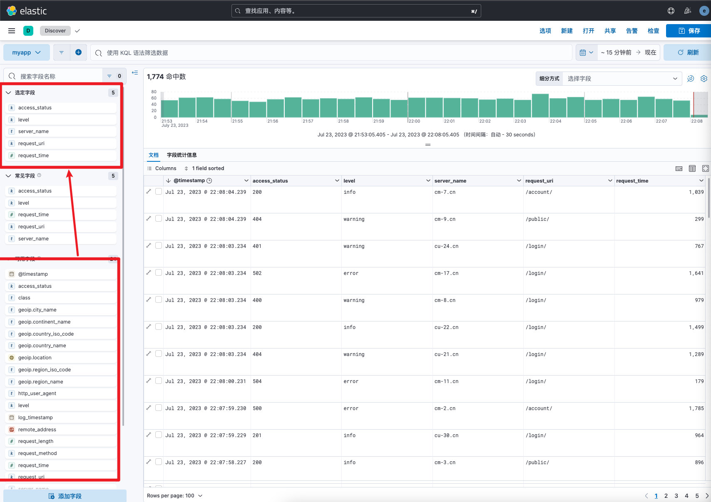

## 条件查询过滤
例如我们需要查询level字段值为info的内容，我们有两种方式实现它。

方式一：直接点击对应值

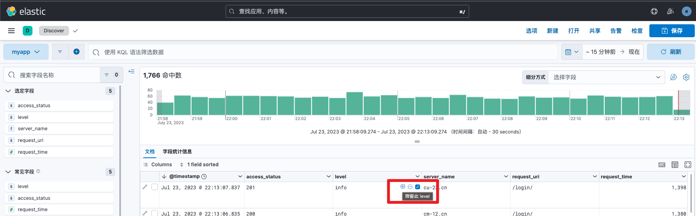

方式二：添加筛选条件

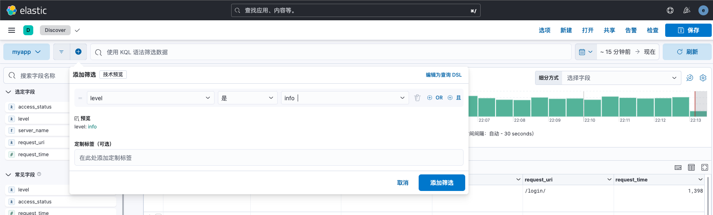

或者直接使用KQL语法筛选数据


查询结果如下所示：


## 查询汇总数据
除了查询数据外，discover也支持简单的数据聚合汇总，例如我们可以查看level字段值的种类和每个值的个数信息。

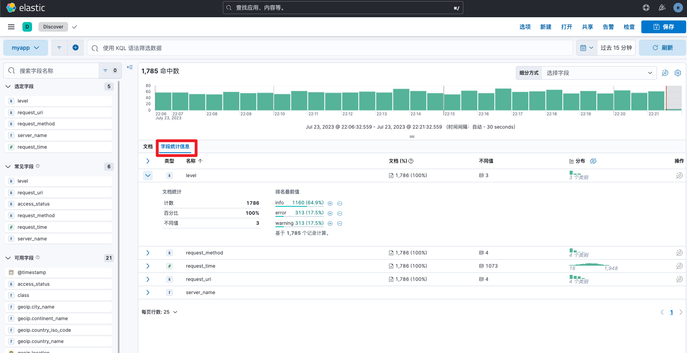

## 结果导出
点击右上方的共享按钮，即可导出CSV格式报告。


> 实测discover导出数据只适用于小规模场景使用，如果数据上万条时可能会导致导出超时，建议使用logstash output csv插件或者使用客户端工具查询并写入csv文件。logstash导出csv可参考文档[https://www.elastic.co/guide/en/logstash/master/plugins-outputs-csv.html](https://www.elastic.co/guide/en/logstash/master/plugins-outputs-csv.html)
>

## DSL语句查询
除了上述的界面点击筛选查询外，discover也支持功能更加强大且灵活的DSL语句查询。由于篇幅有限在此不详细介绍DSL语法，感兴趣的小伙伴可查看博客网站ES数据查询章节相关内容。[https://www.cuiliangblog.cn/catalog/10898409](https://www.cuiliangblog.cn/catalog/10898409)

例如我们需要全文检索http_user_agent为Mac OS的用户，并添加过滤条件1：request_uri为/public/和过滤条件2：access_status值为502、503、504的数据。DSL语句如下：

```json
GET logs-myapp-default/_search
{
  "query": {
    "bool": {
      "must": [
        {
          "match_phrase": {
            "http_user_agent": "Mac OS"
          }
        }
      ],
      "filter": [
        {
          "terms": {
            "access_status": [
              "502",
              "503",
              "504"
            ]
          }
        },
        {
          "term": {
            "request_uri": "/public/"
          }
        }
      ]
    }
  }
}
```

接下来在discover中添加查询条件，直接选择编辑查询DSL

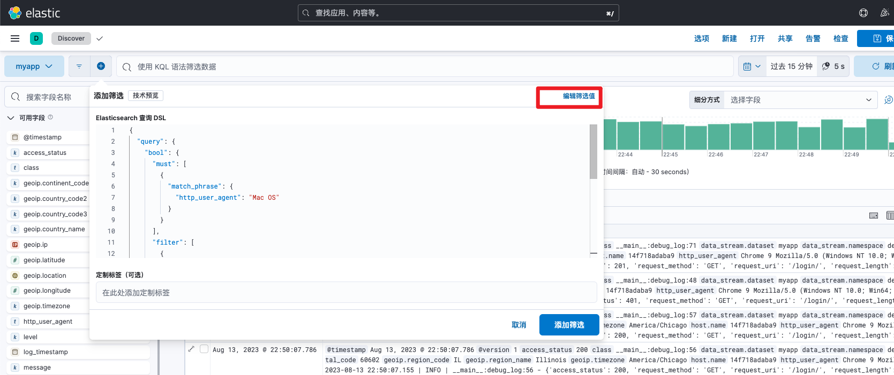

点击添加筛选后，查询结果如下所示：

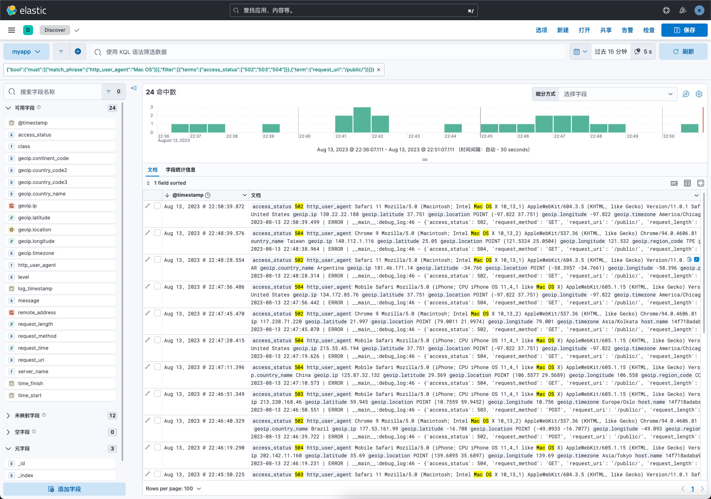

# 实时日志查看
对于日志类数据，我们可能需要经常查看当前时刻的最新日志，我们可以通过kibana的Stream页面查看实时日志。

## 数据视图中添加字段
若想使用实时日志的前提是数据视图字段中必须包含message字段，我们可以对先前添加的myapp数据视图修改，新增message字段。


## 添加实时日志显示
接下来在stream菜单中，点击设置按钮，选择刚刚修改好的myapp数据视图。


修改名称和数据视图，日志源选择myapp

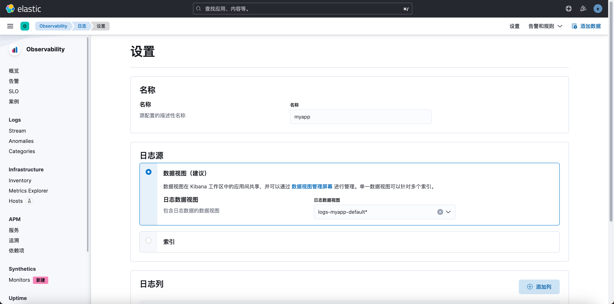

## 查看效果
接下来就会在页面中实时滚动输出最新的日志信息。


往往我们更关注日志等级为error的日志，我们只需要添加筛选条件即可。


# dashboard制作
除了对数据进行筛选查询外，数据可视化也是kibana的特色功能，我们只需要点击配置条件便可实现数据可视化。

## 新增dashboard
依次点击Analytics——>Dashboard，即可创建数据看板，以我们的自定义日志为例演示可视化分析效果。


## 单值图
以应用访问量为例，我们只需要查询指定时间范围内的count即可，图标配置如下所示

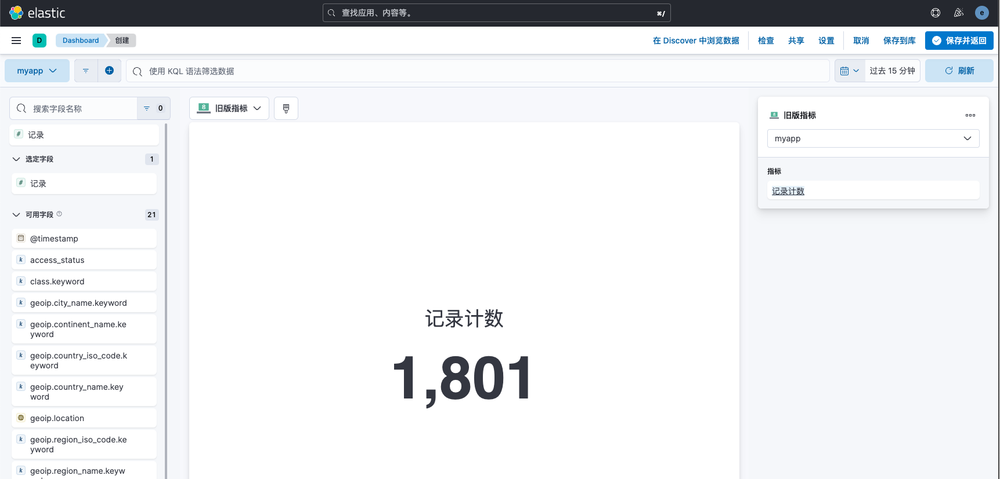

## 折线图
如果我们需要查看随着时间的推移，每个时间间隔内用户访问量和访问时长的数据时，就可以通过折线图分析。

其中水平轴使用时间字段，类型选择Date Histogram


垂直轴我们指定request_time字段的平均值。


另一个垂直轴我们选择count数


## 柱状图
以分析返回状态码数据，水平轴选取access_status字段值的前5


垂直轴使用count计数

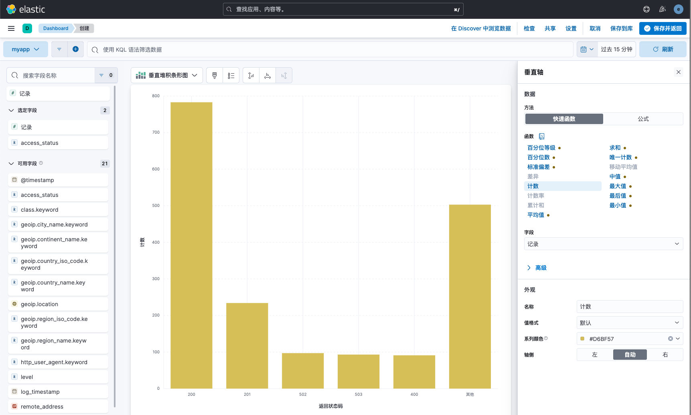

## 饼图
以分析用户请求方式为例，选择饼图，字段选择request_method即可。

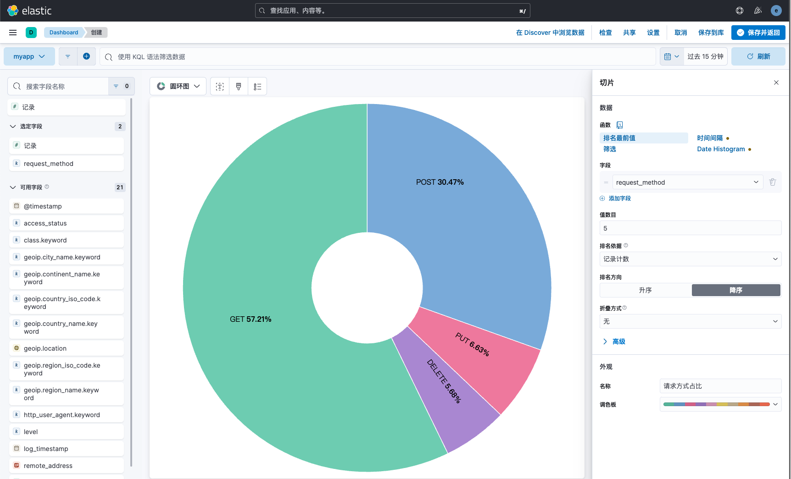

## 效果演示
制作完成的dashboard如下所示


# 地理热力图制作
kibana除了支持简单的数据查询和聚合分析外，也支持地理位置数据可视化分析显示。

## 前提条件
在前面的Logstash配置中，我们使用了geoip插件，它可以根据IP地址解析出对于的经纬度信息，我们只需要修改mapping，将geoip字段类型设置为geo_point。

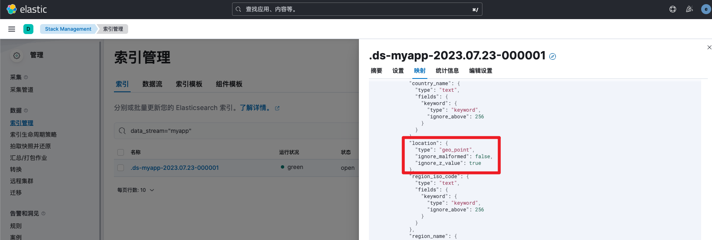

## 创建热力图
依次点击菜单Analytics——>Maps，创建地图。


进入后，已经为我们默认提供了一张世界地图，接下来我们添加一个热图图层即可。

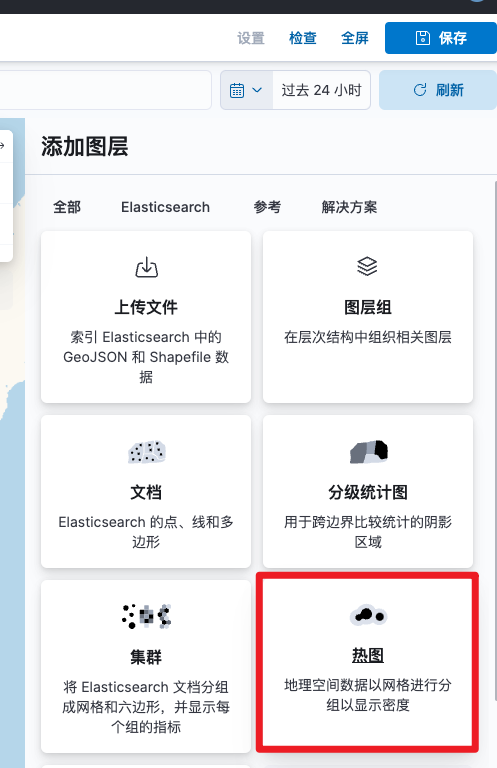

数据视图选择myapp，kibana会自动扫描该数据视图下geo_point类型的字段。


点击添加即可，一张热力图便制作完成。

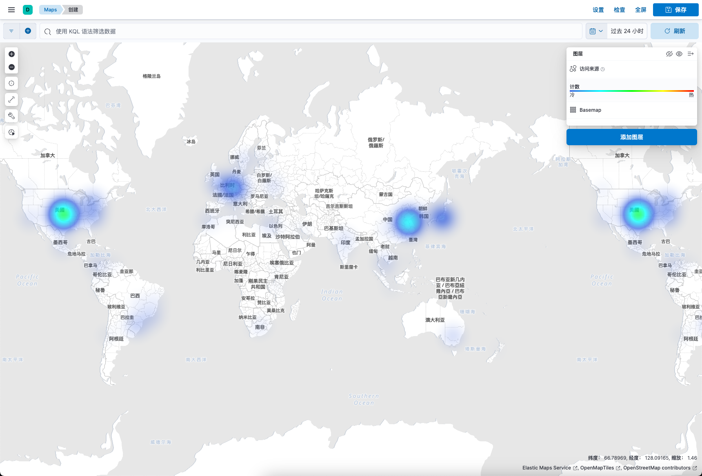

可能某些应用主要针对国内用户访问，而默认提供的世界地图对国内信息显示不够详细，此时我们可以添加自定义图层。

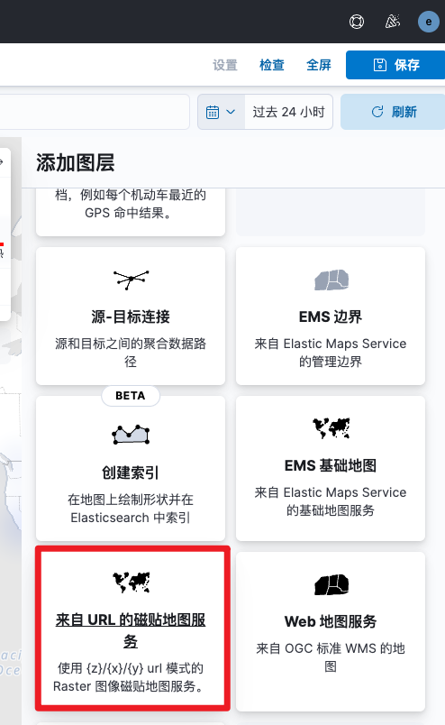

然后填写高德地图的URL地址，内容如下

```bash
http://webrd02.is.autonavi.com/appmaptile?lang=zh_cn&size=1&scale=1&style=7&x={x}&y={y}&z={z}
```

添加完成后，显示效果如下


至此，kibana的数据查询与可视化演示完成。

# 参考文档
kibana discover操作指南：[https://www.elastic.co/guide/en/kibana/8.8/discover.html](https://www.elastic.co/guide/en/kibana/8.8/discover.html)

kibana dashboard操作指南：[https://www.elastic.co/guide/en/kibana/8.8/dashboard.html](https://www.elastic.co/guide/en/kibana/8.8/dashboard.html)

kibana map操作指南：[https://www.elastic.co/guide/en/kibana/8.8/maps-getting-started.html](https://www.elastic.co/guide/en/kibana/8.8/maps-getting-started.html)


