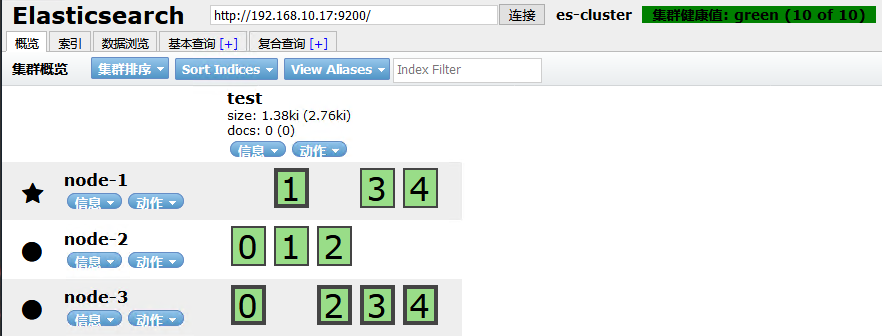

# 故障转移

> 分类: ELK Stack > ES基础与部署
> 更新时间: 2026-01-10T23:33:32.269510+08:00

---

+ 当前node-2为master节点，node-1、node-3为data节点

# 一、data节点模拟宕机
1. 将node-1关机

+ 说明：当前集群状态为黄色，表示主节点可用，副本节点不完全可用。

+ 过一段时间观察，发现节点列表中看不到node-1，副本节点分配到了node-2和node-3，集群状态恢复到绿色。
1. 将node-1恢复

+ 可以看到，node-1恢复后，重新加入了集群，并且重新分配了节点信息。

# 二、master节点模拟宕机
1. 将node-2节点关机

+ 从结果中可以看出，集群对master进行了重新选举，选择node-1为master。并且集群状态变成黄色。

+ 等待一段时间后，集群状态从黄色变为了绿色：
2. 将node-2恢复

+ 重启之后，发现node-2可以正常加入到集群中，集群状态依然为绿色：

