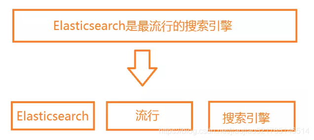
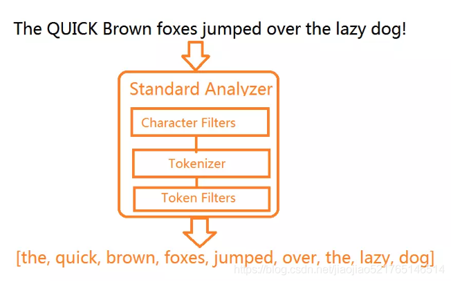

# 倒排索引与分词基础

> 分类: ELK Stack > ES数据增删改查
> 更新时间: 2026-01-10T23:33:33.927850+08:00

---

## 倒排索引
### 正排索引
**文档ID到文档内容、单词的关联关系。**

正排索引就是最普通的索引排序方式。正排索引也是采取key-value pair的方式对数据进行保存，key是doc-id，value则可以存储多种内容，如doc的分词词表、doc所在网页的属性信息等。由此可见，正排索引可以随意添加数据，但如果你要查询某个单词在哪些文档中出现，那么你就不得不将全部文档都遍历一遍，效率极低。

| 文档ID | 文档内容 |
| --- | --- |
| 1 | elasticsearch是最流行的搜索引擎 |
| 2 | php是世界上最好的语言 |
| 3 | 搜索引擎是如何诞生的 |

### 倒排索引
**单词到文档ID的关联关系**

倒排索引类似将正排索引反过来，以全部文档中出现的所有words建立一个term dictionary ，然后对于term dictionary 中的每个词，它后面都会跟随一个链表，该链表就是 倒排表 ，倒排表内存储着如下信息：

+ 该词出现的doc-id
+ 该词在某doc中的出现次数和出现位置

如此一来，倒排索引就可以在用户输入查询query时，将query分词成一个个token，然后将一个个token带到term dictionary 去“查字典”，然后获得出现该词的doc-id集合，最终在这若干个token对应的若干doc-id集合上做交集，得到最符合用户query查询的结果。

由此可见，倒排索引大大加快了查询速度，然而一旦有新的文档加入文档库，你就要重新做一次"入库操作"，即建立倒排索引的操作。因为此时各个token在不同文档中的出现次数、以及每个token对应的 倒排表 都可能发生变化。

| 单词 | 文档ID |
| --- | --- |
| elasticsearch | 1 |
| 流行 | 1 |
| 搜索引擎 | 1，3 |
| php | 2 |
| 世界 | 2 |
| 最好 | 2 |
| 语言 | 2 |
| 如何 | 3 |
| 诞生 | 3 |

## 分词
分词是指将文本转换成一系列单词（term or token）的过程，也可以叫做文本分析，在 es 里面称为 Analysis，如下图所示

### 分词器
分词器是ES中专门处理分词的组件，英文为Analyzer，它的组成如下：

+ Character Filters：针对原始文本进行处理，比如去除html标签
+ Tokenizer：将原始文本按照一定规则切分为单词
+ Token Filters：针对Tokenizer处理的单词进行再加工，比如转小写、删除或增新等处理

### 分词器调用顺序

## 参考文档
csdn 倒排索引、分词详解[https://blog.csdn.net/jiaojiao521765146514/article/details/83750548](https://blog.csdn.net/jiaojiao521765146514/article/details/83750548)

