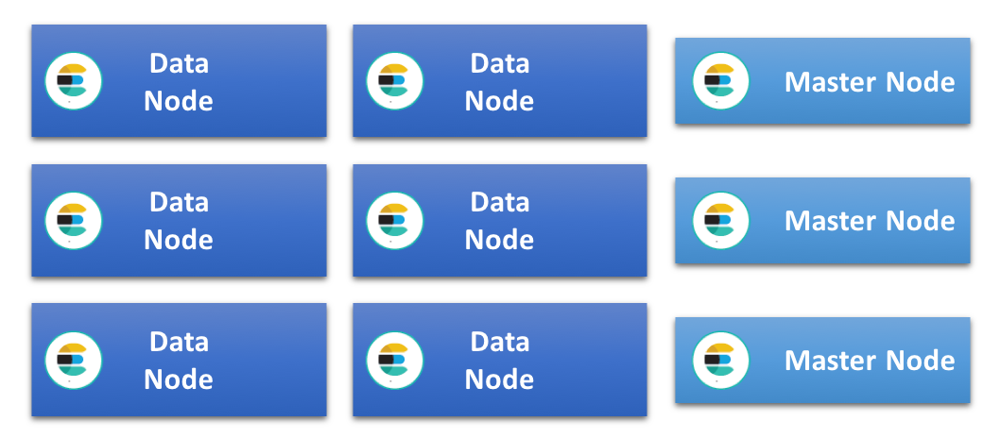
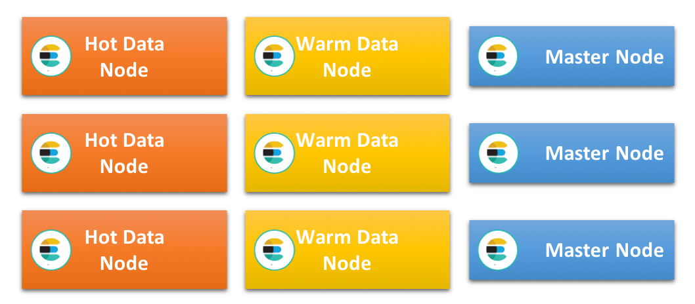

# 集群规划案例

> 分类: ELK Stack > ES进阶
> 更新时间: 2026-01-10T23:33:40.011706+08:00

---

# 业务场景需求
日志类业务，此集群每天能够采集 100GB 的原始网络访问日志，需要经常查询最近7天数据，数据的保留期为 30 天。

# 规划分析
## 集群架构
在所有 Elasticsearch 集群中，最简单的一种架构是：所有数据节点的规格相同，并且可以处理所有角色。如果采用这种架构，随着集群规模的增大，用户通常需要添加针对具体任务的节点，例如专用的主节点、采集节点，以及 Machine Learning 节点。这样会减轻数据节点的负载，并提高这些数据节点的运行效率。在此种类型的集群中，所有数据节点会平均分担索引和查询负载，而且由于这些数据节点的配置相同，我们通常将此种架构称为同质或统一集群架构。

另一种十分热门的架构便是我们所说的热温架构，当处理诸如日志和指标等时序型数据时，这一架构尤为常用。此架构基于下列原则：数据通常是不可更改的，并且能够索引到时序型索引中。由于每个索引仅包含特定时间段的数据，所以用户有可能通过删除整个索引来管理数据保留时间和数据生命周期。此架构有两种不同类型的数据节点（拥有不同的硬件配置文件）：“热”和“温”数据节点。

由于所有最新索引均位于热数据节点上，所以热数据节点会处理集群中的全部索引负载。鉴于最新数据的查询频率通常也最为频繁，所以这些节点一般而言都会十分繁忙。将数据索引到 Elasticsearch 中需要占用大量 CPU 和 I/O 资源，再加上还要处理查询负载，因此这些节点需要具有十分强大的性能，并且可以十分快速地进行存储。一般而言，这意味着需要使用本地附加型 SSD（固态硬盘）。

温节点则已经过优化，能够在节省成本的同时满足集群中只读索引的长期存储需求。温节点一般拥有较大的内存和 CPU，但通常会使用本地附加型转盘式硬盘或 SAN，而不会使用 SSD。一旦热节点上的索引超过了这些节点的保留期限，并且 Elasticsearch 不再向其中索引数据，这些索引便会转移到温节点上。

有很重要的一点需要注意：将数据从热节点转移至温节点并不意味着查询速度肯定会变慢。由于温节点根本不处理任何占用大量资源的索引负载，所以温节点通常无需使用 SSD 类存储，便能高效完成早期数据的查询请求，并且延迟较低。

由于此种架构中的数据节点具有十分专一的用途，并且可能需要处理很高的负载，所以我们推荐使用专门的主节点、采集节点、Machine Learning 节点以及纯协调节点。

## 选择架构
这两种架构的效果都很好，因此对于选择哪种架构，我们并不能直接给出明确的答案。然而，的确存在一些特定的条件和限制，使得某种架构在这些情形下能够更胜一筹。

集群可以使用的存储类型是一个需要考虑的重要因素。由于在热温架构中热节点需要十分快速的存储性能，所以如果集群仅限使用较慢的存储工具，则热温架构并不合适。在这种情况下，最好使用统一架构，并将索引和查询负载扩展到尽可能多的节点上。

尽管 SSD 越来越普遍，但统一集群通常仍由附加作为区块存储工具的本地转盘式硬盘或 SAN 提供支持。如果存储速度较慢，则可能不能支持特别高的索引速度，若同时还有查询负载，这种情况会尤为明显；有鉴于此，如果存储速度较慢，可能需要很长时间才能填满可用的磁盘空间。因此，只有在您有充分理由需要长期存储数据时，才可能需要在每个节点上存放大量数据。

如果用例规定的保留期限很短（例如少于 10 天），那么索引完成后，数据不会在磁盘上长期闲置。这要求具备强大的存储性能。热温架构可能适用，但是仅有热数据节点的统一集群可能效果会更好，也更加易于管理。

## 预估容量
为简单起见，我们在此示例中仅使用单一类型的数据。在索引基准测试期间，我们看到原始数据量和索引后所占磁盘空间之间的比例大约为 1.1，所以 100GB 的原始数据预计会在磁盘上产生 110GB 的索引数据。添加完复制索引后，此数值会翻倍，变为 220GB。

在 30 天内，索引数据和复制数据的总量为 6600GB，这就是集群需要处理的总量。

本示例假定在所有区中使用了 1 个复制分片，因为业内认为这是兼顾性能和可用性的最佳实践。

## 热节点规模预估
为了给查询和小型流量峰值流出一些余量，我们假定仅能将索引吞吐量维持在不超过最高水平 50% 的范围内。如想完全利用这些节点上的可用存储，我们需要在更长时间内向这些节点中索引数据，所以我们在这些节点上调整了保留期限以反映这一要求。

由于 Elasticsearch 还需要一些备用磁盘空间以实现高效运行，所以为了不超过 [disk watermarks](https://www.elastic.co/guide/en/elasticsearch/reference/6.3/disk-allocator.html)（磁盘水位线），我们假定需要 15% 的额外磁盘空间进行缓冲。该值显示在下面表格中的“所需磁盘空间”列。基于这些数据，我们便可以确定所需的总内存量。

| 磁盘与内存的比例 | 有效保留期(天) | 需存储的数据量 (GB) | 所需总磁盘空间 (GB) | 所需总内存 (GB) |
| --- | --- | --- | --- | --- |
| 30:1 | 7 | 1540 | 1771 | 59 |

由于为保障高可用，同一索引的主副分片不能位于同一节点，因此热温节点数量最少各2台。

## 温节点规模预估
热节点上超出保留期的数据将会转移到温节点。通过计算这些节点需要存储的数据量，我们便可以预估所需的规模，计算时需要将高磁盘水位线的开销考虑在内。

| 磁盘与内存的比例 | 有效保留期（天） | 需存储的数据量 (GB) | 所需总磁盘空间 (GB) | 所需总内存 (GB) |
| --- | --- | --- | --- | --- |
| 100:1 | 23 | 5060 | 5819 | 58 |

## 添加其他节点类型
除了数据节点，我们通常还需要1个专用主节点，以便提高集群的弹性和可用性。由于这些节点不处理任何流量，所以它们的规模很小。最初可以分配 1GB 至 2GB 的节点便是一个不错的选择。随着托管集群规模的增长，然后可将这些节点的规模扩大至 16GB 左右。

