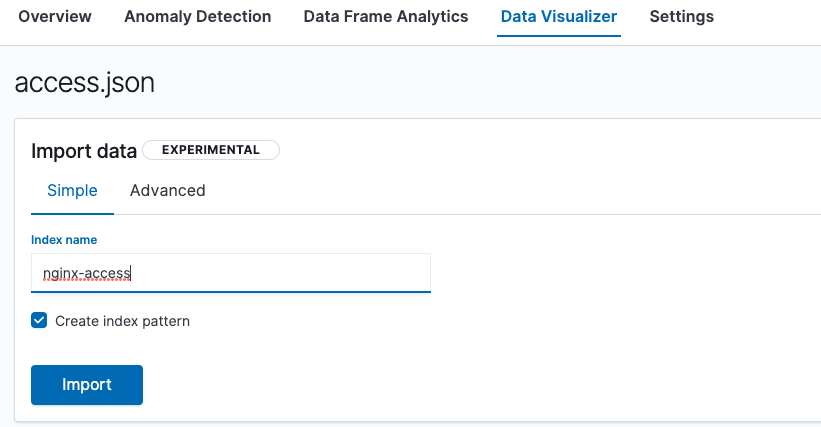
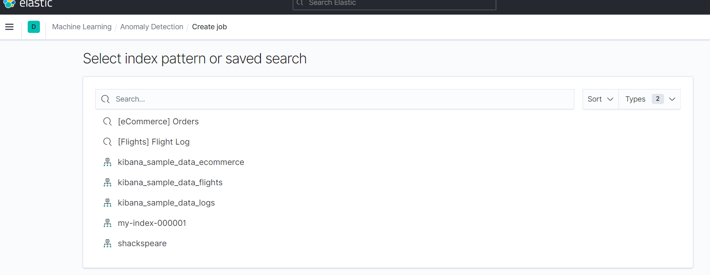

# Kibana上传数据

> 分类: ELK Stack > ES集群管理
> 更新时间: 2026-01-10T23:33:36.784866+08:00

---

## Data Visualizer 定义
Machine Learning -> Data Visulalizer -> Data Visualizer -> Import data / Select an index pattern


中文释义：机器学习数据可视化工具通过分析日志文件或现有 Elasticsearch 索引中的指标和字段，帮助您了解数据。

## Data Visualizer 分类
###  Import data 导入数据
可视化日志文件中的数据核心功能如下：

+ 文件数据可视化工具可帮助您了解日志文件中的字段和指标。 
+ 上传文件，分析其数据，然后选择是否将数据导入 Elasticsearch 索引。

文件数据可视化器支持以下文件格式：

+ 分隔的文本文件，例如 CSV 和 TSV
+ 换行符分隔的 JSON
+ 具有通用时间戳格式的日志文件

注意：

+ 最多可以上传 100 MB 的文件。
+ 此功能是实验性的。 

### 步骤1：选择文件
可以将nginx日志设置为json格式并导入

```json
http {
    #log_format  main  '$remote_addr - $remote_user [$time_local] "$request" '
    #                  '$status $body_bytes_sent "$http_referer" '
    #                  '"$http_user_agent" "$http_x_forwarded_for"';
    #access_log  /var/log/nginx/access.log  main;
    log_format log_json escape=json '{"@timestamp":"$time_iso8601",'    #通用日志格式下的本地时间，也可使用“$time_iso8601”标准格式下的本地时间
        '"server_addr":"$server_addr",'     #访问服务器的IP
        '"remote_addr":"$remote_addr",'     #客户端请求的IP
        '"host":"$host",'                   #请求的域名
        '"uri":"$uri",'                     #请求的URL
        '"body_bytes_sent":$body_bytes_sent,'   #发送给客户端的字节数，发送给客户端的字节数，也可选择 $bytes_sent 发送给客户端的总字节数
        '"request":"$request",'             #记录请求的URL和HTTP协议
        '"request_length":$request_length,' #字节的长度
        '"request_time":$request_time,'     #请求处理时间
        '"status":"$status",'               #返回的状态
        '"http_referer":"$http_referer",'   #记录从哪个页面链接访问过来的
        '"http_x_forwarded_for":"$http_x_forwarded_for",'       #（反向）记录客户端IP地址,也可以用 $remote_addr
        '"http_user_agent":"$http_user_agent"'  #记录客户端浏览器相关信息
        '}';
    access_log  /var/log/nginx/access.log  log_json;
}
```

注意：

+ json 文件设置为 UTF-8格式。
+ 每一行代表一条记录（document）。

### 步骤2：上传过程文件
+ 选择文件并上传


+ 导入数据



### 步骤3：导入成功


## 3.2 Select an index pattern 选择一个索引pattern
就简单列一下，如何操作。




## 参考文档
kibana使用文件上传数据[https://www.elastic.co/guide/en/kibana/7.13/connect-to-elasticsearch.html](https://www.elastic.co/guide/en/kibana/7.13/connect-to-elasticsearch.html)

