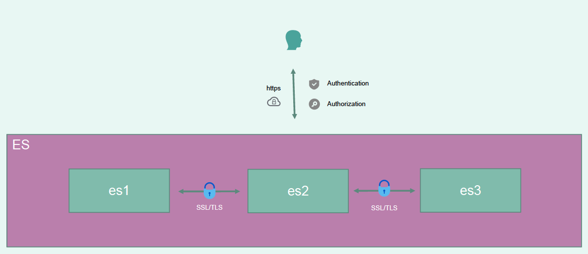

# 安全特性使用

> 分类: ELK Stack > ES集群管理
> 更新时间: 2026-01-10T23:33:36.902507+08:00

---

## Elasticsearch 安全特性
+ 用户认证(User Authentication)，支持 Basic、LDAP/AD(*)、Kerberos(*)、SAML(*)
+ 基于角色的权限管理(Authorization/RBAC)，支持 Index 级别、Document 级别(*)
+ 传输加密(Transportation Encryption)

集群内部节点与节点之间 SSL/TLS (启用安全特性后强制开启)

集群与 client 之间加密传输 https(按需开启，不强制)



## 单节点用户认证
默认情况下，拥有安全免费许可证时，Elasticsearch安全功能被禁用。

### 设置xpack.security.enabled。
在elasticsearch.yml配置文件中，新增：

```plain
cluster.name: my-application
node.name: node-1
network.host: 192.168.10.21
discovery.seed_hosts: ["192.168.10.21"]
# cluster.initial_master_nodes: ["node-1"]

# 新增如下配置
xpack.security.enabled: true
xpack.security.transport.ssl.enabled: true
discovery.type: single-node
```

注意：xpack.security.transport.ssl.enabled的设置。

否则会报错：

```plain
[1]: Transport SSL must be enabled if security is enabled on a [basic] license.

Please set [xpack.security.transport.ssl.enabled] to [true] or disable security by setting [xpack.security.enabled] to [false]
```

### 设置账号和密码
elasticsearch-setup-passwords 用于设置密码。

+ auto - 随机设置用户名和密码
+ interactive - 交互式设置用户名和密码

根据业务需要，选择随机或者自定义密码。

自定义密码设置命令如下：

```plain
./elasticsearch-setup-passwords interactive
```

### 访问验证
+ 不使用账号密码访问

```bash
[root@es-1 elasticsearch]# curl http://192.168.10.21:9200/_cluster/health
{"error":{"root_cause":[{"type":"security_exception","reason":"missing authentication credentials for REST request [/_cluster/health]","header":{"WWW-Authenticate":"Basic realm=\"security\" charset=\"UTF-8\""}}],"type":"security_exception","reason":"missing authentication credentials for REST request [/_cluster/health]","header":{"WWW-Authenticate":"Basic realm=\"security\" charset=\"UTF-8\""}},"status":401}
```

+ 使用账号密码访问

```bash
[root@es-1 ~]# curl -u elastic:123456 http://192.168.10.21:9200/_cluster/health
{"cluster_name":"my-application","status":"green","timed_out":false,"number_of_nodes":1,"number_of_data_nodes":1,"active_primary_shards":8,"active_shards":8,"relocating_shards":0,"initializing_shards":0,"unassigned_shards":0,"delayed_unassigned_shards":0,"number_of_pending_tasks":0,"number_of_in_flight_fetch":0,"task_max_waiting_in_queue_millis":0,"active_shards_percent_as_number":100.0}
```

### kibana设置
kibana添加账号和密码如下所示：

```plain
elasticsearch.username: "kibana"
elasticsearch.password: "123456"
```

### 成功标志
kibana 访问会出现如下的界面。


## <font style="color:rgb(1, 1, 1);">多节点TLS加密配置</font>
> 以下操作步骤以rpm包部署方式三个节点的es7版本集群为例
>

### 配置elasticsearch安全功能（每个节点都操作）
+ 先停止整个es服务

```bash
systemctl stop elasticsearch
```

+ 修改elasticsearch配置

```bash
vim /etc/elasticsearch/elasticsearch.yml
xpack.security.enabled: true
xpack.security.transport.ssl.enabled: true
xpack.security.transport.ssl.verification_mode: certificate
xpack.security.transport.ssl.client_authentication: required
xpack.security.transport.ssl.keystore.path: elastic-certificates.p12
xpack.security.transport.ssl.truststore.path: elastic-certificates.p12
```

### 生成证书与密钥（master节点操作）
+ 生成证书

```bash
[root@es-1 ~]# cd /usr/share/elasticsearch/
[root@es-3 elasticsearch]# ./bin/elasticsearch-certutil ca
This tool assists you in the generation of X.509 certificates and certificate
signing requests for use with SSL/TLS in the Elastic stack.

The 'ca' mode generates a new 'certificate authority'
This will create a new X.509 certificate and private key that can be used
to sign certificate when running in 'cert' mode.

Use the 'ca-dn' option if you wish to configure the 'distinguished name'
of the certificate authority

By default the 'ca' mode produces a single PKCS#12 output file which holds:
* The CA certificate
* The CA's private key

If you elect to generate PEM format certificates (the -pem option), then the output will
be a zip file containing individual files for the CA certificate and private key

Please enter the desired output file [elastic-stack-ca.p12]: // 直接回车，使用默认路径即可
Enter password for elastic-stack-ca.p12 : // 输入密码，并记住它
```

+ 查看证书

```bash
[root@es-1 elasticsearch]# pwd
/usr/share/elasticsearch
[root@es-1 elasticsearch]# ls -la elastic-stack-ca.p12 
-rw------- 1 root root 2672 7月   9 23:14 elastic-stack-ca.p12
```

+ 生成密钥

```bash
[root@es-1 elasticsearch]# ./bin/elasticsearch-certutil cert --ca elastic-stack-ca.p12
This tool assists you in the generation of X.509 certificates and certificate
signing requests for use with SSL/TLS in the Elastic stack.

The 'cert' mode generates X.509 certificate and private keys.
    * By default, this generates a single certificate and key for use
       on a single instance.
    * The '-multiple' option will prompt you to enter details for multiple
       instances and will generate a certificate and key for each one
    * The '-in' option allows for the certificate generation to be automated by describing
       the details of each instance in a YAML file

    * An instance is any piece of the Elastic Stack that requires an SSL certificate.
      Depending on your configuration, Elasticsearch, Logstash, Kibana, and Beats
      may all require a certificate and private key.
    * The minimum required value for each instance is a name. This can simply be the
      hostname, which will be used as the Common Name of the certificate. A full
      distinguished name may also be used.
    * A filename value may be required for each instance. This is necessary when the
      name would result in an invalid file or directory name. The name provided here
      is used as the directory name (within the zip) and the prefix for the key and
      certificate files. The filename is required if you are prompted and the name
      is not displayed in the prompt.
    * IP addresses and DNS names are optional. Multiple values can be specified as a
      comma separated string. If no IP addresses or DNS names are provided, you may
      disable hostname verification in your SSL configuration.

    * All certificates generated by this tool will be signed by a certificate authority (CA)
      unless the --self-signed command line option is specified.
      The tool can automatically generate a new CA for you, or you can provide your own with
      the --ca or --ca-cert command line options.

By default the 'cert' mode produces a single PKCS#12 output file which holds:
    * The instance certificate
    * The private key for the instance certificate
    * The CA certificate

If you specify any of the following options:
    * -pem (PEM formatted output)
    * -keep-ca-key (retain generated CA key)
    * -multiple (generate multiple certificates)
    * -in (generate certificates from an input file)
then the output will be be a zip file containing individual certificate/key files

Enter password for CA (elastic-stack-ca.p12) :  // 输入密码
Please enter the desired output file [elastic-certificates.p12]: // 直接回车，使用默认路径
Enter password for elastic-certificates.p12 :   // 输入密码

Certificates written to /usr/share/elasticsearch/elastic-certificates.p12

This file should be properly secured as it contains the private key for 
your instance.

This file is a self contained file and can be copied and used 'as is'
For each Elastic product that you wish to configure, you should copy
this '.p12' file to the relevant configuration directory
and then follow the SSL configuration instructions in the product guide.

For client applications, you may only need to copy the CA certificate and
configure the client to trust this certificate.
```

+ 查看密钥

```bash
[root@es-1 elasticsearch]# pwd
/usr/share/elasticsearch
[root@es-1 elasticsearch]# ls -la elastic-certificates.p12 
-rw------- 1 root root 3596 7月   9 23:15 elastic-certificates.p12
```

### 将密钥分发至其他节点并修改目录和权限（所有节点）
+ 分发密钥文件

```bash
[root@es-1 elasticsearch]# scp elastic-certificates.p12 192.168.10.22:/usr/share/elasticsearch
[root@es-1 elasticsearch]# scp elastic-certificates.p12 192.168.10.23:/usr/share/elasticsearch
```

+ 修改权限与目录

```bash
[root@es-1 elasticsearch]# cp /usr/share/elasticsearch/elastic-certificates.p12 /etc/elasticsearch/
[root@es-1 elasticsearch]# chmod 644 /usr/share/elasticsearch/elastic-certificates.p12
[root@es-1 elasticsearch]# chmod 644 /etc/elasticsearch/elastic-certificates.p12
```

### 节点添加密码（所有节点）
```bash
[root@es-1 elasticsearch]# ./bin/elasticsearch-keystore add xpack.security.transport.ssl.keystore.secure_password
Enter value for xpack.security.transport.ssl.keystore.secure_password: // 输入密码
[root@es-1 elasticsearch]# ./bin/elasticsearch-keystore add xpack.security.transport.ssl.truststore.secure_password
Enter value for xpack.security.transport.ssl.truststore.secure_password: // 输入密码
```

### 启动es服务（所有节点）
```bash
[root@es-1 elasticsearch]# systemctl start elasticsearch
[root@es-1 elasticsearch]# systemctl status elasticsearch
```

<font style="color:rgb(77, 77, 77);">启动后看日志(</font>/var/log/elasticsearch/<font style="color:rgb(77, 77, 77);">)，是否正常，若日志异常，则需要具体排查。通常是密钥权限不足或存放路径有问题导致。</font>

### 内置用户创建密码（master节点操作）
```bash
[root@es-1 elasticsearch]# ./bin/elasticsearch-setup-passwords  interactive
# 下面会要输入很多密码，都要自己能记住，以后要用
# 需要设置 elastic，apm_system，kibana，kibana_system，logstash_system，beats_system，remote_monitoring_user 这些用户的密码
Initiating the setup of passwords for reserved users elastic,apm_system,kibana,kibana_system,logstash_system,beats_system,remote_monitoring_user.
You will be prompted to enter passwords as the process progresses.
Please confirm that you would like to continue [y/N]y


Enter password for [elastic]: 
Reenter password for [elastic]: 
Enter password for [apm_system]: 
Reenter password for [apm_system]: 
Enter password for [kibana_system]: 
Reenter password for [kibana_system]: 
Enter password for [logstash_system]: 
Reenter password for [logstash_system]: 
Enter password for [beats_system]: 
Reenter password for [beats_system]: 
Enter password for [remote_monitoring_user]: 
Reenter password for [remote_monitoring_user]: 
Changed password for user [apm_system]
Changed password for user [kibana_system]
Changed password for user [kibana]
Changed password for user [logstash_system]
Changed password for user [beats_system]
Changed password for user [remote_monitoring_user]
Changed password for user [elastic]
```

### 配置kibana使用密码连接elasticsearch
+ 修改kibana配置，填写账号密码

```bash
vim /etc/kibana/kibana.yml
#elasticsearch.username: "kibana_system"
elasticsearch.username: "elastic"
elasticsearch.password: "123.com"
```

默认使用kibana_system用户，但启动kibana时提示`"tags":["error","savedobjects-service"],"pid":4455,"message":"[.mykibana] Action failed with 'security_exception'. Retrying attempt 1 in 2 seconds."}`更换elastic账号可顺利启动。

## 文档
es安全配置：[https://www.elastic.co/guide/en/elasticsearch/reference/7.13/configuring-stack-security.html](https://www.elastic.co/guide/en/elasticsearch/reference/7.13/configuring-stack-security.html)

es最小安全配置：[https://www.elastic.co/guide/en/elasticsearch/reference/7.13/security-minimal-setup.html](https://www.elastic.co/guide/en/elasticsearch/reference/7.13/security-minimal-setup.html)

es基础安全配置：[https://www.elastic.co/guide/en/elasticsearch/reference/7.13/security-basic-setup.html](https://www.elastic.co/guide/en/elasticsearch/reference/7.13/security-basic-setup.html)

es<font style="color:rgb(1, 1, 1);">高阶安全配置</font>：[https://www.elastic.co/guide/en/elasticsearch/reference/7.13/security-basic-setup-https.html](https://www.elastic.co/guide/en/elasticsearch/reference/7.13/security-basic-setup-https.html)


