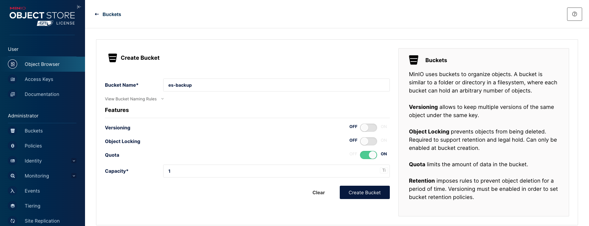
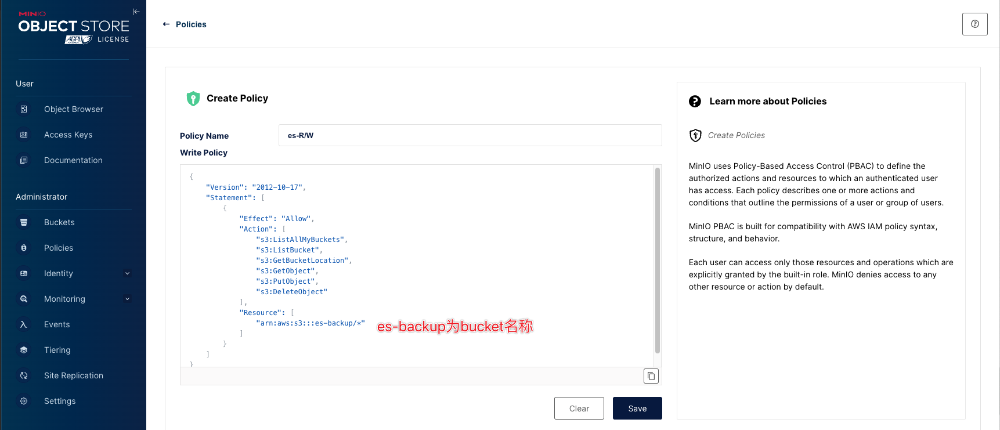
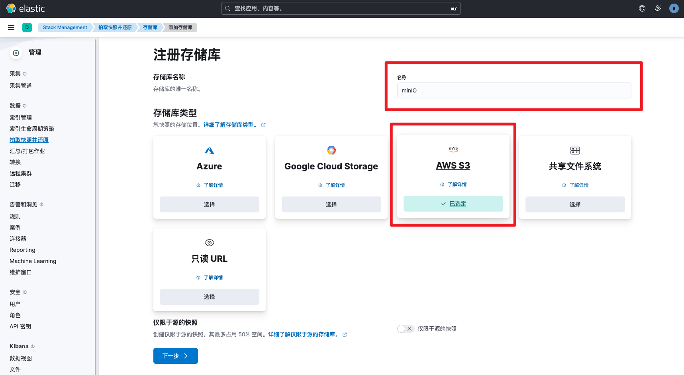
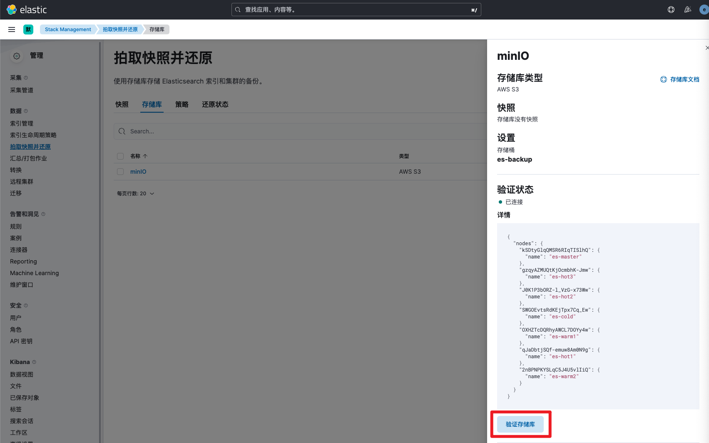
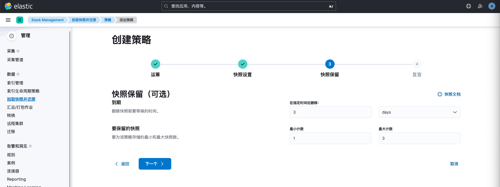
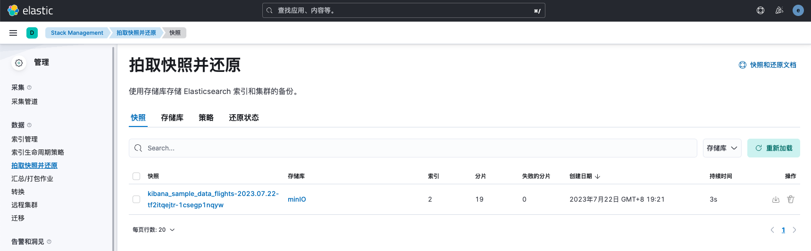
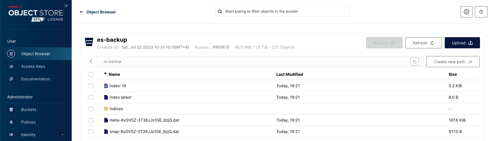
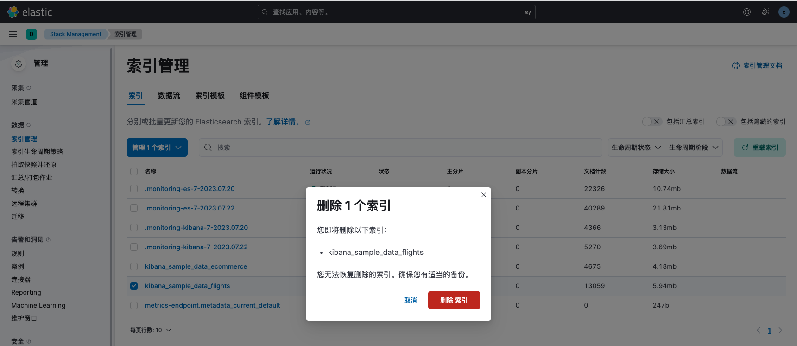
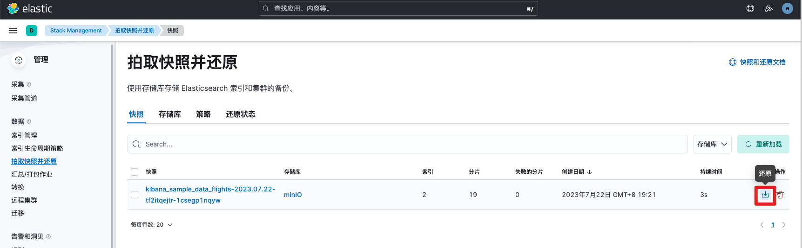

# 集群备份与恢复(S3)

> 分类: ELK Stack > ES集群管理
> 更新时间: 2026-01-10T23:33:37.801363+08:00

---

ES支持快照功能，用于实现数据的备份与恢复。我们可以生成单个索引或整个集群的快照，并将其存储在共享文件系统上的存储库中，并且有一些插件支持 S3、HDFS、Azure、Google Cloud Storage 等上的远程存储库。

因为minio兼容S3，而es支持将快照存储在远程S3存储服务中，本实验以minio为例演示es的快照备份与恢复。

# 部署minio
## 部署说明
为了方便起见，本示例仅使用一台minio节点docker方式部署。在实际生产环境中，强烈建议使用二进制方式部署4台及以上节点的minio集群，提高容错率和服务可用性。

## docker部署
```bash
[root@es-master ~]# mkdir /data/minio
[root@es-master ~]# docker run -d -p 9000:9000  -p 9090:9090  --name minio  -v /data/minio:/data -e "MINIO_ROOT_USER=root" -e "MINIO_ROOT_PASSWORD=1234qwer" --restart always quay.io/minio/minio server /data --console-address ":9090"
```

## 访问测试
访问master节点ip:9090端口


# 创建bucket和Access Key
## 创建bucket
创建一个名为es-backup的bucket，并设置容量上限为1TB



## 创建Access Key
创建access key并牢记，后续使用。


1BdVZLrwFI8QiNeRKFWk

Y2xxioPqPHHHbZUMV0FCV8rRb06VOzkDGrdn3Hdd

## 创建访问控制权限
<font style="color:rgb(38, 38, 38);">Minio 的存储桶默认是不跟任何 Access Key 关联的，也就是说所有Access Key均可访问该bucket，这在实际生产环境中存在权限过大的问题。不过由于 Minio 支持标准的 S3 协议，我们可以给 Access Key 授予某个 Bucket 存储桶的访问权限，实现 Key 和 Bucket 的绑定。</font>

<font style="color:rgb(38, 38, 38);">创建policy</font>



```yaml
{
    "Version": "2012-10-17",
    "Statement": [
        {
            "Effect": "Allow",
            "Action": [
                "s3:ListAllMyBuckets",
                "s3:ListBucket",
                "s3:GetBucketLocation",
                "s3:GetObject",
                "s3:PutObject",
                "s3:DeleteObject"
            ],
            "Resource": [
                "arn:aws:s3:::es-backup/*"
            ]
        }
    ]
}
```

创建user

<font style="color:rgb(38, 38, 38);">这里 Access Key 是用户名，Access Secret 是对应的口令。设置时关联上刚才创建的 Policy 即可。</font>


<font style="color:rgb(38, 38, 38);">我们就创建了一个新的存储桶，并且给这个存储桶设置了一个用户，同时授权了用户对存储桶的访问，包括列表、上传、下载这几个基本权限。</font>

# 配置es以支持minio备份
> 以下操作在每个ES节点都要执行
>

## 安装S3插件
```bash
[root@es-master ~]# /usr/share/elasticsearch/bin/elasticsearch-plugin install repository-s3 
-> Installing repository-s3
[repository-s3] is no longer a plugin but instead a module packaged with this distribution of Elasticsearch
-> Please restart Elasticsearch to activate any plugins installed
```

## 添加S3地址
```bash
[root@es-master ~]# vim /etc/elasticsearch/elasticsearch.yml
s3.client.default.endpoint: 192.168.10.132:9000 # minio服务地址+端口
s3.client.default.protocol: http # 非https时需要指定
```

## 添加Access key至密钥库
```bash
[root@es-master ~]# /usr/share/elasticsearch/bin/elasticsearch-keystore add s3.client.default.access_key
Enter value for s3.client.default.access_key: 
[root@es-master ~]# /usr/share/elasticsearch/bin/elasticsearch-keystore add s3.client.default.secret_key
Enter value for s3.client.default.secret_key: 
```

## 重启es服务
```bash
[root@es-master ~]# systemctl restart elasticsearch
```

# 备份恢复验证
## 创建快照仓库
登录kibana——>点击菜单按钮——>Stack Management——>拍摄快照并还原——>存储库——>注册存储库，然后设置名称并选择类型为AWS S3



填写存储桶名称为es-backup，其他保持默认即可


注册完成后点击验证存储库，显示已连接



## 创建数据策略
接下来，我们以导入的**<font style="color:rgb(0, 107, 184);background-color:rgb(250, 251, 253);">kibana_sample_data_flights</font>**索引为例，演示数据的备份与恢复。


创建备份策略，名称自定义，快照表达式填写<kibana_sample_data_flights-{now/d}>

选择索引为kibana_sample_data_flights


设置快照保留策略



备份策略创建后，界面如下所示


## 数据备份
创建完策略后，es会在每天8点自动将数据上传至minIO备份，我们也可以点击立即执行，手动触发一次备份任务操作。


点击立即执行后，查看快照信息，显示已备份完成。



查看minIO的bucket信息，发现已成功上传数据



## 数据恢复
接下来删除index，模拟误操作情况发生。



在快照菜单点击恢复按钮，执行恢复操作



使用默认选项还原即可


查看还原状态显示已完成


接下来打开索引管理，发现index已正常还原，且文档数、分片数、存储大小等信息与先前保持一致。


## 快照删除注意事项
如果需要删除快照，一定要使用kibana或者用 API 删除快照，而不能用其他机制（比如手动删除，或者用 S3 上的自动清除工具）。因为快照是增量的，有可能很多快照依赖于过去的数据文件。delete API 知道哪些数据还在被近期快照使用，只删除不再被使用的那部分数据。

# 参考文档
minIO 生产模式部署：[https://www.minio.org.cn/docs/minio/linux/operations/install-deploy-manage/deploy-minio-multi-node-multi-drive.html#deploy-minio-distributed](https://www.minio.org.cn/docs/minio/linux/operations/install-deploy-manage/deploy-minio-multi-node-multi-drive.html#deploy-minio-distributed)

minIO docker方式部署：[https://www.minio.org.cn/docs/minio/container/index.html](https://www.minio.org.cn/docs/minio/container/index.html)

备份策略创建：[https://www.elastic.co/guide/en/elasticsearch/reference/8.8/api-conventions.html#api-conventions](https://www.elastic.co/guide/en/elasticsearch/reference/8.8/api-conventions.html#api-conventions)

创建快照：[https://www.elastic.co/guide/en/elasticsearch/reference/8.8/snapshots-take-snapshot.html](https://www.elastic.co/guide/en/elasticsearch/reference/8.8/snapshots-take-snapshot.html)

恢复快照：[https://www.elastic.co/guide/en/elasticsearch/reference/8.8/snapshots-restore-snapshot.html](https://www.elastic.co/guide/en/elasticsearch/reference/8.8/snapshots-restore-snapshot.html)

注册s3存储地址：[https://www.elastic.co/guide/en/elasticsearch/reference/8.8/repository-s3.html](https://www.elastic.co/guide/en/elasticsearch/reference/8.8/repository-s3.html)

