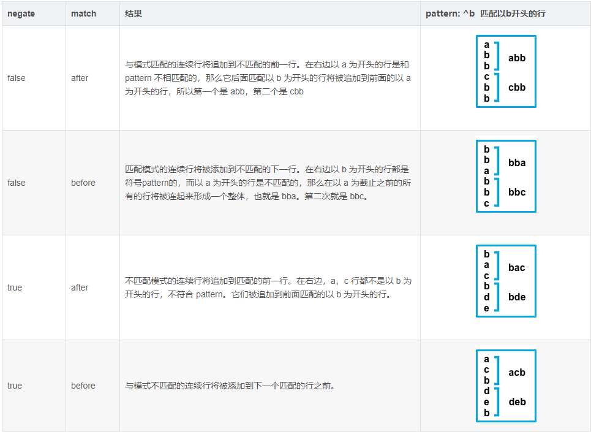

# 文件输入
# 读取文件
## 配置示例
配置读取文件项 text-log.yml

```yaml
filebeat.inputs:
- type: log
  enabled: true
  paths:
  - /tmp/*.log
output.console:
  pretty: true
  enable: true
```

2. 启动filebeat

`./filebeat -e -c fitcast-log.yml` 

3. 测试

```yaml
[root@es-cold ~]# echo hello >> /tmp/a.log
{
  "@timestamp": "2023-07-19T14:24:05.562Z",
  "@metadata": {
    "beat": "filebeat",
    "type": "_doc",
    "version": "8.8.2"
  },
  "agent": {
    "version": "8.8.2",
    "ephemeral_id": "d1c00d94-9b73-4ea6-93fc-738916229fdc",
    "id": "5d6d4273-b4f8-4cf4-ba39-abab53f6aea2",
    "name": "es-cold",
    "type": "filebeat"
  },
  "log": {
    "offset": 18,
    "file": {
      "path": "/tmp/a.log"
    }
  },
  "message": "hello",
  "input": {
    "type": "log"
  },
  "ecs": {
    "version": "8.0.0"
  },
  "host": {
    "name": "es-cold"
  }
}

[root@es-cold ~]# echo abc >> /tmp/a.log
{
  "@timestamp": "2023-07-19T14:24:30.574Z",
  "@metadata": {
    "beat": "filebeat",
    "type": "_doc",
    "version": "8.8.2"
  },
  "message": "abc",
  "log": {
    "offset": 24,
    "file": {
      "path": "/tmp/a.log"
    }
  },
  "input": {
    "type": "log"
  },
  "host": {
    "name": "es-cold"
  },
  "agent": {
    "type": "filebeat",
    "version": "8.8.2",
    "ephemeral_id": "d1c00d94-9b73-4ea6-93fc-738916229fdc",
    "id": "5d6d4273-b4f8-4cf4-ba39-abab53f6aea2",
    "name": "es-cold"
  },
  "ecs": {
    "version": "8.0.0"
  }
}
```

# 读取多行文件，避免换行
以elasticsearch日志为例，通常异常日志如下，如果不配置多行采集，就会生成四条日志数据记录。

```java
Exception in thread "main" java.lang.NullPointerException
    at com.example.myproject.Book.getTitle(Book.java:16)
    at com.example.myproject.Author.getBookTitles(Author.java:25)
    at com.example.myproject.Bootstrap.main(Bootstrap.java:14)
```

遇到这种情况，filebeat配置如下：

```java
- type: log
    enabled: true
    paths:
    - /root/*.log
    multiline # 避免日志换行采集
      pattern: '^[[:space:]]'
      negate: false
      match: after
output.console:
    pretty: true
    enable: true
```

#### <font style="color:rgb(24, 24, 24);">multiline.pattern</font>
<font style="color:rgb(36, 41, 46);">指定要匹配的正则表达式模式。 请注意，Filebeat 支持的正则表达式模式与 Logstash 支持的模式有些不同。 有关受支持的正则表达式模式的列表，请参见</font>[正则表达式支持](https://www.elastic.co/guide/en/beats/filebeat/current/regexp-support.html)<font style="color:rgb(36, 41, 46);">。 根据你配置其他多行选项的方式，与指定正则表达式匹配的行将被视为上一行的延续或新多行事件的开始。 你可以设置 negate 选项以否定模式。</font>

#### <font style="color:rgb(24, 24, 24);">multiline.negate</font>
<font style="color:rgb(36, 41, 46);">定义是否为否定模式，也就是和上面定义的模式相反。 默认为 false。</font>

#### <font style="color:rgb(24, 24, 24);">multiline.match</font>
<font style="color:rgb(36, 41, 46);">指定 Filebeat 如何将匹配的行组合到事件中。 设置在之后 （after） 或之前 （before）。 这些设置的行为取决于你为否定指定的内容：</font>



