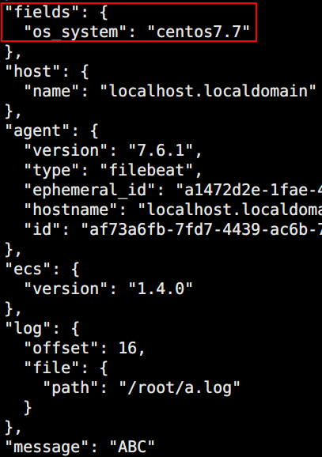

# 自定义内容

> 分类: ELK Stack > Filebeat
> 更新时间: 2026-01-10T23:33:40.906290+08:00

---

# 一、添加自定义tag
1. 配置读取文件项text.yml

```yaml
filebeat.inputs:
- type: log 
  enabled: true
  paths:
    - /root/*.log
  #添加自定义tag，便于后续的处理
  tags: ["web", "test"]
output.console:
  pretty: true
  enable: true
```

2. 启动filebeat

`filebeat -e -c text.yml `

3. 测试

`echo abc >> /root/a.log`


# 二、添加自定义字段
1. 配置读取文件项text.yml

```yaml
filebeat.inputs:
- type: log 
  enabled: true
  paths:
    - /root/*.log
  fields:
    os_system: centos7.7
output.console:
  pretty: true
  enable: true
```

2. 启动filebeat

`filebeat -e -c text.yml `

3. 测试

`echo ABC >> /root/a.log` 



# 三、自定义字段添加到根节点
1. 配置读取文件项text.yml

```yaml
filebeat.inputs:
- type: log 
  enabled: true
  paths:
    - /root/*.log
  fields:
    os_system: centos7.7
  fields_under_root: true
output.console:
  pretty: true
  enable: true
```

2. 启动filebeat

`filebeat -e -c text.yml `

3. 测试

`echo @#$ >> /root/a.log` 


