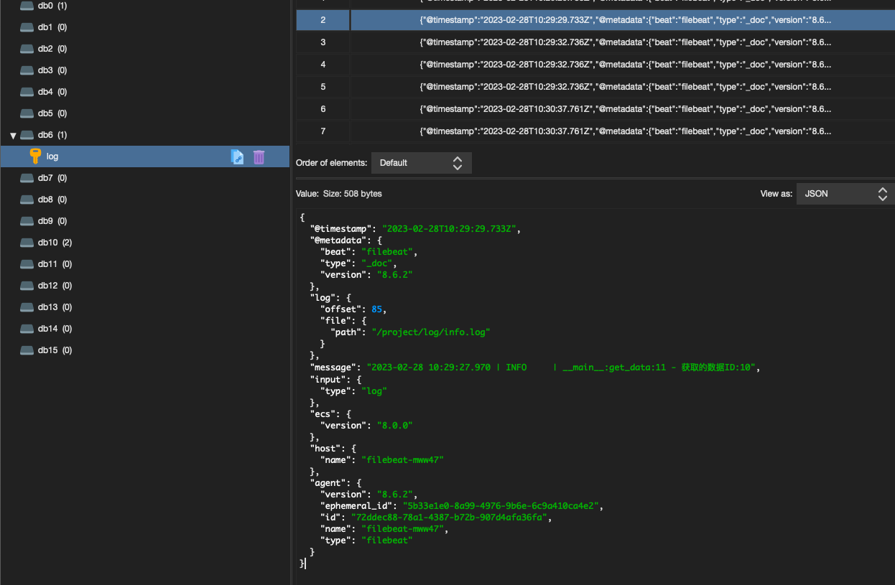

# 输出到Redis

> 分类: ELK Stack > Filebeat
> 更新时间: 2026-01-10T23:33:41.352405+08:00

---

新建Filebeat配置文件

```yaml
filebeat.inputs:
- type: log
    enabled: true
    paths:
    - /project/log/*.log
output.redis:
  hosts: ["XXX.XX.XX.XXX:6379"]
  key: log
  password: XXXXX
  db: 6
```

启动Filebeat

```yaml
filebeat -e -c filebeat.yml
```

redis查看数据



