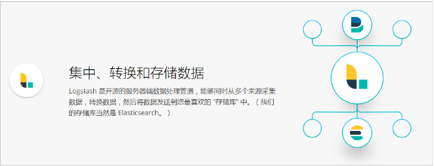
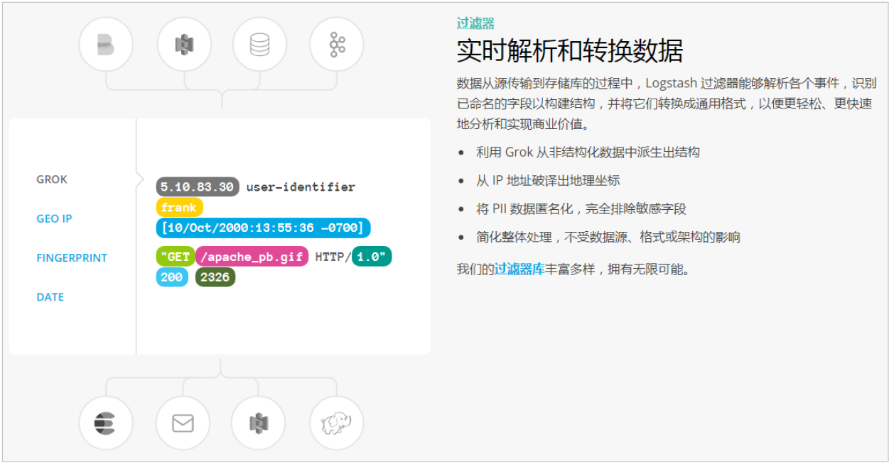

# 简介

> 分类: ELK Stack > Logstash
> 更新时间: 2026-01-10T23:33:41.883721+08:00

---

## 概述

## 输入
1. 采集各种样式、大小和来源的数据，数据往往以各种各样的形式，或分散或集中地存在于很多系统中。
2. Logstash 支持各种输入选择      ，可以在同一时间从众多常用来源捕捉事件。能够以连续的流式传输方式，轻松地从您的日志、指标、Web 应用、数据存储以及各种 AWS 服务采集数据。

## 过滤
1. 实时解析和转换数据
2. 数据从源传输到存储库的过程中，Logstash      过滤器能够解析各个事件，识别已命名的字段以构建结构，并将它们转换成通用格式，以便更轻松、更快速地分析和实现商业价值。

## 输出
Logstash 提供众多输出选择，您可以将数据发送到您要指定的地方，并且能够灵活地解锁众多下游用例。

