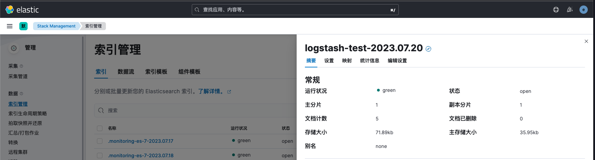

# 输出插件-Elasticsearch
# 配置filebeat.yml
```yaml
filebeat.inputs:
- type: log
  paths:
    - /usr/local/tomcat/logs/catalina.*
output.logstash:
  hosts: ["192.168.10.21:5044"]
```

# <font style="color:#262626;background-color:transparent;">配置logstash(索引)</font>
由于es8默认开启xpack安全配置，Logstash连接es需要ca证书和账号密码认证。如果使用rpm方式安装，ca证书路径为：/etc/elasticsearch/certs/http_ca.crt

```yaml
input {
    stdin {
        type => "system"
    }
}
output {
    elasticsearch {
        hosts => [ "https://192.168.10.100:9200"]
        index => "logstash-test-%{+YYYY.MM.dd}"
        timeout => 120
        pool_max => 800
        validate_after_inactivity => 7000
        user => elastic
        password => "XXXXXXXX"
        ssl_enabled => true		# 如果是https协议，需要设置为true
        ssl_verification_mode => false # 是否跳过证书验证，如果为false需要指定证书路径
        ssl_certificate_authorities => "/usr/share/logstash/config/ca.crt"
    }  
}
```

# <font style="color:#262626;background-color:transparent;">配置logstash(数据流)</font>
```yaml
input {
    stdin {
        type => "system"
    }
}
output {
    elasticsearch {
        hosts => ["https://es-master:9200"]
        data_stream => "true"
        data_stream_type => "logs"
        data_stream_dataset => "myapp"
        data_stream_namespace => "default"
        user => "elastic"
        password => "K907P17yAs46pgZI3uFiJa30"
        ssl_enabled => "true"
        ssl_verification_mode => "none"
    }  
}
```

# <font style="color:#262626;background-color:transparent;">kibana查看index</font>


# API KEY方式验证
1. 创建api key

```json
# 请求
POST /_security/api_key
{
  "name": "logstash"
}
# 响应
{
  "id": "xWgSOooBtFUihNJltt2T",
  "name": "filebeat",
  "api_key": "TGw4sf5IRXaTUXG6TF0HBQ",
  "encoded": "eFdnU09vb0J0RlVpaE5KbHR0MlQ6VEd3NHNmNUlSWGFUVVhHNlRGMEhCUQ=="
}
```

2. 修改filebeat配置

```bash
input {
    stdin {
        type => "system"
    }
}
output {
    elasticsearch {
        hosts => [ "https://192.168.10.100:9200"]
        index => "logstash-test-%{+YYYY.MM.dd}"
        ssl_enabled => true		# 如果是https协议，需要设置为true
        ssl_verification_mode => false # 是否跳过证书验证，如果为false需要指定证书路径
        ssl_certificate_authorities => "/usr/share/logstash/config/ca.crt"
        api_key => "xWgSOooBtFUihNJltt2T:TGw4sf5IRXaTUXG6TF0HBQ" 
    }  
}
```

