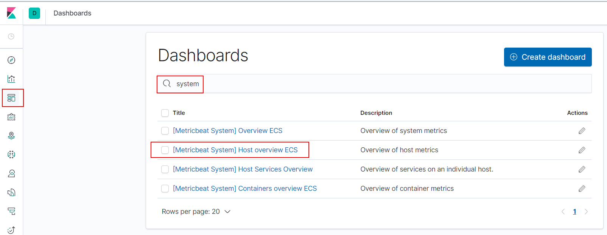
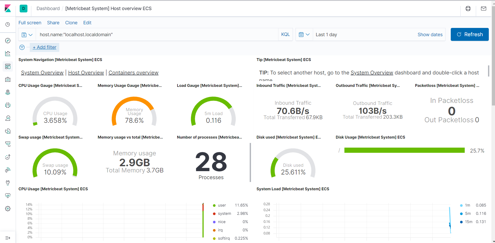

# Metricbeat 仪表盘

> 分类: ELK Stack > Metricbeat
> 更新时间: 2026-01-10T23:33:41.775763+08:00

---

1. 修改metricbeat配置

```yaml
setup.kibana:
	host:  "192.168.10.50:5601"
```

2. 停止metricbeat服务

systemctl stop metricbeat

3. 安装仪表盘到Kibana

metricbeat setup --dashboards


4. 配置kibana仪表盘



4. 查看仪表盘信息

     

