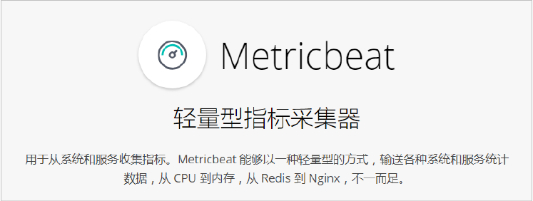
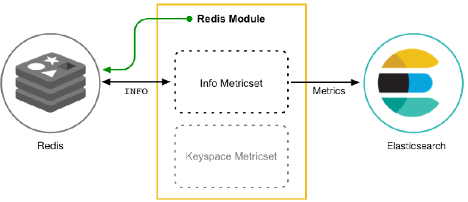

# 简介
# 一、功能

+ 定期收集操作系统或应用服务的指标数据
+ 存储到Elasticsearch中，进行实时分析

# 二、组成
1. Metricbeat有2部分组成，一部分是Module，另一部分为Metricset。
+ Module

收集的对象，如：mysql、redis、nginx、操作系统等；

+ Metricset

收集指标的集合，如：cpu、memory、network等；

以Redis Module为例：

 

