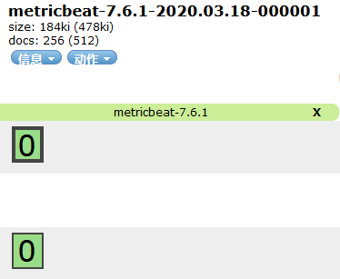
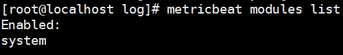

# 部署收集系统指标

> 分类: ELK Stack > Metricbeat
> 更新时间: 2026-01-10T23:33:41.674517+08:00

---

# 一、安装部署metricbeat
1. 安装软件包

# rpm -ivh metricbeat-7.6.1-linux-x86_64.tar.gz

2. 编辑配置文件

vim metricbeat.yml

        

    

3. 启动服务

systemctl start metricbeat

4. 查看数据

    

# 二、system module
1. system module默认启用状态

    

 

