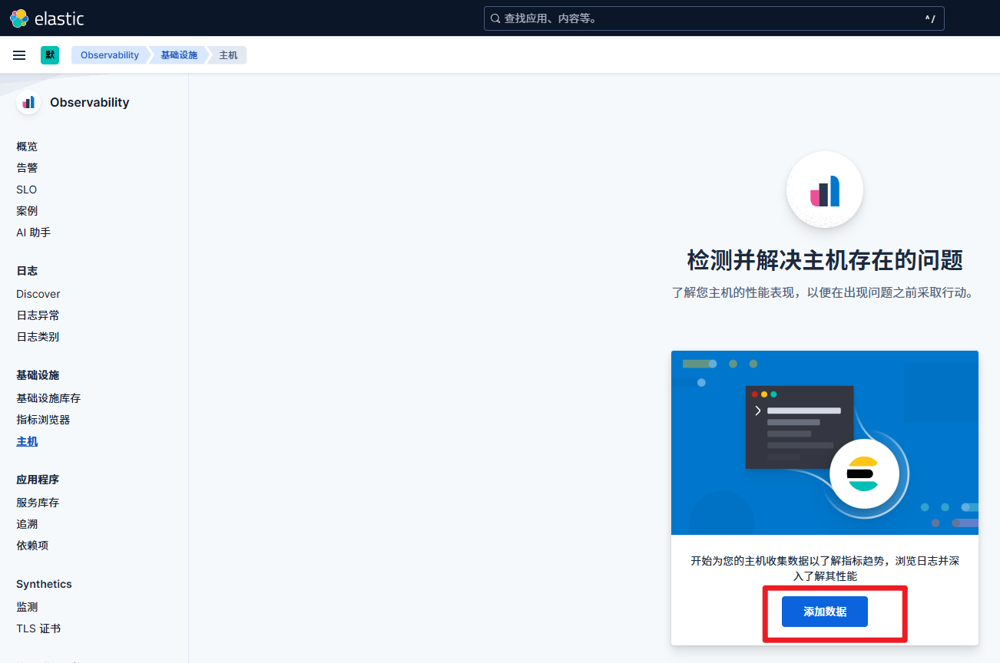
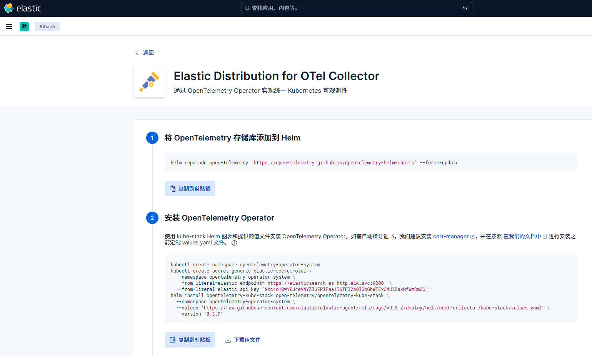
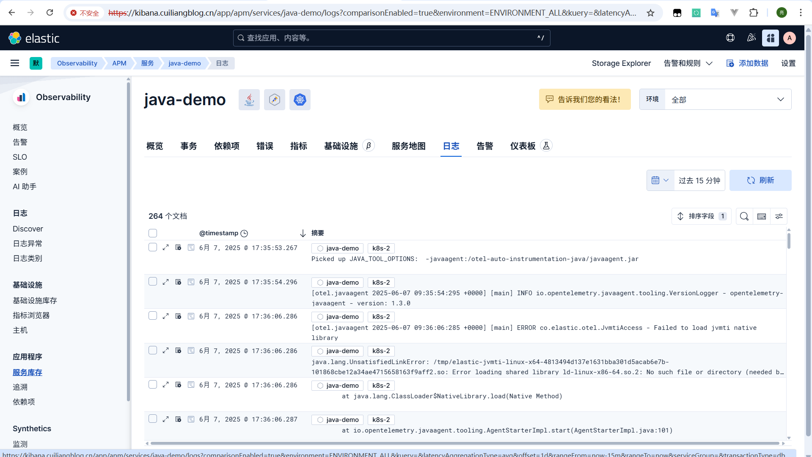

# Elastic EDOT全家桶方案

> 分类: Kubernetes > OpenTelemetry可观测性
> 更新时间: 2026-01-10T23:33:31.000418+08:00

---

# EDOT 介绍
## 什么是 EDOT
<font style="color:rgb(52, 55, 65);">Elastic Distributions of OpenTelemetry （EDOT） 是一个专为 Elastic 量身定制的 </font>[<font style="color:rgb(11, 100, 221);">OpenTelemetry 发行版</font>](https://opentelemetry.io/docs/concepts/distributions/)<font style="color:rgb(52, 55, 65);">开源生态系统。它们包括一个自定义的 OpenTelemetry Collector 和多个 OpenTelemetry 语言 SDK</font>。具体可参考文档：[https://www.elastic.co/docs/reference/opentelemetry](https://www.elastic.co/docs/reference/opentelemetry)

## 对比 OpenTelemetry Collector  
**EDOT = Elastic 自研增强的 OpenTelemetry Collector**它是一个 OTel Collector 的定制构建，添加了如下增强功能：

| 能力 | 描述 |
| --- | --- |
| **内置 ECS 格式转换** | 使用elasticinframetricsprocessor将指标统一转换为 [Elastic Common Schema (ECS)] 格式 |
| **支持采集 K8s/容器/主机/进程指标** | 集成了hostmetrics, kubeletstats, cadvisor, kubernetes_cluster等 receiver |
| **内置 Elasticsearch Exporter** | 通过elasticsearch exporter 直接将数据发送至 Elasticsearch，无需额外 exporter 或中间件 |
| **自动注入 k8s metadata** | 使用 k8sattributes processor 自动添加 Pod、Namespace、Node 标签等上下文信息 |
| **兼容 OpenTelemetry 协议标准** | 与 OTLP 协议、OpenTelemetry SDK、仪表库无缝对接 |


## EDOT On K8S 架构


在 Kubernetes 环境中，EDOT 的部署架构主要包括以下组件：

+ **OpenTelemetry Collector（EDOT）**：以 DaemonSet 形式部署在每个节点上，负责采集主机和容器的指标数据。
+ **Receivers（接收器）**：如 `hostmetrics`、`kubeletstats` 等，用于从主机和 Kubernetes 组件中收集指标。
+ **Processors（处理器）**：如 `k8sattributes`、`elasticinframetricsprocessor`，用于增强和转换指标数据，使其符合 Elastic Common Schema（ECS）标准。
+ **Exporters（导出器）**：如 `elasticsearch` exporter，将处理后的指标数据发送到 Elasticsearch。

数据流动路径：

1. **数据采集**：EDOT 使用 `hostmetrics` receiver 收集主机级指标（CPU、内存、磁盘、网络等），使用 `kubeletstats` receiver 收集容器级指标。
2. **数据处理**：采集到的指标通过 `k8sattributes` processor 添加 Kubernetes 元数据（如 Pod 名称、命名空间、节点信息等），然后通过 `elasticinframetricsprocessor` 转换为 ECS 格式。
3. **数据导出**：处理后的指标数据通过 `elasticsearch` exporter 发送到 Elasticsearch，供 Kibana 等工具进行可视化和分析。

## Elastic付费功能介绍
Elastic Stack在可观测性方面，社区版**和**白金版之间存在明显的功能差异。以下是它们在 Observability 场景下的主要区别：  

| 功能 | 社区版 | 白金版（Platinum） |
| --- | --- | --- |
| **日志收集与搜索** | 支持 | 支持 |
| **APM（应用性能监控）** | 基本功能 | 全功能（含高级仪表盘、机器学习） |
| **Metrics（系统指标监控）** | 支持 | 支持 |
| **Uptime（服务可用性监控）** | 支持基本 Heartbeat | 支持全功能和 UI 扩展 |
| **安全特性（认证、权限控制）** | 基础认证 | 细粒度 RBAC |
| **机器学习（异常检测）** | 不支持 | 支持 |
| **Service Map（服务拓扑图）** | 不支持 | 支持 |
| **APM Trace Correlation（日志、指标、追踪关联）** | 不支持 | 支持 |
| **Anomaly Detection（异常检测与告警）** | 不支持 | 支持，但依赖 ML |
| **日志分类（Log categorization）** | 不支持 | 支持，但依赖 ML |
| **跨域可视化 Dashboard（比如 SLO）** | 限制多 | 支持跨日志/APM/metric |
| **告警与自动化响应** | 基础告警 | 告警 + Actions（如Webhook、Slack等） |


# EDOT 部署
## 部署 ES Kibana
具体可参考文档[https://www.cuiliangblog.cn/detail/section/15189467](https://www.cuiliangblog.cn/detail/section/15189467)

## 生成安装 EDOT 指令
在 observability 菜单——>主机——>添加数据



选择 OpenTelemetry 方式采集数据，系统会为我们自动创建 api key 并生成安装命令。



## 安装 EDOT
1. [<font style="color:rgb(0, 0, 0);">将 OpenTelemetry 存储库添加到 Helm</font>](https://www.elastic.co/docs/reference/opentelemetry/quickstart/self-managed/k8s#add-the-opentelemetry-repository-to-helm)<font style="color:rgb(0, 0, 0);">仓库</font>

```bash
helm repo add open-telemetry 'https://open-telemetry.github.io/opentelemetry-helm-charts' --force-update
```

2. 创建名称空间和凭据资源

```bash
kubectl create namespace opentelemetry-operator-system
kubectl create secret generic elastic-secret-otel \
--namespace opentelemetry-operator-system \
--from-literal=elastic_endpoint='https://elasticsearch-es-http.elk.svc:9200' \
--from-literal=elastic_api_key='NXc4d1BwY0J4eVNYZlJZRlFaa1I6TEl2b0lSbGhWTExCMUY2akNfWmRmQQ=='
```

3. [<font style="color:rgb(0, 0, 0);">安装 Operator</font>](https://www.elastic.co/docs/reference/opentelemetry/quickstart/self-managed/k8s#install-the-operator)

<font style="color:rgb(52, 55, 65);">使用带有预配置文件的 Helm 图表安装 OpenTelemetry Operator。</font>

```bash
# 下载配置文件
wget https://raw.githubusercontent.com/elastic/elastic-agent/refs/tags/v9.0.2/deploy/helm/edot-collector/kube-stack/values.yaml

# 自定义values.yaml配置
exporters:
  elasticsearch/otel:
    # 跳过自签证书验证
    tls:
      insecure_skip_verify: true
      
# helm install opentelemetry-kube-stack open-telemetry/opentelemetry-kube-stack \
--namespace opentelemetry-operator-system \
--values './values.yaml' \
--version '0.3.9'
NAME: opentelemetry-kube-stack
LAST DEPLOYED: Thu Jun  5 11:31:25 2025
NAMESPACE: opentelemetry-operator-system
STATUS: deployed
REVISION: 1
```

查看验证

```bash
# kubectl get pod -n opentelemetry-operator-system
NAME                                                              READY   STATUS    RESTARTS   AGE
opentelemetry-kube-stack-cluster-stats-collector-7976dd946snjkv   1/1     Running   0          5m16s
opentelemetry-kube-stack-daemon-collector-47j6q                   1/1     Running   0          5m13s
opentelemetry-kube-stack-daemon-collector-hj46t                   1/1     Running   0          5m13s
opentelemetry-kube-stack-daemon-collector-xrlqf                   1/1     Running   0          5m14s
opentelemetry-kube-stack-gateway-collector-587fc7fdbc-ljl79       1/1     Running   0          5m11s
opentelemetry-kube-stack-gateway-collector-587fc7fdbc-qq67t       1/1     Running   0          5m11s
opentelemetry-kube-stack-opentelemetry-operator-677fd9878d4sdx6   2/2     Running   0          5m23s
# kubectl get svc -n opentelemetry-operator-system 
NAME                                                          TYPE        CLUSTER-IP       EXTERNAL-IP   PORT(S)             AGE
opentelemetry-kube-stack-cluster-stats-collector-monitoring   ClusterIP   10.105.174.188   <none>        8888/TCP            5m36s
opentelemetry-kube-stack-daemon-collector                     ClusterIP   10.104.104.159   <none>        4317/TCP,4318/TCP   5m34s
opentelemetry-kube-stack-daemon-collector-headless            ClusterIP   None             <none>        4317/TCP,4318/TCP   5m34s
opentelemetry-kube-stack-daemon-collector-monitoring          ClusterIP   10.109.130.8     <none>        8888/TCP            5m34s
opentelemetry-kube-stack-gateway-collector                    ClusterIP   10.111.54.4      <none>        4317/TCP,4318/TCP   5m31s
opentelemetry-kube-stack-gateway-collector-headless           ClusterIP   None             <none>        4317/TCP,4318/TCP   5m31s
opentelemetry-kube-stack-gateway-collector-monitoring         ClusterIP   10.103.49.148    <none>        8888/TCP            5m31s
opentelemetry-kube-stack-opentelemetry-operator               ClusterIP   10.98.164.147    <none>        8443/TCP,8080/TCP   5m43s
opentelemetry-kube-stack-opentelemetry-operator-webhook       ClusterIP   10.111.250.255   <none>        443/TCP             5m43s
```

Kubernetes 设置依赖于 OpenTelemetry Operator，它配置为自动编排 EDOT，如下所示：

+ EDOT Collector Cluster：集群指标的集合。
+ EDOT Collector Daemon：节点指标、日志和应用程序遥测的集合。
+ EDOT Collector Gateway：将数据预处理、聚合和采集到 Elastic 中。
+ EDOT SDK：带注释的应用程序使用 EDOT SDK 自动检测。

## 配置自动埋点
指定应用配置自动埋点

```yaml
apiVersion: apps/v1
kind: Deployment
metadata:
  name: myapp
spec:
  ...
  template:
    metadata:
      annotations:
        instrumentation.opentelemetry.io/inject-java: "opentelemetry-operator-system/elastic-instrumentation"
      ...
    spec:
      containers:
      - image: myapplication-image
        name: app
```

名称空间所以资源配置自动埋点

```bash
# kubectl annotate namespace default instrumentation.opentelemetry.io/inject-java="opentelemetry-operator-system/elastic-instrumentation"
namespace/default annotated
```

<font style="color:rgb(52, 55, 65);">配置完成后重新启动应用，以确保应用注释和自动检测。</font>

<font style="color:rgb(52, 55, 65);">对于 EDOT 支持自动埋点采集语言信息，可参阅</font>[<font style="color:rgb(11, 100, 221);">相应 SDK 中的 设置 部分</font>](https://www.elastic.co/docs/reference/opentelemetry/edot-sdks/)<font style="color:rgb(52, 55, 65);">。</font>

## <font style="color:rgb(52, 55, 65);">查看数据</font>
查看 k8s 集群与节点信息


查看应用 trace 信息


查看 trace 详情


查看 Metrics 信息


查看日志信息



# 总结
Elastic Distributions of OpenTelemetry 是 Elastic 官方基于 OpenTelemetry 的集成方案，允许用户使用标准化的 OpenTelemetry 协议采集应用性能数据（Trace、Metrics、Logs），并将数据发送到 Elastic Stack 中进行统一的可观测性分析。

## 优点
1. 配置简单
+ 支持直接使用 OpenTelemetry Collector，将数据发送至 Elastic APM Server 或 Elastic Agent。
+ 提供官方采集模板和配置向导，无需复杂集成代码，快速上手。
2. 开源标准兼容
+ 完整兼容 OpenTelemetry 协议（OTLP），可接入主流语言的 OTel SDK 和 Collector。
+ 易于与现有 OpenTelemetry 体系无缝对接。
3. 统一可观测平台
+ 日志、指标、Trace 数据在 Kibana 中统一分析，支持链路追踪、根因分析和性能优化。
+ 数据可通过统一仪表盘展示，支持多维筛选与告警。
4. 支持云原生与分布式系统
+ 原生支持 Kubernetes、微服务、Serverless 等场景。
+ 结合 Elastic Agent 与 Fleet，可实现一站式数据采集和集中管理。

## 缺点
1. 部分高级功能需白金版授权
+ **机器学习**：自动异常检测与根因分析；
+ **APM 服务地图**：可视化展示服务依赖关系；
+ **跨服务 Trace 关联分析**：需白金或企业版许可；
+ **安全访问控制（RBAC）增强**：更细粒度的权限配置需高级授权。
2. Kibana 功能欠缺
+ 虽然采集配置简化，但仪表盘自定义与告警规则设计仍需一定学习成本。
+ 对比 grafana 支持多数据源以及灵活图表配置项，Kibana 在这方面仍有不足。


