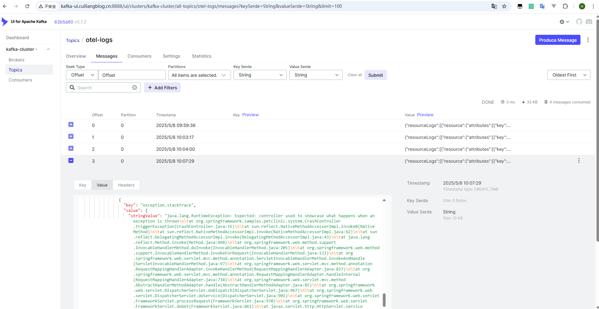
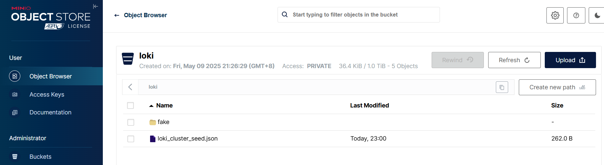

# 日志数据收集与导出
# 日志数据收集方案
目前日志自动埋点支持主要有：

+ .NET、Java、Python SDK 开始支持正式的日志记录，控制台打印的日志均可自动采集。
+ JavaScript / go 等暂时需用 `span.addEvent()` 或通过标准输出间接采集。

日志的采集方式一般是：

+ ✅ 使用 OTel SDK + `Logging` API（手动埋点日志）
+ ✅ 使用日志框架（如 logback）将日志转为 OTLP logs
+ ✅ 使用 Fluent Bit / Filebeat 收集 stdout → 发送到 OTLP Receiver

# 日志导出(kafka)
## 部署 kafka
部署 kafka 具体可参考文档：[https://www.cuiliangblog.cn/detail/section/190398674](https://www.cuiliangblog.cn/detail/section/190398674)

## 配置 Collector
配置 collector 导出 日志数据到 kafka 中。

```yaml
apiVersion: opentelemetry.io/v1beta1
kind: OpenTelemetryCollector
# 元数据定义部分
metadata:
  name: center        # Collector 的名称为 center
  namespace: opentelemetry
# 具体的配置内容
spec:
  replicas: 1           # 设置副本数量为1
  config:               # 定义 Collector 配置
    receivers:          # 接收器，用于接收遥测数据（如 trace、metrics、logs）
      otlp:             # 配置 OTLP（OpenTelemetry Protocol）接收器
        protocols:      # 启用哪些协议来接收数据
          grpc: 
            endpoint: 0.0.0.0:4317      # 启用 gRPC 协议
          http: 
            endpoint: 0.0.0.0:4318      # 启用 HTTP 协议

    processors:         # 处理器，用于处理收集到的数据
      batch: {}         # 批处理器，用于将数据分批发送，提高效率

    exporters:          # 导出器，用于将处理后的数据发送到后端系统
      debug: {}         # 使用 debug 导出器，将数据打印到终端（通常用于测试或调试）
      otlp:               # 数据发送到tempo的grpc端口
        endpoint: "jaeger:4317"
        tls: # 跳过证书验证
          insecure: true
      prometheus:
        endpoint: "0.0.0.0:9464" # prometheus指标暴露端口
      kafka:
        protocol_version: 2.0.0
        brokers:
          - my-cluster-kafka-brokers.kafka.svc:9092  # Kafka 的地址
        topic: otel-logs
        encoding: otlp_json  # 日志通常用 json 格式

    service:            # 服务配置部分
      telemetry:
        logs:
          level: "debug"              # 设置 Collector 自身日志等级为 debug（方便观察日志）
      pipelines:        # 定义处理管道
        traces:         # 定义 trace 类型的管道
          receivers: [otlp]                      # 接收器为 OTLP
          processors: [batch]                    # 使用批处理器
          exporters: [otlp]                      # 将数据导出到OTLP
        metrics:        # 定义 metrics 类型的管道
          receivers: [otlp]                      # 接收器为 OTLP
          processors: [batch]                    # 使用批处理器
          exporters: [prometheus]                # 将数据导出到prometheus
        logs:
          receivers: [otlp]                      # 接收器为 OTLP
          processors: [batch]                    # 使用批处理器
          exporters: [kafka,debug]               # 将数据导出到kafka
```

## 查看日志数据
登录 kafka-ui，查看 otel-logs 主题下的日志数据，内容如下：



# 日志导出(elasticsearch)
## 部署 elasticsearch
具体可参考文档：[https://www.cuiliangblog.cn/detail/section/15189467](https://www.cuiliangblog.cn/detail/section/15189467)

创建数据流模板


## 配置 Collector
参考文档：[https://github.com/open-telemetry/opentelemetry-collector-contrib/tree/main/exporter/elasticsearchexporter](https://github.com/open-telemetry/opentelemetry-collector-contrib/tree/main/exporter/elasticsearchexporter)

```yaml
apiVersion: opentelemetry.io/v1beta1
kind: OpenTelemetryCollector
# 元数据定义部分
metadata:
  name: center        # Collector 的名称为 center
  namespace: opentelemetry
# 具体的配置内容
spec:
  replicas: 1           # 设置副本数量为1
  # image: otel/opentelemetry-collector-contrib:latest  # 使用支持 elasticsearch 的镜像
  image: harbor.cuiliangblog.cn/otel/opentelemetry-collector-contrib:latest
  config:               # 定义 Collector 配置
    receivers:          # 接收器，用于接收遥测数据（如 trace、metrics、logs）
      otlp:             # 配置 OTLP（OpenTelemetry Protocol）接收器
        protocols:      # 启用哪些协议来接收数据
          grpc: {}      # 启用 gRPC 协议
          http: {}      # 启用 HTTP 协议

    processors:         # 处理器，用于处理收集到的数据
      batch: {}         # 批处理器，用于将数据分批发送，提高效率

    exporters:          # 导出器，用于将处理后的数据发送到后端系统
      debug: {}         # 使用 debug 导出器，将数据打印到终端（通常用于测试或调试）
      otlp:               # 数据发送到tempo的grpc端口
        endpoint: "jaeger:4317"
        tls: # 跳过证书验证
          insecure: true
      prometheus:
        endpoint: "0.0.0.0:9464" # prometheus指标暴露端口
      elasticsearch:
        endpoints: ["https://elasticsearch-es-http.elk.svc:9200"]
        logs_index: "logs-otel"
        tls:
          insecure_skip_verify: true  # 如果使用自签名证书，临时关闭验证（建议生产环境配置CA）
        user: "admin"
        password: "123.com"

    service:            # 服务配置部分
      telemetry:
        logs:
          level: "debug"              # 设置 Collector 自身日志等级为 debug（方便观察日志）
      pipelines:        # 定义处理管道
        traces:         # 定义 trace 类型的管道
          receivers: [otlp]                      # 接收器为 OTLP
          processors: [batch]                    # 使用批处理器
          exporters: [otlp]                      # 将数据导出到OTLP
        metrics:        # 定义 metrics 类型的管道
          receivers: [otlp]                      # 接收器为 OTLP
          processors: [batch]                    # 使用批处理器
          exporters: [prometheus]          # 将数据导出到prometheus
        logs:
          receivers: [otlp]
          processors: [batch]                    # 使用批处理器
          exporters: [elasticsearch,debug]
```

## 查看日志数据


# 日志导出(loki)
## 部署 loki
具体可参考文档：[https://www.cuiliangblog.cn/detail/section/219069254](https://www.cuiliangblog.cn/detail/section/219069254)

## 配置 Collector
在 loki3.0 之前的版本，使用[lokiexporter](https://github.com/open-telemetry/opentelemetry-collector-contrib/tree/main/exporter/lokiexporter)导出，具体可参考文档：[https://github.com/open-telemetry/opentelemetry-collector-contrib/tree/main/exporter/lokiexporter](https://github.com/open-telemetry/opentelemetry-collector-contrib/tree/main/exporter/lokiexporter)

但是 3.0 后的版本已弃用 lokiExporter，需要使用 otlphttp 导出，具体可参考文档：[https://grafana.com/docs/loki/latest/send-data/otel/](https://grafana.com/docs/loki/latest/send-data/otel/)

```yaml
apiVersion: opentelemetry.io/v1beta1
kind: OpenTelemetryCollector
# 元数据定义部分
metadata:
  name: center        # Collector 的名称为 center
  namespace: opentelemetry
# 具体的配置内容
spec:
  replicas: 1           # 设置副本数量为1
  image: otel/opentelemetry-collector-contrib:latest  # 使用支持 elasticsearch 的镜像
  imagePullPolicy: IfNotPresent  # 镜像拉取策略为如果不存在则拉取
  # image: harbor.cuiliangblog.cn/otel/opentelemetry-collector-contrib:latest
  config:               # 定义 Collector 配置
    receivers:          # 接收器，用于接收遥测数据（如 trace、metrics、logs）
      otlp:             # 配置 OTLP（OpenTelemetry Protocol）接收器
        protocols:      # 启用哪些协议来接收数据
          grpc: 
            endpoint: 0.0.0.0:4317      # 启用 gRPC 协议
          http: 
            endpoint: 0.0.0.0:4318      # 启用 HTTP 协议
    processors:         # 处理器，用于处理收集到的数据
      batch: {}         # 批处理器，用于将数据分批发送，提高效率

    exporters:          # 导出器，用于将处理后的数据发送到后端系统
      debug: {}         # 使用 debug 导出器，将数据打印到终端（通常用于测试或调试）
      otlp:               # 数据发送到tempo的grpc端口
        endpoint: "tempo:4317"
        tls: # 跳过证书验证
          insecure: true
      prometheus:
        endpoint: "0.0.0.0:9464" # prometheus指标暴露端口
      otlphttp:
        endpoint: http://loki.loki.svc:3100/otlp

    service:            # 服务配置部分
      telemetry:
        logs:
          level: "debug"              # 设置 Collector 自身日志等级为 debug（方便观察日志）
      pipelines:        # 定义处理管道
        traces:         # 定义 trace 类型的管道
          receivers: [otlp]                      # 接收器为 OTLP
          processors: [batch]                    # 使用批处理器
          exporters: [otlp]                      # 将数据导出到OTLP
        metrics:        # 定义 metrics 类型的管道
          receivers: [otlp]                      # 接收器为 OTLP
          processors: [batch]                    # 使用批处理器
          exporters: [prometheus]          # 将数据导出到prometheus
        logs:
          receivers: [otlp]
          processors: [batch]                    # 使用批处理器
          exporters: [otlphttp, debug]

```

## 查看日志数据
登录 grafana 查看日志数据


minio 查看对象存储资源



