# nginx-Ingress案例

> 分类: Kubernetes > Service和Ingress
> 更新时间: 2026-01-10T23:33:22.374197+08:00

---

> 注意要点：
>
> + ingress中的serviceName要与service中的metadata-name保持一致
> + service中的selector-app要与deployment中的selector-app保持一致
> + deployment中的matchlables-app要与template中的matadata-lables-app保持一致
>

# 一、部署myapp1实例

1. 使用Deployment控制器部署myapp1相关的Pod对象

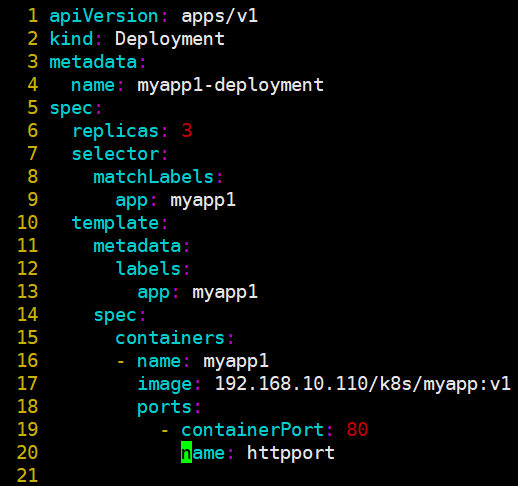

+ 查看deployment状态

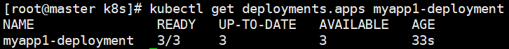

2. 使用ClusterIP控制器部署svc1相关的对象

+ 查看svc

# 二、部署myapp2实例

1. 使用Deployment控制器部署myapp2相关的Pod对象

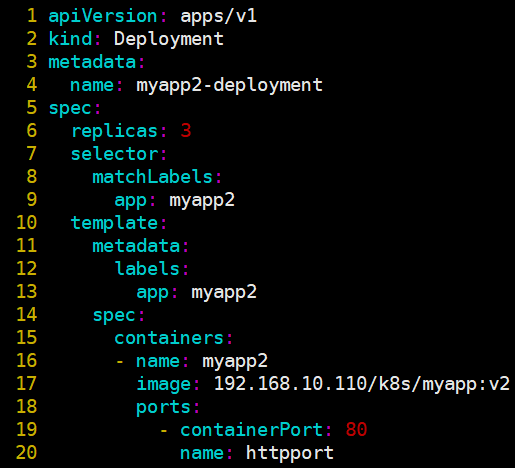

+ 查看deployment状态

2. 使用ClusterIP控制器部署svc2相关的对象

+ 查看svc

# 三、创建Ingress实例

1. 编写ingress使访问myapp1.cuiliang.com跳转至myapp1，访问myapp2.cuiliang.com跳转至myapp2

2. 查看svc服务信息

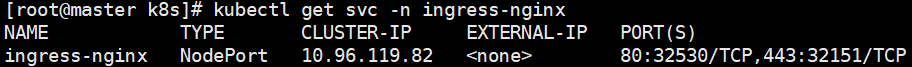

3. 查看ingress规则

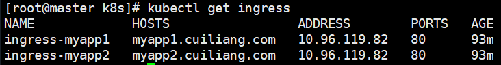

4. 查看ingress-nginx配置文件

5. 修改host文件

6. 访问测试

# 四、Ingress https代理

1. 创建证书，以及 cert 存储  
`# openssl req -x509 -sha256 -nodes -days 365 -newkey rsa:2048 -keyout tls.key -out tls.crt -subj "/CN=nginxsvc/O=nginxsvc"`   
`# kubectl create secret tls tls-secret --key tls.key --cert tls.crt` 
2. 使用Deployment控制器部署myapp3相关的Pod对象

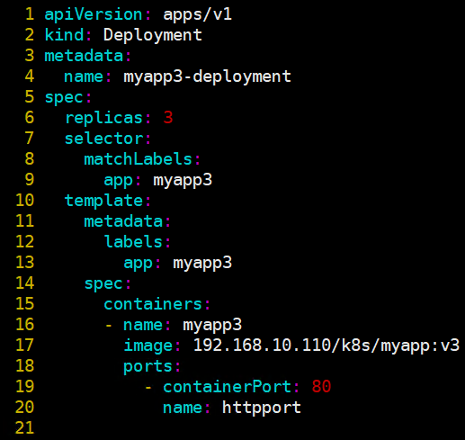

+ 查看deployment状态

3. 使用ClusterIP控制器部署svc3相关的对象

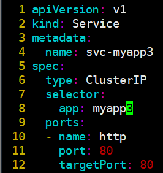

+ 查看svc

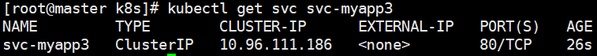

4. 创建Ingress实例  
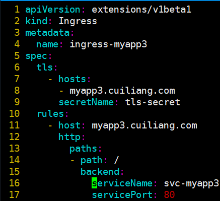

+ 查看svc-ingress信息

5. 修改host文件

6. 访问测试

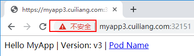

# 五、BasicAuth用户认证

1. 创建证书，以及 cert 存储  
`#yum -y install httpd`   
`#htpasswd -c auth foo`   
`#kubectl create secret generic basic-auth --from-file=auth` 
2. 使用Deployment控制器部署myapp4相关的Pod对象

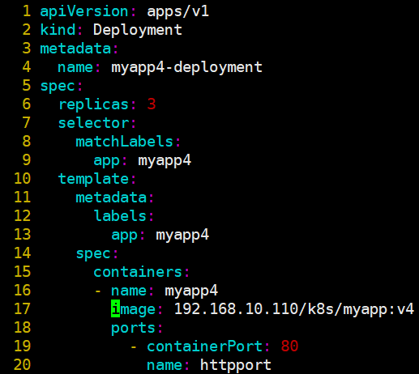

+ 查看deployment状态  
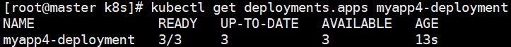
3. 使用ClusterIP控制器部署svc4相关的对象

+ 查看svc

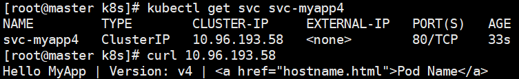

4. 创建Ingress实例

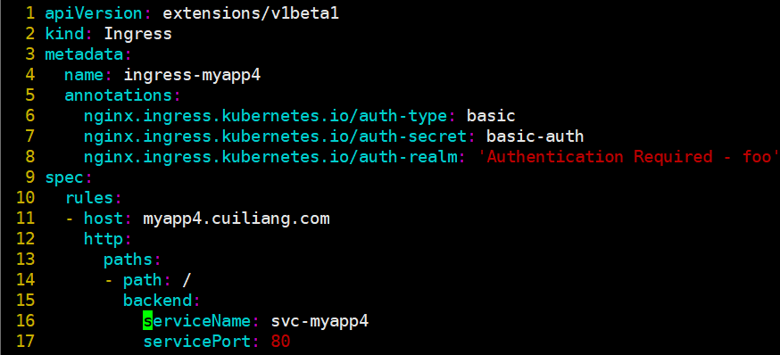

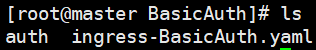

5. 查看svc-ingress信息

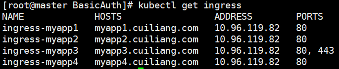

6. 修改host文件

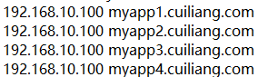

7. 访问测试

# 六、nginx重写

+ 当用户访问myapp5.cuiliang.com时跳转到myapp3.cuiliang.com

1. 创建Ingress实例

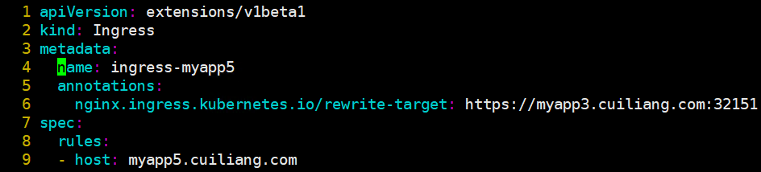

2. 查看svc-ingress信息

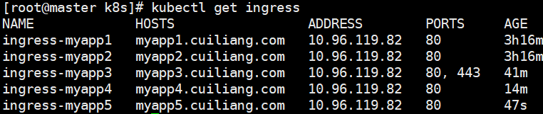

3. 修改host文件

4. 访问测试  
   

