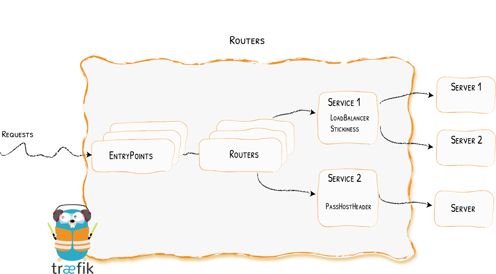
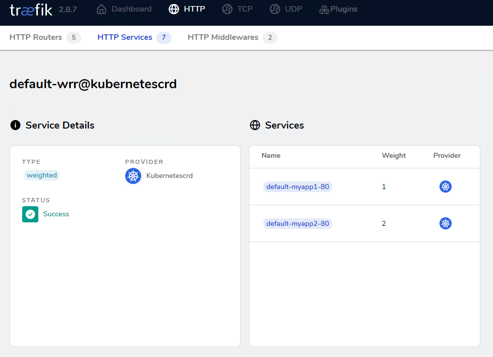
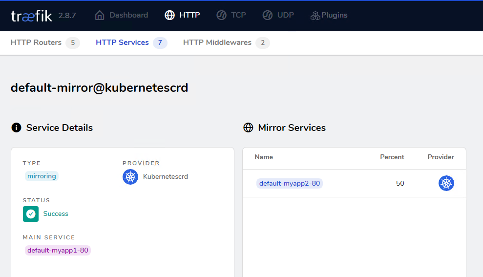

# 服务(TraefikService)
# 简介


traefik的路由规则就可以实现4层和7层的基本负载均衡操作，使用[IngressRoute](https://doc.traefik.io/traefik/routing/providers/kubernetes-crd/#kind-ingressroute)/[IngressRouteTCP](https://doc.traefik.io/traefik/routing/providers/kubernetes-crd/#kind-ingressroutetcp)/[IngressRouteUDP](https://doc.traefik.io/traefik/routing/providers/kubernetes-crd/#kind-ingressrouteudp)资源即可。但是如果想要实现加权轮询、流量复制等高级操作，traefik抽象出了一个[TraefikService](https://doc.traefik.io/traefik/routing/providers/kubernetes-crd/#kind-traefikservice)资源。此时整体流量走向为：外部流量先通过entryPoints<font style="color:rgb(53, 53, 53);">端口进入traefik，然后由</font>[IngressRoute](https://doc.traefik.io/traefik/routing/providers/kubernetes-crd/#kind-ingressroute)/[IngressRouteTCP](https://doc.traefik.io/traefik/routing/providers/kubernetes-crd/#kind-ingressroutetcp)/[IngressRouteUDP](https://doc.traefik.io/traefik/routing/providers/kubernetes-crd/#kind-ingressrouteudp)匹配后进入[TraefikService](https://doc.traefik.io/traefik/routing/providers/kubernetes-crd/#kind-traefikservice)，在[TraefikService](https://doc.traefik.io/traefik/routing/providers/kubernetes-crd/#kind-traefikservice)这一层实现加权轮循和流量复制，最后将请求转发至kubernetes的service。

除此之外traefik还支持7层的粘性会话、健康检查、传递请求头、响应转发、故障转移等操作。

# 使用案例
## 加权轮询(灰度发布)
灰度发布我们有时候也会称为金丝雀发布（Canary），主要就是让一部分测试的服务也参与到线上去，经过测试观察看是否符合上线要求，在traefik中，通过调整生产与测试服务的权重，实现灰度发布的功能。

接下来配置加权轮循，仍然请求myapp.test.com，myapp1的负载权重为1，myapp2的负载权重为2。

参考文档：[https://doc.traefik.io/traefik/routing/services/#weighted-round-robin-service](https://doc.traefik.io/traefik/routing/services/#weighted-round-robin-service)

依旧是上面创建的两个deployment应用与对应的svc

```bash
[root@k8s-master udp]# kubectl get pod
NAME                                          READY   STATUS    RESTARTS   AGE
myapp1-795d947b45-9lsm6                       1/1     Running   1          25h
myapp2-6ffd54f76-ljkr9                        1/1     Running   1          25h
[root@k8s-master udp]# kubectl get svc
NAME         TYPE        CLUSTER-IP      EXTERNAL-IP   PORT(S)                                                                                 2d22h
myapp1       ClusterIP   10.104.91.200   <none>        80/TCP                                                                                   25h
myapp2       ClusterIP   10.111.245.32   <none>        80/TCP    
```

创建IngressRouter资源，配置域名为myapp.test.com，注意此时后端service配置TraefikService。

```yaml
[root@k8s-master ingress]# cat myapp-ingress.yaml 
apiVersion: traefik.io/v1alpha1
kind: IngressRoute
metadata:
  name: myapp
  namespace: default
spec:
  entryPoints:
    - web
  routes:
  - match: Host(`myapp.test.com`)
    kind: Rule
    services:                     # 加权轮循时，后端service不再是k8s的service，而是traefik的TraefikService
    - name: wrr     
      namespace: default
      kind: TraefikService
[root@k8s-master ingress]# kubectl apply -f myapp-ingress.yaml 
ingressroute.traefik.containo.us/myapp created
```

创建TraefikService资源，名称与IngressRouter的TraefikService保持一致，services后端填写kubernetes的service，并指定权重。

```yaml
[root@k8s-master ingress]# cat myapp-traefikService.yaml 
apiVersion: traefik.io/v1alpha1
kind: TraefikService
metadata:
  name: wrr
  namespace: default
spec:
  weighted:
    services:
      - name: myapp1
        port: 80
        weight: 1
      - name: myapp2
        port: 80
        weight: 2
[root@k8s-master ingress]# kubectl apply -f myapp-traefikService.yaml 
traefikservice.traefik.containo.us/wrr unchanged
```

查看dashboard的配置信息，此时myapp2权重为2，myapp1权重为1。



客户端访问测试，验证无误。

```bash
[root@tiaoban ~]# curl myapp.test.com
Hello MyApp | Version: v1 | <a href="hostname.html">Pod Name</a>
[root@tiaoban ~]# curl myapp.test.com
Hello MyApp | Version: v2 | <a href="hostname.html">Pod Name</a>
[root@tiaoban ~]# curl myapp.test.com
Hello MyApp | Version: v2 | <a href="hostname.html">Pod Name</a>
[root@tiaoban ~]# curl myapp.test.com
Hello MyApp | Version: v1 | <a href="hostname.html">Pod Name</a>
[root@tiaoban ~]# curl myapp.test.com
Hello MyApp | Version: v2 | <a href="hostname.html">Pod Name</a>
[root@tiaoban ~]# curl myapp.test.com
Hello MyApp | Version: v2 | <a href="hostname.html">Pod Name</a>
```

## 镜像复制(流量复制)
traefik还支持镜像复制功能，<font style="color:rgb(43, 43, 43);">是</font>一种可以将流入流量复制并同时将其发送给其他服务的方法，镜像服务可以获得给定百分比的请求同时也会忽略这部分请求的响应，在实际生产中主要用于测试场景以及问题复现bug定位。

参考文档：[https://doc.traefik.io/traefik/routing/services/#mirroring-service](https://doc.traefik.io/traefik/routing/services/#mirroring-service)

依旧是上面创建的两个deployment应用与对应的svc

```bash
[root@k8s-master udp]# kubectl get pod
NAME                                          READY   STATUS    RESTARTS   AGE
myapp1-795d947b45-9lsm6                       1/1     Running   1          25h
myapp2-6ffd54f76-ljkr9                        1/1     Running   1          25h
[root@k8s-master udp]# kubectl get svc
NAME         TYPE        CLUSTER-IP      EXTERNAL-IP   PORT(S)                                                                                 2d22h
myapp1       ClusterIP   10.104.91.200   <none>        80/TCP                                                                                   25h
myapp2       ClusterIP   10.111.245.32   <none>        80/TCP    
```

创建IngressRouter资源，配置域名为myapp.test.com，注意此时后端service配置TraefikService。

```yaml
[root@k8s-master ingress]# cat myapp-ingress.yaml 
apiVersion: traefik.io/v1alpha1
kind: IngressRoute
metadata:
  name: myapp
  namespace: default
spec:
  entryPoints:
    - web
  routes:
  - match: Host(`myapp.test.com`)
    kind: Rule
    services:                     # 流量复制时，后端service不再是k8s的service，而是traefik的TraefikService
    - name: mirror   
      namespace: default
      kind: TraefikService
[root@k8s-master ingress]# kubectl apply -f myapp-ingress.yaml 
ingressroute.traefik.containo.us/myapp created
```

创建TraefikService资源，名称与IngressRouter的TraefikService保持一致，services后端填写kubernetes的service，并设置复制流量比例。

```yaml
[root@k8s-master ingress]# cat myapp-traefikService.yaml 
apiVersion: traefik.io/v1alpha1
kind: TraefikService
metadata:
  name: mirror
  namespace: default

spec:
  mirroring:      # 所有流量全部请求到k8s的myapp1
    name: myapp1
    port: 80
    mirrors:      # 同时复制50%的请求到k8s的myapp2  
    - name: myapp2
      port: 80
      percent: 50
[root@k8s-master ingress]# kubectl apply -f myapp-traefikService.yaml 
traefikservice.traefik.containo.us/mirror created
```

查看dashboard的配置信息，此时myapp2类型为mirroring，比例为50%



客户端访问测试，只响应了myapp1的内容。

```bash
[root@tiaoban ~]# curl myapp.test.com
Hello MyApp | Version: v1 | <a href="hostname.html">Pod Name</a>
[root@tiaoban ~]# curl myapp.test.com
Hello MyApp | Version: v1 | <a href="hostname.html">Pod Name</a>
[root@tiaoban ~]# curl myapp.test.com
Hello MyApp | Version: v1 | <a href="hostname.html">Pod Name</a>
[root@tiaoban ~]# curl myapp.test.com
Hello MyApp | Version: v1 | <a href="hostname.html">Pod Name</a>
```

查看myapp1和myapp2的日志，发现有请求日志符合预期。

```bash
[root@k8s-master ingress]# kubectl logs myapp1-795d947b45-9lsm6 
10.244.0.0 - - [25/Sep/2022:08:45:33 +0000] "GET / HTTP/1.1" 200 65 "-" "curl/7.61.1" "192.168.93.1"
10.244.0.0 - - [25/Sep/2022:08:45:35 +0000] "GET / HTTP/1.1" 200 65 "-" "curl/7.61.1" "192.168.93.1"
10.244.0.0 - - [25/Sep/2022:08:45:36 +0000] "GET / HTTP/1.1" 200 65 "-" "curl/7.61.1" "192.168.93.1"
10.244.0.0 - - [25/Sep/2022:09:45:38 +0000] "GET / HTTP/1.1" 200 65 "-" "curl/7.61.1" "192.168.93.1"
[root@k8s-master ingress]# kubectl logs myapp2-6ffd54f76-ljkr9 
10.244.0.0 - - [25/Sep/2022:08:45:33 +0000] "GET / HTTP/1.1" 200 65 "-" "curl/7.61.1" "192.168.93.1"
10.244.0.0 - - [25/Sep/2022:08:45:36 +0000] "GET / HTTP/1.1" 200 65 "-" "curl/7.61.1" "192.168.93.1"
```

## 粘性会话(会话保持)
当我们使用traefik的负载均衡时，默认情况下轮循多个k8s的service服务，如果用户对同一内容的多次请求，可能被转发到了不同的后端服务器。假设用户发出请求被分配至服务器A，保存了一些信息在session中，该用户再次发送请求被分配到服务器B，要用之前保存的信息，若服务器A和B之间没有session粘滞，那么服务器B就拿不到之前的信息，这样会导致一些问题。traefik同样也支持粘性会话，可以让用户在一次会话周期内的所有请求始终转发到一台特定的后端服务器上。

参考文档：[https://doc.traefik.io/traefik/routing/services/#servers](https://doc.traefik.io/traefik/routing/services/#servers)

依旧是上面创建的两个deployment应用与对应的svc

```bash
[root@k8s-master udp]# kubectl get pod
NAME                                          READY   STATUS    RESTARTS   AGE
myapp1-795d947b45-9lsm6                       1/1     Running   1          25h
myapp2-6ffd54f76-ljkr9                        1/1     Running   1          25h
[root@k8s-master udp]# kubectl get svc
NAME         TYPE        CLUSTER-IP      EXTERNAL-IP   PORT(S)                                                                                 2d22h
myapp1       ClusterIP   10.104.91.200   <none>        80/TCP                                                                                   25h
myapp2       ClusterIP   10.111.245.32   <none>        80/TCP    
```

创建IngressRouter资源，配置域名为myapp.test.com，注意此时后端service配置TraefikService。

```yaml
[root@k8s-master ingress]# cat myapp-ingress.yaml 
apiVersion: traefik.io/v1alpha1
kind: IngressRoute
metadata:
  name: myapp
  namespace: default
spec:
  entryPoints:
    - web
  routes:
  - match: Host(`myapp.test.com`)
    kind: Rule
    services:                     # 粘性会话依赖加权轮循，后端service不再是k8s的service，而是traefik的TraefikService
    - name: wrr  
      namespace: default
      kind: TraefikService
[root@k8s-master ingress]# kubectl apply -f myapp-ingress.yaml 
ingressroute.traefik.containo.us/myapp created
```

创建TraefikService资源，名称与IngressRouter的TraefikService保持一致，services后端填写kubernetes的service，并指定权重。

```yaml
[root@k8s-master ingress]# cat myapp-traefikService.yaml 
apiVersion: traefik.io/v1alpha1
kind: TraefikService
metadata:
  name: wrr
  namespace: default

spec:
  weighted:
    services:
      - name: myapp1
        kind: Service
        port: 80
        weight: 1
      - name: myapp2
        kind: Service
        weight: 2
        port: 80
    sticky:                 # 开启粘性会话
      cookie:               # 基于cookie区分客户端
        name: lvl1          # 指定客户端请求时，包含的cookie名称
[root@k8s-master ingress]# kubectl apply -f myapp-traefikService.yaml 
traefikservice.traefik.containo.us/wrr unchanged
```

客户端携带cookie信息访问测试。

```bash
# lvl1为default-myapp2-80的请求全部由myapp2响应
[root@tiaoban ~]# curl -b "lvl1=default-myapp2-80" http://myapp.test.com
Hello MyApp | Version: v2 | <a href="hostname.html">Pod Name</a>
[root@tiaoban ~]# curl -b "lvl1=default-myapp2-80" http://myapp.test.com
Hello MyApp | Version: v2 | <a href="hostname.html">Pod Name</a>
# lvl1为default-myapp1-80的请求全部由myapp1响应
[root@tiaoban ~]# curl -b "lvl1=default-myapp1-80" http://myapp.test.com
Hello MyApp | Version: v1 | <a href="hostname.html">Pod Name</a>
[root@tiaoban ~]# curl -b "lvl1=default-myapp1-80" http://myapp.test.com
Hello MyApp | Version: v1 | <a href="hostname.html">Pod Name</a>
```

## 跳过后端证书验证
某些后端服务，例如kube-dashboard、Kibana，在后端服务中已配置了tls证书，如果直接使用HTTPS路由时，会出现<font style="color:rgb(79, 79, 79);">https双向验证报错，在</font>traefik日志会有如下信息：

```bash
x509: cannot validate certificate for 10.30.0.163 because it doesn't contain any IP SANs
```

我们可以通过TraefikService方式跳过证书验证，解决上述问题

```yaml
apiVersion: traefik.containo.us/v1alpha1
kind: ServersTransport
metadata:
  name: dashboard-transport
  namespace: kubernetes-dashboard
spec:
  serverName: "dashboard.local.com" # 与域名保持一致
  insecureSkipVerify: true # 跳过后端服务证书验证
---
apiVersion: traefik.containo.us/v1alpha1
kind: IngressRoute
metadata:
  name: dashboard
  namespace: kubernetes-dashboard
spec:
  entryPoints:
  - websecure
  routes:
  - match: Host(`dashboard.local.com`) # 域名
    kind: Rule
    services:
      - name: kubernetes-dashboard  # 与svc的name一致
        port: 443      # 与svc的port一致
        serversTransport: dashboard-transport # 与ServersTransport的name保持一致
  tls:
    secretName: dashboard-tls       # 指定tls证书名称
```

