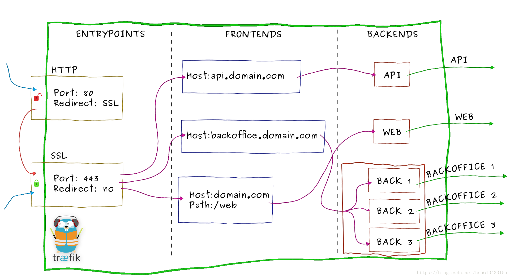
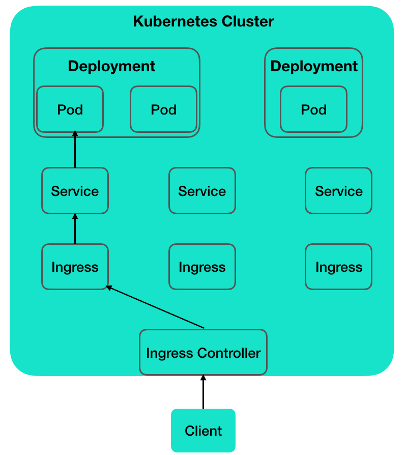

# 简介
# 什么是Traefik
## 官方文档
[https://doc.traefik.io/traefik/](https://doc.traefik.io/traefik/)

## 简介
Traefik是一个为了让部署微服务更加便捷而诞生的现代HTTP反向代理、负载均衡工具。 它支持多种后台 (Docker, Swarm, Kubernetes, Marathon, Mesos, Consul, Etcd, Zookeeper, BoltDB, Rest API, file…) 来自动化、动态的应用它的配置文件设置。

## 流量示意图

## 核心概念
当请求Traefik时，请求首先到`entrypoints`，然后分析传入的请求，查看他们是否与定义的`Routers`匹配。如果匹配，则会通过一系列`middlewares`处理，再到`traefikServices`上做流量转发，最后请求到`kubernetes的services上`。

+ `Providers`用来自动发现平台上的服务，可以是编排工具、容器引擎云提供商或者键值存储。Traefik通过查询Providers的API来查询路由的相关信息，一旦检测到变化，就会动态的更新路由。
+ `Entrypoints`监听传入的流量，是网络的入口点，定义了接受请求的端口(HTTP或者TCP)
+ `Routers`分析请求(host,path,headers,SSL等)，负责将传入的请求连接到可以处理这些请求的服务上去。
+ `Middlewares`中间件，用来修改请求或者根据请求来做出判断，中间件被附件到路由上，是一种在请求发送到服务之前调整请求的一种方法。
+ `Service`将请求转发给应用，负责配置如何最终将处理传入请求的实际服务，Traefik的Service介于Middlewares与KubernetesService之间，可以实现加权负载、流量复制等功能。

## traefik组件与nginx类比
| 组件名称 | 功能 | nginx相同概念 |
| --- | --- | --- |
| Providers | 监听路由信息变化，更新路由 | 修改nginx配置，reload服务。 |
| Entrypoints | 网络入口，监听传入的流量 | 配置文件listen指定监听端口 |
| Routers | 分析传入的请求，匹配规则 | 配置文件server_name+location |
| Middlewares | 中间件，修改请求或响应 | location配置段中添加的缓存、压缩、请求头等配置 |
| Service | 请求转发 | http配置段中的upstream |

# Nginx-Ingress和traefik区别
## Ingress Controller
k8s 是通过一个又一个的 controller 来负责监控、维护集群状态。Ingress Controller 就是监控 Ingress 路由规则的一个变化，然后跟 k8s 的资源操作入口 api-server 进行通信交互。K8s 并没有自带 Ingress Controller，它只是一种标准，具体实现有多种，需要自己单独安装，常用的是 Nginx Ingress Controller 和 Traefik Ingress Controller。

Ingress Controller 收到请求，匹配 Ingress 转发规则，匹配到了就转发到后端 Service，而 Service 可能代表的后端 Pod 有多个，选出一个转发到那个 Pod，最终由那个 Pod 处理请求。

## 与kubernetes交互
nginx-ingress：由于微服务架构以及 Docker 技术和 kubernetes 编排工具最近几年才开始逐渐流行，所以一开始的反向代理服务器比如 nginx、apache 并未提供其支持，所以才会出现 Ingress Controller 这种东西来做 kubernetes 和前端负载均衡器如 nginx 之间做衔接；**即 Ingress Controller 的存在就是为了能跟 kubernetes 交互，然后写入nginx 配置，最后reload。**

使用nginx作为前端负载均衡，通过ingress controller不断的和kubernetes api交互，实时获取后端service，pod等的变化，然后动态更新nginx配置，并刷新使配置生效，达到服务发现的目的。 

traefik：traefik本身设计的就能够实时跟kubernetes api交互，感知后端service，pod等的变化，自动更新配置并重载。

## traefik优点
+ 不需要安装其他依赖，使用 GO 语言编译可执行文件
+ 支持多种后台，如 Docker, Swarm mode, Kubernetes, Marathon, Consul, Etcd, Rancher, Amazon ECS 等等
+ 支持 REST API
+ 配置文件热重载，可自动监听配置改动、发现新服务，并自动更新无需人工重启
+ 支持熔断、限流功能
+ 支持轮训、负载均衡
+ 提供简洁的 UI 界面
+ 支持 Websocket, HTTP/2, GRPC
+ 自动更新 HTTPS 证书
+ 支持高可用集群模式

## Nginx和Traefik横向对比
| | Nginx Ingress | Traefik ingress |
| --- | :---: | --- |
| **协议** | http/https、http2、grpc、tcp/udp | http/https、http2、grpc、tcp、tcp+tls |
| **路由匹配** | host、path | host、path、headers、query、path prefix、method |
| **命名空间支持** | - | 共用或指定命名空间 |
| **部署策略** | - | 金丝雀部署、蓝绿部署、灰度部署 |
| **upstream探测** | 重试、超时、心跳探测 | 重试、超时、心跳探测、熔断 |
| **负载均衡算法** | RR、会话保持、最小连接、最短时间、一致性hash | WRR、动态RR、会话保持 |
| **优点** | 简单易用，易接入 | Golang编写，部署容易，支持众多的后端，内置WebUI |
| **缺点** | 没有解决nginx reload，插件多，但是扩展性能差 | 性能略逊于NGINX，但强于HAProxy |

