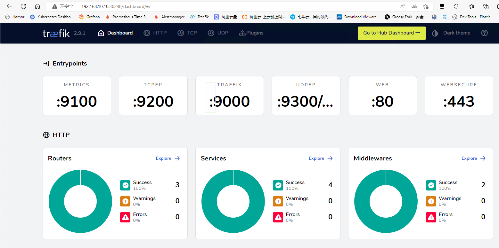

# 部署与配置

> 分类: Kubernetes > Traefik
> 更新时间: 2026-01-10T23:33:22.710623+08:00

---

# helm部署
## 参考文档
官方文档：[https://doc.traefik.io/traefik/getting-started/install-traefik/](https://doc.traefik.io/traefik/getting-started/install-traefik/)

gtihub地址：[https://github.com/traefik/traefik-helm-chart](https://github.com/traefik/traefik-helm-chart)

## 必要条件
Kubernetes版本1.14+

Helm版本3+

## 安装traefik
```bash
# 添加repo
[root@k8s-master ~]# helm repo add traefik https://helm.traefik.io/traefik
# 更新repo仓库资源
[root@k8s-master ~]# helm repo update
# 查看repo仓库traefik
[root@k8s-master ~]# helm search repo traefik
NAME                    CHART VERSION   APP VERSION     DESCRIPTION                                       
traefik/traefik         24.0.0          v2.10.4         A Traefik based Kubernetes ingress controller     
traefik/traefik-hub     2.1.0           v2.1.0          Traefik Hub Ingress Controller                    
traefik/traefik-mesh    4.1.1           v1.4.8          Traefik Mesh - Simpler Service Mesh               
traefik/traefikee       1.14.2          v2.10.4         Traefik Enterprise is a unified cloud-native ne...
traefik/hub-agent       1.6.0           v1.4.2          Traefik Hub is an all-in-one global networking ...
traefik/maesh           2.1.2           v1.3.2          Maesh - Simpler Service Mesh                      
# 创建traefik名称空间
[root@k8s-master ~]# kubectl create ns traefik
# 拉取helm包
[root@k8s-master ~]# helm pull traefik/traefik --untar
# 修改配置
[root@k8s-master ~]# cd traefik/
[root@k8s-master traefik]# vim values.yaml 
# Create an IngressRoute for the dashboard
ingressRoute:
  dashboard:
    enabled: false  # 禁用helm中渲染的dashboard，traefik默认使用LoadBalancer暴露服务配置较为麻烦

# Configure ports
ports:
  traefik:
    port: 9000
    hostPort: 9000 # 使用 hostport 模式
  web:
    port: 8000
    hostPort: 80  # 使用 hostport 模式
  websecure:
    port: 8443
    hostPort: 443  # 使用 hostport 模式

# Options for the main traefik service, where the entrypoints traffic comes
# from.
service:  # 使用 hostport 模式就不需要Service了
  enabled: false

# Logs
# https://docs.traefik.io/observability/logs/
logs:
  general:
    level: DEBUG
    
tolerations:   # kubeadm 安装的集群默认情况下master是有污点，需要容忍这个污点才可以部署
- key: "node-role.kubernetes.io/master"
  operator: "Equal"
  effect: "NoSchedule"

nodeSelector:   # 固定到master1节点（该节点才可以访问外网）
  kubernetes.io/hostname: "k8s-master"
  
# 安装
[root@k8s-master traefik]# helm install traefik -n traefik . -f values.yaml
NAME: traefik
LAST DEPLOYED: Mon Aug 14 13:11:04 2023
NAMESPACE: traefik
STATUS: deployed
REVISION: 1
TEST SUITE: None
NOTES:
Traefik Proxy v2.10.4 has been deployed successfully on traefik namespace !

# 查看helm列表
[root@k8s-master traefik]# helm list -n traefik
NAME    NAMESPACE       REVISION        UPDATED                                 STATUS          CHART           APP VERSION
traefik traefik         1               2023-08-14 13:11:04.879891529 +0800 CST deployed        traefik-24.0.0  v2.10.4    
# 查看pod资源信息
[root@k8s-master traefik]# kubectl get pod -n traefik
NAME                       READY   STATUS    RESTARTS   AGE
traefik-5bfc574f88-vz4zr   1/1     Running   0          65s
```

## 域名访问dashboard服务
添加dashboard的IngressRoute资源：`kubectl apply -f dashboard.yaml`

```yaml
apiVersion: traefik.containo.us/v1alpha1
kind: IngressRoute
metadata:
  name: dashboard
  namespace: traefik
spec:
  entryPoints:
    - web
  routes:
    - match: Host(`traefik.local.com`)
      kind: Rule
      services:
        - name: api@internal
          kind: TraefikService
```

接下来使用集群外部机器访问，添加hosts解析

```yaml
192.168.10.100 traefik.test.com
```


# YAML自定义部署
helm虽然实现了一键安装部署，但是查看helm包的value.yaml配置发现总共有500多行配置，当需要修改配置项或者对traefik做一下自定义配置时，并不灵活。如果只是使用traefik的基础功能，推荐使用helm部署。如果想深入研究使用traefik的话，推荐使用自定义方式部署。

## 环境准备
k8s版本：1.23.16

<font style="color:#444444;">traefik版本：2.9.6</font>

其中master节点充当边缘节点，<font style="color:#333333;">安装两块网卡，</font>eth0：k8s集群内网ip  eth1公网ip

官方文档：[https://doc.traefik.io/traefik/providers/kubernetes-crd/](https://doc.traefik.io/traefik/providers/kubernetes-crd/)

官方示例文件：[https://github.com/traefik/traefik/blob/master/docs/content/user-guides/crd-acme/index.md](https://github.com/traefik/traefik/blob/master/docs/content/user-guides/crd-acme/index.md)(示例文件仅提供最基本的配置，且所有配置项通过args传参，仅供参考，并不推荐用于生产)

## 创建CRD资源
> 这里要注意你的k8s版本，从k8s 1.16开始废弃apiextensions.k8s.io/v1beta1，1.22完全删除。
>
> 对于k8s 1.16 以上版本，使用apiextensions.k8s.io/v1
>

```bash
[root@k8s-master traefik]# wget https://raw.githubusercontent.com/traefik/traefik/v2.9/docs/content/reference/dynamic-configuration/kubernetes-crd-definition-v1.yml
[root@k8s-master traefik]# kubectl apply -f kubernetes-crd-definition-v1.yml 
[root@k8s-master traefik]# kubectl get crd
NAME                                    CREATED AT
addresspools.metallb.io                 2022-09-23T01:14:18Z
bfdprofiles.metallb.io                  2022-09-23T01:14:18Z
bgpadvertisements.metallb.io            2022-09-23T01:14:18Z
bgppeers.metallb.io                     2022-09-23T01:14:18Z
communities.metallb.io                  2022-09-23T01:14:18Z
ingressroutes.traefik.containo.us       2022-10-07T02:57:25Z
ingressroutetcps.traefik.containo.us    2022-10-07T02:57:25Z
ingressrouteudps.traefik.containo.us    2022-10-07T02:57:25Z
ipaddresspools.metallb.io               2022-09-23T01:14:18Z
l2advertisements.metallb.io             2022-09-23T01:14:18Z
middlewares.traefik.containo.us         2022-10-07T02:57:25Z
middlewaretcps.traefik.containo.us      2022-10-07T02:57:25Z
serverstransports.traefik.containo.us   2022-10-07T02:57:25Z
tlsoptions.traefik.containo.us          2022-10-07T02:57:25Z
tlsstores.traefik.containo.us           2022-10-07T02:57:26Z
traefikservices.traefik.containo.us     2022-10-07T02:57:27Z
```

## 创建RBAC资源
```bash
[root@k8s-master traefik]# wget https://raw.githubusercontent.com/traefik/traefik/v2.9/docs/content/reference/dynamic-configuration/kubernetes-crd-rbac.yml
[root@k8s-master traefik]# kubectl apply -f kubernetes-crd-rbac.yml 
clusterrole.rbac.authorization.k8s.io/traefik-ingress-controller created
clusterrolebinding.rbac.authorization.k8s.io/traefik-ingress-controller created
[root@k8s-master traefik]# kubectl get clusterrole | grep traefik
traefik-ingress-controller                                             2022-10-07T02:58:22Z
[root@k8s-master traefik]# kubectl get clusterrolebinding | grep traefik
traefik-ingress-controller                             ClusterRole/traefik-ingress-controller                                             24s
```

## 创建SA资源并绑定角色
查看kubernetes-crd-rbac.yml资源清单可知，官方的配置文件为我们创建了一个名为traefik-ingress-controller的角色，并在default名称空间创建了一个traefik-ingress-controller的sa账号与其绑定。但是在traefik名称空间下的资源并不能直接使用，我们可以修改traefik-ingress-controller的名称空间，或者在traefik名称空间建立一个sa账号并绑定角色使用。在尽量不修改官方配置的前提下，我们创建sa账号并绑定角色。

```yaml
[root@k8s-master traefik]# tee traefik-sa.yaml <<-'EOF'
apiVersion: v1
kind: Namespace
metadata:
  name: traefik
---
apiVersion: v1
kind: ServiceAccount
metadata:
  namespace: traefik
  name: traefik-ingress-controller
---
apiVersion: rbac.authorization.k8s.io/v1
kind: ClusterRoleBinding
metadata:
  name: traefik-ingress-controller
roleRef:
  apiGroup: rbac.authorization.k8s.io
  kind: ClusterRole
  name: traefik-ingress-controller
subjects:
  - kind: ServiceAccount
    name: traefik-ingress-controller
    namespace: traefik
EOF
[root@k8s-master traefik]# kubectl apply -f traefik-sa.yaml 
namespace/traefik created
serviceaccounttraefik-ingress-controller created
clusterrolebinding.rbac.authorization.k8s.io/traefik-ingress-controller created
[root@k8s-master traefik]# kubectl get sa -n traefik
NAME                         SECRETS   AGE
default                      1         4m20s
traefik-ingress-controller   1         4m20s
[root@k8s-master traefik]# kubectl get clusterrolebinding | grep traefik
traefik-ingress-controller                             ClusterRole/traefik-ingress-controller                                             98s
```

## 创建traefik配置文件
> 在 Traefik 中有三种方式定义静态配置：在配置文件中、在命令行参数中、通过环境变量传递，由于 Traefik 配置很多，通过 CLI 定义不是很方便，一般时候选择将其配置选项放到配置文件中，然后存入 ConfigMap，将其挂入 traefik 中。参考文档：[https://doc.traefik.io/traefik/getting-started/configuration-overview/](https://doc.traefik.io/traefik/getting-started/configuration-overview/)
>

```yaml
[root@k8s-master traefik]# tee traefik-config.yaml <<-'EOF'
apiVersion: v1
kind: ConfigMap
metadata:
  name: traefik-config
  namespace: traefik
data:
  traefik.yaml: |-
    global:
      checkNewVersion: false    # 周期性的检查是否有新版本发布
      sendAnonymousUsage: false # 周期性的匿名发送使用统计信息
    serversTransport:
      insecureSkipVerify: true  # Traefik忽略验证代理服务的TLS证书
    api:
      insecure: true            # 允许HTTP 方式访问API
      dashboard: true           # 启用Dashboard
      debug: false              # 启用Debug调试模式
    metrics:
      prometheus:               # 配置Prometheus监控指标数据，并使用默认配置
        addRoutersLabels: true  # 添加routers metrics
        entryPoint: "metrics"   # 指定metrics监听地址
    entryPoints:
      web:
        address: ":80"          # 配置80端口，并设置入口名称为web
        forwardedHeaders: 
          insecure: true        # 信任所有的forward headers
      websecure:
        address: ":443"         # 配置443端口，并设置入口名称为 websecure
        forwardedHeaders: 
          insecure: true
      traefik:
        address: ":9000"        # 配置9000端口，并设置入口名称为 dashboard
      metrics:
        address: ":9100"        # 配置9100端口，作为metrics收集入口
      tcpep:
        address: ":9200"        # 配置9200端口，作为tcp入口
      udpep:
        address: ":9300/udp"    # 配置9300端口，作为udp入口
    providers:
      kubernetesCRD:            # 启用Kubernetes CRD方式来配置路由规则
        ingressClass: ""        # 指定traefik的ingressClass名称
        allowCrossNamespace: true   #允许跨namespace
        allowEmptyServices: true    #允许空endpoints的service
    log:
      filePath: "/etc/traefik/logs/traefik.log" # 设置调试日志文件存储路径，如果为空则输出到控制台
      level: "DEBUG"            # 设置调试日志级别
      format: "common"          # 设置调试日志格式
    accessLog:
      filePath: "/etc/traefik/logs/access.log" # 设置访问日志文件存储路径，如果为空则输出到控制台
      format: "common"          # 设置访问调试日志格式
      bufferingSize: 0          # 设置访问日志缓存行数
      filters:
        # statusCodes: ["200"]  # 设置只保留指定状态码范围内的访问日志
        retryAttempts: true     # 设置代理访问重试失败时，保留访问日志
        minDuration: 20         # 设置保留请求时间超过指定持续时间的访问日志
      fields:                   # 设置访问日志中的字段是否保留（keep保留、drop不保留）
        defaultMode: keep       # 设置默认保留访问日志字段
        names:                  # 针对访问日志特别字段特别配置保留模式
          ClientUsername: drop
          StartUTC: drop        # 禁用日志timestamp使用UTC
        headers:                # 设置Header中字段是否保留
          defaultMode: keep     # 设置默认保留Header中字段
          names:                # 针对Header中特别字段特别配置保留模式
            # User-Agent: redact# 可以针对指定agent
            Authorization: drop
            Content-Type: keep
EOF
[root@k8s-master traefik]# kubectl apply -f traefik-config.yaml
configmap/traefik-config created
[root@k8s-master traefik]# kubectl get configmaps -n traefik 
NAME             DATA   AGE
traefik-config   1      11s
```

## 节点设置label标签
> 模拟实际生产环境，假设集群中master节点安装两块网卡充当边缘节点，需要提前给master节点设置 Label，这样当程序部署时 Pod 会自动调度到设置 Label 的节点上。
>

master节点网络信息如下：

| 网卡名称 | ip | 用途 |
| --- | --- | --- |
| ens33 | 192.168.10.10 | k8s集群内部ip |
| ens160 | 192.168.93.128 | 公网ip，用于外部访问 |


给master节点设置标签

`kubectl label nodes k8s-master IngressProxy=true` 

查看节点label信息

```bash
[root@k8s-master traefik]# kubectl get nodes --show-labels
NAME         STATUS   ROLES    AGE   VERSION    LABELS
k8s-master   Ready    master   28h   v1.19.16   IngressProxy=true,beta.kubernetes.io/arch=amd64,beta.kubernetes.io/os=linux,kubernetes.io/arch=amd64,kubernetes.io/hostname=k8s-master,kubernetes.io/os=linux,node-role.kubernetes.io/master=
k8s-work1    Ready    <none>   28h   v1.19.16   beta.kubernetes.io/arch=amd64,beta.kubernetes.io/os=linux,kubernetes.io/arch=amd64,kubernetes.io/hostname=k8s-work1,kubernetes.io/os=linux
k8s-work2    Ready    <none>   28h   v1.19.16   beta.kubernetes.io/arch=amd64,beta.kubernetes.io/os=linux,kubernetes.io/arch=amd64,kubernetes.io/hostname=k8s-work2,kubernetes.io/os=linux
```

## Deployment部署traefik
> 使用DeamonSet或者Deployment均可部署，此处使用Deployment方式部署 Traefik，副本数设置为1，调度至IngressProxy=true的那台master边缘节点，并使用host网络模式，提高网络入口的网络性能
>

创建 traefik 部署文件 traefik-deployment.yaml

```yaml
[root@k8s-master traefik]# tee traefik-deployment.yaml <<-'EOF'
apiVersion: apps/v1
kind: Deployment
metadata:
  name: traefik
  namespace: traefik
  labels:
    app: traefik
spec:
  replicas: 1   # 副本数为1，因为集群只设置一台master为边缘节点
  selector:
    matchLabels:
      app: traefik
  template:
    metadata:
      name: traefik
      labels:
        app: traefik
    spec:
      serviceAccountName: traefik-ingress-controller
      terminationGracePeriodSeconds: 1
      containers:
      - name: traefik
        image: traefik:v2.9
        env:
        - name: KUBERNETES_SERVICE_HOST       # 手动指定k8s api,避免网络组件不稳定。
          value: "192.168.10.10"
        - name: KUBERNETES_SERVICE_PORT_HTTPS # API server端口
          value: "6443"
        - name: KUBERNETES_SERVICE_PORT       # API server端口
          value: "6443"
        - name: TZ                            # 指定时区
          value: "Asia/Shanghai"
        ports:
          - name: web
            containerPort: 80
            hostPort: 80                      # 将容器端口绑定所在服务器的 80 端口
          - name: websecure
            containerPort: 443
            hostPort: 443                     # 将容器端口绑定所在服务器的 443 端口
          - name: admin
            containerPort: 9000               # Traefik Dashboard 端口
          - name: metrics
            containerPort: 9100               # metrics端口
          - name: tcpep
            containerPort: 9200               # tcp端口
          - name: udpep
            containerPort: 9300               # udp端口
        securityContext:                      # 只开放网络权限  
          capabilities:
            drop:
              - ALL
            add:
              - NET_BIND_SERVICE
        args:
          - --configfile=/etc/traefik/config/traefik.yaml
        volumeMounts:
        - mountPath: /etc/traefik/config
          name: config
        - mountPath: /etc/traefik/logs
          name: logdir
        - mountPath: /etc/localtime
          name: timezone
          readOnly: true
        resources:
          requests:
            memory: "5Mi"
            cpu: "10m" 
          limits:
            memory: "256Mi"
            cpu: "1000m"
      volumes:
        - name: config                         # traefik配置文件
          configMap:
            name: traefik-config 
        - name: logdir                         # traefik日志目录
          hostPath:
            path: /var/log/traefik
            type: "DirectoryOrCreate"
        - name: timezone                       #挂载时区文件
          hostPath:
            path: /etc/localtime
            type: File
      tolerations:                             # 设置容忍所有污点，防止节点被设置污点
        - operator: "Exists"
      hostNetwork: true                        # 开启host网络，提高网络入口的网络性能
      dnsPolicy: ClusterFirstWithHostNet       # 满足使用HostNetwork同时使用k8sDNS作为Pod预设DNS的配置。
      nodeSelector:                            # 设置node筛选器，在特定label的节点上启动
        IngressProxy: "true"                   # 调度至IngressProxy: "true"的节点
EOF
[root@k8s-master traefik]# kubectl apply -f traefik-deployment.yaml 
deployment.apps/traefik-ingress-controller created
[root@k8s-master traefik]# kubectl get pod -n traefik 
NAME                                         READY   STATUS    RESTARTS   AGE
traefik-ingress-controller-7d5c4c944-6ffkk   1/1     Running   0          12s
```

## 创建service资源
```yaml
[root@k8s-master traefik]# tee traefik-svc.yaml <<-'EOF'
apiVersion: v1
kind: Service
metadata:
  name: traefik
  namespace: traefik
spec:
  type: NodePort    ## 官网示例为LoadBalancer,为方便演示，此处改为NodePort
  selector:
    app: traefik
  ports:
    - name: web
      protocol: TCP
      port: 80
      targetPort: 80
    - name: websecure
      protocol: TCP
      port: 443
      targetPort: 443
    - name: admin
      protocol: TCP
      port: 9000
      targetPort: 9000
    - name: metrics
      protocol: TCP
      port: 9100
      targetPort: 9100
    - name: tcpep
      protocol: TCP
      port: 9200
      targetPort: 9200
    - name: udpep
      protocol: UDP
      port: 9300
      targetPort: 9300
EOF
[root@k8s-master traefik]# kubectl apply -f traefik-svc.yaml 
service/traefik created
[root@k8s-master traefik]# kubectl get svc -n traefik 
NAME      TYPE       CLUSTER-IP      EXTERNAL-IP   PORT(S)                                                                                  AGE
traefik   NodePort   10.111.162.84   <none>        80:30347/TCP,443:32301/TCP,9000:30248/TCP,9100:31939/TCP,9200:32617/TCP,9300:32355/UDP   10s
```

## NodePort方式访问dashboard
traefik的dashboard使用nodeport暴露服务，将9000端口映射为30248，现在访问http://192.168.10.10:30248/



## dashboard配置http域名访问
> Traefik 应用已经部署完成，treafik的Dashboard为svc类型是NodePort，接下来配置域名规则，模拟外部用户通过公网IP访问dashboard应用
>

<font style="color:rgb(18, 18, 18);">Traefik创建路由规则有多种方式，比如：</font>

+ <font style="color:rgb(18, 18, 18);">原生Ingress写法</font>
+ <font style="color:rgb(18, 18, 18);">使用CRD IngressRoute方式</font>
+ <font style="color:rgb(18, 18, 18);">使用GatewayAPI的方式</font>

相较于原生Ingress写法，ingressRoute是2.1以后新增功能，简单来说，他们都支持路径(path)路由和域名(host)HTTP路由，以及HTTPS配置，区别在于IngressRoute需要定义CRD扩展，但是它支持了TCP、UDP路由以及中间件等新特性，强烈推荐使用ingressRoute，<font style="color:rgb(18, 18, 18);">GatewayAPI方式后续再详细介绍。</font>

创建 Traefik Dashboard 路由资源

```yaml
[root@k8s-master traefik]# tee traefik-dashboard-ingress.yaml <<-'EOF'
apiVersion: traefik.containo.us/v1alpha1
kind: IngressRoute
metadata:
  name: dashboard
  namespace: traefik
spec:
  entryPoints:
    - web
  routes:
    - match: Host(`traefik.test.com`)
      kind: Rule
      services:
        - name: api@internal
          kind: TraefikService
          namespace: traefik
EOF
[root@k8s-master traefik]# kubectl apply -f traefik-dashboard-ingress.yaml 
ingressroute.traefik.containo.us/dashboard created
[root@k8s-master traefik]# kubectl get ingressroute -n traefik
NAME        AGE
dashboard   8s
```

配置 Hosts，客户端想通过域名访问服务，必须要进行 DNS 解析，由于这里没有 DNS 服务器进行域名解析，所以直接修改客户端端的 hosts 文件，将 Traefik 所在的节点的 公网IP 和自定义 host 绑定。打开电脑的 Hosts 配置文件，往其加入下面配置：`192.168.93.128 traefik.test.com` 

配置完成后，打开浏览器输入地址：http://traefik.test.com 打开 Traefik Dashboard。


# 其他配置
## 强制使用<font style="color:rgb(36, 41, 47);">TLS v1.2+</font>
> <font style="color:rgb(36, 41, 47);">如今，TLS v1.0 和 v1.1 因为存在安全问题，现在已被弃用。为了保障系统安全，所有入口路由都应该强制使用TLS v1.2 或更高版本。</font>
>

<font style="color:rgb(36, 41, 47);">参考文档：</font>[https://doc.traefik.io/traefik/user-guides/crd-acme/#force-tls-v12](https://doc.traefik.io/traefik/user-guides/crd-acme/#force-tls-v12)

```yaml
[root@k8s-master traefik]# tee traefik-tlsoption.yml <<-'EOF'
apiVersion: traefik.containo.us/v1alpha1
kind: TLSOption
metadata:
  name: default
  namespace: traefik
spec:
  minVersion: VersionTLS12
  cipherSuites:
    - TLS_ECDHE_RSA_WITH_AES_256_GCM_SHA384   # TLS 1.2
    - TLS_ECDHE_RSA_WITH_CHACHA20_POLY1305    # TLS 1.2
    - TLS_AES_256_GCM_SHA384                  # TLS 1.3
    - TLS_CHACHA20_POLY1305_SHA256            # TLS 1.3
  curvePreferences:
    - CurveP521
    - CurveP384
  sniStrict: true
EOF
[root@k8s-master traefik]# kubectl apply -f traefik-tlsoption.yml
tlsoption.traefik.containo.us/default created
```

## 日志轮换
> 官方并没有日志轮换的功能，但是traefik收到USR1信号后会重建日志文件，因此可以通过logrotate实现日志轮换
>

参考文档：[https://doc.traefik.io/traefik/observability/logs/](https://doc.traefik.io/traefik/observability/logs/)

在/etc/logrotate.d创建下traefik目录

```yaml
mkdir -p /etc/logrotate.d/traefik
```

配置logrotate文件

```yaml
/data/traefik/logs/*.log {
  daily
  rotate 15
  missingok
  notifempty
  compress
  dateext
  dateyesterday
  dateformat .%Y-%m-%d
  create 0644 root root
  postrotate
   docker kill --signal="USR1" $(docker ps | grep traefik |grep -v pause| awk '{print $1}')
  endscript
 }
```

添加crontab定时任务

```yaml
sudo echo "0 0 * * * /usr/sbin/logrotate -f /etc/logrotate.d/traefik/traefikLogrotate >/dev/null 2>&1" > /etc/crontab
```

# 多控制器
有的业务场景下可能需要在一个集群中部署多个 traefik，例如：避免单个traefik配置规则过多导致加载处理缓慢。每个namespace部署一个traefik。或者traefik生产与测试环境区分等场景，需要不同的实例控制不同的 IngressRoute 资源对象，要实现该功能有两种方法：

## 通过 annotations 注解筛选
首先在traefik配置文件中的providers下增加Ingressclass参数，指定具体的值。

参考文档：[https://doc.traefik.io/traefik/providers/kubernetes-crd/#ingressclass](https://doc.traefik.io/traefik/providers/kubernetes-crd/#ingressclass)

```yaml
kind: ConfigMap
apiVersion: v1
metadata:
  name: traefik-config
  namespace: traefik
data:
  traefik.yaml: |-
    global:
      checkNewVersion: false    # 周期性的检查是否有新版本发布
      sendAnonymousUsage: false # 周期性的匿名发送使用统计信息
    serversTransport:
      insecureSkipVerify: true  # Traefik忽略验证代理服务的TLS证书
    api:
      insecure: true            # 允许HTTP 方式访问API
      dashboard: true           # 启用Dashboard
      debug: false              # 启用Debug调试模式
    metrics:
      prometheus:               # 配置Prometheus监控指标数据，并使用默认配置
        addRoutersLabels: true  # 添加routers metrics
        entryPoint: "metrics"   # 指定metrics监听地址
    entryPoints:
      web:
        address: ":80"          # 配置80端口，并设置入口名称为web
        forwardedHeaders: 
          insecure: true        # 信任所有的forward headers
      websecure:
        address: ":443"         # 配置443端口，并设置入口名称为 websecure
        forwardedHeaders: 
          insecure: true
      traefik:
        address: ":9000"        # 配置9000端口，并设置入口名称为 dashboard
      metrics:
        address: ":9100"        # 配置9100端口，作为metrics收集入口
      tcpep:
        address: ":9200"        # 配置9200端口，作为tcp入口
      udpep:
        address: ":9300/udp"    # 配置9300端口，作为udp入口
    providers:
      kubernetesCRD:            # 启用Kubernetes CRD方式来配置路由规则
        ingressClass: "traefik-v2.8" # 指定traefik的ingressClass实例名称
        allowCrossNamespace: true   #允许跨namespace
        allowEmptyServices: true    #允许空endpoints的service
    log:
      filePath: "/etc/traefik/logs/traefik.log" # 设置调试日志文件存储路径，如果为空则输出到控制台
      level: "INFO"             # 设置调试日志级别
      format: "common"          # 设置调试日志格式
    accessLog:
      filePath: "/etc/traefik/logs/access.log" # 设置访问日志文件存储路径，如果为空则输出到控制台
      format: "common"          # 设置访问调试日志格式
      bufferingSize: 0          # 设置访问日志缓存行数
      filters:
        statusCodes: ["200"]   # 设置只保留指定状态码范围内的访问日志
        retryAttempts: true     # 设置代理访问重试失败时，保留访问日志
        minDuration: 20         # 设置保留请求时间超过指定持续时间的访问日志
      fields:                   # 设置访问日志中的字段是否保留（keep保留、drop不保留）
        defaultMode: keep       # 设置默认保留访问日志字段
        names:                  # 针对访问日志特别字段特别配置保留模式
          ClientUsername: drop
          StartUTC: drop        # 禁用日志timestamp使用UTC
        headers:                # 设置Header中字段是否保留
          defaultMode: keep     # 设置默认保留Header中字段
          names:                # 针对Header中特别字段特别配置保留模式
            #User-Agent: redact # 可以针对指定agent
            Authorization: drop
            Content-Type: keep
```

接下来在IngressRoute 资源对象中的annotations参数中添加 kubernetes.io/ingress.class: traefik-v2.8即可

```yaml
apiVersion: traefik.containo.us/v1alpha1
kind: IngressRoute
metadata:
  name: dashboard
  namespace: traefik
  annotations:
    kubernetes.io/ingress.class: traefik-v2.8 #  因为静态配置文件指定了ingressclass，所以这里的annotations 要指定，否则访问会404
spec:
  entryPoints:
    - web
  routes:
    - match: Host(`traefik.test.com`)
      kind: Rule
      services:
        - name: api@internal
          kind: TraefikService
          namespace: traefik
```

## 通过标签选择器进行过滤
首先在traefik配置文件中的providers下增加labelSelector参数，指定具体的标签键值。

参考文档：[https://doc.traefik.io/traefik/providers/kubernetes-crd/#labelselector](https://doc.traefik.io/traefik/providers/kubernetes-crd/#labelselector)

```yaml
kind: ConfigMap
apiVersion: v1
metadata:
  name: traefik-config
  namespace: traefik
data:
  traefik.yaml: |-
    global:
      checkNewVersion: false    # 周期性的检查是否有新版本发布
      sendAnonymousUsage: false # 周期性的匿名发送使用统计信息
    serversTransport:
      insecureSkipVerify: true  # Traefik忽略验证代理服务的TLS证书
    api:
      insecure: true            # 允许HTTP 方式访问API
      dashboard: true           # 启用Dashboard
      debug: false              # 启用Debug调试模式
    metrics:
      prometheus:               # 配置Prometheus监控指标数据，并使用默认配置
        addRoutersLabels: true  # 添加routers metrics
        entryPoint: "metrics"   # 指定metrics监听地址
    entryPoints:
      web:
        address: ":80"          # 配置80端口，并设置入口名称为web
        forwardedHeaders: 
          insecure: true        # 信任所有的forward headers
      websecure:
        address: ":443"         # 配置443端口，并设置入口名称为 websecure
        forwardedHeaders: 
          insecure: true
      traefik:
        address: ":9000"        # 配置9000端口，并设置入口名称为 dashboard
      metrics:
        address: ":9100"        # 配置9100端口，作为metrics收集入口
      tcpep:
        address: ":9200"        # 配置9200端口，作为tcp入口
      udpep:
        address: ":9300/udp"    # 配置9300端口，作为udp入口
    providers:
      kubernetesCRD:            # 启用Kubernetes CRD方式来配置路由规则
        # ingressClass: "traefik-v2.8"    # 指定traefik的ingressClass名称
        labelSelector: "app=traefik-v2.8" # 通过标签选择器指定traefik标签 
        allowCrossNamespace: true   #允许跨namespace
        allowEmptyServices: true    #允许空endpoints的service
    log:
      filePath: "/etc/traefik/logs/traefik.log" # 设置调试日志文件存储路径，如果为空则输出到控制台
      level: "INFO"             # 设置调试日志级别
      format: "common"          # 设置调试日志格式
    accessLog:
      filePath: "/etc/traefik/logs/access.log" # 设置访问日志文件存储路径，如果为空则输出到控制台
      format: "common"          # 设置访问调试日志格式
      bufferingSize: 0          # 设置访问日志缓存行数
      filters:
        statusCodes: ["200"]   # 设置只保留指定状态码范围内的访问日志
        retryAttempts: true     # 设置代理访问重试失败时，保留访问日志
        minDuration: 20         # 设置保留请求时间超过指定持续时间的访问日志
      fields:                   # 设置访问日志中的字段是否保留（keep保留、drop不保留）
        defaultMode: keep       # 设置默认保留访问日志字段
        names:                  # 针对访问日志特别字段特别配置保留模式
          ClientUsername: drop
          StartUTC: drop        # 禁用日志timestamp使用UTC
        headers:                # 设置Header中字段是否保留
          defaultMode: keep     # 设置默认保留Header中字段
          names:                # 针对Header中特别字段特别配置保留模式
            #User-Agent: redact # 可以针对指定agent
            Authorization: drop
            Content-Type: keep
```

然后在 IngressRoute 资源对象中添加labels标签选择器，选择app: traefik-v2.8这个标签即可

```yaml
apiVersion: traefik.containo.us/v1alpha1
kind: IngressRoute
metadata:
  name: dashboard
  labels:     # 通过标签选择器，该IngressRoute资源由配置了app=traefik-v2.8的traefik处理
    app: traefik-v2.8
  # annotations:
    # kubernetes.io/ingress.class: traefik-v2.8 #  因为静态配置文件指定了ingressclass，所以这里的annotations 要指定，否则访问会404
spec:
  entryPoints:
    - web
  routes:
    - match: Host(`traefik.test.com`)
      kind: Rule
      services:
        - name: api@internal
          kind: TraefikService
          namespace: traefik
```

# <font style="color:rgba(0, 0, 0, 0.87);">Traefik CRD功能总结</font>
traefik通过<font style="color:rgb(64, 64, 64);">自定义资源实现了对traefik资源的创建和管理，支持的crd资源类型如下所示：</font>

<font style="color:rgb(64, 64, 64);">参考文档：</font>[https://doc.traefik.io/traefik/routing/providers/kubernetes-crd/](https://doc.traefik.io/traefik/routing/providers/kubernetes-crd/)

| kind | 功能 |
| --- | --- |
| [IngressRoute](https://doc.traefik.io/traefik/routing/providers/kubernetes-crd/#kind-ingressroute) | HTTP路由配置 |
| [Middleware](https://doc.traefik.io/traefik/routing/providers/kubernetes-crd/#kind-middleware) | HTTP中间件配置 |
| [TraefikService](https://doc.traefik.io/traefik/routing/providers/kubernetes-crd/#kind-traefikservice) | HTTP负载均衡/流量复制配置 |
| [IngressRouteTCP](https://doc.traefik.io/traefik/routing/providers/kubernetes-crd/#kind-ingressroutetcp) | TCP路由配置 |
| [MiddlewareTCP](https://doc.traefik.io/traefik/routing/providers/kubernetes-crd/#kind-middlewaretcp) | TCP中间件配置 |
| [IngressRouteUDP](https://doc.traefik.io/traefik/routing/providers/kubernetes-crd/#kind-ingressrouteudp) | UDP路由配置 |
| [TLSOptions](https://doc.traefik.io/traefik/routing/providers/kubernetes-crd/#kind-tlsoption) | TLS连接参数配置 |
| [TLSStores](https://doc.traefik.io/traefik/routing/providers/kubernetes-crd/#kind-tlsstore) | TLS存储配置 |
| [ServersTransport](https://doc.traefik.io/traefik/routing/providers/kubernetes-crd/#kind-serverstransport) | traefik与后端之间的传输配置 |


