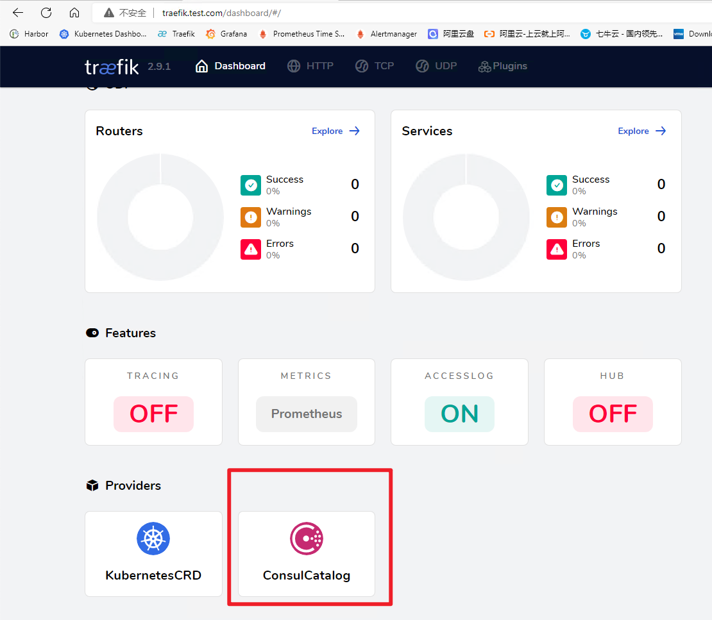
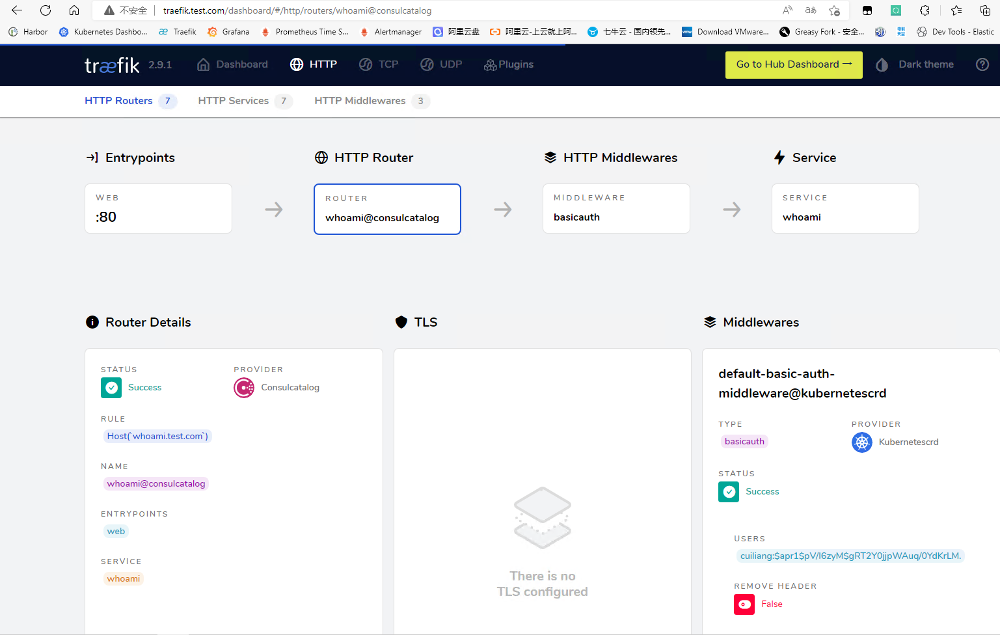
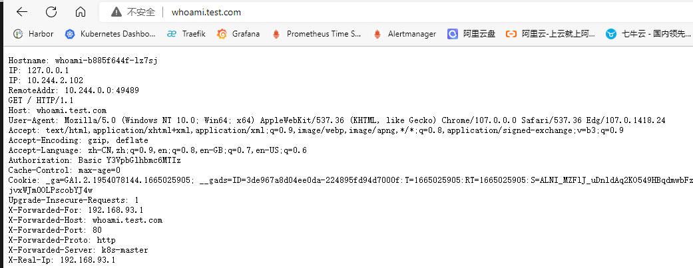

# 配置发现(Consul)
# 配置发现简介
traefik除了可以对接kubernetes ingressroute外，也支持其他常用的服务发现中间件，例如consul、etcd、zookeeper等。以consul为例，我们只需要向consul中注册服务，traefik监听到有新的服务注册时，会实时检测服务并自动更新路由规则。

参考文档：[https://doc.traefik.io/traefik/providers/overview/](https://doc.traefik.io/traefik/providers/overview/)


# k8s部署consul
## helm安装consul
参考文档：[https://developer.hashicorp.com/consul/tutorials/kubernetes/kubernetes-deployment-guide](https://developer.hashicorp.com/consul/tutorials/kubernetes/kubernetes-deployment-guide)

版本要求：k8s版本：1.21.0+，helm版本3.2.1+

<font style="color:rgb(79, 79, 79);">配置Helm Chart</font>

```bash
# 添加repo
[root@k8s-master ~]# helm repo add hashicorp https://helm.releases.hashicorp.com
"hashicorp" has been added to your repositories
# 更新repo仓库资源
[root@k8s-master ~]# helm repo update
Hang tight while we grab the latest from your chart repositories...
...Successfully got an update from the "hashicorp" chart repository
...Successfully got an update from the "stable" chart repository
Update Complete. ⎈Happy Helming!⎈
# 查看consul可用版本信息
[root@k8s-master ~]# helm search repo consul
NAME                                    CHART VERSION   APP VERSION     DESCRIPTION                                       
hashicorp/consul                        0.49.0          1.13.2          Official HashiCorp Consul Chart                   
stable/consul                           3.9.6           1.5.3           Highly available and distributed service discov...
stable/prometheus-consul-exporter       0.1.6           0.4.0           DEPRECATED A Helm chart for the Prometheus Cons...
# 拉取helm包资源
[root@k8s-master ~]# helm pull hashicorp/consul
[root@k8s-master ~]# ls
anaconda-ks.cfg  consul-0.49.0.tgz  
# 解压查看
[root@k8s-master ~]# tar -zxf consul-0.49.0.tgz 
[root@k8s-master ~]# ls
anaconda-ks.cfg  consul  consul-0.49.0.tgz  
```

## 创建存储资源
查看value.yaml配置文件可知，部署的时候会创建使用 PVC：PersistentVolumeClaim 的 Pod ，Pod 中的应用通过 PVC 进行数据的持久化，而 PVC 使用 PV: PersistentVolume 进行数据的最终持久化处理。所以我们要准备好存储资源供应，否则 consul会因为获取不到存储资源而一直处于 pending 状态。

```bash
[root@k8s-master ~]# cd consul/
[root@k8s-master consul]# cat values.yaml
# This defines the disk size for configuring the
# servers' StatefulSet storage. For dynamically provisioned storage classes, this is the
# desired size. For manually defined persistent volumes, this should be set to
# the disk size of the attached volume.
storage: 10Gi

# The StorageClass to use for the servers' StatefulSet storage. It must be
# able to be dynamically provisioned if you want the storage
# to be automatically created. For example, to use 
# local(https://kubernetes.io/docs/concepts/storage/storage-classes/#local)
# storage classes, the PersistentVolumeClaims would need to be manually created.
# A `null` value will use the Kubernetes cluster's default StorageClass. If a default
# StorageClass does not exist, you will need to create one.
# Refer to the [Read/Write Tuning](https://www.consul.io/docs/install/performance#read-write-tuning) 
# section of the Server Performance Requirements documentation for considerations 
# around choosing a performant storage class.
#
# ~> **Note:** The [Reference Architecture](https://learn.hashicorp.com/tutorials/consul/reference-architecture#hardware-sizing-for-consul-servers)
# contains best practices and recommendations for selecting suitable
# hardware sizes for your Consul servers.
# @type: string
storageClass: null
```

我们可以手动创建静态pv或者使用<font style="color:rgb(51, 51, 51);">StorageClass动态卷供应实现存储持久化，为了方便演示，此处以最简单的静态PV为例。</font>

```bash
[root@k8s-master consul]# cat pv.yaml 
apiVersion: v1
kind: PersistentVolume
metadata:
  name: consul-pv-0
spec:
  storageClassName: ""
  capacity:
    storage: 10Gi
  accessModes:
    - ReadWriteOnce
  persistentVolumeReclaimPolicy: Delete
  hostPath:
    path: "/data/consul"
    type: DirectoryOrCreate
  nodeAffinity:
    required:
      nodeSelectorTerms:
      - matchExpressions:
        - key: kubernetes.io/hostname
          operator: In
          values:
          - k8s-master
---
apiVersion: v1
kind: PersistentVolume
metadata:
  name: consul-pv-1
spec:
  storageClassName: ""
  capacity:
    storage: 10Gi
  accessModes:
    - ReadWriteOnce
  persistentVolumeReclaimPolicy: Delete
  hostPath:
    path: "/data/consul"
    type: DirectoryOrCreate
  nodeAffinity:
    required:
      nodeSelectorTerms:
      - matchExpressions:
        - key: kubernetes.io/hostname
          operator: In
          values:
          - k8s-work1
---
apiVersion: v1
kind: PersistentVolume
metadata:
  name: consul-pv-2
spec:
  storageClassName: ""
  capacity:
    storage: 10Gi
  accessModes:
    - ReadWriteOnce
  persistentVolumeReclaimPolicy: Delete
  hostPath:
    path: "/data/consul"
    type: DirectoryOrCreate
  nodeAffinity:
    required:
      nodeSelectorTerms:
      - matchExpressions:
        - key: kubernetes.io/hostname
          operator: In
          values:
          - k8s-work2
[root@k8s-master consul]# kubectl apply -f pv.yaml 
persistentvolume/consul-pv-0 created
persistentvolume/consul-pv-1 created
persistentvolume/consul-pv-2 created
[root@k8s-master consul]# kubectl get pv
NAME          CAPACITY   ACCESS MODES   RECLAIM POLICY   STATUS      CLAIM   STORAGECLASS   REASON   AGE
consul-pv-0   10Gi       RWO            Delete           Available                                   4s
consul-pv-1   10Gi       RWO            Delete           Available                                   4s
consul-pv-2   10Gi       RWO            Delete           Available                                   4s
```

## 部署consul资源
修改helm变量配置

```bash
global:
  name: consul # 设置用于 Helm chart 中所有资源的前缀
ui:
  service: # 为 Consul UI 配置服务
    type: "NodePort" # 服务类型为 NodePort
server:
  replicas: 3 # 要运行的服务器的数量，即集群数
  storage: '10Gi' # 定义用于配置服务器的 StatefulSet 存储的磁盘大小
  storageClass: "" # 使用Kubernetes集群的默认 StorageClass
  securityContext: # 服务器 Pod 的安全上下文，以 root 用户运行
    fsGroup: 2000
    runAsGroup: 2000
    runAsNonRoot: false
    runAsUser: 0
```

创建资源

```bash
[root@k8s-master consul]# helm install consul hashicorp/consul -n consul -f values.yaml --create-namespace
[root@k8s-master consul]# helm list -n consul
NAME    NAMESPACE       REVISION        UPDATED                                 STATUS          CHART           APP VERSION
consul  consul          1               2022-10-28 10:43:56.104694201 +0800 CST deployed        consul-0.49.0   1.13.2  
```

# 访问验证
## 查看资源信息
```bash
[root@k8s-master consul]# kubectl get pod -n consul
NAME                  READY   STATUS    RESTARTS   AGE
consul-client-78jzj   1/1     Running   0          3m12s
consul-client-dhtxw   1/1     Running   0          80s
consul-client-mm6hf   1/1     Running   0          3m12s
consul-server-0       1/1     Running   0          3m12s
consul-server-1       1/1     Running   0          3m12s
consul-server-2       1/1     Running   0          3m12s
[root@k8s-master consul]# kubectl get svc -n consul 
NAME            TYPE        CLUSTER-IP       EXTERNAL-IP   PORT(S)                                                                            AGE
consul-dns      ClusterIP   10.108.192.200   <none>        53/TCP,53/UDP                                                                      4m5s
consul-server   ClusterIP   None             <none>        8500/TCP,8503/TCP,8301/TCP,8301/UDP,8302/TCP,8302/UDP,8300/TCP,8600/TCP,8600/UDP   4m5s
consul-ui       NodePort    10.99.86.8       <none>        80:32177/TCP                                                                       4m5s                                                                      104s
```

## nodeport方式访问consul
根据service信息可知，consul-ui服务的80端口映射在k8s节点的31277端口，直接访问k8s节点ip:31277即可


## ingress方式访问consul-ui
创建ingressroute资源

```yaml
[root@k8s-master consul]# cat ingress.yaml 
apiVersion: traefik.containo.us/v1alpha1
kind: IngressRoute
metadata:
  name: consul-ui
  namespace: consul
spec:
  entryPoints:
    - web
  routes:
    - match: Host(`consul-ui.test.com`)
      kind: Rule
      services:
        - name: consul-ui
          port: 80
          namespace: consul
[root@k8s-master consul]# kubectl apply -f ingress.yaml 
ingressroute.traefik.containo.us/consul-ui created
```

添加hosts解析记录`192.168.93.128 consul-ui.test.com`，然后访问consul-ui.test.com


# traefik对接consul
参考文档：[https://doc.traefik.io/traefik/providers/consul-catalog/](https://doc.traefik.io/traefik/providers/consul-catalog/)

## traefik启用consul配置发现
修改traefik配置，添加consulCatalog相关配置。

```yaml
[root@k8s-master traefik]# cat traefik-config.yaml 
apiVersion: v1
kind: ConfigMap
metadata:
  name: traefik-config
  namespace: traefik
data:
  traefik.yaml: |-
    global:
      checkNewVersion: false    # 周期性的检查是否有新版本发布
      sendAnonymousUsage: false # 周期性的匿名发送使用统计信息
    serversTransport:
      insecureSkipVerify: true  # Traefik忽略验证代理服务的TLS证书
    api:
      insecure: true            # 允许HTTP 方式访问API
      dashboard: true           # 启用Dashboard
      debug: false              # 启用Debug调试模式
    metrics:
      prometheus:               # 配置Prometheus监控指标数据，并使用默认配置
        addRoutersLabels: true  # 添加routers metrics
        entryPoint: "metrics"   # 指定metrics监听地址
    entryPoints:
      web:
        address: ":80"          # 配置80端口，并设置入口名称为web
        forwardedHeaders: 
          insecure: true        # 信任所有的forward headers
      websecure:
        address: ":443"         # 配置443端口，并设置入口名称为 websecure
        forwardedHeaders: 
          insecure: true
      traefik:
        address: ":9000"        # 配置9000端口，并设置入口名称为 dashboard
      metrics:
        address: ":9100"        # 配置9100端口，作为metrics收集入口
      tcpep:
        address: ":9200"        # 配置9200端口，作为tcp入口
      udpep:
        address: ":9300/udp"    # 配置9300端口，作为udp入口
    providers:
      kubernetesCRD:            # 启用Kubernetes CRD方式来配置路由规则
        ingressClass: ""        # 指定traefik的ingressClass名称
        allowCrossNamespace: true   #允许跨namespace
        allowEmptyServices: true    #允许空endpoints的service
      consulCatalog:            # 启用consul服务发现
        endpoint:               # consul服务地址
          address: consul-server.consul.svc:8500
    log:
      filePath: "/etc/traefik/logs/traefik.log" # 设置调试日志文件存储路径，如果为空则输出到控制台
      level: "DEBUG"            # 设置调试日志级别
      format: "common"          # 设置调试日志格式
    accessLog:
      filePath: "/etc/traefik/logs/access.log" # 设置访问日志文件存储路径，如果为空则输出到控制台
      format: "common"          # 设置访问调试日志格式
      bufferingSize: 0          # 设置访问日志缓存行数
      filters:
        # statusCodes: ["200"]  # 设置只保留指定状态码范围内的访问日志
        retryAttempts: true     # 设置代理访问重试失败时，保留访问日志
        minDuration: 20         # 设置保留请求时间超过指定持续时间的访问日志
      fields:                   # 设置访问日志中的字段是否保留（keep保留、drop不保留）
        defaultMode: keep       # 设置默认保留访问日志字段
        names:                  # 针对访问日志特别字段特别配置保留模式
          ClientUsername: drop
          StartUTC: drop        # 禁用日志timestamp使用UTC
        headers:                # 设置Header中字段是否保留
          defaultMode: keep     # 设置默认保留Header中字段
          names:                # 针对Header中特别字段特别配置保留模式
            # User-Agent: redact# 可以针对指定agent
            Authorization: drop
            Content-Type: keep
[root@k8s-master traefik]# kubectl apply -f traefik-config.yaml 
configmap/traefik-config configured
```

访问traefik dashboard，查看providers信息



## 创建测试资源
创建测试应用

```yaml
[root@k8s-master k8s-test]# cat whoami.yaml 
apiVersion: apps/v1
kind: Deployment
metadata:
  name: whoami
spec:
  selector:
    matchLabels:
      app: whoami
  template:
    metadata:
      labels:
        app: whoami
    spec:
      containers:
      - name: whoami
        image: traefik/whoami
        resources:
          limits:
            memory: "128Mi"
            cpu: "500m"
        ports:
        - containerPort: 80
---
apiVersion: v1
kind: Service
metadata:
  name: whoami
spec:
  selector:
    app: whoami
  ports:
  - port: 80
    targetPort: 80
[root@k8s-master k8s-test]# kubectl apply -f whoami.yaml 
deployment.apps/whoami created
service/whoami created
[root@k8s-master k8s-test]# kubectl get svc 
NAME         TYPE        CLUSTER-IP      EXTERNAL-IP   PORT(S)   AGE
whoami       ClusterIP   10.100.157.68   <none>        80/TCP    44s
[root@k8s-master k8s-test]# kubectl get pod 
whoami-b885f644f-lz7sj    1/1     Running   0          49s
```

创建base auth认证中间件

```yaml
[root@k8s-master auth]# cat basic-auth-middleware.yaml 
apiVersion: traefik.containo.us/v1alpha1
kind: Middleware
metadata:
  name: basic-auth-middleware
spec:
  basicAuth:
    secret: basic-auth
[root@k8s-master auth]# kubectl apply -f basic-auth-middleware.yaml 
middleware.traefik.containo.us/basic-auth-middleware created
```

## 注册服务到consul
```bash
[root@test /]# curl -X PUT -d '{"name":"whoami","address":"whoami.default.svc","port":80,"tags":["traefik.http.routers.whoami.rule=Host(`whoami.test.com`)","traefik.http.routers.whoami.entrypoints=web","traefik.http.routers.whoami.middlewares=default-basic-auth-middleware@kubernetescrd"]}' http://consul-server.consul.svc:8500/v1/agent/service/register
```

参数说明：

address：service资源地址

tags：traefik相关配置

```bash
traefik.http.routers.whoami.rule=Host(`whoami.test.com`)：指定ingressroute路径
traefik.http.routers.whoami.entrypoints=web：指定endpoints类型
traefik.http.routers.whoami.middlewares=default-basic-auth-middleware@kubernetescrd：指定中间件
```

## 访问验证
查看consul-ui信息，服务已成功注册。


查看traefik dashboard，已自动添加路由规则，并配置了base auth认证中间件。



访问验证，添加hosts记录，访问`whoami.test.com`


输入账号密码后成功访问whoami应用



[  
](https://nosaid.com/article/use-traefik#%E6%B5%81%E9%87%8F%E6%B5%81%E8%BD%AC)

