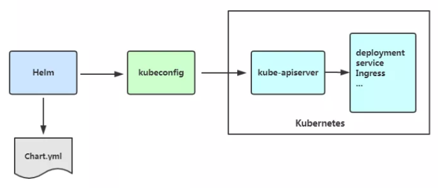

# helm基础与部署
# helm功能

1. Helm就是Kubernetes的应用程序包管理器，类似于Linux系统之上的yum或apt-get等，可用于实现帮助用户查找、分享及使用Kubernetes应用程序。它的核心打包功能组件称为chart，可以帮助用户创建、安装及升级复杂应用。Helm将Kubernetes的资源（如Deployments、Services或ConfigMap等）打包到一个Charts中，制作并测试完成的各个Charts将保存到Charts仓库进行存储和分发。另外，Helm实现了可配置的发布，它支持应用配置的版本管理，简化了Kubernetes部署应用的版本控制、打包、发布、删除和更新等操作。
2. Helm是一个基于Kubernetes的程序包（资源包）管理器，它将一个应用的相关资源组织成为Charts，并通过Charts管理程序包，其使用优势可简单总结为如下几个方面：
+ 管理复杂应用：Charts能够描述哪怕是最复杂的程序结构，其提供了可重复使用的应用安装的定义。
+ 易于升级：使用就地升级和自定义钩子来解决更新的难题。
+ 简单分享：Charts易于通过公共或私有服务完成版本化、分享及主机构建。
+ 回滚：可使用“helm rollback”命令轻松实现快速回滚。

# helm核心术语

1. Helm将Kubernetes应用的相关配置组织为Charts，并通过它完成应用的常规管理操作。使用Charts管理应用的流程包括：
+ 从0开始创建Charts
+ 将Charts及其相关的文件打包为归档格式
+ 将Charts存储于仓库（repository）中并与之交互
+ 在Kubernetes集群中安装或卸载Charts以及管理经Helm安装的应用的版本发行周期
2. 对Helm来说，它具有以下几个关键概念。
+ Charts：即一个Helm程序包，它包含了运行一个Kubernetes应用所需要的镜像、依赖关系和资源定义等，必要时还会包含Service的定义；它类似于yum的rpm文件。
+ Repository：Charts仓库，用于集中存储和分发Charts，类似于Python的PyPI。
+ Config：应用程序实例化安装运行时使用的配置信息。
+ Release：应用程序实例化配置后运行于Kubernetes集群中的一个Charts实例；从V3开始，Release  
不再是全局资源，而是存储在各自命名空间内。

# helm架构
> Helm主要由Helm客户端、Tiller服务器和Charts仓库（repository）组成
>

1. Helm客户端是命令行客户端工具，采用Go语言编写，基于gRPC协议与Tiller  
server交互。它主要完成如下任务。
+ 本地Charts开发。
+ 管理Charts仓库。
+ 与Tiller服务器交互：发送Charts以安装、查询Release的相关信息以及升级或卸载已有的Release。
2. Tiller  
server（V3已将Tiller的删除，通过ApiServer与k8s交互）是托管运行于Kubernetes集群之中的容器化服务应用，它接收来自Helm客户端的请求，并在必要时与Kubernetes API Server进行交互。它主要完成以下任务。
+ 监听来自于Helm客户端的请求。
+ 合并Charts和配置以构建一个Release。
+ 向Kubernetes集群安装Charts并对相应的Release进行跟踪。
+ 升级和卸载Charts。
3. 通常，用户于Helm客户端本地遵循其格式编写Charts文件，而后即可部署于Kuber-netes集群之上运行为一个特定的Release。仅在有分发需求时，才应该将同一应用的Charts文件打包成归档压缩格式提交到特定的Charts仓库。

# Helm工作原理

1. Chart Install 过程：
+ Helm从指定的目录或者tgz文件中解析出Chart结构信息
+ Helm将指定的Chart结构和Values信息通过gRPC传递给Tiller
+ Tiller根据Chart和Values生成一个Release
+ Tiller将Release发送给Kubernetes用于生成Release
2. Chart Update过程：
+ Helm从指定的目录或者tgz文件中解析出Chart结构信息
+ Helm将要更新的Release的名称和Chart结构，Values信息传递给Tiller
+ Tiller生成Release并更新指定名称的Release的History
+ Tiller将Release发送给Kubernetes用于更新Release
3. Chart Rollback过程：
+ Helm将要回滚的Release的名称传递给Tiller
+ Tiller根据Release的名称查找History
+ Tiller从History中获取上一个Release
+ Tiller将上一个Release发送给Kubernetes用于替换当前Release

# Helm 安装
具体可参考文档：[https://www.cuiliangblog.cn/detail/section/215968508](https://www.cuiliangblog.cn/detail/section/215968508)

