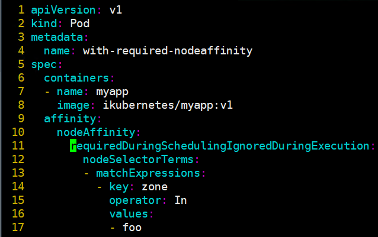
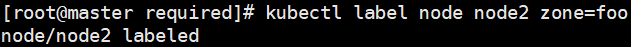
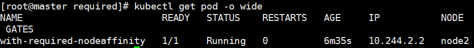
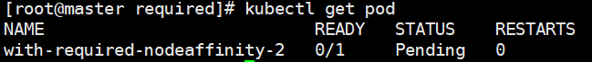
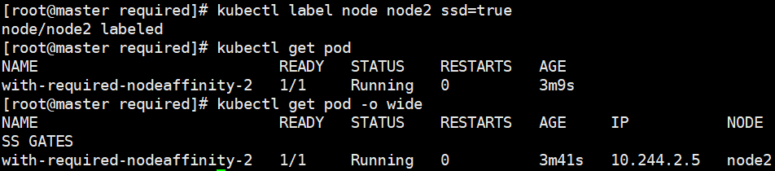
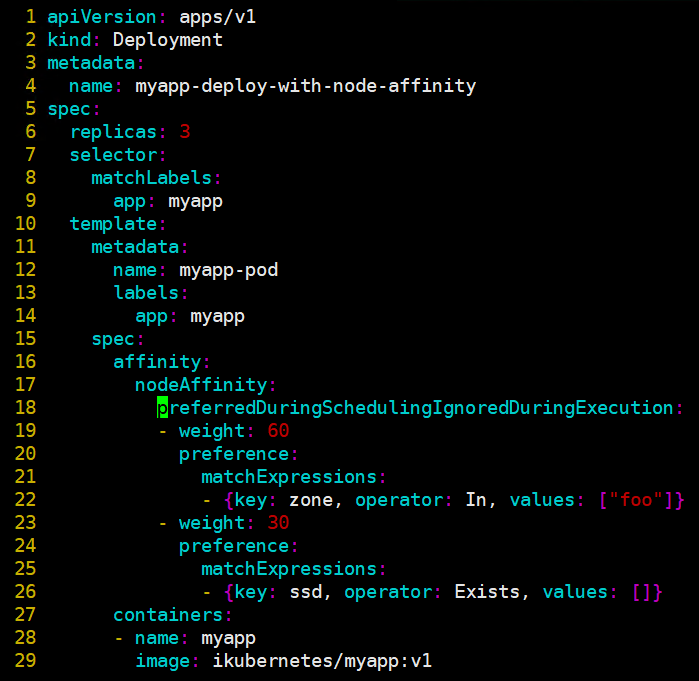

# node亲和调度
# 一、概述

1. 基于节点上的自定义标签和Pod对象上指定的标签选择器将pod调度至node节点
2. 定义节点亲和性规则时有两种类型的节点亲和性规则：硬亲和性（required）和软亲和性（preferred）。
+ 硬亲和性是强制性规则，它是Pod调度时必须要满足的规则，而在不存在满足规则的节点时，Pod对象会被置为Pending状态。
+ 软亲和性是一种柔性调度限制，它倾向于将Pod对象运行于某类特定的节点之上，而调度器也将尽量满足此需求，但在无法满足调度需求时它将退而求其次地选择一个不匹配规则的节点。
3. 定义节点亲和规则的关键点有两个，一是为node配置合乎需求的标签，另一个是为Pod对象定义合理的标签选择器，从而能够基于标签选择出符合期望的目标节点。
4. 在Pod资源基于节点亲和性规则调度至某节点之后，节点标签发生了改变而不再符合此节点亲和性规则时，它仅对新建的Pod对象生效。调度器不会将Pod对象从此节点上移出。
5. 键值运算关系

| In | label 的值在某个列表中 |
| --- | --- |
| NotIn | label 的值不在某个列表中 |
| Gt | label 的值大于某个值 |
| Lt | label 的值小于某个值 |
| Exists | 某个 label 存在 |
| DoesNotExist | 某个 label 不存在 |

6. requiredDuringSchedulingIgnoredDuringExecution字段用于定义节点硬亲和性，由一到多个nodeSelectorTerm定义的对象组成，彼此间为“逻辑或”的关系。
7. nodeSelectorTerm用于定义节点选择器条目，由一个或多个matchExpressions对象定义的匹配规则组成，多个规则彼此之间为“逻辑与”的关系。

# 二、示例

1. 使用节点硬亲和规则定义，将当前Pod对象调度至拥有zone标签且其值为foo的节点之上。

+ 处于Pending阶段，这是由于强制型的节点亲和限制场景中不存在能够满足匹配条件的节点所致

+ 为node2节点设置标签zone=foo，使其满足条件

+ pod节点成功调度至node2

2. 定义了调度拥有两个标签选择器的节点挑选条目，zone=foo且设置ssd标签，两个标签选择器彼此之间为“逻辑与”的关系。

+ 处于pending状态，由于当前node只有zone=foo标签，还未设置ssd标签

+ 给node2设置ssd标签后，成功调度至node2

3. 定义节点软亲和性以选择运行在拥有zone=foo和ssd标签（无论其值为何）的节点之上，其中zone=foo是更为重要的倾向性规则，它的权重为60，ssd标签就没有那么关键，它的权重为30。

+ 将node2原来的zone=foo标签修改为aaa  
`# kubectl label nodes node2 zone='aaa' --overwrite` 
+ apply配置清单后查看pod信息。即便没有zone=foo的node，依然能成功调度

