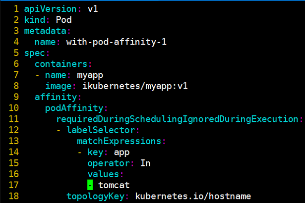
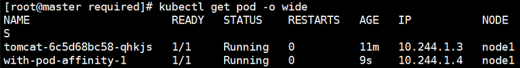
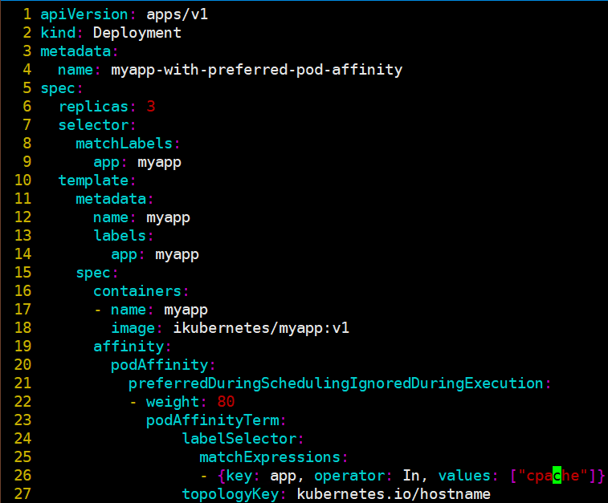
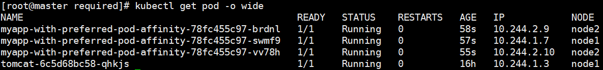
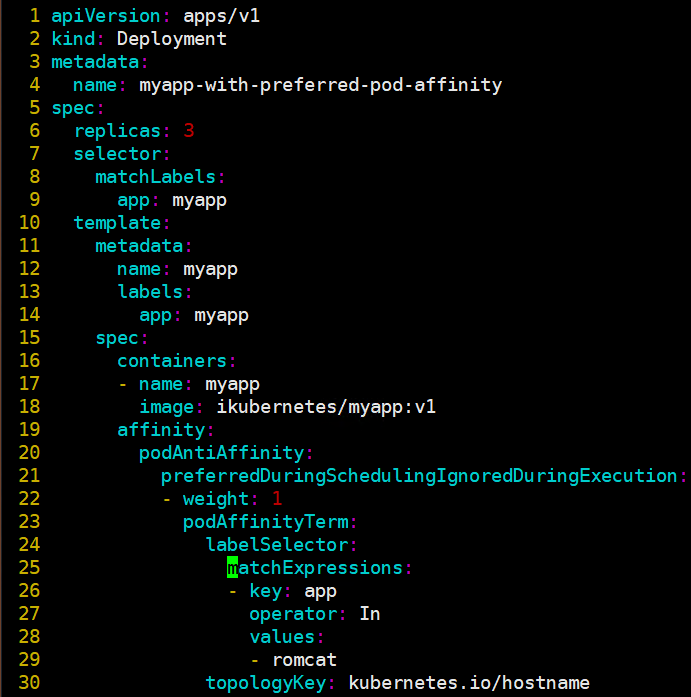
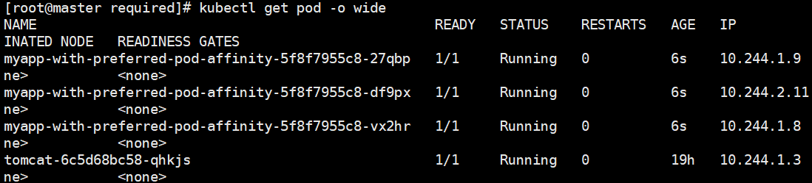

# pod亲和调度

> 分类: Kubernetes > pod调度
> 更新时间: 2026-01-10T23:33:25.845007+08:00

---

# 一、概述

1. 把一些Pod对象组织在相近的位置，如某业务的前端Pod和后端Pod等，这些Pod对象间的关系为亲和性。出于安全或分布式等原因也有可能需要将一些Pod对象在其运行的位置上隔离开来，这些Pod对象间的关系为反亲和性。
2. 常用实现方式是允许调度器把第一个Pod放置于任何位置，而后与其有亲和或反亲和关系的Pod据此动态完成位置编排。
3. Pod的亲和性定义也存在“硬”（required）亲和性和“软”（preferred）亲和性的区别。
4. 亲和性/反亲和性调度策略比较如下：

| 调度策略 | 匹配标签 | 操作符 | 拓扑域支持 | 调度目标 |
| --- | --- | --- | --- | --- |
| nodeAffinity | 主机 | In, NotIn, Exists,DoesNotExist, Gt, Lt | 否 | 指定主机 |
| podAffinity | POD | In, NotIn, Exists,DoesNotExist | 是 | POD与指定POD同一拓扑域 |
| podAnitAffinity | POD | In, NotIn, Exists,DoesNotExist | 是 | POD与指定POD不在同一拓扑域 |

# 二、示例

1. pod硬亲和调度
+ 创建带有标签“app=tomcat”的Deployment资源  
`# kubectl run tomcat -l app=tomcat --image tomcat:alpine` 
+ 定义Pod对象，通过labelSelector定义的标签选择器，使其调度到和app=tomcat的资源到同一个主机名的节点上。

+ 查看pod信息，与“app=tomcat”的Deployment资源在同一node上

2. pod软亲和调度
+ 定义Pod对象，通过labelSelector定义的标签选择器，尽可能使其调度到和app=apache的资源到同一个主机名的节点上。（当前环境不存在app=apache的资源）

+ myapp被调度到了node1和node2节点上

3. pod反亲和调度
+ 定义Pod对象，通过labelSelector定义的标签选择器，使其不要调度到和app=apache的资源在同一个主机名的节点上。（当前环境不存在app=apache的资源）

+ myapp被调度到了node1节点上

