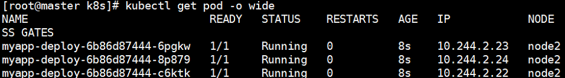

# 固定节点调度
> Pod.spec.nodeName 将 Pod 直接调度到指定的 Node 节点上，会跳过 Scheduler的调度策略，该匹配规则是强制匹配
>

1. 编写资源清单，指定deployment调度至node1节点

2. 查看pod信息，全部调度至node1节点

3. Pod.spec.nodeSelector：通过 kubernetes 的 label-selector机制选择节点，由调度器调度策略匹配 label，而后调度 Pod到目标节点，该匹配规则属于强制约束
+ 编写资源清单，指定deployment调度至disk=ssd标签的节点

+ 给node2设置disk=ssd标签  
`# kubectl label nodes node2 disk=ssd` 
+ 查看pod调度状态信息

