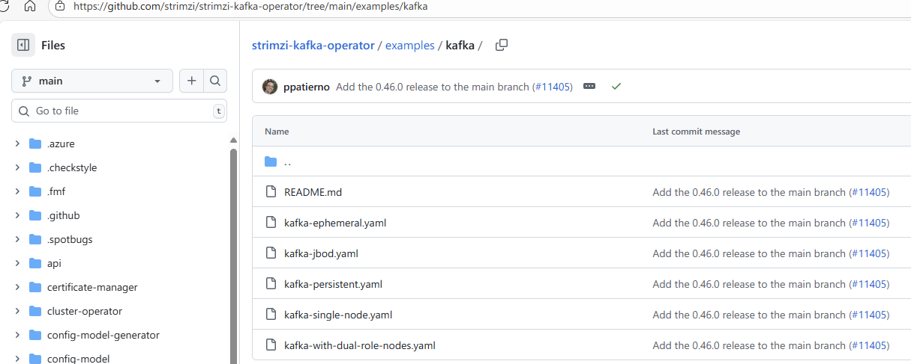
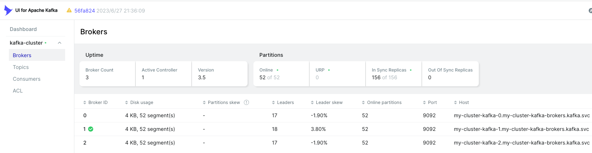

# 部署Kafka消息队列

> 分类: Kubernetes > 周边组件安装部署
> 更新时间: 2026-01-10T23:33:18.538808+08:00

---

> 生产环境推荐的kafka部署方式为operator方式部署，Strimzi是目前最主流的operator方案。因为 kafka 是分布式集群，对 IO 性能要求高，因此生产环境使用话建议使用local pv存储。
>

# 部署operator
## helm部署operator
operator部署方式为helm或yaml文件部署，此处以helm方式部署为例：

```bash
[root@tiaoban kafka]# helm repo add strimzi https://strimzi.io/charts/
"strimzi" has been added to your repositories
[root@tiaoban kafka]# helm pull strimzi/strimzi-kafka-operator --untar
[root@tiaoban kafka]# cd strimzi-kafka-operator
[root@tiaoban strimzi-kafka-operator]# vim values.yaml
dashboards: # 加载grafna dashboard
  enabled: true
  namespace: monitoring
# 安装
[root@k8s-master traefik]# helm install strimzi -n kafka . -f values.yaml --create-namespace
NAME: strimzi
LAST DEPLOYED: Sun Oct 20 20:21:54 2024
NAMESPACE: kafka
STATUS: deployed
REVISION: 1
TEST SUITE: None
NOTES:
Thank you for installing strimzi-kafka-operator-0.43.0

To create a Kafka cluster refer to the following documentation.

https://strimzi.io/docs/operators/latest/deploying.html#deploying-cluster-operator-helm-chart-str
[root@tiaoban strimzi-kafka-operator]# kubectl get pod -n kafka
NAME                                        READY   STATUS    RESTARTS   AGE
strimzi-cluster-operator-56fdbb99cb-gznkw   1/1     Running   0          17m
```

## 获取示例文件
Strimzi官方仓库为我们提供了各种场景下的示例文件，资源清单地址：[https://github.com/strimzi/strimzi-kafka-operator/tree/main/examples/kafka](https://github.com/strimzi/strimzi-kafka-operator/tree/main/examples/kafka)



示例文件说明：

+ kafka-ephemeral.yaml：部署一个临时 Kafka 集群，其中包含一个控制器节点池和一个代理节点池。
+ kafka-jbod.yaml：在每个代理节点中部署具有多个卷的 Kafka 集群。
+ kafka.yaml：部署具有一个控制器节点池和一个代理节点池的持久性 Kafka 集群。
+ kafka-single-node.yaml：部署具有单个节点的 Kafka 集群。
+ kafka-with-dual-role-nodes.yaml：部署一个 Kafka 集群，其中包含一个共享代理和控制器角色的节点池。（推荐）

# KRaft模式部署
## 部署kafka
参考官方仓库的kafka-with-dual-role-nodes.yaml示例文件，部署一个控制代理节点和三个 Kafka 节点的持久集群。

```yaml
[root@tiaoban kafka]# cat > kafka.yaml << EOF
apiVersion: kafka.strimzi.io/v1beta2
kind: KafkaNodePool
metadata:
  name: dual-role
  namespace: kafka
  labels:
    strimzi.io/cluster: my-cluster
spec:
  replicas: 3
  roles:
    - controller
    - broker
  template:
    pod:
      affinity:                             # 节点亲和性
        nodeAffinity:
          requiredDuringSchedulingIgnoredDuringExecution:
            nodeSelectorTerms:
              - matchExpressions:
                  - key: storage
                    operator: In
                    values:
                      - "true"
  storage:
    type: jbod
    volumes:
      - id: 0
        type: persistent-claim
        class: local-path # 使用LocalPathProvisioner本地存储
        size: 100Gi
        deleteClaim: false
        kraftMetadata: shared
---

apiVersion: kafka.strimzi.io/v1beta2
kind: Kafka
metadata:
  name: my-cluster
  namespace: kafka
  annotations:
    strimzi.io/node-pools: enabled
    strimzi.io/kraft: enabled
spec:
  kafka:
    version: 4.0.0
    metadataVersion: 4.0-IV3
    listeners:
      - name: plain
        port: 9092
        type: internal
        tls: false
      - name: tls
        port: 9093
        type: internal
        tls: true
    config:
      offsets.topic.replication.factor: 3
      transaction.state.log.replication.factor: 3
      transaction.state.log.min.isr: 2
      default.replication.factor: 3
      min.insync.replicas: 2
  entityOperator:
    topicOperator: {}
    userOperator: {}
  kafkaExporter: {} # 启用exporter监控
EOF
```

## 访问验证
查看资源信息，已成功创建相关pod和svc资源。

```bash
kubectl get pod -n kafka
NAME                                          READY   STATUS    RESTARTS   AGE
my-cluster-dual-role-0                        1/1     Running   0          3m50s
my-cluster-dual-role-1                        1/1     Running   0          3m50s
my-cluster-dual-role-2                        1/1     Running   0          3m50s
my-cluster-entity-operator-78cf8cd48d-kxmjr   2/2     Running   0          2m14s
my-cluster-kafka-exporter-776f8dfb8c-rhls2    1/1     Running   0          113s
strimzi-cluster-operator-85cc8676d6-k8fvv     1/1     Running   0          21m
[root@tiaoban kafka]# kubectl get svc -n kafka
NAME                         TYPE        CLUSTER-IP       EXTERNAL-IP   PORT(S)                                        AGE
my-cluster-kafka-bootstrap   ClusterIP   10.107.111.213   <none>        9091/TCP,9092/TCP,9093/TCP                     21m
my-cluster-kafka-brokers     ClusterIP   None             <none>        9090/TCP,9091/TCP,8443/TCP,9092/TCP,9093/TCP   21m
```

# 部署kafka-ui
## 创建资源
创建configmap和ingress资源，在configmap中指定kafka连接地址。以traefik为例，创建ingress资源便于通过域名方式访问。

```yaml
[root@tiaoban kafka]# cat kafka-ui.yaml 
apiVersion: v1
kind: ConfigMap
metadata:
  name: kafka-ui-helm-values
  namespace: kafka
data:
  KAFKA_CLUSTERS_0_NAME: "kafka-cluster"
  KAFKA_CLUSTERS_0_BOOTSTRAPSERVERS: "my-cluster-kafka-brokers.kafka.svc:9092"
  AUTH_TYPE: "DISABLED"
  MANAGEMENT_HEALTH_LDAP_ENABLED: "FALSE" 
---
apiVersion: traefik.io/v1alpha1
kind: IngressRoute
metadata:
  name: kafka-ui
  namespace: kafka
spec:
  entryPoints:
  - web
  routes:
  - match: Host(`kafka-ui.local.com`) 
    kind: Rule
    services:
      - name: kafka-ui
        port: 80
[root@tiaoban kafka]# kubectl apply -f kafka-ui.yaml 
configmap/kafka-ui-helm-values created
ingressroute.traefik.containo.us/kafka-ui created
```

## 部署kafka-ui
helm方式部署kafka-ui并指定配置文件

```bash
[root@tiaoban kafka]# helm repo add kafka-ui https://provectus.github.io/kafka-ui-charts
[root@tiaoban kafka]# helm install kafka-ui kafka-ui/kafka-ui -n kafka --set existingConfigMap="kafka-ui-helm-values"
NAME: kafka-ui
LAST DEPLOYED: Mon Oct  9 09:56:45 2023
NAMESPACE: kafka
STATUS: deployed
REVISION: 1
TEST SUITE: None
NOTES:
1. Get the application URL by running these commands:
  export POD_NAME=$(kubectl get pods --namespace kafka -l "app.kubernetes.io/name=kafka-ui,app.kubernetes.io/instance=kafka-ui" -o jsonpath="{.items[0].metadata.name}")
  echo "Visit http://127.0.0.1:8080 to use your application"
  kubectl --namespace kafka port-forward $POD_NAME 8080:8080
```

访问验证，添加hosts记录`192.168.10.100 kafka-ui.local.com`，然后访问测试。



