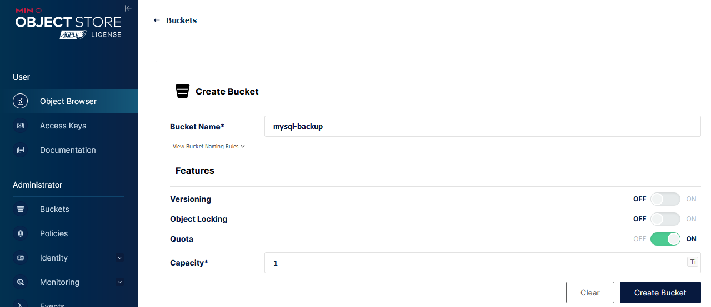
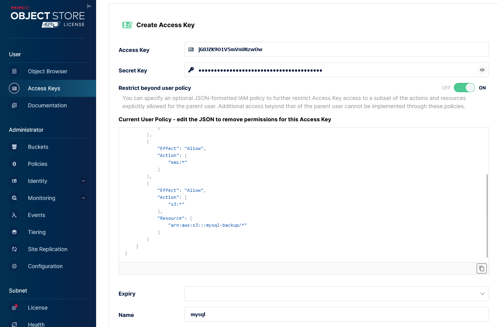
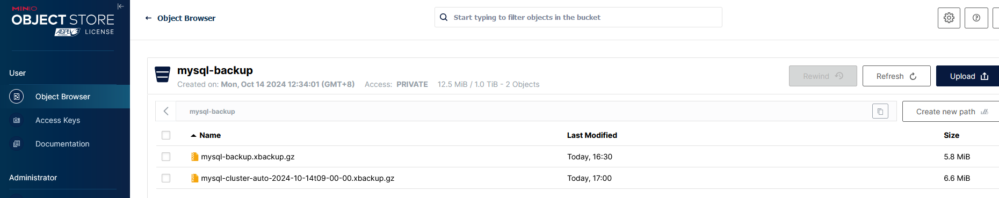

# 部署MySQL数据库
# 部署方案
## Oracle MySQL Operator
由Oracle官方发布，使用<font style="color:rgb(85, 85, 85);">MySQL InnoDB</font>架构，提供了较为完整的 MySQL 集群管理工具和功能，集成了 Oracle 生态中的一些特性（如 MySQL Shell、MySQL Router）， 管理维护较为复杂。 支持强一致性和自动故障转移，适合需要高可靠性和自动恢复的生产级场景。  

仓库地址：[https://github.com/mysql/mysql-operator](https://github.com/mysql/mysql-operator)

参考文档：[https://dev.mysql.com/doc/mysql-operator/en/mysql-operator-preface.html](https://dev.mysql.com/doc/mysql-operator/en/mysql-operator-preface.html)

## Presslabs MySQL Operator
由Bitpoke进行维护，使用主从模式架构。 自动化主从切换、监控 MySQL 节点健康状况，并支持主库的自动提升。适合中小场景便捷部署管理mysql集群场景。本文以Presslabs MySQL Operator为例。

仓库地址：[https://github.com/bitpoke/mysql-operator](https://github.com/bitpoke/mysql-operator)

参考文档：[https://www.bitpoke.io/docs/mysql-operator/getting-started/](https://www.bitpoke.io/docs/mysql-operator/getting-started/)

# 部署MySQL Operator
添加helm repo进行并update

```bash
helm repo add bitpoke https://helm-charts.bitpoke.io

helm update
```

安装mysql-operator

```bash
[root@k8s-master k8s]# helm pull bitpoke/mysql-operator --untar                                                               
[root@k8s-master k8s]# cd mysql-operator 
[root@k8s-master mysql-operator]# ls
Chart.yaml  README.md  crds  templates  values.yaml
[root@k8s-master mysql-operator]# vim values.yaml
  persistence:
    enabled: true
    storageClass: "nfs"
[root@k8s-master mysql-operator]# helm install mysql-operator -n mysql --create-namespace . -f values.yaml 
NAME: mysql-operator
LAST DEPLOYED: Mon Oct 14 11:06:57 2024
NAMESPACE: mysql
STATUS: deployed
REVISION: 1
TEST SUITE: None
NOTES:
You can create a new cluster by issuing:
cat <<EOF | kubectl apply -f-
apiVersion: mysql.presslabs.org/v1alpha1
kind: MysqlCluster
metadata:
  name: my-cluster
spec:
  replicas: 1
  secretName: my-cluster-secret
---
apiVersion: v1
kind: Secret
metadata:
  name: my-cluster-secret
type: Opaque
data:
  ROOT_PASSWORD: $(echo -n "not-so-secure" | base64)
EOF
```

确认mysql-operator状态为Running

```bash
[root@k8s-master mysql-operator]# kubectl get pod -n mysql
NAME               READY   STATUS    RESTARTS   AGE
mysql-operator-0   2/2     Running   0          6s
```

# Mysql集群部署
## 创建root密码Secret
```yaml
# base64编码root密码
[root@k8s-master mysql]# echo -n '123.com' | base64
MTIzLmNvbQ==
# 创建secret资源
[root@k8s-master mysql]# cat root-secret.yaml
apiVersion: v1
kind: Secret
metadata:
  name: mysql-secret
  namespace: mysql
type: Opaque
data:
  ROOT_PASSWORD: MTIzLmNvbQ==
```

## 创建mysql集群
```yaml
[root@k8s-master mysql]# cat mysql.yaml                   
apiVersion: mysql.presslabs.org/v1alpha1
kind: MysqlCluster
metadata:
  name: mysql-cluster
  namespace: mysql
spec:
  replicas: 2
  secretName: mysql-secret
  image: registry.sensetime.com/xlab/k8s/percona:8.0
  mysqlVersion: "8.0"
  volumeSpec:
    persistentVolumeClaim:
      storageClassName: nfs
      accessModes: [ "ReadWriteOnce" ]
      resources:
        requests:
          storage: 10Gi
[root@k8s-master mysql]# kubectl apply -f mysql.yaml -n mysql
mysqlcluster.mysql.presslabs.org/my-cluster created
```

注意事项：默认情况下拉取的镜像是

```plain
percona@sha256:5332a2dd238486f597566403403410e85cc4438f11f317f65458105be00feeba
```

但直接拉取percona:8.0的话，sha256与之前不一致。建议先不设置image参数，查看拉取的image的sha256参数，然后手动拉取再传入harbor仓库。

## 查看验证集群
查看pod状态

```yaml
[root@k8s-master mysql]# kubectl get mysql -n mysql                         
NAME            READY   REPLICAS   AGE
mysql-cluster   True    2          7m
[root@k8s-master mysql]# kubectl get pod -n mysql  
NAME                    READY   STATUS    RESTARTS        AGE
mysql-cluster-mysql-0   4/4     Running   1 (6m34s ago)   7m7s
mysql-cluster-mysql-1   4/4     Running   1 (5m23s ago)   6m4s
mysql-operator-0        2/2     Running   0               3h50m
```

访问mysql数据库

```yaml
[root@k8s-master mysql]# kubectl exec -it -n mysql mysql-cluster-mysql-0 --  bash
Defaulted container "mysql" out of: mysql, sidecar, metrics-exporter, pt-heartbeat, init (init), mysql-init-only (init)
bash-5.1$ mysql -u root -p
Enter password: 
Welcome to the MySQL monitor.  Commands end with ; or \g.
Your MySQL connection id is 389
Server version: 8.0.32-24 Percona Server (GPL), Release 24, Revision e5c6e9d2

Copyright (c) 2009-2023 Percona LLC and/or its affiliates
Copyright (c) 2000, 2023, Oracle and/or its affiliates.

Oracle is a registered trademark of Oracle Corporation and/or its
affiliates. Other names may be trademarks of their respective
owners.

Type 'help;' or '\h' for help. Type '\c' to clear the current input statement.

mysql> show databases;
+--------------------+
| Database           |
+--------------------+
| information_schema |
| mysql              |
| performance_schema |
| sys                |
| sys_operator       |
+--------------------+
5 rows in set (0.01 sec)
```

## 查看web页面
创建ingress资源

```yaml
apiVersion: traefik.io/v1alpha1
kind: IngressRoute
metadata:
  name: mysql-operator
  namespace: mysql
spec:
  entryPoints:
  - web
  routes:
  - match: Host(`mysql.local.com`) # 域名
    kind: Rule
    services:
      - name: mysql-operator  # 与svc的name一致
        port: 80    # 与svc的port一致
```

添加域名解析后访问验证


# Mysql集群备份
## 创建备份密钥Secret
创建<font style="color:rgb(48, 49, 51);">一个名为mysql-backup的bucket，并设置容量上限为1TB</font>



创建ak sk并配置权限



创建secret资源

```yaml
# base64编码AK SK
[root@k8s-master mysql]# echo -n 'jG0JZK9O1V5mVnUNzwOw' | base64
akcwSlpLOU8xVjVtVm5VTnp3T3c=
[root@k8s-master mysql]# echo -n 'KSNFyS6ygf1QgU41K5jLsB1adTG9TSwElQPAx0TF' | base64
S1NORnlTNnlnZjFRZ1U0MUs1akxzQjFhZFRHOVRTd0VsUVBBeDBURg==
[root@k8s-master mysql]# echo -n 'http://minio-service.minio.svc:9000' | base64
aHR0cDovL21pbmlvLXNlcnZpY2UubWluaW8uc3ZjOjkwMDA=
[root@k8s-master mysql]# cat > minio-secret.yaml << EOF
apiVersion: v1
kind: Secret
metadata:
  name: backup-secret
  namespace: mysql
type: Opaque
data:
  AWS_ACCESS_KEY_ID: akcwSlpLOU8xVjVtVm5VTnp3T3c=
  AWS_SECRET_ACCESS_KEY: S1NORnlTNnlnZjFRZ1U0MUs1akxzQjFhZFRHOVRTd0VsUVBBeDBURg==
  S3_PROVIDER: TWluaW8K # 固定写法 minio存储
  S3_ENDPOINT: aHR0cDovL21pbmlvLXNlcnZpY2UubWluaW8uc3ZjOjkwMDA=
EOF
```

## 手动备份
修改mysql配置，新增备份配置

```yaml
[root@k8s-master mysql]# cat mysql.yaml
apiVersion: mysql.presslabs.org/v1alpha1
kind: MysqlCluster
metadata:
  name: mysql-cluster
  namespace: mysql
spec:
  replicas: 2
  secretName: mysql-secret
  image: registry.sensetime.com/xlab/k8s/percona:8.0.36
  mysqlVersion: "8.0"
  volumeSpec:
    persistentVolumeClaim:
      storageClassName: nfs
      accessModes: [ "ReadWriteOnce" ]
      resources:
        requests:
          storage: 10Gi
  backupSecretName: backup-secret # 备份s3 secret
  backupURL: s3://mysql-backup/ # bucket地址
```

创建手动备份任务

```yaml
[root@k8s-master mysql]# cat backup-once.yaml
apiVersion: mysql.presslabs.org/v1alpha1
kind: MysqlBackup
metadata:
  name: mysql-backup
  namespace: mysql
spec:
  clusterName: mysql-cluster
[root@k8s-master mysql]# kubectl apply -f backup-once.yaml 
mysqlbackup.mysql.presslabs.org/mysql-backup created
```

查看备份内容

```yaml
[root@k8s-master mysql]# kubectl get mysqlbackup -n mysql 
NAME           AGE
mysql-backup   61s
[root@k8s-master mysql]# kubectl describe mysqlbackup -n mysql mysql-backup
Name:         mysql-backup
Namespace:    mysql
Labels:       <none>
Annotations:  <none>
API Version:  mysql.presslabs.org/v1alpha1
Kind:         MysqlBackup
Metadata:
  Creation Timestamp:  2024-10-14T08:30:53Z
  Generation:          3
  Resource Version:    809050
  UID:                 e549aa28-81f6-4ab4-8db2-c90e9f8998ff
Spec:
  Backup Secret Name:    backup-secret
  Backup URL:            s3://mysql-backup/mysql-backup.xbackup.gz
  Cluster Name:          mysql-cluster
  Remote Delete Policy:  retain
Status:
  Completed:  true
  Conditions:
    Last Transition Time:  2024-10-14T08:31:01Z
    Message:               
    Reason:                
    Status:                True
    Type:                  Complete
Events:
  Type    Reason              Age   From                    Message
  ----    ------              ----  ----                    -------
  Normal  JobSyncSuccessfull  66s   mysqlbackup-controller  batch/v1, Kind=Job mysql/mysql-backup-backup created successfully
```

查看minio备份信息


## 定时备份
修改mysql配置，新增定时备份配置

```yaml
[root@k8s-master mysql]# cat mysql.yaml                                    
apiVersion: mysql.presslabs.org/v1alpha1
kind: MysqlCluster
metadata:
  name: mysql-cluster
  namespace: mysql
spec:
  replicas: 2
  secretName: mysql-secret
  image: registry.sensetime.com/xlab/k8s/percona:8.0.36
  mysqlVersion: "8.0"
  volumeSpec:
    persistentVolumeClaim:
      storageClassName: nfs
      accessModes: [ "ReadWriteOnce" ]
      resources:
        requests:
          storage: 10Gi
  backupSchedule: "0 0 0 * * *" # 每天0时备份
  backupRemoteDeletePolicy: retain # 历史备份文件保留
  backupSecretName: backup-secret # 备份s3 secret
  backupURL: s3://mysql-backup/ # bucket地址
[root@k8s-master mysql]# kubectl apply -f mysql.yaml                       
mysqlcluster.mysql.presslabs.org/mysql-cluster configured
```

查看备份内容

```bash
[root@k8s-master mysql]# kubectl get mysqlbackup -n mysql
NAME                                     AGE
mysql-backup                             69m
mysql-cluster-auto-2024-10-14t09-00-00   40m
```

查看minio备份文件



# Mysql集群恢复
## 基于备份文件创建恢复集群
```bash
[root@k8s-master mysql]# cat recovery.yaml   
apiVersion: mysql.presslabs.org/v1alpha1
kind: MysqlCluster
metadata:
  name: recovery-cluster
  namespace: mysql
spec:
  replicas: 2
  secretName: mysql-secret
  image: registry.sensetime.com/xlab/k8s/percona:8.0.36
  mysqlVersion: "8.0"
  volumeSpec:
    persistentVolumeClaim:
      storageClassName: nfs
      accessModes: [ "ReadWriteOnce" ]
      resources:
        requests:
          storage: 10Gi
  initBucketURL: s3://mysql-backup/mysql-cluster-auto-2024-10-14t09-00-00.xbackup.gz
  initBucketSecretName: backup-secret
[root@k8s-master mysql]# kubectl apply -f recovery.yaml   
mysqlcluster.mysql.presslabs.org/recovery-cluster created
```

## 确认实例状态为Running
```bash
[root@k8s-master mysql]# kubectl get pod -n mysql
NAME                                                  READY   STATUS      RESTARTS       AGE
mysql-backup-backup-vh7f5                             0/1     Completed   0              85m
mysql-cluster-auto-2024-10-14t09-00-00-backup-9wsfg   0/1     Completed   0              55m
mysql-cluster-mysql-0                                 4/4     Running     1 (151m ago)   151m
mysql-cluster-mysql-1                                 4/4     Running     1 (150m ago)   150m
mysql-operator-0                                      2/2     Running     0              6h15m
recovery-cluster-mysql-0                              4/4     Running     1 (119s ago)   2m10s
recovery-cluster-mysql-1                              4/4     Running     1 (58s ago)    88s
```

## 验证恢复数据
```bash
[root@k8s-master mysql]# kubectl exec -it -n mysql recovery-cluster-mysql-0 -- bash
Defaulted container "mysql" out of: mysql, sidecar, metrics-exporter, pt-heartbeat, init (init), mysql-init-only (init)
bash-5.1$ mysql -u root -p
Enter password: 
Welcome to the MySQL monitor.  Commands end with ; or \g.
Your MySQL connection id is 148
Server version: 8.0.32-24 Percona Server (GPL), Release 24, Revision e5c6e9d2

Copyright (c) 2009-2023 Percona LLC and/or its affiliates
Copyright (c) 2000, 2023, Oracle and/or its affiliates.

Oracle is a registered trademark of Oracle Corporation and/or its
affiliates. Other names may be trademarks of their respective
owners.

Type 'help;' or '\h' for help. Type '\c' to clear the current input statement.

mysql> show databases;
+--------------------+
| Database           |
+--------------------+
| information_schema |
| kuboard            |
| mysql              |
| performance_schema |
| sys                |
| sys_operator       |
+--------------------+
6 rows in set (0.00 sec)
```

# <font style="color:rgb(0, 0, 0);">dbeaver</font>部署
## 资源清单
```yaml
kind: PersistentVolumeClaim
apiVersion: v1
metadata:
  name: dbeaver-pvc
  namespace: mysql
spec:
  storageClassName: nfs-client
  accessModes:
    - ReadWriteOnce
  resources:
    requests:
      storage: 1Gi
---
apiVersion: apps/v1
kind: Deployment
metadata:
  name: dbeaver
  namespace: mysql
  labels:
    app: dbeaver
spec:
  replicas: 1
  selector:
    matchLabels:
      app: dbeaver
  template:
    metadata:
      labels:
        app: dbeaver
    spec:
      containers:
      - name: dbeaver
        image: dbeaver/cloudbeaver:24.2
        ports:
        - containerPort: 8978
          name: web
        resources:
          limits:
            memory: "512Mi"
            cpu: "500m"
        volumeMounts:
        - mountPath: /opt/cloudbeaver/workspace
          name: data
      volumes:
      - name: data
        persistentVolumeClaim:
          claimName: dbeaver-pvc
---
apiVersion: v1
kind: Service
metadata:
  name: dbeaver
  namespace: mysql
  labels:
    app: dbeaver
spec:
  type: ClusterIP
  ports:
  - port: 8978
    targetPort: 8978
  selector:
    app: dbeaver
---
apiVersion: traefik.io/v1alpha1
kind: IngressRoute
metadata:
  name: grafana
  namespace: mysql
spec:
  entryPoints:
  - web
  routes:
  - match: Host(`dbeaver.local.com`)
    kind: Rule
    services:
      - name: dbeaver
        port: 8978
```

## 访问验证


