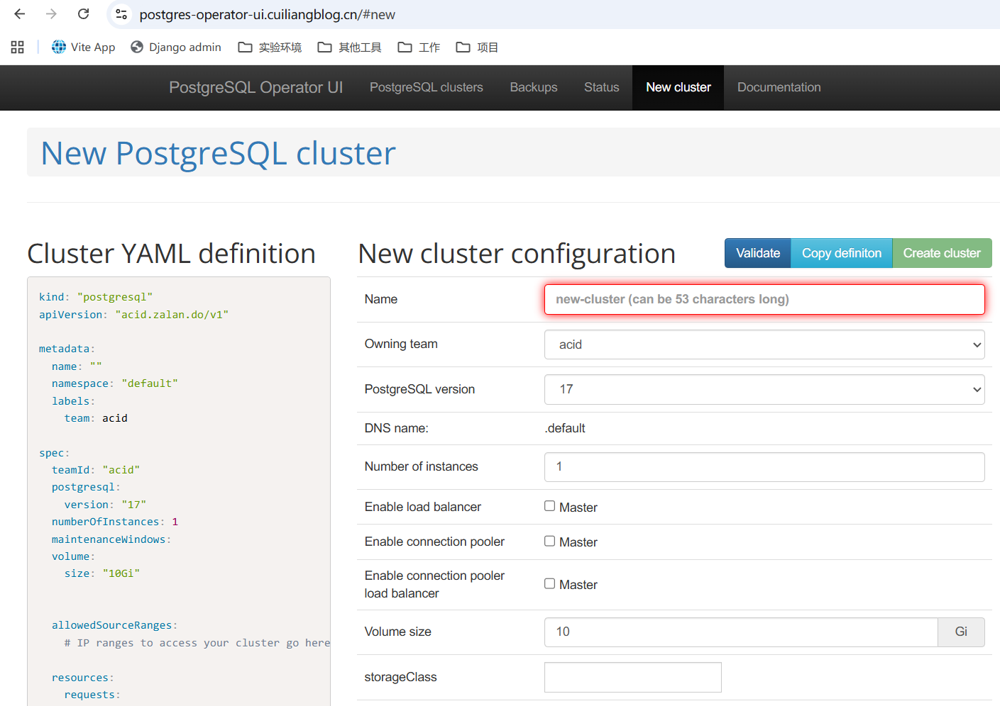

# 部署PostgreSQL数据库
# 部署方案介绍
Bitnami 提供的 postgresql-ha 解决方案是一个预配置的、高可用的 PostgreSQL 集群配置，通常部署在 Kubernetes 环境中。它使用了一些关键技术和组件来实现数据库的高可用性。具体定制参数可参考文档：[https://artifacthub.io/packages/helm/bitnami/postgresql-ha](https://artifacthub.io/packages/helm/bitnami/postgresql-ha)

**Crunchy PostgreSQL Operator** 适合需要企业级支持、复杂 HA 配置和多集群灾备的场景。  参考文档：[https://github.com/CrunchyData/postgres-operator](https://github.com/CrunchyData/postgres-operator)

**Zalando Postgres Operator** 适合追求 GitOps 流程、快速部署和社区支持的用户。  参考文档：[https://github.com/zalando/postgres-operator](https://github.com/zalando/postgres-operator)

此处以Zalando Postgres Operator 为例部署 3 节点高可用的PostgreSQL 集群。

# 部署PostgreSQL 集群
## 获取资源清单
需要注意的是 operator 与 k8s 版本对应关系，具体可参考文档：[https://github.com/zalando/postgres-operator?tab=readme-ov-file#supported-postgres--k8s-versions](https://github.com/zalando/postgres-operator?tab=readme-ov-file#supported-postgres--k8s-versions)，我的 k8s 版本是 1.30，要部署 17 版的 PostgreSQL，operator 版本就是 1.14.0

```bash
# 首先，克隆存储库并切换到目录
# git clone https://github.com/zalando/postgres-operator.git
# cd postgres-operator
# ls
build-ci.sh  cmd         CONTRIBUTING.md  docker  e2e     go.sum  kubectl-pg  logical-backup  Makefile   mkdocs.yml  pkg        run_operator_locally.sh  ui
charts       CODEOWNERS  delivery.yaml    docs    go.mod  hack    LICENSE     MAINTAINERS     manifests  mocks       README.md  SECURITY.md

```

## 部署 operator
```bash
# 创建名称空间
# kubectl create ns postgres-operator
namespace/postgres-operator created
# 按以下顺序应用清单，可修改yaml文件，指定namespace
# 配置
# kubectl create -f manifests/configmap.yaml -n postgres-operator
configmap/postgres-operator created
# 身份和权限
# kubectl create -f manifests/operator-service-account-rbac.yaml -n postgres-operator
serviceaccount/postgres-operator created
clusterrole.rbac.authorization.k8s.io/postgres-operator created
clusterrolebinding.rbac.authorization.k8s.io/postgres-operator created
clusterrole.rbac.authorization.k8s.io/postgres-pod created
# 部署
# kubectl create -f manifests/postgres-operator.yaml  -n postgres-operator
deployment.apps/postgres-operator created
# 通过 UI 使用 operator API
# kubectl create -f manifests/api-service.yaml  -n postgres-operator
service/postgres-operator created
```

查看部署资源信息

```bash
# kubectl get pod -n postgres-operator 
NAME                                 READY   STATUS    RESTARTS   AGE
postgres-operator-6fc99486dc-9q2r7   1/1     Running   0          74s
# kubectl get svc -n postgres-operator 
NAME                TYPE        CLUSTER-IP      EXTERNAL-IP   PORT(S)    AGE
postgres-operator   ClusterIP   10.111.73.154   <none>        8080/TCP   85s
```

## 部署 operator UI
也可提前修改 yaml 文件，指定 namespace。

```bash
# kubectl apply -f ui/manifests/       
deployment.apps/postgres-operator-ui created
middleware.traefik.io/redirect-https-middleware created
ingressroute.traefik.io/postgres created
service/postgres-operator-ui created
serviceaccount/postgres-operator-ui created
clusterrole.rbac.authorization.k8s.io/postgres-operator-ui created
clusterrolebinding.rbac.authorization.k8s.io/postgres-operator-ui created
```

查看资源部署信息

```bash
# kubectl get pod -n postgres-operator
NAME                                    READY   STATUS    RESTARTS   AGE
postgres-operator-6fc99486dc-9q2r7      1/1     Running   0          2m17s
postgres-operator-ui-58df56454f-8t9hf   1/1     Running   0          12s
# kubectl get svc -n postgres-operator 
NAME                   TYPE        CLUSTER-IP      EXTERNAL-IP   PORT(S)    AGE
postgres-operator      ClusterIP   10.111.73.154   <none>        8080/TCP   2m28s
postgres-operator-ui   ClusterIP   10.104.122.31   <none>        80/TCP     23s
```

访问验证



## 创建 Postgres 集群
参考manifests/minimal-postgres-manifest.yaml文件配置，创建集群。完整配置项可参考文档：[https://github.com/zalando/postgres-operator/blob/master/manifests/complete-postgres-manifest.yaml](https://github.com/zalando/postgres-operator/blob/master/manifests/complete-postgres-manifest.yaml)

```yaml
# cat cluster.yaml             
apiVersion: v1
kind: Namespace
metadata:
  name:  postgresql
---
apiVersion: "acid.zalan.do/v1"
kind: postgresql
metadata:
  name: postgres-cluster
  namespace: postgresql
spec:
  teamId: "default" # 团队标识，通常用来区分不同团队的数据库集群
  volume:
    size: 10Gi # 每个 Postgres 实例分配的存储空间
    storageClass: nfs-client 
  numberOfInstances: 2 # 有 1 个主库（primary）+ 1 个副本（replica）
  # users:
  #   zalando:  # 具备 superuser 和 createdb 权限
  #   - superuser
  #   - createdb
  #   foo_user: []  # 没有额外权限（普通角色）
  # databases: # 创建一个名为 foo 的数据库,zalando 用户作为 owner
  #   foo: zalando  # dbname: owner
  # preparedDatabases:
  #   bar: {}
  postgresql: # Postgres 版本
    version: "17"
  dockerImage: ghcr.io/zalando/spilo-17:4.0-p2 # 自定义镜像地址
# kubectl apply -f cluster.yaml       
namespace/postgresql created
postgresql.acid.zalan.do/postgresql-cluster created
```

查看资源信息

```bash
# kubectl get pod -n postgresql        
NAME                 READY   STATUS    RESTARTS   AGE
postgres-cluster-0   1/1     Running   0          89s
postgres-cluster-1   1/1     Running   0          87s
# kubectl get svc -n postgresql
NAME                      TYPE        CLUSTER-IP      EXTERNAL-IP   PORT(S)    AGE
postgres-cluster          ClusterIP   10.105.30.148   <none>        5432/TCP   108s
postgres-cluster-config   ClusterIP   None            <none>        <none>     105s
postgres-cluster-repl     ClusterIP   10.97.81.178    <none>        5432/TCP   108s
```

## 连接Postgres 集群
创建 nodeport 资源，暴露 postgres 服务

```bash
# cat svc-nodeport.yaml             
apiVersion: v1
kind: Service
metadata:
  name: postgresql-cluster-nodeport
  namespace: postgresql
spec:
  internalTrafficPolicy: Cluster
  ipFamilies:
  - IPv4
  ipFamilyPolicy: SingleStack
  ports:
  - name: postgresql
    port: 5432
    protocol: TCP
    targetPort: 5432
    nodePort: 30432
  selector:
    application: spilo
    cluster-name: postgres-cluster
    spilo-role: master # 参考postgres-cluster-repl配置，role改master
  sessionAffinity: None
  type: NodePort                                                                                                                                                                              
# kubectl apply -f svc-nodeport.yaml 
service/postgresql-cluster-nodeport created
# kubectl get svc -n postgresql
NAME                          TYPE        CLUSTER-IP      EXTERNAL-IP   PORT(S)          AGE
postgresql-cluster            ClusterIP   10.108.202.15   <none>        5432/TCP         4m40s
postgresql-cluster-config     ClusterIP   None            <none>        <none>           4m35s
postgresql-cluster-nodeport   NodePort    10.109.13.185   <none>        5432:30432/TCP   97s
postgresql-cluster-repl       ClusterIP   10.107.159.78   <none>        5432/TCP         4m39s
```

查看postgres 默认密码

```bash
# kubectl get secret -n postgresql postgres.postgresql-cluster.credentials.postgresql.acid.zalan.do -o 'jsonpath={.data.password}' | base64 -d
MxIEhEvqt8RVLZiLt30uzGf5UrIzuzzCmrehQQhZSPdTvjD4CjRgjiNBiIQB8S0Y
```

登录 postgres

```bash
# kubectl exec -it -n postgresql postgres-cluster-0 -- bash

This container is managed by runit, when stopping/starting services use sv

Examples:

sv stop cron
sv restart patroni

Current status: (sv status /etc/service/*)

run: /etc/service/patroni: (pid 33) 652s
run: /etc/service/pgqd: (pid 32) 652s

root@postgres-cluster-0:/home/postgres# psql -U postgres
psql (17.2 (Ubuntu 17.2-1.pgdg22.04+1))
Type "help" for help.

postgres=# \l
                                                     List of databases
   Name    |  Owner   | Encoding | Locale Provider |   Collate   |    Ctype    | Locale | ICU Rules |   Access privileges   
-----------+----------+----------+-----------------+-------------+-------------+--------+-----------+-----------------------
 postgres  | postgres | UTF8     | libc            | en_US.utf-8 | en_US.utf-8 |        |           | 
 template0 | postgres | UTF8     | libc            | en_US.utf-8 | en_US.utf-8 |        |           | =c/postgres          +
           |          |          |                 |             |             |        |           | postgres=CTc/postgres
 template1 | postgres | UTF8     | libc            | en_US.utf-8 | en_US.utf-8 |        |           | =c/postgres          +
           |          |          |                 |             |             |        |           | postgres=CTc/postgres
(3 rows)
```

## 修改管理员密码
```bash
# kubectl exec -it -n postgresql postgres-cluster-0 -- bash      

This container is managed by runit, when stopping/starting services use sv

Examples:

sv stop cron
sv restart patroni

Current status: (sv status /etc/service/*)

run: /etc/service/patroni: (pid 24) 10s
run: /etc/service/pgqd: (pid 25) 10s
root@postgresql-cluster-0:/home/postgres# PGPASSWORD='Password123' PGSSLMODE='require' psql -U zalando -h 192.168.10.10 -p 30432 -d postgres
psql: error: connection to server at "192.168.10.10", port 30432 failed: FATAL:  password authentication failed for user "zalando"
root@postgresql-cluster-0:/home/postgres# psql -U postgres
psql (17.2 (Ubuntu 17.2-1.pgdg22.04+1))
Type "help" for help.

postgres=# ALTER USER postgres WITH PASSWORD 'NewPassword123';
ALTER ROLE
postgres=# exit

# 验证
root@postgresql-cluster-0:/home/postgres# PGPASSWORD='NewPassword123' psql -U postgres -h 192.168.10.10 -p 30432 -d postgres
psql (17.2 (Ubuntu 17.2-1.pgdg22.04+1))
SSL connection (protocol: TLSv1.3, cipher: TLS_AES_256_GCM_SHA384, compression: off, ALPN: postgresql)
Type "help" for help.

postgres=# \l
                                                     List of databases
   Name    |  Owner   | Encoding | Locale Provider |   Collate   |    Ctype    | Locale | ICU Rules |   Access privileges   
-----------+----------+----------+-----------------+-------------+-------------+--------+-----------+-----------------------
 postgres  | postgres | UTF8     | libc            | en_US.utf-8 | en_US.utf-8 |        |           | 
 template0 | postgres | UTF8     | libc            | en_US.utf-8 | en_US.utf-8 |        |           | =c/postgres          +
           |          |          |                 |             |             |        |           | postgres=CTc/postgres
 template1 | postgres | UTF8     | libc            | en_US.utf-8 | en_US.utf-8 |        |           | =c/postgres          +
           |          |          |                 |             |             |        |           | postgres=CTc/postgres
(3 rows)
```

外部工具连接测试


## 创建数据库用户
```bash
-- 1. 创建数据库
CREATE DATABASE mydb;

-- 2. 创建用户，并设置密码
CREATE USER myuser WITH PASSWORD 'mypassword';

-- 3. 授权用户管理数据库
GRANT ALL PRIVILEGES ON DATABASE mydb TO myuser;
# 修改owner
ALTER DATABASE mydb OWNER TO myuser;

-- 4. 授权用户管理 schema（一般是 public）
\c mydb  -- 切换到 mydb 数据库执行以下语句

-- 授予 schema 使用权限
GRANT ALL ON SCHEMA public TO myuser;

-- 授予已有表、序列、函数的所有权限
GRANT ALL PRIVILEGES ON ALL TABLES IN SCHEMA public TO myuser;
GRANT ALL PRIVILEGES ON ALL SEQUENCES IN SCHEMA public TO myuser;
GRANT ALL PRIVILEGES ON ALL FUNCTIONS IN SCHEMA public TO myuser;

-- 设置默认权限，确保以后新建的表/序列/函数也自动授权
ALTER DEFAULT PRIVILEGES IN SCHEMA public GRANT ALL PRIVILEGES ON TABLES TO myuser;
ALTER DEFAULT PRIVILEGES IN SCHEMA public GRANT ALL PRIVILEGES ON SEQUENCES TO myuser;
ALTER DEFAULT PRIVILEGES IN SCHEMA public GRANT ALL PRIVILEGES ON FUNCTIONS TO myuser;
```

