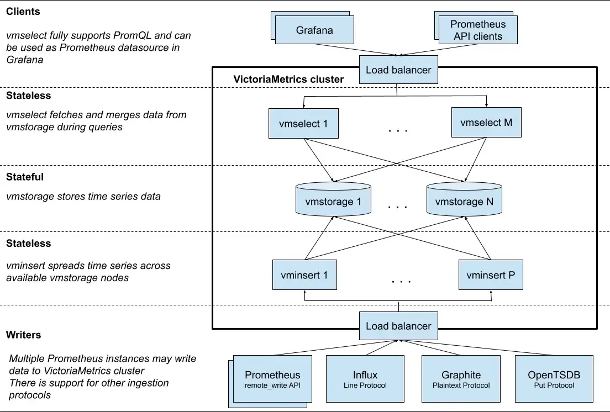
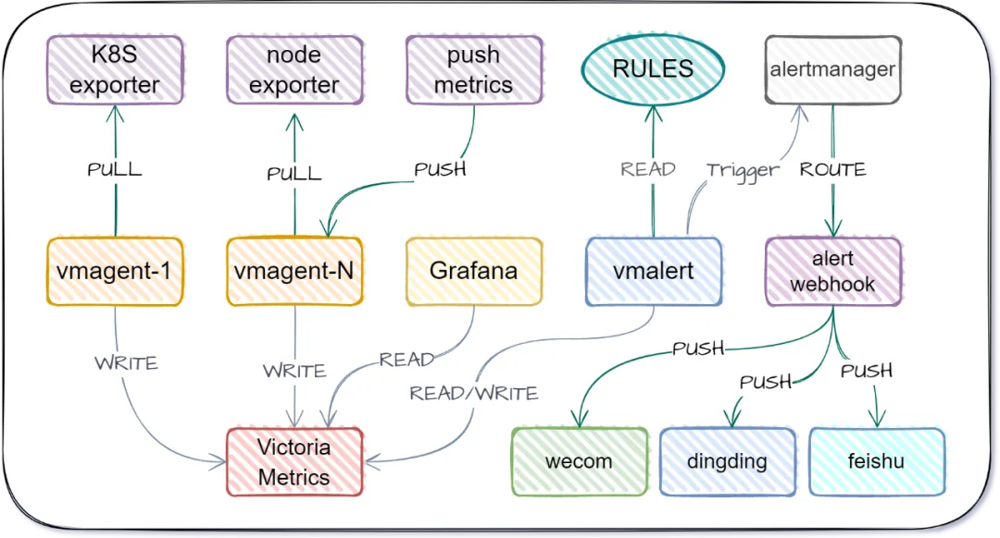
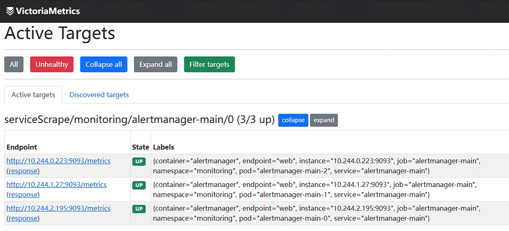
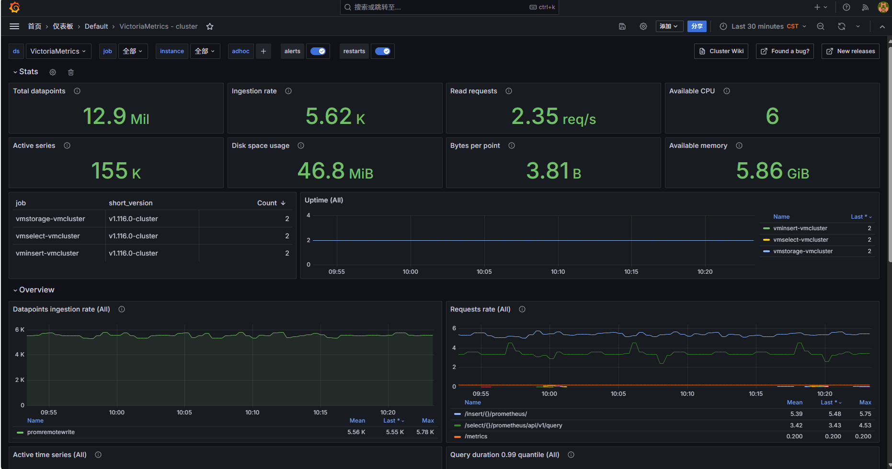

# 部署VictoriaMetrics监控
# VictoriaMetrics 介绍
VictoriaMetrics 是一个高效、低资源占用的指标数据库，兼容 Prometheus，但在压缩率、查询性能、可扩展性方面表现更优秀。对于需要大规模指标数据持久化与分析的团队，特别适合使用它作为核心指标平台。  

相较于 Prometheus 方案，他具备以下几个优势：

+ 可以作为Prometheus的长期远端存储。
+ Vmstore本身提供数据压缩，要比Prometheus本地存储、Thanos的所需存储空间低7倍。
+ 在处理百万级别的时间序列时，比Prometheus、Thanos所需内存低7倍。
+ 支持备份恢复。

## 部署方式
VictoriaMetrics 有 2 种发布形式：

[单机版本](https://victoriametrics.com.cn/docs/ops/single/) - ALL-IN-ONE 的二进制形式，非常易于使用和维护。可以垂直扩展，并轻松处理百万级的 QPS 写入。

[集群版本](https://victoriametrics.com.cn/docs/ops/cluster/) - 一套组件，可用于构建水平可扩展的集群。

## 系统架构


## 组件介绍
VictoriaMetrics 集群版本由以下几个服务组成：

`vmstorage` 存储节点，负责存储数据，是有状态组件。

`vmselect` 查询节点，负责查询数据，Grafana 添加 Prometheus 数据源时使用 `vmselect` 地址，查询数据时，`vmselect` 会调用各个 `vmstorage` 的接口完成数据的查询。

`vminsert`写入节点，负责写入数据，采集器将采集到的数据 "吐到" `vminsert`，然后 `vminsert` 会调用各个 `vmstorage` 的接口完成数据的写入。

每项服务都可独立扩展，并可以在最合适的硬件上运行。`vmstorage`实例之间互不相识，互不通信，也不共享任何数据。 这是一种 [SN 架构](https://en.wikipedia.org/wiki/Shared-nothing_architecture)。这提高了集群的可用性，简化了集群维护和扩展成本。  
`vmagent`采集节点，用于数据采集，可以主动以 PULL 的模式采集业务组件指标，也可以让业务指标自己 [PUSH](https://victoriametrics.com.cn/docs/write/model/#push) 进来；当业务组件采用 PUSH 时，也可以绕过`vmagent`直接 [PUSH](https://victoriametrics.com.cn/docs/write/model/#pull) 到`vmauth`。

除此之外还有一些周边生态组件：

+ vmagent- 替代 Prometheus 的采集部分，并将采集到的 metrics 数据。
+ [vmalert](https://docs.victoriametrics.com/vmalert/) - 用于处理与 Prometheus 兼容的警报和记录规则的服务。
+ [vmalert-tool](https://docs.victoriametrics.com/vmalert-tool/) - 用于验证警报和记录规则的工具。
+ [vmauth](https://docs.victoriametrics.com/vmauth/) - 针对 VictoriaMetrics 产品优化的授权代理和负载均衡器。
+ [vmgateway](https://docs.victoriametrics.com/vmgateway/) - 具有每个租户速率限制功能的授权代理。
+ [vmctl](https://docs.victoriametrics.com/vmctl/) - 用于在不同存储系统之间迁移和复制数据以获取指标的工具。
+ [vmbackup](https://docs.victoriametrics.com/vmbackup/)、vmrestore和vmbackupmanager - 用于为 VictoriaMetrics 数据创建备份和从备份恢复的工具。
+ [VictoriaLogs](https://docs.victoriametrics.com/victorialogs/) - 用户友好、经济高效的日志数据库。

## 组件架构


# VictoriaMetrics 部署
## 安装operator
使用 helm 安装，具体可参考文档：[https://github.com/VictoriaMetrics/helm-charts](https://github.com/VictoriaMetrics/helm-charts)

```bash
# helm repo add vm https://victoriametrics.github.io/helm-charts
# helm repo update
# helm install victoria-operator vm/victoria-metrics-operator -n victoria --create-namespace 
NAME: victoria-operator
LAST DEPLOYED: Fri Oct 10 17:33:23 2025
NAMESPACE: victoria
STATUS: deployed
REVISION: 1
TEST SUITE: None
NOTES:
victoria-metrics-operator has been installed. Check its status by running:
  kubectl --namespace victoria get pods -l "app.kubernetes.io/instance=victoria-operator"

Get more information on https://github.com/VictoriaMetrics/helm-charts/tree/master/charts/victoria-metrics-operator.
See "Getting started guide for VM Operator" on https://docs.victoriametrics.com/guides/getting-started-with-vm-operator
```

检查 operator 是否成功启动:

```bash
# kubectl get pod -n victoria                                              
NAME                                                           READY   STATUS    RESTARTS   AGE
victoria-operator-victoria-metrics-operator-5cf78ddff9-4v424   1/1     Running   0          22s
# kubectl get crd | grep victoria       
vlogs.operator.victoriametrics.com                     2025-05-11T02:03:04Z
vmagents.operator.victoriametrics.com                  2025-05-11T02:03:04Z
vmalertmanagerconfigs.operator.victoriametrics.com     2025-05-11T02:03:04Z
vmalertmanagers.operator.victoriametrics.com           2025-05-11T02:03:04Z
vmalerts.operator.victoriametrics.com                  2025-05-11T02:03:04Z
vmauths.operator.victoriametrics.com                   2025-05-11T02:03:04Z
vmclusters.operator.victoriametrics.com                2025-05-11T02:03:04Z
vmnodescrapes.operator.victoriametrics.com             2025-05-11T02:03:04Z
vmpodscrapes.operator.victoriametrics.com              2025-05-11T02:03:04Z
vmprobes.operator.victoriametrics.com                  2025-05-11T02:03:04Z
vmrules.operator.victoriametrics.com                   2025-05-11T02:03:04Z
vmscrapeconfigs.operator.victoriametrics.com           2025-05-11T02:03:04Z
vmservicescrapes.operator.victoriametrics.com          2025-05-11T02:03:04Z
vmsingles.operator.victoriametrics.com                 2025-05-11T02:03:04Z
vmstaticscrapes.operator.victoriametrics.com           2025-05-11T02:03:04Z
vmusers.operator.victoriametrics.com                   2025-05-11T02:03:04Z
```

## 安装VMCluster
准备 `vmcluster.yaml`:

```yaml
apiVersion: operator.victoriametrics.com/v1beta1
kind: VMCluster
metadata:
  name: vmcluster
  namespace: victoria
spec:
  retentionPeriod: "1" # 默认单位是月，参考 https://docs.victoriametrics.com/Single-server-VictoriaMetrics.html#retention
  vmstorage:
    replicaCount: 2 # 组件副本数
    # image:
    #   repository: victoriametrics/vmstorage
    #   tag: v1.125.0-cluster
    #   pullPolicy: IfNotPresent
    storage:
      volumeClaimTemplate:
        metadata:
          name: data
        spec:
          accessModes: [ "ReadWriteOnce" ]
          storageClassName: nfs-client
          resources:
            requests:
              storage: 100Gi
  vmselect:
    replicaCount: 2
    cacheMountPath: "/select-cache"
    # image:
    #   repository: victoriametrics/vmselect
    #   tag: v1.125.0-cluster
    #   pullPolicy: IfNotPresent
    persistentVolume:
      volumeClaimTemplate:
        metadata:
          name: data
        spec:
          accessModes: [ "ReadWriteOnce" ]
          storageClassName: ceph-fs
          resources:
            requests:
              storage: 1Gi
  vminsert:
    replicaCount: 2
    # image:
    #   repository: victoriametrics/vminsert
    #   tag: v1.125.0-cluster
    #   pullPolicy: IfNotPresent
```

安装

```bash
# kubectl apply -f vmcluster.yaml      
vmcluster.operator.victoriametrics.com/vmcluster created
```

检查组件是否启动成功

```bash
# kubectl get pod -n victoria 
NAME                                                           READY   STATUS    RESTARTS   AGE
victoria-operator-victoria-metrics-operator-5cf78ddff9-4v424   1/1     Running   0          6m20s
vminsert-vmcluster-fd554ff9d-9vrps                             1/1     Running   0          77s
vminsert-vmcluster-fd554ff9d-sld4w                             1/1     Running   0          77s
vmselect-vmcluster-0                                           1/1     Running   0          82s
vmselect-vmcluster-1                                           1/1     Running   0          82s
vmstorage-vmcluster-0                                          1/1     Running   0          87s
vmstorage-vmcluster-1                                          1/1     Running   0          87s
# kubectl get svc -n victoria            
NAME                                          TYPE        CLUSTER-IP     EXTERNAL-IP   PORT(S)                      AGE
victoria-operator-victoria-metrics-operator   ClusterIP   10.103.81.61   <none>        8080/TCP,9443/TCP            6m26s
vminsert-vmcluster                            ClusterIP   10.106.1.243   <none>        8480/TCP                     81s
vmselect-vmcluster                            ClusterIP   None           <none>        8481/TCP                     83s
vmstorage-vmcluster                           ClusterIP   None           <none>        8482/TCP,8400/TCP,8401/TCP   88s
```

## 安装VMAlertmanager
准备 `vmalertmanager.yaml`:

```yaml
apiVersion: operator.victoriametrics.com/v1beta1
kind: VMAlertmanager
metadata:
  name: vmalertmanager
  namespace: victoria
spec:
  # configReloaderImageTag: jimmidyson/configmap-reload:v0.3.0
  # image:
    #   repository: prom/alertmanager
    #   tag: v0.28.1
    #   pullPolicy: IfNotPresent
  replicaCount: 2
  selectAllByDefault: true
```

安装 `VMAlertmanager`:

```bash
# kubectl apply -f vmalertmanager.yaml    
vmalertmanager.operator.victoriametrics.com/vmalertmanager created
```

检查组件是否启动成功

```bash
# kubectl get pod -n victoria 
NAME                                                           READY   STATUS    RESTARTS   AGE
victoria-operator-victoria-metrics-operator-5cf78ddff9-4v424   1/1     Running   0          7m41s
vmalertmanager-vmalertmanager-0                                2/2     Running   0          7s
vmalertmanager-vmalertmanager-1                                2/2     Running   0          7s
vminsert-vmcluster-fd554ff9d-9vrps                             1/1     Running   0          2m38s
vminsert-vmcluster-fd554ff9d-sld4w                             1/1     Running   0          2m38s
vmselect-vmcluster-0                                           1/1     Running   0          2m43s
vmselect-vmcluster-1                                           1/1     Running   0          2m43s
vmstorage-vmcluster-0                                          1/1     Running   0          2m48s
vmstorage-vmcluster-1                                          1/1     Running   0          2m48s
```

## 安装 VMAlert
准备 `vmalert.yaml`:

```yaml
apiVersion: operator.victoriametrics.com/v1beta1
kind: VMAlert
metadata:
  name: vmalert
  namespace: victoria
spec:
  # image:
    #   repository: victoriametrics/vmalert
    #   tag: v1.125.0
    #   pullPolicy: IfNotPresent
  replicaCount: 2
  selectAllByDefault: true
  notifiers:
    - url: http://vmalertmanager-vmalertmanager-0.vmalertmanager-vmalertmanager.victoria.svc:9093
    - url: http://vmalertmanager-vmalertmanager-1.vmalertmanager-vmalertmanager.victoria.svc:9093
  resources:
    requests:
      cpu: 10m
      memory: 10Mi
    limits:
      cpu: 100m
      memory: 100Mi
  remoteWrite:
    url: http://vminsert-vmcluster:8480/insert/0/prometheus/
  remoteRead:
    url: http://vmselect-vmcluster:8481/select/0/prometheus/
  datasource:
    url: http://vmselect-vmcluster:8481/select/0/prometheus/
```

安装 `VMAlert`:

```bash
# kubectl apply -f vmalert.yaml       
vmalert.operator.victoriametrics.com/vmalert created
```

检查组件是否启动成功:

```bash
# kubectl get pod -n victoria 
NAME                                                           READY   STATUS    RESTARTS   AGE
victoria-operator-victoria-metrics-operator-5cf78ddff9-4v424   1/1     Running   0          9m14s
vmalert-vmalert-6cf94d97d4-ns585                               2/2     Running   0          14s
vmalert-vmalert-6cf94d97d4-s5s4v                               2/2     Running   0          14s
vmalertmanager-vmalertmanager-0                                2/2     Running   0          100s
vmalertmanager-vmalertmanager-1                                2/2     Running   0          100s
vminsert-vmcluster-fd554ff9d-9vrps                             1/1     Running   0          4m11s
vminsert-vmcluster-fd554ff9d-sld4w                             1/1     Running   0          4m11s
vmselect-vmcluster-0                                           1/1     Running   0          4m16s
vmselect-vmcluster-1                                           1/1     Running   0          4m16s
vmstorage-vmcluster-0                                          1/1     Running   0          4m21s
vmstorage-vmcluster-1                                          1/1     Running   0          4m21s
```

## 安装 VMAgent
VictoriaMetrics Operator 会自动将你创建的 `ServiceMonitor`（或 `PodMonitor`）资源，转换成 `scrape_configs` 并注入到 VMAgent 中。  

当然，你也可以继续使用 Prometheus，配置remoteWrite 到vminsert 即可。

```yaml
apiVersion: operator.victoriametrics.com/v1beta1
kind: VMAgent
metadata:
  name: vmagent
  namespace: victoria
spec:
  # image:
    #   repository: victoriametrics/vmagent
    #   tag: v1.125.0
    #   pullPolicy: IfNotPresent
  selectAllByDefault: true # 如果没有指定 selector，则默认选择所有资源（即全部匹配）
  resources:
    requests:
      cpu: 10m
      memory: 10Mi
    limits:
      cpu: 100m
      memory: 100Mi
  replicaCount: 2
  externalLabels: # 修改额外标签，用于区分不同prometheus集群
    cluster: "k8s-ha"
  remoteWrite:
  - url: "http://vminsert-vmcluster:8480/insert/0/prometheus/api/v1/write"
```

安装:

```bash
# kubectl apply -f vmagent.yaml 
vmagent.operator.victoriametrics.com/vmagent created
```

检查组件是否启动成功:

```bash
# kubectl get pod -n victoria
NAME                                                           READY   STATUS    RESTARTS   AGE
victoria-operator-victoria-metrics-operator-5cf78ddff9-4v424   1/1     Running   0          10m
vmagent-vmagent-56ff6fd8c-s5kvw                                2/2     Running   0          30s
vmagent-vmagent-56ff6fd8c-vk84v                                2/2     Running   0          30s
vmalert-vmalert-6cf94d97d4-ns585                               2/2     Running   0          88s
vmalert-vmalert-6cf94d97d4-s5s4v                               2/2     Running   0          88s
vmalertmanager-vmalertmanager-0                                2/2     Running   0          2m54s
vmalertmanager-vmalertmanager-1                                2/2     Running   0          2m54s
vminsert-vmcluster-fd554ff9d-9vrps                             1/1     Running   0          5m25s
vminsert-vmcluster-fd554ff9d-sld4w                             1/1     Running   0          5m25s
vmselect-vmcluster-0                                           1/1     Running   0          5m30s
vmselect-vmcluster-1                                           1/1     Running   0          5m30s
vmstorage-vmcluster-0                                          1/1     Running   0          5m35s
vmstorage-vmcluster-1                                          1/1     Running   0          5m35s
```

## 配置 Ingress
查看 svc 资源

```bash
# kubectl get svc -n victoria 
NAME                                          TYPE        CLUSTER-IP       EXTERNAL-IP   PORT(S)                      AGE
victoria-operator-victoria-metrics-operator   ClusterIP   10.103.81.61     <none>        8080/TCP,9443/TCP            10m
vmagent-vmagent                               ClusterIP   10.105.183.176   <none>        8429/TCP                     51s
vmalert-vmalert                               ClusterIP   10.100.68.116    <none>        8080/TCP                     109s
vmalertmanager-vmalertmanager                 ClusterIP   None             <none>        9093/TCP,9094/TCP,9094/UDP   3m15s
vminsert-vmcluster                            ClusterIP   10.106.1.243     <none>        8480/TCP                     5m44s
vmselect-vmcluster                            ClusterIP   None             <none>        8481/TCP                     5m46s
vmstorage-vmcluster                           ClusterIP   None             <none>        8482/TCP,8400/TCP,8401/TCP   5m51s
```

创建 ingress 资源

```yaml
apiVersion: traefik.io/v1alpha1
kind: Middleware
metadata:
  name: redirect-https-middleware
  namespace: victoria
spec:
  redirectScheme:
    scheme: https
---
apiVersion: traefik.io/v1alpha1
kind: IngressRoute
metadata:
  name: victoria
  namespace: victoria 
spec:
  entryPoints:
  - web
  - websecure 
  tls:
    secretName: ingress-tls
  routes:
  - match: Host(`vmselect.cuiliangblog.cn`) # 域名
    kind: Rule
    services:
      - name: vmselect-vmcluster   # 与svc的name一致
        port: 8481    # 与svc的port一致  
    middlewares:
      - name: redirect-https-middleware    
  - match: Host(`vmalert.cuiliangblog.cn`) # 域名
    kind: Rule
    services:
      - name: vmalert-vmalert   # 与svc的name一致
        port: 8080    # 与svc的port一致  
    middlewares:
      - name: redirect-https-middleware    
  - match: Host(`vmalertmanager.cuiliangblog.cn`) # 域名
    kind: Rule
    services:
      - name: vmalertmanager-vmalertmanager   # 与svc的name一致
        port: 9093    # 与svc的port一致  
    middlewares:
      - name: redirect-https-middleware 
  - match: Host(`vmagent.cuiliangblog.cn`) # 域名
    kind: Rule
    services:
      - name: vmagent-vmagent    # 与svc的name一致
        port: 8429    # 与svc的port一致  
    middlewares:
      - name: redirect-https-middleware 
```

访问vmselect，添加 hosts 解析后访问[https://vmselect.cuiliangblog.cn/select/0/vmui/](https://vmselect.cuiliangblog.cn/select/0/vmui/)


访问vmalert，添加 hosts 解析后访问[https://vmalert.cuiliangblog.cn/vmalert/groups](https://vmalert.cuiliangblog.cn/vmalert/groups)


访问vmalertmanager，添加 hosts 解析后访问[https://vmalertmanager.cuiliangblog.cn/](https://vmalertmanager.cuiliangblog.cn/)


访问 vmagent，添加 hosts 解析后访问https://vmagent.cuiliangblog.cn/targets



# 配置 Grafana
## 添加数据源
VictoriaMetrics 兼容 Prometheus，在 Grafana 添加数据源时，使用 Prometheus 类型，如果 Grafana 跟 VictoriaMetrics 安装在同一集群中，可以使用 service 地址

```plain
http://vmselect-vmcluster.victoria.svc:8481/select/0/prometheus/
```


## 添加 Dashboard
VictoriaMetrics 官方提供了几个 Grafana Dashboard，id 分别是:

+ 11176
+ 12683
+ 14205

可以将其导入 Grafana:



# 其他集群指标写入
## 配置思路
方案 1： 在对端 Prometheus（kube-prometheus）里配置 `remote_write`，让它将采集的指标推送到 VictoriaMetrics 集群的 `vminsert` 服务。 

方案 2：在对端部署VMAgent，VictoriaMetrics Operator 会自动将你创建的 `ServiceMonitor`（或 `PodMonitor`）资源，转换成 `scrape_configs` 并注入到 VMAgent 中，配置 `VMAgent`远程写入VictoriaMetrics 集群的 `vminsert` 服务

## 暴露 vminsert 服务
可以使用 nodeport 或者 ingress 暴露，以 ingress 为例：

```yaml
apiVersion: traefik.io/v1alpha1
kind: IngressRoute
metadata:
  name: vminsert
  namespace: victoria 
spec:
  entryPoints:
  - web
  routes:
  - match: Host(`vminsert-vmcluster.cuiliangblog.cn`) # 域名
    kind: Rule
    services:
      - name: vminsert-vmcluster   # 与svc的name一致
        port: 8480    # 与svc的port一致  
```

## 配置 Prometheus 远程写入
```yaml
# cat prometheus-prometheus.yaml 
apiVersion: monitoring.coreos.com/v1
kind: Prometheus
metadata:
  labels:
    app.kubernetes.io/component: prometheus
    app.kubernetes.io/instance: k8s
    app.kubernetes.io/name: prometheus
    app.kubernetes.io/part-of: kube-prometheus
    app.kubernetes.io/version: 2.54.1
  name: k8s
  namespace: monitoring
spec:
  ……
  externalLabels: # 修改额外标签，用于区分不同prometheus集群
    cluster: local
  remoteWrite:
  - url: "http://vminsert-vmcluster.cuiliangblog.cn/insert/0/prometheus/api/v1/write"
    writeRelabelConfigs: # 多副本写入时去重
    - action: labeldrop
      regex: prometheus_replica
# kubectl apply -f prometheus-prometheus.yaml      
prometheus.monitoring.coreos.com/k8s configured
```

## 配置 vmagent
除了使用Prometheus远程写入外，还可以部署vmagent实现数据采集与写入vm集群。

```yaml
apiVersion: operator.victoriametrics.com/v1beta1
kind: VMAgent
metadata:
  name: vmagent
  namespace: victoria
spec:
  image:
    repository: registry.sensetime.com/xlab/victoriametrics/vmagent
    tag: v1.125.0
    pullPolicy: IfNotPresent
  selectAllByDefault: true # 如果没有指定 selector，则默认选择所有资源（即全部匹配）
  resources:
    requests:
      cpu: 10m
      memory: 10Mi
    limits:
      cpu: 1
      memory: 1Gi
  replicaCount: 2
  externalLabels:
    cluster: "k8s-test"
  remoteWrite:
  - url: "http://vminsert-vmcluster.cuiliangblog.cn/insert/0/prometheus/api/v1/write"
```

## 访问 vmselect 验证


# 创建探针监控项创建
方案 1：创建VMProbe 资源，使用 vmagent 定期调用 blackbox-exporter，对指定目标（URL、端口、TCP 服务等）做探测 ，然后通过 vmagent 将数据写入 vm 集群。

方案 2：创建 Probe 资源，使用 Prometheus 定期调用 blackbox-exporter 抓取指标数据，然后remoteWrite 写入 vm 集群。

## 配置采集项
VMProbe 配置如下：

```yaml
apiVersion: operator.victoriametrics.com/v1beta1
kind: VMProbe
metadata:
  name: website-probe
  namespace: victoria
spec:
  jobName: website-probe
  vmAgentSelector: {}  # 匹配所有 vmagent
  module: http_2xx # 可选icmp、tcp_connect、dns、grps等，主要看blackbox-exporter启用的模块
  interval: 30s
  targets:
    staticConfig:
      targets:
        - https://cuiliangblog.cn
        - https://www.baidu.com
      labels: # 添加自定义标签
        team: "public"
        env: "prod"
  vmProberSpec:
    url: http://blackbox-exporter.monitoring.svc:9115
```

使用 Probe 配置如下

```yaml
apiVersion: monitoring.coreos.com/v1
kind: Probe
metadata:
  name: probe-http
  namespace: monitoring
spec:
  jobName: probe-http
  prober:
    url: blackbox-exporter.monitoring.svc:19115
  module: http_2xx
  interval: 30s 
  targets:
    staticConfig:
      static:
        - https://www.baidu.com
        - https://cuiliangblog.cn
      labels:
        env: prod
  sampleLimit: 100
```

## 查看数据


# 创建服务监控项
方案 1：创建VMServiceScrape 或 VMPodScrape 资源，使用 vmagent 对指定 metric 接口拉取数据 ，然后通过 vmagent 将数据写入 vm 集群。

方案 2：创建 ServiceMonitor 或 PodMonitor资源，使用 Prometheus 对指定 metric 接口拉取数据，然后remoteWrite 写入 vm 集群。

## 配置采集项
```yaml
apiVersion: operator.victoriametrics.com/v1beta1
kind: VMServiceScrape
metadata:
  name: example
  labels:
    team: frontend
spec:
  endpoints:
    - port: web
  selector:
    matchLabels:
      app: example-app
```

# 创建告警规则
方案 1：创建ServiceMonitor 或 PodMonitor 资源，使用 Operator 自动将Monitor 转换为VMRule 。

方案 2：直接创建VMRule 资源。

## 配置告警规则
使用 VMRule 创建资源可参考文档：[https://github.com/VictoriaMetrics/operator/blob/master/config/alerting/vmoperator-rules.yaml](https://github.com/VictoriaMetrics/operator/blob/master/config/alerting/vmoperator-rules.yaml)

```yaml
apiVersion: operator.victoriametrics.com/v1beta1
kind: VMRule
metadata:
  name: vmoperator-rules # K8s 资源名，标识这组告警规则对象
spec:
  groups:
  - name: vmoperator # 定义规则分组名称
    interval: 30s # 设置该分组的评估周期
    rules:
    - alert: LogErrors
      expr: |
        sum(
          rate(
            operator_log_messages_total{
              level="error",job=~".*((victoria.*)|vm)-?operator"
            }[5m]
          )
        ) by (cluster) > 0
      for: 15m
      labels:
        severity: warning
        show_at: dashboard
      annotations:
        description: "Operator has too many errors at logs: {{ $value}}, check operator logs"
        dashboard: "{{ $externalURL }}/d/1H179hunk/victoriametrics-operator?ds={{ $labels.dc }}&orgId=1&viewPanel=16"
        summary: "Too many errors at logs of operator: {{ $value}}"
```

