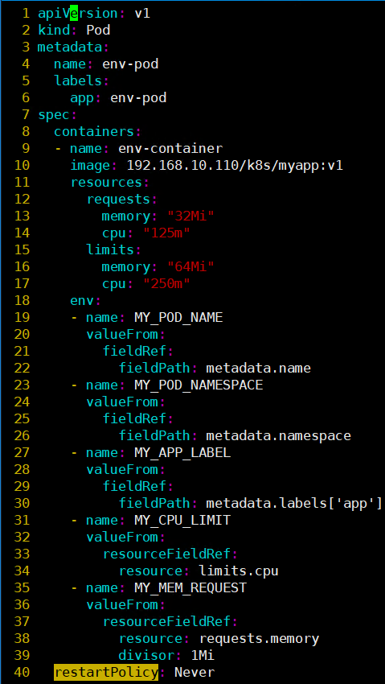
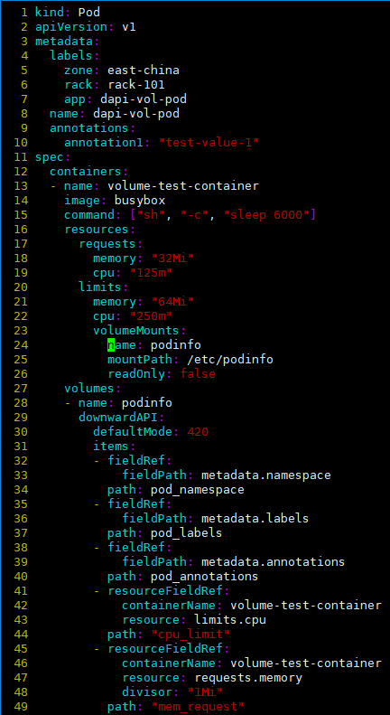

# downwardAPI元数据
> 运行于Kubernetes的Pod对象中的容器化应用偶尔也需要获取其所属Pod对象的IP、主机名、标签、注解、UID、请求的CPU及内存资源量及其限额，甚至是Pod所在的节点名称等，容器可以通过环境变量或downwardAPI存储卷访问此类信息，不过，标签和注解仅支持通过存储卷暴露给容器。
>


# 一、环境变量式元数据注入
1. 因为在进程启动完成后将无法再向其告知变量值的变动，于是，环境变量也就不支持中途的更新操作。
2. 可通过fieldRef字段引用的信息。
+ spec.nodeName：节点名称。
+ status.hostIP：节点IP地址。
+ metadata.name:Pod对象的名称。
+ metadata.namespace:Pod对象隶属的名称空间。
+ status.podIP:Pod对象的IP地址。
+ spec.serviceAccountName:Pod对象使用的ServiceAccount资源的名称。
+ metadata.uid:Pod对象的UID。
+ metadata.labels['<KEY>']:Pod对象标签中的指定键的值
+ metadata.annotations['<KEY>']:Pod对象注解信息中的指定键的值  
通过resourceFieldRef字段引用的信息是指当前容器的资源请求及资源限额的定义，包括requests.cpu、limits.cpu、requests.memory和limits.memory四项。
3. 示例  
资源配置清单中定义的Pod对象通过环境变量向容器env-test-container中注入了Pod对象的名称、隶属的名称空间、标签app的值以及容器自身的CPU资源限额和内存资源请求等信息：



+ 查看环境变量信息


# 二、存储卷式元数据注入


1. 在downwardAPI存储卷中使用fieldRef引用如下两个数据源。
+ metadata.labels:Pod对象的所有标签信息。
+ metadata.annotations:Pod对象的所有注解信息。
2. 示例  
清单中定义的Pod对象通过downwardAPI存储卷向容器volume-test-container中注入了Pod对象隶属的名称空间、标签、注解以及容器自身的CPU资源限额和内存资源请求等信息。存储卷在容器中的挂载点为/etc/podinfo目录




+ 测试访问上述的映射文件，例如，查看Pod对象的标签列表：

```bash
kubectl exec dapi-vol-pod -- cat /etc/podinfo/pod_labels
app="dapi-vol-pod"
rack="rack-101"
zone="east-china"
```


