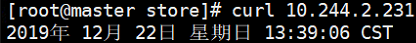
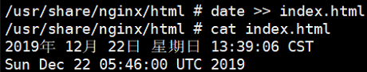
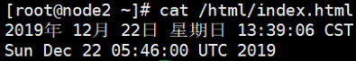

# 节点存储hostPath

> 分类: Kubernetes > 存储
> 更新时间: 2026-01-10T23:33:23.843499+08:00

---

# 一、概述


1. hostPath类型的存储卷是指将工作节点上某文件系统的目录或文件挂载于Pod中的一种存储卷，它可独立于Pod资源的生命周期，因而具有持久性。但它是工作节点本地的存储空间，仅适用于特定情况下的存储卷使用需求。
2. hostPath的用途：
+ 运行需要访问 Docker 内部的容器
+ 使用/var/lib/docker的hostPath在容器中运行 cAdvisor
+ 使用/dev/cgroups的hostPath允许 pod 指定给定的 hostPath 是否应该在 pod运行之前存在，是否应该创建，以及它应该以什么形式存在
3. 配置hostPath存储卷的嵌套字段共有两个：一个是用于指定工作节点上的目录路径的必选字段path；另一个是指定存储卷类型的type，它支持使用的卷类型包含如下几种。
+ DirectoryOrCreate：指定的路径不存时自动将其创建为权限是0755的空目录，属主属组均为kubelet。
+ Directory：必须存在的目录路径。
+ FileOrCreate：指定的路径不存时自动将其创建为权限是0644的空文件，属主和属组同是kubelet。
+ File：必须存在的文件路径。
+ Socket：必须存在的Socket文件路径。
+ CharDevice：必须存在的字符设备文件路径。
+ BlockDevice：必须存在的块设备文件路径。
4. 使用这种卷类型的注意：
+ 由于每个节点上的文件都不同，具有相同配置（例如从 podTemplate 创建的）的 pod在不同节点上的行为可能会有所不同
+ 当 Kubernetes 按照计划添加资源感知调度时，将无法考虑hostPath使用的资源
+ 在底层主机上创建的文件或目录只能由 root 写入。您需要在特权容器中以 root身份运行进程，或修改主机上的文件权限以便写入hostPath卷

# 二、实例
## 本地数据目录挂载


> 存储卷名称为html，将本地/html下的文件挂载于容器nginx的/usr/share/nginx/html目录下，向index.html文件中追加时间信息，而容器nginx中的nginx进程则以其为站点主页。
>


1. 提前在每个节点创建/html目录，并生成index.html文件


2. 创建pod资源清单


3. 访问验证



4. 进入容器修改index.html文件



5. 宿主机查看文件是否更改



## 创建空目录或文件并挂载
```yaml
[root@k8s-master hostpath]# cat pod_hostpath.yaml
apiVersion: v1
kind: Pod
metadata:
  name: pod-hostpath
  namespace: default
spec:
  nodeName: k8s-work1 # 通常固定节点调度，否则pod漂移到其他节点后需要重新创建目录文件
  containers:
  - name: myapp-pod
    image: myapp:v1
    volumeMounts:
    - name: hostpath-dir-volume
      mountPath: /test-k8s/hostpath-dir
    - name: hostpath-file-volume
      mountPath: /test/hostpath-file/test.conf
  volumes:
  - name: hostpath-dir-volume
    hostPath:
      # 宿主机目录
      path: /k8s/hostpath-dir
      # hostPath 卷指定 type，如果目录不存在则创建(可创建多层目录)
      type: DirectoryOrCreate
  - name: hostpath-file-volume
    hostPath:
      path: /k8s2/hostpath-file/test.conf
      # 如果文件不存在则创建。 前提：文件所在目录必须存在  目录不存在则不能创建文件
      type: FileOrCreate
```

