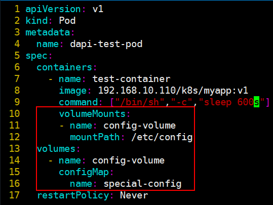
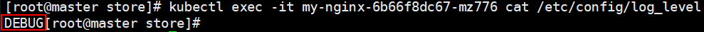

# 配置集合ConfigMap
# 简介


1. 一个ConfigMap对象就是一系列配置数据的集合，这些数据可“注入”到Pod对象中，并为容器应用所使用，注入方式有挂载为存储卷和传递为环境变量两种。
2. ConfigMap对象将配置数据以键值对的形式进行存储，这些数据可以在Pod对象中使用或者为系统组件提供配置。无论应用程序如何使用ConfigMap对象中的数据，用户都完全可以通过在不同的环境中创建名称相同但内容不同的ConfigMap对象，从而为不同环境中同一功能的Pod资源提供不同的配置信息。


# 创建ConfigMap对象


用户可以根据目录、文件或直接值创建ConfigMap对象。命令的语法格式为：`kubectl create configmap <map-name> <data-source>`

+ <map-name>即为ConfigMap对象的名称，而<data-source>是数据源，它可以通过直接值、文件或目录来获取。无论是哪一种数据源供给方式，它都要转换为ConfigMap对象中的Key-Value数据，其中Key由用户在命令行给出或是文件数据源的文件名，它仅能由字母、数字、连接号和点号组成，而Value则是直接值或文件数据源的内容。

## 基于值创建


使用“--from-literal”选项可在命令行直接给出键值对来创建ConfigMap对象，重复使用此选项则可以传递多个键值对

```bash
[root@k8s-master ~]# kubectl create configmap test-config --from-literal=username=root --from-literal=port=8888
configmap/test-config created
```

查看ConfigMap对象test-config的相关信息

```bash
[root@k8s-master ~]# kubectl get configmaps test-config -o yaml
apiVersion: v1
data:
  port: "8888"
  username: root
kind: ConfigMap
metadata:
  creationTimestamp: "2023-06-01T07:36:11Z"
  name: test-config
  namespace: default
  resourceVersion: "1260566"
  uid: 029e2a81-8295-41e8-bee7-cef82ef0eb99
[root@k8s-master ~]# kubectl describe configmaps test-config
Name:         test-config
Namespace:    default
Labels:       <none>
Annotations:  <none>

Data
====
port:
----
8888
username:
----
root

BinaryData
====

Events:  <none>
```

## 基于文件创建
使用“--from-file”选项即可基于文件内容来创建ConfigMap对象，可以重复多次使用“--from-file”选项以传递多个文件内容：

```bash
[root@k8s-master ~]# kubectl create configmap resolv-conf --from-file=/etc/resolv.conf
configmap/resolv-conf created
```

查看ConfigMap对象，其数据存储的键为文件名，值为文件内容

```bash
[root@k8s-master ~]# kubectl get configmaps resolv-conf -o yaml
apiVersion: v1
data:
  resolv.conf: |
    # Generated by NetworkManager
    nameserver 114.114.114.114
kind: ConfigMap
metadata:
  creationTimestamp: "2023-06-01T07:38:47Z"
  name: resolv-conf
  namespace: default
  resourceVersion: "1260855"
  uid: aa534bec-405f-4a7f-8692-0025e5ea36c8
[root@k8s-master ~]# kubectl describe configmaps resolv-conf
Name:         resolv-conf
Namespace:    default
Labels:       <none>
Annotations:  <none>

Data
====
resolv.conf:
----
# Generated by NetworkManager
nameserver 114.114.114.114


BinaryData
====

Events:  <none>
```

## 基于目录创建
将“--from-file”选项后面所跟的路径指向一个目录路径就能将目录下的所有文件一同创建于同一ConfigMap资源中，将/etc/docker/目录下的所有文件都保存于docker-config-files对象中：

```bash
[root@k8s-master ~]# kubectl create configmap docker-config --from-file=/etc/docker/
configmap/docker-config created
```

查看创建的configmap资源，此目录中包含daemon.json key.json两个配置文件。创建ConfigMap资源时，它们会被分别存储为两个键值数据

```bash
[root@k8s-master ~]# kubectl get configmaps docker-config -o yaml
apiVersion: v1
data:
  daemon.json: |
    {
        "registry-mirrors": [
            "https://mirror.ccs.tencentyun.com",
            "https://o2j0mc5x.mirror.aliyuncs.com"
        ],
        "insecure-registries": [
            "http://192.168.10.100"
        ],
        "exec-opts": [
            "native.cgroupdriver=systemd"
        ]
    }
  key.json: '{"crv":"P-256","d":"MGbNgukrge_1ti8--lAoldTBH2biZU-P_1eiR6GLov4","kid":"R3S5:BX3W:DP3O:XRSY:7PJF:FOTL:N3RC:PXWN:L27S:EHPM:P22A:HY7N","kty":"EC","x":"ehNIu7K5qekvIGYffIUf1-iIIhO7qJ-YK79H54otT9k","y":"lsTOxp-7BNIMmWFLHuO1Jrl3my2LzDeNmMOejylGYy4"}'
kind: ConfigMap
metadata:
  creationTimestamp: "2023-06-01T07:40:59Z"
  name: docker-config
  namespace: default
  resourceVersion: "1261096"
  uid: 2ae86fd7-e193-4798-9ef9-511ebbc9086b
[root@k8s-master ~]# kubectl describe configmaps docker-config
Name:         docker-config
Namespace:    default
Labels:       <none>
Annotations:  <none>

Data
====
daemon.json:
----
{
    "registry-mirrors": [
        "https://mirror.ccs.tencentyun.com",
        "https://o2j0mc5x.mirror.aliyuncs.com"
    ],
    "insecure-registries": [
        "http://192.168.10.100"
    ],
    "exec-opts": [
        "native.cgroupdriver=systemd"
    ]
}

key.json:
----
{"crv":"P-256","d":"MGbNgukrge_1ti8--lAoldTBH2biZU-P_1eiR6GLov4","kid":"R3S5:BX3W:DP3O:XRSY:7PJF:FOTL:N3RC:PXWN:L27S:EHPM:P22A:HY7N","kty":"EC","x":"ehNIu7K5qekvIGYffIUf1-iIIhO7qJ-YK79H54otT9k","y":"lsTOxp-7BNIMmWFLHuO1Jrl3my2LzDeNmMOejylGYy4"}

BinaryData
====

Events:  <none>
```

## 使用清单创建配置值
基于配置文件创建ConfigMap资源时，它所使用的字段包括通常的apiVersion、kind和metadata字段，以及用于存储数据的关键字段“data”

```yaml
[root@k8s-master ~]# cat config-value.yaml 
apiVersion: v1
kind: ConfigMap
metadata:
  name: myconfigmap
data:
  log_level: INFO
  log_file: /var/log/my.log
[root@k8s-master ~]# kubectl create -f config-value.yaml 
configmap/myconfigmap created
```

查看资源信息

```yaml
[root@k8s-master ~]# kubectl get configmaps myconfigmap -o yaml
apiVersion: v1
data:
  log_file: /var/log/my.log
  log_level: INFO
kind: ConfigMap
metadata:
  creationTimestamp: "2023-06-01T07:44:24Z"
  name: myconfigmap
  namespace: default
  resourceVersion: "1261474"
  uid: a77af1ff-deb7-4e73-a14e-f5e72da21696
[root@k8s-master ~]# kubectl describe configmaps myconfigmap 
Name:         myconfigmap
Namespace:    default
Labels:       <none>
Annotations:  <none>

Data
====
log_file:
----
/var/log/my.log
log_level:
----
INFO

BinaryData
====

Events:  <none>
```

## 基于清单创建配置文件
可以使用资源清单创建服务的配置文件，用法如下：

```yaml
[root@k8s-master ~]# cat config-file.yaml 
apiVersion: v1
kind: ConfigMap
metadata:
  name: redis-conf
data:
  redis.conf : |-  # 配置文件名称，下面存放配置文件内容
    port 6379
    tls-port 16379
[root@k8s-master ~]# kubectl apply -f config-file.yaml 
configmap/redis-conf created
```

查看资源信息

```yaml
[root@k8s-master ~]# kubectl get configmaps redis-conf -o yaml
apiVersion: v1
data:
  redis.conf: |-
    port 6379
    tls-port 16379
kind: ConfigMap
metadata:
  annotations:
    kubectl.kubernetes.io/last-applied-configuration: |
      {"apiVersion":"v1","data":{"redis.conf":"port 6379\ntls-port 16379"},"kind":"ConfigMap","metadata":{"annotations":{},"name":"redis-conf","namespace":"default"}}
  creationTimestamp: "2023-06-01T07:46:58Z"
  name: redis-conf
  namespace: default
  resourceVersion: "1261758"
  uid: 5ba13d66-8a61-4998-85eb-ce02bfed56dd
[root@k8s-master ~]# kubectl describe configmaps redis-conf
Name:         redis-conf
Namespace:    default
Labels:       <none>
Annotations:  <none>

Data
====
redis.conf:
----
port 6379
tls-port 16379

BinaryData
====

Events:  <none>
```

# 环境变量使用configmap
## 环境变量使用部分键值
在env字段name的值为要引用的ConfigMap对象的名称，字段key可用于指定要引用ConfigMap对象中某键的键名在容器中使用envFrom字段直接将ConfigMap资源中的所有键值一次性地完成导入。

创建configmap资源

```yaml
[root@k8s-master ~]# cat config-value.yaml 
apiVersion: v1
kind: ConfigMap
metadata:
  name: myconfigmap
data:
  log_level: INFO
  log_file: /var/log/my.log
  log_size: 1G
[root@k8s-master ~]# kubectl apply -f config-value.yaml 
configmap/myconfigmap created
```

创建pod，在env中使用部分键值

```yaml
root@k8s-master ~]# cat pod.yaml 
apiVersion: v1
kind: Pod
metadata:
  name: mypod
  labels:
    name: mypod
spec:
  containers:
  - name: mypod
    image: busybox
    command: ["/bin/sh", "-c", "env"]
    env:
      - name: LOG_LEVEL # 环境变量名称
        valueFrom:
          configMapKeyRef:
            key: log_level # configmap的键
            name: myconfigmap # configmap资源名
[root@k8s-master ~]# kubectl apply -f pod.yaml 
pod/mypod created
```

查看pod日志环境变量信息

```yaml
[root@k8s-master ~]# kubectl logs mypod | grep LOG
LOG_LEVEL=INFO
```

## 环境变量使用全部键值
修改pod，在env中使用全部键值

```yaml
[root@k8s-master ~]# cat pod.yaml 
apiVersion: v1
kind: Pod
metadata:
  name: mypod
  labels:
    name: mypod
spec:
  containers:
  - name: mypod
    image: busybox
    command: ["/bin/sh", "-c", "env"]
    envFrom:
    - configMapRef:
        name: myconfigmap # configmap资源名
[root@k8s-master ~]# kubectl apply -f pod.yaml 
pod/mypod created
```

查看pod日志环境变量信息

```yaml
[root@k8s-master ~]# kubectl logs mypod | grep log
log_size=1G
log_file=/var/log/my.log
log_level=INFO
```

## 命令行参数使用ConfigMap
创建pod资源，在启动参数中echo变量信息

```yaml
[root@k8s-master ~]# cat pod.yaml 
apiVersion: v1
kind: Pod
metadata:
  name: mypod
  labels:
    name: mypod
spec:
  containers:
  - name: mypod
    image: busybox
    command: ["/bin/sh", "-c", "echo", "$(LOG_LEVEL)"]
    env:
      - name: LOG_LEVEL # 环境变量名称
        valueFrom:
          configMapKeyRef:
            key: log_level # configmap的键
            name: myconfigmap # configmap资源名
[root@k8s-master ~]# kubectl apply -f pod.yaml 
pod/mypod created
```

查看pod输出信息

```yaml
[root@k8s-master ~]# kubectl logs mypod
INFO
```

# 容器挂载使用config
## 通过数据卷使用整个ConfigMap
创建pod资源，将configmap挂载到/etc/config



进入pod容器查看文件内容


## 通过数据卷使用部分ConfigMap值


创建pod资源，将configmap挂载到/etc/config


进入pod查看文件内容


## configmap权限问题
k8s中configmap挂载文件的权限默认是420。这是十进制表示，转换成八进制就是644,如果容器中使用非root用户，此时文件没有可执行权限，需要修改文件权限。修改文件权限的方法如下：  
在volumes字段中修改defaultMode参数的值。

```yaml
volumes:
- name: postgresql-config
  configMap:
    defaultMode: 493
    name: postgresql-config
```

**<font style="color:rgb(37, 41, 51);">yaml中权限定义是用十进制的</font>**<font style="color:rgb(37, 41, 51);">，权限设置成493，转换成八进制就是755。</font>

## subPath 子路径
 `subPath` 是 Kubernetes 中的一个功能，用于**将 Volume 的一部分内容（子路径）单独挂载到容器中的特定路径**。它允许你只挂载 Volume 中的某个文件或子目录，而不是整个 Volume。  

**使用场景**

1. **选择性挂载**： 只需要 Volume 中的一部分内容，而不是全部。
2. **多个文件挂载到同一目录**： 当需要将同一个目录用于不同 Volume 的多个文件时，可以避免相互覆盖。
3. **挂载文件到指定路径**： 如果 Volume 是一个 ConfigMap 或 Secret，你可以选择将其中的某个键（文件）挂载到特定位置。

挂载单个文件

```yaml
apiVersion: v1
kind: ConfigMap
metadata:
  name: example-config
data:
  key1: value1
  key2: value2
---
apiVersion: v1
kind: Pod
metadata:
  name: example-pod
spec:
  containers:
  - name: example-container
    image: nginx
    volumeMounts:
    - name: config-vol
      mountPath: /app/config/key1
      subPath: key1
  volumes:
  - name: config-vol
    configMap:
      name: example-config
```

+ 同一目录挂载多个文件

```yaml
# configmap-one
key1: value1
# configmap-two
key2: value2
# 将它们的内容挂载到同一个目录 /app/config
apiVersion: v1
kind: Pod
metadata:
  name: example-pod
spec:
  containers:
  - name: example-container
    image: nginx
    volumeMounts:
    - name: config-one
      mountPath: /app/config/key1
      subPath: key1
    - name: config-two
      mountPath: /app/config/key2
      subPath: key2
  volumes:
  - name: config-one
    configMap:
      name: configmap-one
  - name: config-two
    configMap:
      name: configmap-two
```

+ 不使用 subPath 时覆盖问题： 如果不使用 `subPath`，将整个 Volume 挂载到同一个目录，可能导致内容被覆盖。  

```yaml
apiVersion: v1
kind: Pod
metadata:
  name: example-pod
spec:
  containers:
  - name: example-container
    image: nginx
    volumeMounts:
    - name: config-one
      mountPath: /app/config
    - name: config-two
      mountPath: /app/config
  volumes:
  - name: config-one
    configMap:
      name: configmap-one
  - name: config-two
    configMap:
      name: configmap-two

```

# configmap热更新
创建资源清单，变量log_level: INFO，数据卷挂载到deployment中


进入pod容器查看文件内容


修改configmap  
`# kubectl edit configmap log-config` 


进入pod查看文件内容



# 注意事项
1. ConfigMap是名称空间级的资源，因此，引用它的Pod必须处于同一名称空间中。
2. ConfigMap 更新后滚动更新 Pod更新 ConfigMap 目前并不会触发相关 Pod  
的滚动更新，可以通过修改 pod annotations 的方式强制触发滚动更新
3. 在.spec.template.metadata.annotations中添加version/config，每次通过修改version/config来触发滚动更新
4. 更新 ConfigMap 后：使用该 ConfigMap 挂载的 Env 不会同步更新使用该 ConfigMap  
挂载的 Volume 中的数据需要一段时间（实测大概10秒）才能同步更新

