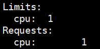
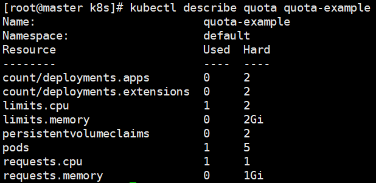

# 准入控制
# 一、简介

1. 在经由认证插件和授权插件分别完成身份认证和权限检查之后，准入控制器将拦截那些创建、更新和删除相关的操作请求以强制实现控制器中定义的功能，包括执行对象的语义验证、设置缺失字段的默认值、限制所有容器使用的镜像文件必须来自某个特定的Registry、检查Pod对象的资源需求是否超出了指定的限制范围等。
2. 准入控制是API Server的插件集合，通过添加不同的插件，实现额外的准入控制规则。甚至于API Server的一些主要的功能都需要通过 Admission Controllers 实现，比如ServiceAccount
3. 在具体运行时，准入控制可分为两个阶段，第一个阶段变更准入控制，用来修改请求的对象，第二个阶段验证准入控制，用于验证请求的对象，在此过程中，一旦任一阶段中的任何控制器拒绝请求，则立即拒绝整个请求，并向用户返回错误。

# 二、常用控制器
+ AlwaysPullImages：总是拉取远端镜像；好处：可以避免本地镜像被恶意入侵而篡改
+ LimitRanger：此准入控制器将确保所有资源请求不会超过namespace的LimitRange（定义Pod级别的资源限额，如cpu、mem）
+ ResourceQuota：此准入控制器将观察传入请求并确保它不违反命名空间的ResourceQuota对象中列举的任何约束（定义名称空间级别的配额，如pod数量）
+ PodSecurityPolicy：此准入控制器用于创建和修改pod，并根据请求的安全上下文和可用的Pod安全策略确定是否应该允许它。
+ ServiceAccount：实现了自动化添加 ServiceAccount。

# 三、LimitRange资源与LimitRanger准入控制器

1. 使用LimitRange资源在每个名称空间中为每个容器指定最小及最大计算资源用量，甚至是设置默认的计算资源需求和计算资源限制。在名称空间上定义了LimitRange对象之后，客户端提交创建或修改的资源对象将受到LimitRanger控制器的检查，任何违反LimitRange对象定义的资源最大用量的请求将被直接拒绝。
2. LimitRange资源支持限制容器、Pod、PersistentVolumeClaim的系统资源用量，其中Pod和容器主要用于定义可用的CPU和内存资源范围，而PersistentVolume-Claim则主要定义存储空间的限制范围。
3. 以容器的CPU资源为例，default用于定义默认的资源限制，defaultRequest定义默认的资源需求，min定义最小的资源用量，而最大的资源用量既可以使用max给出固定值，也可以使用maxLimitRequestRatio设定为最小用量的指定倍数：
4. 示例
+ 创建资源清单，设置资源限制

+ 创建测试正常pod  
`kubectl run limit-pod1 --image=ikubernetes/myapp:v1 --restart=Never` 
+ 查看pod默认信息

+ 创建pod对象设定的系统资源需求量大于LimitRange中的最大用量限制  
`kubectl run limit-pod2 --image=ikubernetes/myapp:v1 --restart=Never --limits='cpu=3000m'` 

# 四、ResourceQuota资源与准入控制器

1. ResourceQuota资源用于定义名称空间的对象数量或系统资源配额，它支持限制每种资源类型的对象总数，以及所有对象所能消耗的计算资源及存储资源总量等。
2. 管理员可为每个名称空间分别创建一个ResourceQuota对象，随后，用户在名称空间中创建资源对象，ResourceQuota准入控制器将跟踪使用情况以确保它不超过相应ResourceQuota对象中定义的系统资源限制。
3. ResourceQuota对象可限制指定名称空间中非终止状态的所有Pod对象的计算资源需求及计算资源限制总量
4. 示例
+ 编辑配置文件resoucequota-demo.yaml，并apply

+ describe命令打印其限额的生效情况

+ 创建一个pod后查看信息  
`kubectl run limit-pod1 --image=ikubernetes/myapp:v1 --restart=Never`

 

