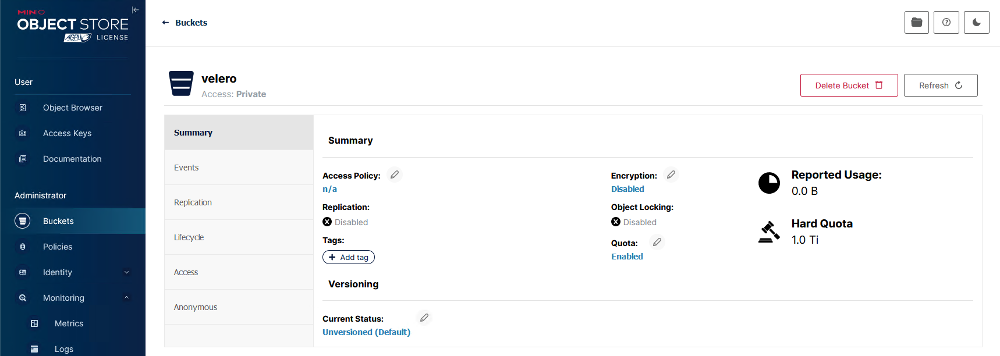
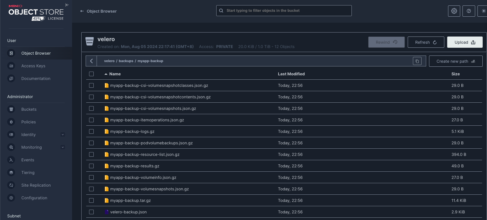

# Velero集群备份还原与迁移

> 分类: Kubernetes > 日常维护
> 更新时间: 2026-01-10T23:33:29.499759+08:00

---

# 简介
## Velero介绍
Velero 是一个云原生的灾难恢复和迁移工具，它本身也是开源的, 采用 Go 语言编写，可以安全的备份、恢复和迁移Kubernetes集群资源和持久卷。

1. <font style="color:rgba(0, 0, 0, 0.75);">备份可以按集群资源的子集，按命名空间、资源类型标签选择器进行过滤，从而为备份和恢复的内容提供高度的灵活性</font>
2. <font style="color:rgba(0, 0, 0, 0.75);">支持复制当前 Kubernetes 集群的资源到其它 Kubernetes 集群</font>
3. <font style="color:rgba(0, 0, 0, 0.75);">通过聚合 API 服务器公开的资源可以轻松备份和恢复，即使它们存储在单独的 etcd 数据库中</font>
+ 开源地址：[https://github.com/vmware-tanzu/velero](https://github.com/vmware-tanzu/velero)
+ 官方文档：[Velero Docs - Overview](https://velero.io/docs/v1.14/)

## Velero组件
Velero 组件一共分两部分，分别是服务端和客户端。

+ **服务端**：<font style="color:rgb(25, 27, 31);">运行在Kubernetes集群中（运行在Pod中）</font>
+ **客户端**：<font style="color:rgb(25, 27, 31);">运行在本地的velero命令行工具，包括安装服务端、备份、定时任务备份、恢复等命令，特别需要注意的是，安装服务端时需要在机器上已配置好kubectl及集群kubeconfig。</font>

## <font style="color:rgb(25, 27, 31);">velero使用场景</font>
+ <font style="color:rgb(25, 27, 31);">灾备场景：提供备份恢复k8s集群的能力</font>
+ <font style="color:rgb(25, 27, 31);">迁移场景：提供拷贝集群资源到其他集群的能力（两个集群连接同一个对象存储地址）</font>

## <font style="color:rgb(25, 27, 31);">与etcd备份区别</font>
+ <font style="color:rgb(25, 27, 31);">直接备份 Etcd 是将集群的全部资源备份起来，而 Velero 可以对 Kubernetes 集群内对象级别进行备份。</font>
+ <font style="color:rgb(25, 27, 31);">除了对 Kubernetes 集群进行整体备份外，Velero 还可以通过对 Type、Namespace、Label、Pod  
</font><font style="color:rgb(25, 27, 31);">等对象进行分类备份或者恢复。</font>

## velero工作流程
**备份数据：**

本地velero客户端发送备份命令，就会调用API Server创建Backup资源对象

服务端收到通知有新的Backup对象创建并执行验证

服务端开始执行备份过程，向API Server查询需要备份的数据

服务端调用对象存储服务，将备份数据保存到对象对象存储上

**恢复数据：**

本地velero客户端发送恢复指令，就会调用API Server创建Restore资源对象

服务端收到通知有新的Restore对象创建并执行验证

服务端调用对象存储，将指定的备份文件下载下来

服务端开始执行恢复过程，根据备份数据调用API Server重新创建相关资源对象


## Velero后端存储
`Velero`支持两种关于后端存储的`CRD`，分别是`BackupStorageLocation`和`VolumeSnapshotLocation`。

**BackupStorageLocation**

主要用来定义 Kubernetes 集群资源的数据存放位置，也就是集群对象数据，不是 PVC 的数据。主要支持的后端存储是 S3 兼容的存储，比如：Mino 和阿里云 OSS 等。

**VolumeSnapshotLocation**

主要用来给 PV 做快照，需要云提供商提供插件。阿里云已经提供了插件，这个需要使用 CSI 等存储机制。也可以使用专门的备份工具 `Restic`，把 PV 数据备份到阿里云 OSS 中去(安装时需要自定义选项)。

> Restic 是一款 GO 语言开发的数据加密备份工具，顾名思义，可以将本地数据加密后传输到指定的仓库。支持的仓库有 Local、SFTP、Aws S3、Minio、OpenStack Swift、Backblaze B2、Azure BS、Google Cloud storage、Rest Server。
>

## <font style="color:rgb(36, 41, 47);">备份有状态数据</font>
velero 有两种备份有状态数据的方式，对比如下

| 考量维度 | 基于 CSI 快照 | 文件复制 |
| --- | --- | --- |
| 应用性能影响 | 低，CSI 接口调用存储系统快照 | 取决于数据量，占用额外资源 |
| 数据可用性 | 依赖于存储系统，需要使用支持快照的CSI | 对象存储和生产环境隔离，独立可用性，支持跨站点可用性 |
| 数据一致性 | 支持 Crash Consistency，配合 hook 机制实现一致性 | 无保障，基于 hook |


文件复制会进行加密、压缩、增量备份，压缩比在60%左右，备份文件都是加密后的二进制文件，打开乱码

两种文件复制插件：

Restic(默认) [https://restic.readthedocs.io/en/latest/100_references.html#terminology](https://restic.readthedocs.io/en/latest/100_references.html#terminology)

Kopia [https://kopia.io/docs/advanced/architecture](https://kopia.io/docs/advanced/architecture)

# 准备minIO存储
Velero支持很多种存储插件，可查看：[https://velero.io/docs/main/supported-providers/](https://velero.io/docs/main/supported-providers/)获取插件信息，我们这里使用minio作为S3兼容的对象存储提供程序。您也可以在任意地方部署Minio对象存储，只需要保证K8S集群可以访问到即可。

## 安装部署
部署过程可参考文档：[https://www.cuiliangblog.cn/detail/section/121560332](https://www.cuiliangblog.cn/detail/section/121560332)

## 创建bucket


## 创建Access Key并配置权限


# 安装velero
## 安装velero
软件包下载地址：[https://github.com/vmware-tanzu/velero/releases](https://github.com/vmware-tanzu/velero/releases)

```bash
[root@tiaoban k8s]# wget https://github.com/vmware-tanzu/velero/releases/download/v1.14.0/velero-v1.14.0-linux-amd64.tar.gz
[root@tiaoban k8s]# tar -zxvf velero-v1.14.0-linux-amd64.tar.gz 
[root@tiaoban ~]# mv velero-v1.14.0-linux-amd64/velero /usr/bin/
[root@tiaoban ~]# velero version
Client:
        Version: v1.14.0
        Git commit: ea5a89f83b89b2cb7a27f54148683c1ee8d57a37
<error getting server version: no matches for kind "ServerStatusRequest" in version "velero.io/v1">
```

启用命令补全

```bash
[root@tiaoban ~]# source <(velero completion bash)
[root@tiaoban ~]# velero completion bash > /etc/bash_completion.d/velero
```

## 创建minIO密钥
```bash
[root@tiaoban ~]# cat > credentials-velero <<EOF
[default]
aws_access_key_id = 3PLipAJkOumVWGZGRHZg
aws_secret_access_key = S9syQfiGfTvvuRUXleWL69yh7mf5doxAZXQnM9rn
EOF
```

## 安装velero到k8s集群
备份数据需要通过s3协议上传到minIO对象存储，提前下载aws插件[https://github.com/vmware-tanzu/velero-plugin-for-aws](https://github.com/vmware-tanzu/velero-plugin-for-aws)并上传仓库

需要准备的镜像列表

```yaml
velero/velero-plugin-for-aws:v1.10.0
velero/velero:v1.14.0
velero/velero-restore-helper:v1.14.0
```

部署 velero

```bash
# 执行install命令后会创建一系列清单，包括CustomResourceDefinition、Namespace、Deployment等。
[root@tiaoban ~]# velero install \
  --provider aws \
  --image harbor.local.com/velero/velero:v1.14.0 \
  --plugins harbor.local.com/velero/velero-plugin-for-aws:v1.10.0 \
  --bucket velero \
  --secret-file ./credentials-velero \
  --use-node-agent \
  --uploader-type=restic \
  --privileged-node-agent \
  --use-volume-snapshots=false \
  --namespace velero \
  --backup-location-config region=minio,s3ForcePathStyle="true",s3Url=http://minio-api.local.com \
  --wait
# 配置恢复工具镜像地址(解决内网环境无法访问dockerhub问题)
[root@tiaoban velero]# cat > config.yaml <<EOF
apiVersion: v1
kind: ConfigMap
metadata:
  name: fs-restore-action-config
  namespace: velero
  labels:
    velero.io/plugin-config: ""
    velero.io/pod-volume-restore: RestoreItemAction
data:
  image: harbor.local.com/velero/velero-restore-helper:v1.14.0 # 恢复镜像地址
EOF
[root@tiaoban velero]# kubectl apply -f config.yaml 
configmap/fs-restore-action-config created
[root@tiaoban ~]# kubectl get all -n velero 
NAME                          READY   STATUS    RESTARTS   AGE
pod/node-agent-8cpz4          1/1     Running   0          50s
pod/node-agent-bl98j          1/1     Running   0          50s
pod/node-agent-pnl82          1/1     Running   0          50s
pod/node-agent-rvz99          1/1     Running   0          50s
pod/node-agent-t25wf          1/1     Running   0          50s
pod/node-agent-vlqn6          1/1     Running   0          50s
pod/velero-6c7f5c9466-8nnjw   1/1     Running   0          50s

NAME                        DESIRED   CURRENT   READY   UP-TO-DATE   AVAILABLE   NODE SELECTOR   AGE
daemonset.apps/node-agent   6         6         6       6            6           <none>          50s

NAME                     READY   UP-TO-DATE   AVAILABLE   AGE
deployment.apps/velero   1/1     1            1           50s

NAME                                DESIRED   CURRENT   READY   AGE
replicaset.apps/velero-6c7f5c9466   1         1         1       50s
[root@tiaoban ~]# kubectl get backupstoragelocation -A
NAMESPACE   NAME      PHASE       LAST VALIDATED   AGE   DEFAULT
velero      default   Available   1s               15m   true
[root@tiaoban ~]# kubectl get backupstoragelocations.velero.io -A
NAME      PHASE         LAST VALIDATED   AGE     DEFAULT
default   Available     23s              15m     true
```

**选项说明：**

+ `--kubeconfig`(可选)：指定`kubeconfig`认证文件，默认使用`.kube/config`；
+ `--provider`：定义插件提供方；
+ `--image`：定义运行velero的镜像，默认与velero客户端一致；
+ `--plugins`：指定使用aws s3兼容的插件镜像；
+ `--bucket`：指定对象存储Bucket桶名称；
+ `--secret-file`：指定对象存储认证文件；
+ `--use-node-agent`：<font style="color:rgb(17, 17, 17);">启用文件系统备份，</font>创建Velero Node Agent守护进程，托管FSB模块；
+ `--uploader-type=restic`：使用<font style="color:rgb(37, 41, 51);">Restic工具备份</font>
+ `<font style="color:rgb(37, 41, 51);">--privileged-node-agent</font>`<font style="color:rgb(37, 41, 51);">: </font>节点代理需要在特权模式下运行
+ `--use-volume-snapshots`：是否启使用快照；
+ `--namespace`：指定部署的namespace名称，默认为velero；
+ `--backup-location-config`：指定对象存储地址信息，需要注意的是如果指定域名的话，服务器端必须能解析到。

**aws插件与velero版本对应关系：**

| <font style="background-color:rgba(255, 255, 255, 0);">Plugin Version</font> | <font style="background-color:rgba(255, 255, 255, 0);">Velero Version</font> |
| --- | --- |
| <font style="background-color:rgba(255, 255, 255, 0);">v1.10.x</font> | <font style="background-color:rgba(255, 255, 255, 0);">v1.14.x</font> |
| <font style="background-color:rgba(255, 255, 255, 0);">v1.9.x</font> | <font style="background-color:rgba(255, 255, 255, 0);">v1.13.x</font> |
| <font style="background-color:rgba(255, 255, 255, 0);">v1.8.x</font> | <font style="background-color:rgba(255, 255, 255, 0);">v1.12.x</font> |
| <font style="background-color:rgba(255, 255, 255, 0);">v1.7.x</font> | <font style="background-color:rgba(255, 255, 255, 0);">v1.11.x</font> |
| <font style="background-color:rgba(255, 255, 255, 0);">v1.6.x</font> | <font style="background-color:rgba(255, 255, 255, 0);">v1.10.x</font> |


## 其他命令
```bash
# 可使用如下命令查看运行日志
[root@tiaoban ~]# kubectl logs deployment/velero -n velero
 
# 查看velero创建的api对象
[root@tiaoban ~]# kubectl api-versions | grep velero
velero.io/v1
velero.io/v2alpha1
 
# 查看备份信息
[root@tiaoban ~]# velero backup-location get
NAME      PROVIDER   BUCKET/PREFIX   PHASE         LAST VALIDATED                  ACCESS MODE   DEFAULT
default   aws        velero          Available     2024-08-05 22:45:08 +0800 CST   ReadWrite     true
```

## 卸载velero
如果您想从集群中完全卸载Velero，则以下命令将删除由`velero install`创建的所有资源:

```plain
kubectl delete namespace/velero clusterrolebinding/velero
kubectl delete crds -l component=velero
```

# 数据备份
## 备份命令
`velero create backup NAME [flags]`  
**backup选项：**

+ `--exclude-namespaces stringArray` : 要从备份中排除的名称空间
+ `--exclude-resources stringArray`: 要从备份中排除的资源，如`storageclasses.storage.k8s.io`
+ `--include-cluster-resources optionalBool[=true]`: 包含集群资源类型
+ `--include-namespaces stringArray`: 要包含在备份中的名称空间(默认'*')
+ `--include-resources stringArray`: 备份中要包括的资源
+ `--labels mapStringString`: 给这个备份加上标签
+ `-o, --output string`: 指定输出格式，支持'table'、'json'和'yaml'；
+ `-l, --selector labelSelector`: 对指定标签的资源进行备份
+ `--snapshot-volumes optionalBool[=true]`: 对 PV 创建快照
+ `--storage-location string`: 指定备份的位置
+ `--ttl duration`: 备份数据多久删掉
+ `--volume-snapshot-locations strings`: 指定快照的位置，也就是哪一个公有云驱动

## 创建测试应用
```bash
[root@tiaoban velero]# cat > redis.yaml <<EOF
apiVersion: v1
kind: Namespace
metadata:
  name:  redis
---
kind: PersistentVolumeClaim
apiVersion: v1
metadata:
  name: reids-pvc
  namespace: redis
spec:
  storageClassName: nfs-client
  accessModes:
    - ReadWriteMany
  resources:
    requests:
      storage: 10Mi
---
apiVersion: apps/v1
kind: Deployment
metadata:
  name: redis
  namespace: redis
spec:
  selector:
    matchLabels:
      app: redis
  template:
    metadata:
      labels:
        app: redis
    spec:
      containers:
      - name: redis
        image: harbor.local.com/library/redis:7
        resources:
          limits:
            memory: "128Mi"
            cpu: "500m"
        ports:
          - containerPort: 6379
        volumeMounts:
          - name: redis-data
            mountPath: "/data"
      volumes:
        - name: redis-data
          persistentVolumeClaim:
            claimName: reids-pvc
---
apiVersion: v1
kind: Service
metadata:
  name: redis
  namespace: redis
spec:
  type: ClusterIP
  selector:
    app: redis
  ports:
  - port: 6379
    targetPort: 6379
EOF
[root@tiaoban velero]# kubectl apply -f redis.yaml 
namespace/redis created
persistentvolumeclaim/reids-pvc created
deployment.apps/redis created
service/redis created
# 查看资源清单
[root@tiaoban velero]# kubectl get all -n redis
NAME                         READY   STATUS    RESTARTS   AGE
pod/redis-7cf5f784f6-8c9xg   1/1     Running   0          26s

NAME            TYPE        CLUSTER-IP       EXTERNAL-IP   PORT(S)    AGE
service/redis   ClusterIP   10.109.225.198   <none>        6379/TCP   26s

NAME                    READY   UP-TO-DATE   AVAILABLE   AGE
deployment.apps/redis   1/1     1            1           26s

NAME                               DESIRED   CURRENT   READY   AGE
replicaset.apps/redis-7cf5f784f6   1         1         1       26s
# 添加测试数据
[root@tiaoban velero]# kubectl exec -it -n redis redis-7cf5f784f6-8c9xg -- redis-cli
127.0.0.1:6379> set key hello
OK
127.0.0.1:6379> get key
"hello"
127.0.0.1:6379> exit
```

## 备份测试应用
```bash
[root@tiaoban velero]# velero backup create redis-backup --include-namespaces=redis --default-volumes-to-fs-backup
Backup request "redis-backup" submitted successfully.
Run `velero backup describe redis-backup` or `velero backup logs redis-backup` for more details.
```

选项：

+ `--include-namespaces`：指定命名空间
+ `--selector`：标签选择器，如app=nginx
+ `--default-volumes-to-fs-backup`：同时备份pv

## 备份数据查看
查看备份列表

```bash
[root@tiaoban velero]# velero backup get
NAME           STATUS      ERRORS   WARNINGS   CREATED                         EXPIRES   STORAGE LOCATION   SELECTOR
redis-backup   Completed   0        0          2024-08-06 10:37:12 +0800 CST   29d       default            <none>
# 查看备份详细信息
[root@tiaoban velero]# velero backup describe redis-backup --details
# 查看备份日志
[root@tiaoban velero]# velero backup logs redis-backup
```

minio控制台查看备份内容



删除备份

```yaml
velero backup delete default-backup
# 默认删除时 不会立刻移除对象存储里的数据，它只是给这个备份打一个 deletionTimestamp，后台清理。
# 如果你想 强制立刻删除存储里的数据，需要加 --confirm：
velero backup delete default-backup --confirm
```

## 定时备份命令
```plain
# 使用cron表达式备份
$ velero schedule create redis-daily --schedule="0 1 * * *" --include-namespaces redis --ttl 72h
 
# 手动触发定时任务
$ velero backup create --from-schedule redis-daily
```

+ `--schedule="0 1 * * *"` → 每天凌晨 1 点执行一次
+ `--include-namespaces` → 只备份 `production` 命名空间
+ `--ttl 72h` → 每个备份只保留 72 小时（3 天），超过会被自动删除

```plain
# 查看定时备份计划
velero schedule get
# 删除定时备份计划
velero schedule delete redis-daily
```

# 数据恢复
## 模拟灾难
```bash
# 删除myapp命名空间和资源
[root@tiaoban velero]# kubectl delete namespace redis
namespace "redis" deleted
# 检查是否删除
[root@tiaoban velero]# kubectl get all -n redis
No resources found in redis namespace.
```

## 恢复资源
```bash
[root@tiaoban velero]# velero backup get
NAME           STATUS      ERRORS   WARNINGS   CREATED                         EXPIRES   STORAGE LOCATION   SELECTOR
redis-backup   Completed   0        0          2024-08-06 10:37:12 +0800 CST   29d       default            <none>
[root@tiaoban velero]# velero restore create --from-backup redis-backup
Restore request "redis-backup-20240806103902" submitted successfully.
Run `velero restore describe redis-backup-20240806103902` or `velero restore logs redis-backup-20240806103902` for more details.
```

## 检查恢复的资源
```bash
[root@tiaoban velero]# velero restore get
NAME                          BACKUP         STATUS      STARTED                         COMPLETED                       ERRORS   WARNINGS   CREATED                         SELECTOR
redis-backup-20240806103902   redis-backup   Completed   2024-08-06 10:39:02 +0800 CST   2024-08-06 10:39:03 +0800 CST   0        1          2024-08-06 10:39:02 +0800 CST   <none>
# 查看详细信息
[root@tiaoban velero]# velero restore describe redis-backup-20240806103902 --details
# 检查资源状态
[root@tiaoban velero]# kubectl get all -n redis
NAME                         READY   STATUS    RESTARTS   AGE
pod/redis-7cf5f784f6-8c9xg   1/1     Running   0          41s

NAME            TYPE        CLUSTER-IP    EXTERNAL-IP   PORT(S)    AGE
service/redis   ClusterIP   10.98.9.199   <none>        6379/TCP   41s

NAME                    READY   UP-TO-DATE   AVAILABLE   AGE
deployment.apps/redis   1/1     1            1           41s

NAME                               DESIRED   CURRENT   READY   AGE
replicaset.apps/redis-7cf5f784f6   1         1         1       41s
# 查看pv数据
[root@tiaoban velero]# kubectl exec -it -n redis redis-7cf5f784f6-8c9xg -- redis-cli
127.0.0.1:6379> get key
hello
```

# <font style="color:rgb(0, 0, 0);">项目迁移</font>
## <font style="color:rgb(51, 51, 51);">项目介绍</font>
使用`Velero`快速完成云原生应用及PV数据的迁移实践过程，在本文示例中，我们将A集群中的一个redis应用迁移到集群B中，其中数据备份采用自建Minio对象存储服务。

## <font style="color:rgb(51, 51, 51);">环境准备</font>
1. 迁移项目最好保证两个Kubernetes集群版本一致(避免不同k8s版本apiversion不一致)。
2. 为了保证PV数据成功迁移，两边需要安装好相同名字的`StorageClass`。
3. 两个集群安装相同版本的velero。
4. 两个集群均可访问minIO服务。

## 源集群备份
查看源集群redis名称空间资源

```bash
[root@k8s-master velero]# kubectl get all -n redis 
NAME                         READY   STATUS    RESTARTS   AGE
pod/redis-7cf5f784f6-smqfz   1/1     Running   0          13m

NAME            TYPE        CLUSTER-IP     EXTERNAL-IP   PORT(S)    AGE
service/redis   ClusterIP   10.105.74.57   <none>        6379/TCP   13m

NAME                    READY   UP-TO-DATE   AVAILABLE   AGE
deployment.apps/redis   1/1     1            1           13m

NAME                               DESIRED   CURRENT   READY   AGE
replicaset.apps/redis-7cf5f784f6   1         1         1       13m
[root@k8s-master velero]#  kubectl exec -it -n redis redis-7cf5f784f6-smqfz -- redis-cli
127.0.0.1:6379> get key
"hello"
127.0.0.1:6379> exit
```

备份源集群redis空间资源

```bash
[root@k8s-master velero]# velero backup create redis-backup --include-namespaces=redis --default-volumes-to-fs-backup
Backup request "redis-backup" submitted successfully.
Run `velero backup describe redis-backup` or `velero backup logs redis-backup` for more details.
[root@k8s-master velero]# velero backup get
NAME           STATUS      ERRORS   WARNINGS   CREATED                         EXPIRES   STORAGE LOCATION   SELECTOR
redis-backup   Completed   0        0          2024-08-06 22:51:55 +0800 CST   29d       default            <none>
```

## 目的集群恢复
查看目的集群redis空间资源

```bash
[root@master1 velero]# kubectl get all -n redis
No resources found in redis namespace.
```

目的集群数据恢复

```bash
# 到目的集群中查看备份资源
[root@master1 velero]# velero backup get
NAME           STATUS      ERRORS   WARNINGS   CREATED                         EXPIRES   STORAGE LOCATION   SELECTOR
redis-backup   Completed   0        0          2024-08-06 22:51:55 +0800 CST   29d       default            <none>
# 执行恢复命令
[root@master1 velero]# velero restore create --from-backup redis-backup
Restore request "redis-backup-20240806225432" submitted successfully.
Run `velero restore describe redis-backup-20240806225432` or `velero restore logs redis-backup-20240806225432` for more details.
# 查看恢复任务
[root@master1 velero]# velero restore get 
NAME                          BACKUP         STATUS      STARTED                         COMPLETED                       ERRORS   WARNINGS   CREATED                         SELECTOR
redis-backup-20240806225432   redis-backup   Completed   2024-08-06 22:54:32 +0800 CST   2024-08-06 22:54:33 +0800 CST   0        1          2024-08-06 22:54:32 +0800 CST   <none>
```

查看目的集群redis空间资源

```bash
[root@master1 velero]# kubectl get all -n redis
NAME                         READY   STATUS    RESTARTS   AGE
pod/redis-7cf5f784f6-smqfz   1/1     Running   0          97s

NAME            TYPE        CLUSTER-IP       EXTERNAL-IP   PORT(S)    AGE
service/redis   ClusterIP   10.100.122.122   <none>        6379/TCP   97s

NAME                    READY   UP-TO-DATE   AVAILABLE   AGE
deployment.apps/redis   1/1     1            1           96s

NAME                               DESIRED   CURRENT   READY   AGE
replicaset.apps/redis-7cf5f784f6   1         1         1       97s
[root@master1 velero]# kubectl exec -it -n redis redis-7cf5f784f6-smqfz -- redis-cli
127.0.0.1:6379> get key
"hello"
127.0.0.1:6379> exit
```

# 总结
1. <font style="color:rgb(0, 0, 0);">Velero 能备份还原 K8S 的资源对象，且可按自定义需求设置备份粒度。</font>
2. <font style="color:rgb(0, 0, 0);">Velero 在备份还原 nfs storageclass 作为后端存储的应用时，备份/恢复数据均正常，未见异常。</font>
3. <font style="color:rgb(0, 0, 0);">Velero 在备份还原 local pv 和 nfs pv/pvc 类型时均存在一个问题，pv 能正常备份，但是在还原时存在异常（主要是受限于 Velero 底层做 pv 还原时使用到 pv snapshot 功能，而一般该功能需要底层的存储或厂商支持，而目前交付的专有云项目绝大多数是无法满足这个条件的，从而导致 pv 在还原的时候存在问题）。</font>
4. <font style="color:rgb(0, 0, 0);">Velero 在备份还原 nfs volume 时，pv 能正常备份，pv 后端的数据也可正常备份，但是数据在还原的时候需要我们预先创建好文件夹，否则数据也无法正常恢复。</font>
5. <font style="color:rgb(0, 0, 0);">上述的 PV 无法恢复问题 github 上目前解决思路大致为：事先创建好 pv/ 或者手动在备份文件中应用 pv 文件。</font>

