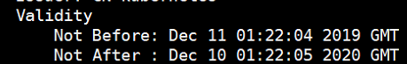
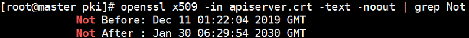

# 更改证书有效期
# 一、基础知识


1. k8s使用https双向认证，使用kubeadm安装后证书默认有效期为1年
2. k8s证书存放路径：/etc/kubernetes/pki/
3. 查看证书信息：openssl x509 -in apiserver.crt -text -noout



4. 修改方式：修改kubeadm源码，更改证书默认有效期

# 二、go 环境部署


1. 下载go安装包  
wget [https://studygolang.com/dl/golang/go1.13.7.linux-amd64.tar.gz](https://studygolang.com/dl/golang/go1.13.7.linux-amd64.tar.gz)
2. 解压到/usr/local下  
tar -zxvf go1.13.7.linux-amd64.tar.gz -C /usr/local/
3. 修改环境变量  
vim /etc/profile  
export PATH=$PATH:/usr/local/go/bin
4. 加载环境变量配置  
source /etc/profile
5. 查看版本信息


# 三、git源码


1. 下载源码至本地  
git clone [https://github.com/kubernetes/kubernetes.git](https://github.com/kubernetes/kubernetes.git)
2. 查看当前k8s版本  
kubeadm version
3. 切换git到指定版本  
cd kubernetes  
git checkout -b remotes/origin/release-1.17.0 v1.17.0


# 四、修改源码更新证书策略


1. 查看相关代码所在文件名称  
kubernetes]# grep -r kubeadmconstants.CertificateValidity .
2. 更改源代码


3. 编译代码kubeadm  
kubernetes] #make WHAT=cmd/kubeadm GOFLAGS=-v
4. 将编译成功的kubeadm复制到/root下  
kubernetes] #cp _output/bin/kubeadm /root/kubeadm-new


# 五、更新 kubeadm


1. 备份原kubeadm文件  
cp /usr/bin/kubeadm /usr/bin/kubeadm.old
2. 替换新kubeadm文件  
cp /root/kubeadm-new /usr/bin/kubeadm
3. 赋予执行权限  
chmod a+x /usr/bin/kubeadm


# 六、更新master节点证书


1. 备份原证书文件  
cp -r /etc/kubernetes/pki /etc/kubernetes/pki.old
2. 生成新证书  
cd /etc/kubernetes/pki  
kubeadm alpha certs renew all --config kubeadm-config.yaml
3. 查看证书有效期  
openssl x509 -in apiserver.crt -text -noout | grep Not



4. 重新初始化集群

kubeadm init phase kubeconfig all --config kubeadm-config.yaml

5. 重新生成kubeconfig文件

```bash
mv $HOME/.kube/config $HOME/.kube/config.old
cp -i /etc/kubernetes/admin.conf $HOME/.kube/config
chown $(id -u):$(id -g) $HOME/.kube/config
```

6. 更新docker容器证书

```bash
# 查看容器证书有效期
echo | openssl s_client -showcerts -connect 127.0.0.1:6443 -servername api 2>/dev/null | openssl x509 -noout -enddate

docker restart `docker ps | grep etcd | awk '{ print $1 }'`
docker restart `docker ps | grep kube-apiserver | awk '{ print $1 }'`
docker restart `docker ps | grep kube-scheduler | awk '{ print $1 }'`
docker restart `docker ps | grep kube-controller | awk '{ print $1 }'`

# 查看更新后的证书有限期
echo | openssl s_client -showcerts -connect 127.0.0.1:6443 -servername api 2>/dev/null | openssl x509 -noout -enddate
```

7. 更新kubelet

```bash
vim /etc/kubernetes/manifests/kube-controller-manager.yaml
spec:
  containers:
  - command:
    - kube-controller-manager
    # 新增以下两行参数
    - --experimental-cluster-signing-duration=87600h0m0s
    - --feature-gates=RotateKubeletServerCertificate=true
```


# 七、HA其余master节点证书更新
```bash
#!/bin/bash
masterNode="192.168.66.20 192.168.66.21"
#for host in ${masterNode}; do
#    scp /etc/kubernetes/pki/{ca.crt,ca.key,sa.key,sa.pub,front-proxy-ca.crt,front-proxy-ca.key}"
${USER}"@$host:/etc/kubernetes/pki/
#    scp /etc/kubernetes/pki/etcd/{ca.crt,ca.key} "root"@$host:/etc/kubernetes/pki/etcd
#    scp /etc/kubernetes/admin.conf "root"@$host:/etc/kubernetes/
#done
for host in${CONTROL_PLANE_IPS}; do
    scp /etc/kubernetes/pki/{ca.crt,ca.key,sa.key,sa.pub,front-proxy-ca.crt,front-proxy-ca.key}"${USER}"@$host:/root/pki/
    scp /etc/kubernetes/pki/etcd/{ca.crt,ca.key} "root"@$host:/root/etcd   
    scp /etc/kubernetes/admin.conf "root"@$host:/root/kubernetes/
done

```

